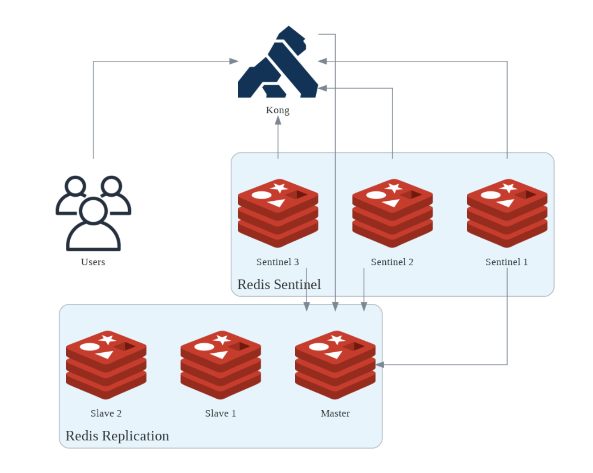

# 前言

整理一下在 Kong APIM 架構下，Redis 在快取與限流計數器同步上的應用。
因為之前沒接觸過，僅就目前理解部分紀錄，不會提到太多細節，未來有機會再補充～

# Redis 快取的用途

Kong API Gateway 可以 Redis 來做快取，主要目的是可以快速回應重複的 API 請求，讓資料變動不頻繁的 API 可以直接回傳快取內容，可減少後端服務壓力。

# 限流計數器的同步需求

如果系統有對 consumer 限流需求，記錄在 db 是一個選項，但這樣就必須所有 gateway 的節點都跟 db 建立連線，且不適用於 dbless 或是 hybrid mode 的架構。
>dbless 是指 data plane 的設置透過 kong.yml 來配置，每次配置都需要重啟服務。
>
>hybrid mode 則是將 Control Plane 和 Data Plane 分離，CP 負責管理與同步設定，DP 專注於流量代理。DP 不直接連資料庫，只從 CP 接收設定。相反地，傳統模式沒有明確區分 DP 和 CP。每一台 Kong 節點同時扮演 CP 和 DP 的角色，也就是說，每個節點都可以管理設定（新增/修改服務、路由、插件等），這是 CP 的功能。每個節點也都會處理用戶端 API 請求，這是 DP 的功能，所有節點也都直接連接到資料庫。

使用 Redis 來同步限流計數器（counter），確保多個 Gateway 節點能共用同一份計數資料是另一個選擇，他也支援 kong 內建的插件。

但如果只用單一 Redis 或每個節點各自記錄，會導致計數不同步而使限流失去預期作用。因此需要一個所有節點都能存取的 Redis 服務，也就是 Redis Cluster 與 Redis Sentinel。

Kong 官方 plugin（開源版）僅支援單一 Redis 節點，企業版則支援 Redis Cluster 與 Redis Sentinel。若單一節點故障，counter 會遺失，因此建議使用後者架構。

# Redis：Cluster 與 Sentinel

> 圖片來源：[How to use Redis with Kong Rate Limiting Plugin](https://tech.aufomm.com/how-to-use-redis-with-kong-rate-limiting-plugin/)

- **Redis Cluster**：多個主節點（Master），可同時寫入更多資料，適合高寫入量場景。
- **Redis Sentinel**：只有一個主節點，當主節點故障時，Sentinel 會自動選出新的主節點，確保服務不中斷。

## 架構實例

以我目前的系統來看，有三台主機（兩台 Redis + 一台監控），都啟動了 Sentinel，負責監控 Redis 健康狀態。

- 主節點（Master）：負責所有寫入操作，並同步資料給從節點（Slave）。
- 從節點（Slave）：複製主節點資料，通常只提供讀取。

當主節點故障時，Sentinel 會自動協調選出新的主節點，並將其中一台從節點提升為主節點，確保服務持續運作。
