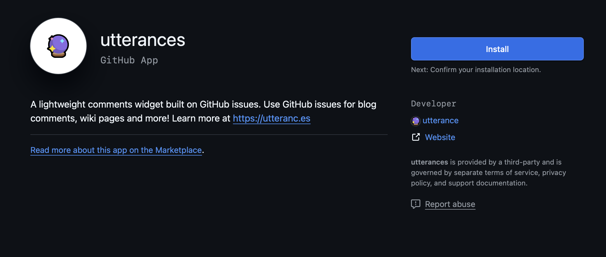
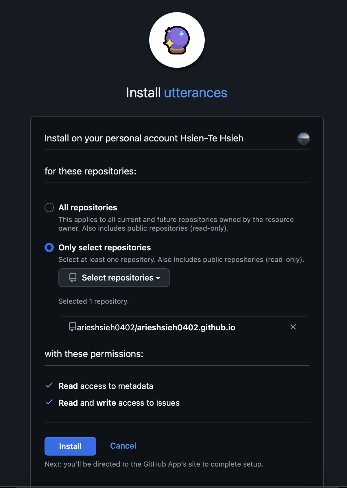

雖然説這個靜態網頁主要是拿來做個人筆記記錄用，但想到如果有寫錯的地方，誤人子弟又沒有人告知好像也是個問題，
研究了一下，原來有將留言直接串接到指定 GitHub repo 的 Issues 充作留言區的方式。

實驗了一下，串接成功，記錄一下過程。

---

# Step 1: 準備 GitHub repo

確認你有一個公開的 GitHub repo，留言將儲存在這個 repo 的 Issues。
因為本站是部署在 GitHub Pages，理當就建立在這個 page 所屬 repo 上。

# Step 2: 安裝 Utterances GitHub App
前往 [Utterances](https://github.com/apps/utterances) 的 GitHub App 頁面，將 App 安裝到你的留言 repo。



這裡沒有必要全部授權，只授權單一 repo 即可。



# Step 3: 產生 Utterances script
繼續下一步，前往設定頁，依序填寫以下內容：
1. repo 名稱（格式：username/repo）
2. Issue 對應規則（建議選 pathname 或 title）
3. 可自訂 label（如 blog-comment）方便分類
4. 選擇主題色系
5. 將產生 `<script ...></script>` 複製下來。

# Step 4: 整合到 Hugo（PaperMod）
在 Hugo 專案目錄下建立或修改 `layouts/partials/comments.html`，貼上剛剛產生的的 script。
接著在你的文章裡面啟用 `comment: true`

```yaml
---
title: "Hugo + PaperMod 靜態網站串接 Utterances 實作留言區"
comments: true # 啟用留言
---
```
