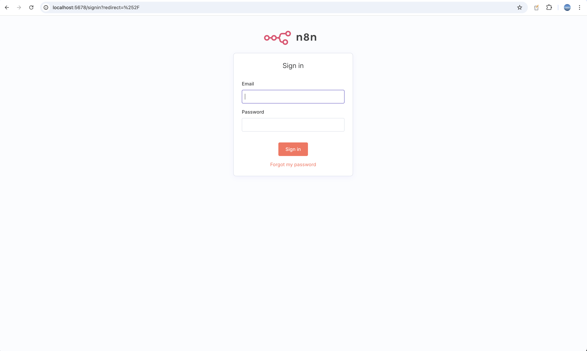
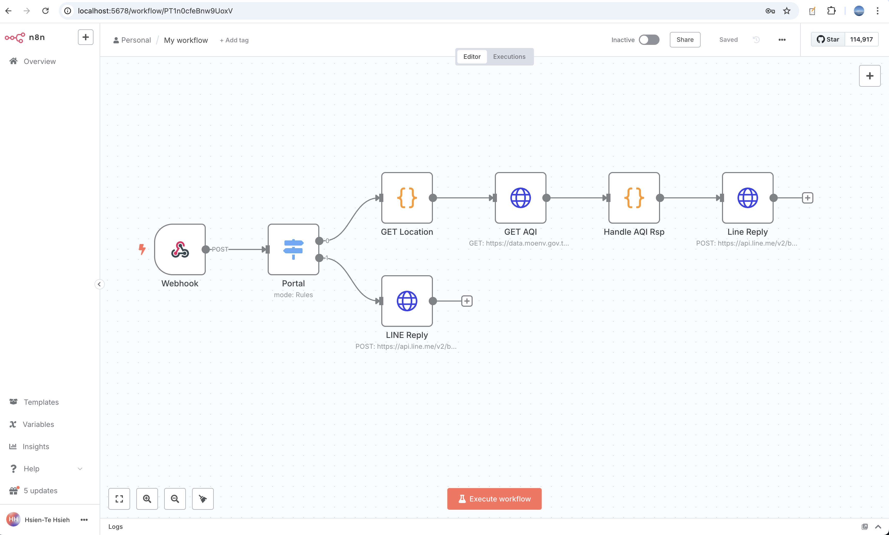

A basic record of local n8n deployment.

---

# Steps

## Docker

### docker-compose.yml

```yml
version: "3.9"

volumes:
  n8n_storage:

services:
  n8n:
    image: n8nio/n8n:latest
    restart: always
    ports:
      - "127.0.0.1:5678:5678"
    volumes:
      - n8n_storage:/home/node/.n8n
    environment:
      - WEBHOOK_URL=https://<your-ngrok-domain>.ngrok-free.app # External webhook URL
```

## Usage

1. Expose local port 5678 to the internet via ngrok:

```sh
ngrok http http://localhost:5678
```

2. Copy the generated ngrok public URL (e.g., `https://xxxx-xxx-xxx.ngrok-free.app`).

3. Edit the `docker-compose.yml` file and replace `<your-ngrok-domain>` in `WEBHOOK_URL` with your actual ngrok URL.

4. Start the n8n service using Docker Compose:

```sh
docker compose up -d
```

## Sign up / Sign in to n8n



User account data will be persisted in the Docker volume (`n8n_storage`), so your credentials and workflows will be retained across container restarts.



Then you can create your own workflow!
