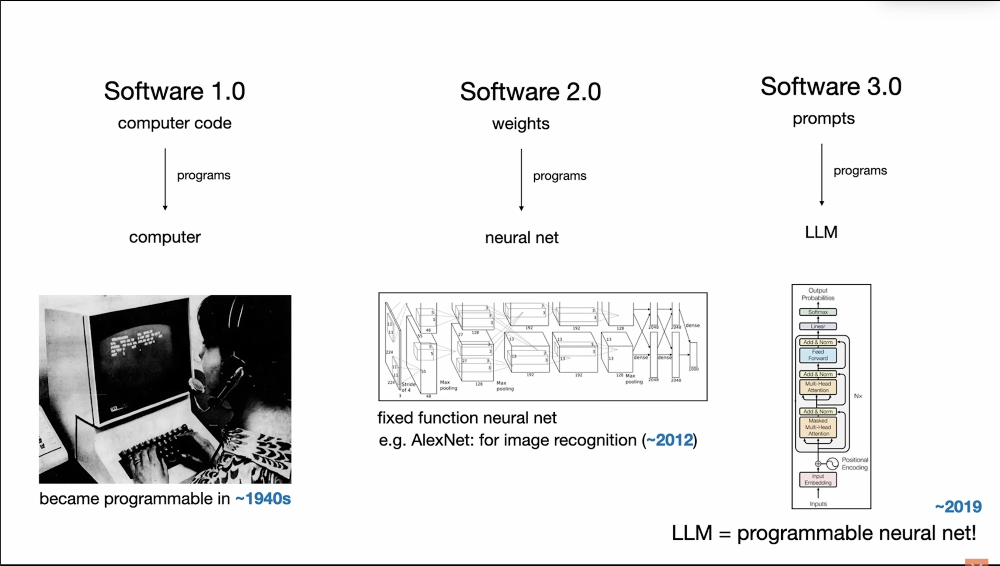

今天看到一段影片，是 Andrej Karpathy(Vibe coding 一詞之創始人)的演講片段

>[中英雙字版本](https://www.youtube.com/watch?v=vD7CIADHeDc)

### 軟體開發的三個重要階段

他提到目前軟體開發演進可分為三個重要階段：

(擷取自影片)

- Software 1.0：由工程師手寫的程式碼。

- Software 2.0：神經網路的權重，工程師不再直接撰寫程式，而是透過調整資料集並運行優化器來訓練模型，進而產生這些程式碼（權重）。例如特斯拉自動駕駛系統中許多功能已從 1.0 轉為 2.0。

- Software 3.0：大型語言模型 (LLMs) 可以透過自然語言提示來「程式設計」。英文本身成為一種強大的程式語言，讓每個人都成為潛在的程式設計師。

### LLMs 的角色與挑戰

Karpathy 將大型語言模型（LLMs）比喻為新型的作業系統，類似 1960 年代初期集中於雲端的電腦運算。他認為 LLMs 具備類似人類的「心理」，擁有百科全書般的知識與超能力般的記憶力，但同時也存在認知缺陷，例如會產生幻覺、智慧表現不穩定，以及類似「順向失憶症」的特性——每次互動後會清除記憶。因此，Karpathy 提醒我們在利用其強大能力的同時，必須特別注意並避開這些弱點。

### Prompt 成為新時代的程式語言

隨著 LLMs 的出現，「prompts」本身成為了一種新型態的程式，這大幅降低了寫程式的門檻。現在，人人都能利用 AI 輕鬆產生基本的程式碼。Karpathy 甚至分享，他自己在完全不懂 Swift 語言的情況下，僅用一天就透過 Vibe Coding 完成了一個基本的 iOS 應用程式。

### 軟體工程師價值的轉變

然而，因為 LLMs 仍然是「會犯錯的系統」，Karpathy 認為軟體工程師的價值也隨之轉變——從純粹的程式碼撰寫，轉向設計與維護人機協作的「生成—驗證」循環。AI 負責生成內容，而人類工程師則負責驗證其輸出。他以鋼鐵人的鋼鐵裝為例，強調我們應將 AI 視為「人類的增強工具」，而非完全自主的 agent。我們必須「將 AI 拴住（keep the AI on the leash）」，確保其輸出符合預期且無潛在問題，並避免 AI 生成過於龐大的修改，導致審核困難。現在軟體工程師的的任務是「讓這個循環盡可能地快速進行」。軟體工程師的價值轉向設計更有效率的工具和介面（GUI），使人類能夠快速地審核與驗證 AI 所生成的結果。

---

### 個人觀後感

以上僅提到一些我認為的重要觀點，影片還有許多內容，有興趣的人可以自己去看，蠻建議花時間看完的。

看完這部影片讓我有很多感觸，剛好我差不多要踏入這一行的時候，ChatGPT 橫空出世，直接開啟了 AI 時代，這讓我特別有感。在還沒有 AI 的時候，自學程式語言是條蠻辛苦的道路，什麼都得自己摸索，要花很多時間看文件、做每一個練習，遇到問題也只能慢慢查資料。現在大家都會用 AI 來寫基本的程式，這種落差其實蠻衝擊的，也讓我更深刻體會到，軟體工程師的價值真的不只是寫程式這麼簡單。

就像我以前當律師時一樣，無論是法律還是技術，本質上都是在解決人的問題，只是方式不同。尤其在 AI 發展這麼快、軟體開發方式不斷變化的時代，除了技術力或會寫多少程式外，工程師的核心價值更在於能不能真正理解問題、設計出好的系統，還有跟不同領域的人有效溝通。這種轉變讓我覺得很有意思，也提醒自己要不斷提升這些能力。
