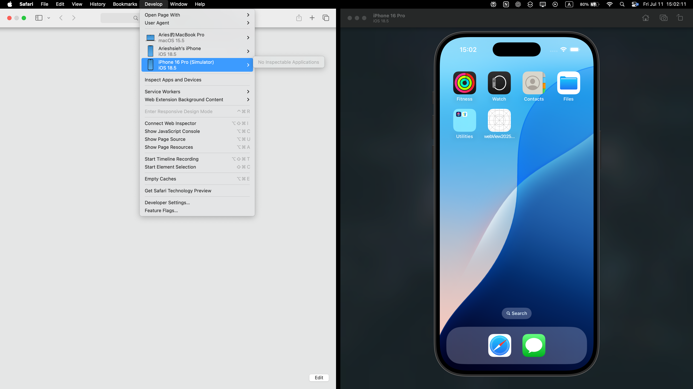
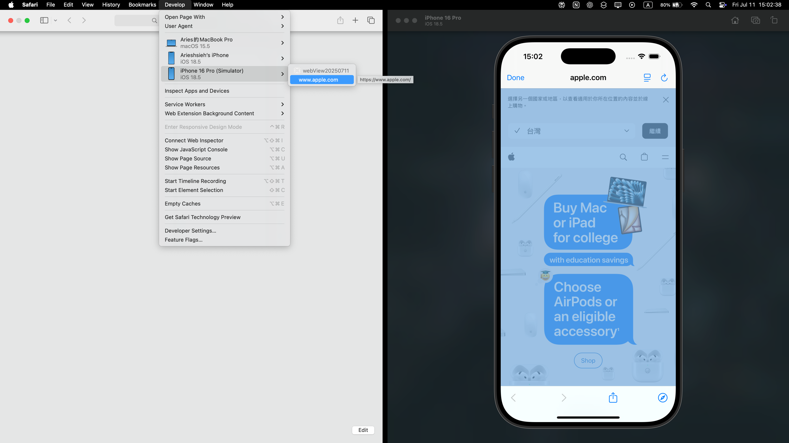
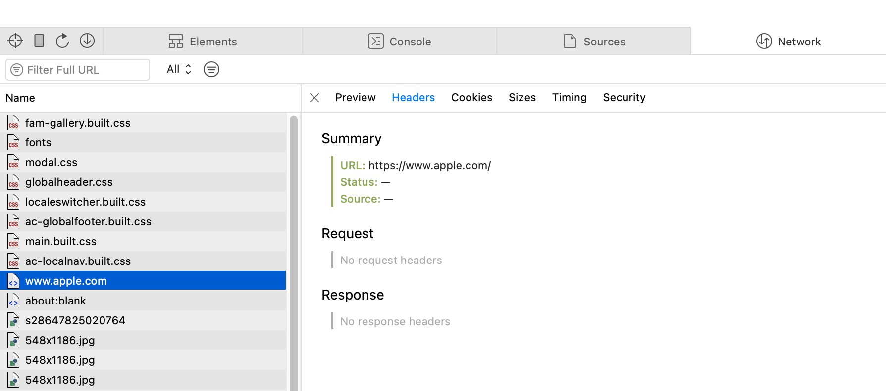
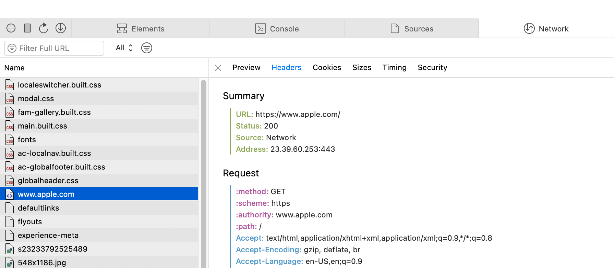

## 前言

最近遇到一個需求，我們的 mobile app 需要用 web view 開啟某個網頁。因為該網頁的認證方式最近有調整，app 端也得跟著修改。也因此這次 iOS 也要從原本的 SFSafariViewController 換成 MKWebView 來實作內嵌網頁，結果問題就這樣冒出來了。

## 過程

事情大概是這樣：
當我在頁面上點擊某個按鈕，會跳轉到另一個網頁，然後這個新頁面會自動彈出一個視窗到最前面。奇怪的是，首頁本身載入沒問題，如果在首頁觸發彈窗也都正常。但只要是跳轉後的頁面，彈窗就會出狀況。
一開始我懷疑是 cookie 沒有正確傳遞，或是 header 有缺漏，所以重點都放在這些地方。用 Safari Web Inspector 看 network，也沒看到什麼明顯的錯誤，只是覺得很怪，怎麼 request、response 的紀錄都不太完整，像是 header 竟然是空的。當下還以為這就是正常現象，只好很麻煩地回到 app 裡面用 NSLog 確認內容。

後來不知道哪根筋突然不對，想說試試看手動按一下重新整理。沒想到這一按，network 頁面所有的請求紀錄都跑出來了，header、response 什麼資訊都有。這時才發現，原來是某個 JS 檔在執行時出錯。仔細追查才知道，是網頁開發者寫的「取得使用者瀏覽器類型」的 function 沒有考慮到 MKWebView 發出的 User-Agent，導致相關 UI 無法正常顯示。

>那段程式碼還註解「若非不得已，盡量少用此方法」，是一個拿 14 年前 stackoverflow 上的解答的函式XD

>User-Agent：WKWebView 預設的 User-Agent 與 Safari 或 SFSafariViewController 不同，若網頁端有依賴 User-Agent 進行判斷，需特別注意。

## 關於 Safari Web Inspector 的觀察

這次讓我發現，Safari Web Inspector 其實有個不太直覺的地方。你必須先在手機上打開那個網頁，Inspector 的 develop 頁籤才會出現該網頁的選項。也就是說，當你點進去看的時候，網頁內容已經載入完成了，Inspector 只會顯示最後的狀態。過程中的流量、請求紀錄根本沒被捕捉到，除非你手動重新整理一次，才會看到完整的 network 資訊。

還未開啟 app(網頁)前：

可以看到 No Inspectable Applications

開啟 app(網頁)後：

可以看到已經出現項目可以點選了

接著點進去：

發現空空如也

按下左上角的重新整理吧～

老實說，我也不確定這算不算是 Inspector 的 bug，但這個行為真的有點反直覺，可能我用瀏覽器的開發人員模式在思考吧。
或許，Apple 可以考慮讓 inspector 變成一個介面可以先打開，偵測到網頁開啟後用分頁方式呈現會更直覺。
如果你在 debug 時遇到類似情況，記得多按幾次重新整理。
