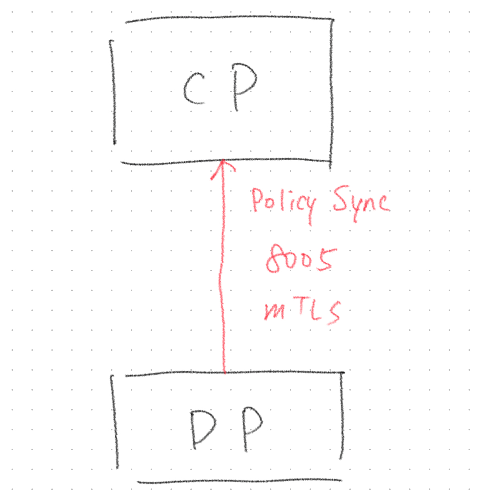
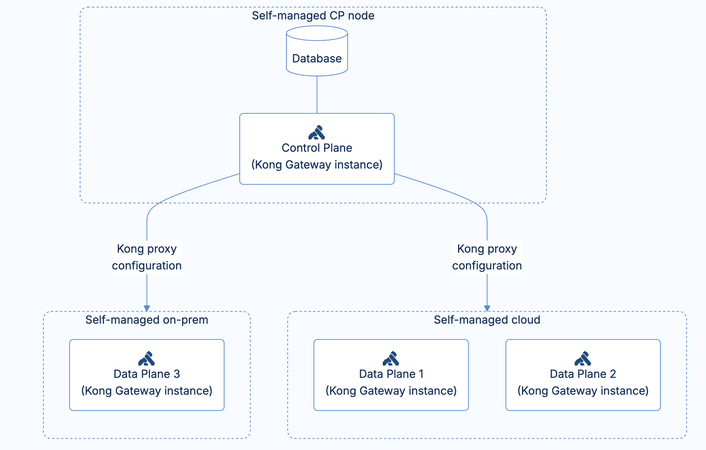
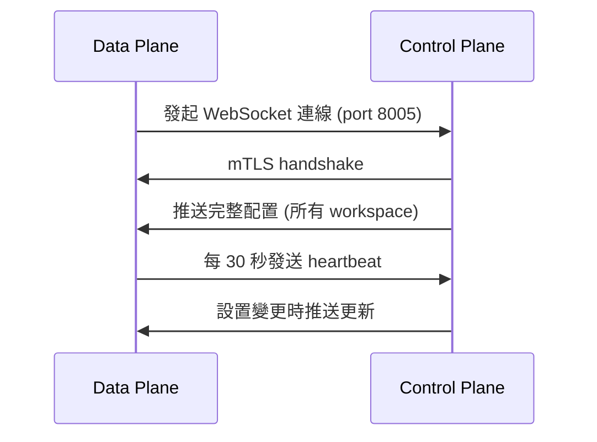

***其實我喜歡在文章裡面放張圖，雖然現在 AI 生圖很方便，但還是喜歡放自然一點的，不論是自己拍的或是網路上看到的(from unsplash)***

---

## 前言

在 Kong API Gateway 的日常維運中，Control plane 與 Data plane 的同步機制是個蠻值得關注的概念。最近在檢視公司架構圖時，我發現到 Control plane 與 Data plane 之間的 policy sync 方向標示為 Data plane 向 Control plane「拉取」最新設置。

>簡單畫，公司實際架構圖沒這麼醜

但在查找相關問題時（別的問題，有機會再說XD），發現 kong 官方文件的流程圖卻顯示 Control plane 會主動「推送」設定到 Data plane。

這讓我開始思考，究竟同步機制的實際運作方式是什麼？是 Data plane 主動拉取，還是 Control plane 主動推送？為了釐清這個認知落差，決定深入查證 hybrid mode 下的 sync 流程。

## Control plane 與 Data plane

先簡單說明一下這兩個東西是什麼。

Kong Gateway 在 hybrid mode 下，有兩個重要的角色，分別為 Controle plane 與 Data plane，其功能分別為：

- **Control plane**: 負責管理與設定整個系統的節點。提供設定管理介面，你可以在這裡新增、修改 route、service、plugin 等設定，這些設定會被下發給其他節點（如 Data Plane）。
- **Data plane**: 實際處理用戶流量的節點，這些節點負責根據 Control Plane 下發的設定去代理、轉發 API 請求。

## Control plane 與 Data plane 之間的通訊機制

根據官方文件說明：

>When you create a new Data Plane node, it establishes a connection to the Control Plane. The Control Plane listens on port 8005 (Kong Gateway) or 443 (Konnect) for connections and tracks any incoming data from its Data Planes.
>
>Once connected, every API or Kong Manager/Konnect UI action on the Control Plane triggers an update to the Data Planes in the cluster.

也就是說，公司的架構圖只對了一半。最初是由 Data plane 主動與 Control plane 建立連線沒錯，但連線後，是由 Control plane 向 Data plane 推送設定。

詳細的流程圖如下：

## 結語

Kong Gateway 在 hybrid mode 下，Data plane 雖然主動連線到 Control plane，但實際的設定同步是由 Control plane 主動推送，確保所有 Data plane 節點都能即時獲得最新的設置。也讓我釐清了原本的認知落差，官方文件還是很重要的～

---

REF:

1. https://developer.konghq.com/gateway/hybrid-mode/
2. https://developer.konghq.com/gateway/cp-dp-communication/
3. https://support.konghq.com/support/s/article/How-to-debug-the-Control-Plane-DataPlane-web-socket-communication
