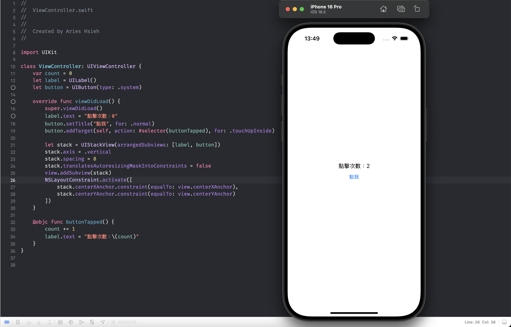
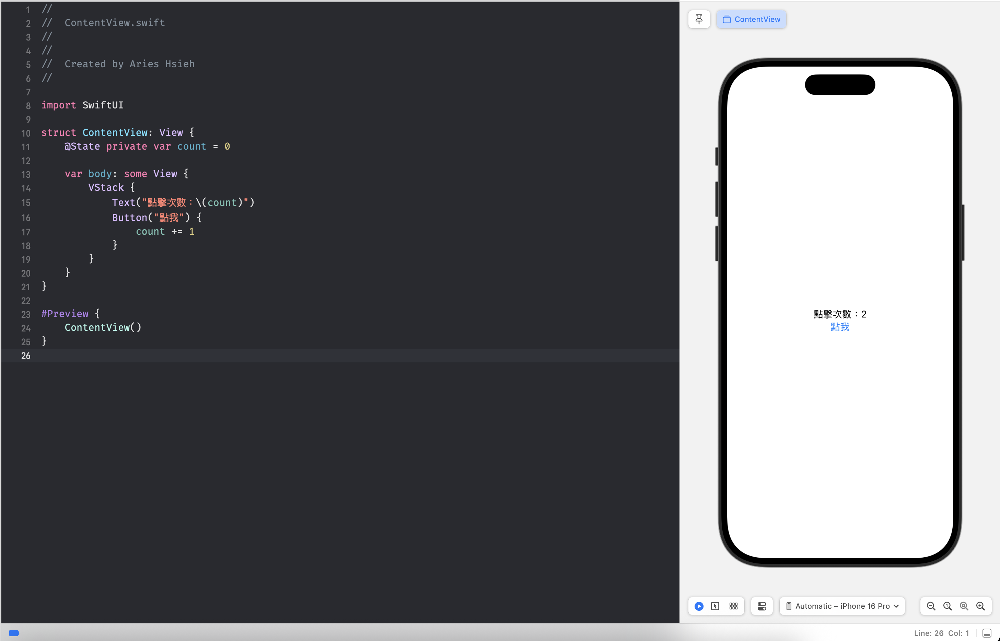

# 前言
在 Day 1 時提到，本次要開發的 app 是讓使用者能夠直接輸入公路里程標（公里數），即時在地圖上定位對應位置。這次我選擇以 SwiftUI 來開發，除了想要嘗試這個框架外，更重要的是，作為軟體工程師，理解各種技術的優勢與限制，並根據實際需求做出合適的選擇，是非常重要的能力。技術本身只是工具，沒有絕對的對錯，關鍵在於能否根據專案目標、團隊狀況與未來維護等因素，做出最適合的技術選型，而不是單純因為新穎或流行。

而在 iOS 的原生開發中，分別有 UIKit 與 SwiftUI 兩個框架。SwfitUI 是蘋果在 WWDC2019 上釋出的新開發框架，其實在 2025 的現在也沒有到非常新了，但相對於 UIKit 來說確實是仍屬非常年輕的框架。

以下簡單對兩個框架做基本介紹。

# SwiftUI 與 UIKit 簡介與比較

雖然本系列文章的重點並非深入比較這兩個框架，但這裡仍簡要說明其主要差異：

## 命令式語法 ＆ 宣告式語法

命令式（Imperative）語法強調「如何做」：開發者需要明確描述每一步操作，手動管理 UI 狀態與流程。例如在 UIKit 中，必須指定元件的建立、佈局、狀態變更等細節。

宣告式（Declarative）語法則強調「要什麼」：開發者只需描述最終希望呈現的 UI 狀態，框架會自動處理狀態變化與畫面更新。例如 SwiftUI 中，直接描述畫面結構與資料綁定，讓 UI 隨資料自動更新。

我們用例子來說明可能會更清楚，以在畫面上放置一個按鈕，點擊後會增加數量紀錄的計數器為例，兩個框架的寫法相當不同：

- UIKit

- SwiftUI

可以看到程式碼的數量有明顯的差異。而最重要的是我們不用手動管理 UILabel(SwiftUI 中的 Text)的變化，我們只要將 count 變數綁定，框架就會幫你處理這件事情，當資料有變動的時候，與之綁定的 UI 將會自動更新。

## 社群與資源

SwiftUI 看起來很棒對吧，而且每次修改完程式碼，右方會即時渲染。雖然後來 UIKit 也可以達到類似的效果，但我個人覺得還是 SwiftUI 比較方便。不過，SwiftUI 畢竟還算年輕，社群的資源與解決方案還是沒有歷史悠久的 UIKit 來得豐富，在查找資料的時候是感覺有差異的。

## 性能與相容性

而 SwiftUI 許多新功能都需要較新版本的 iOS 才能使用。例如 `NavigationStack`（新版的導航結構）、`Charts`（繪製圖表）等元件必須 iOS 16 以上才支援。
因此若專案需支援較舊的 iOS 版本，SwiftUI 可能會受限，故需特別注意相容性問題。

# 選擇 SwiftUI 的理由
- 個人希望藉此專案練習 SwiftUI。
- 技術優勢：
  - 宣告式語法讓 UI 開發更快速，易於預覽與調整。
  - 與地圖元件（如 MapKit）整合簡單，適合本專案需求。
  - Preview，提升開發效率。
