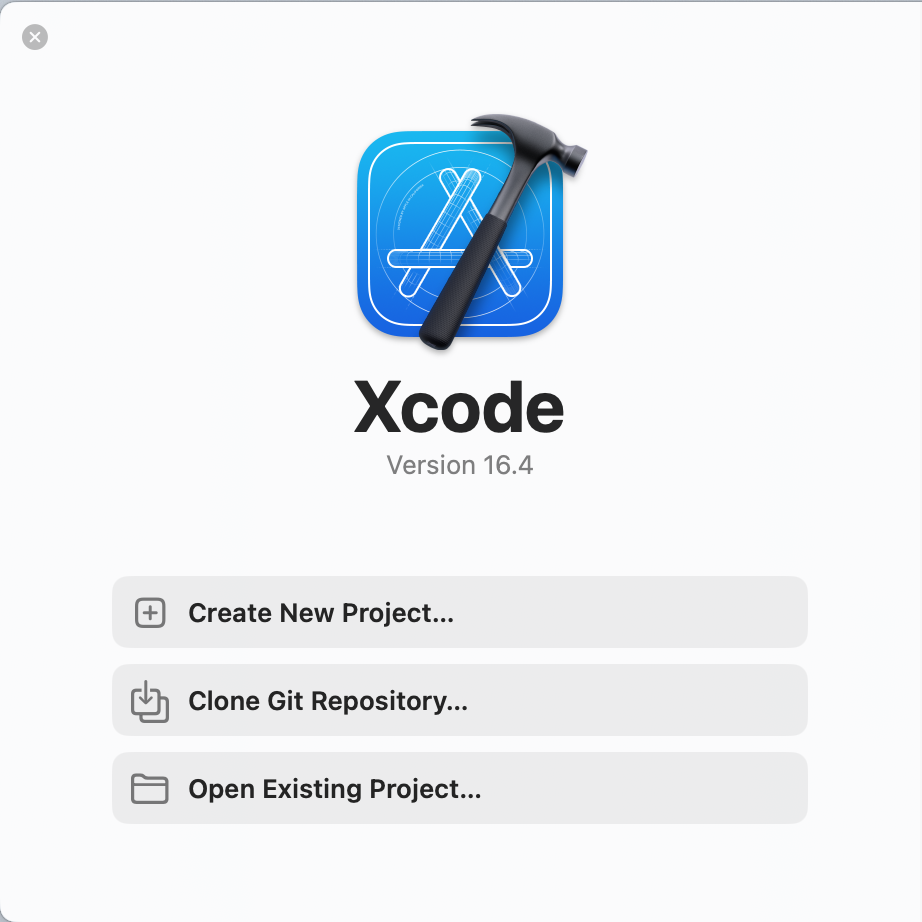
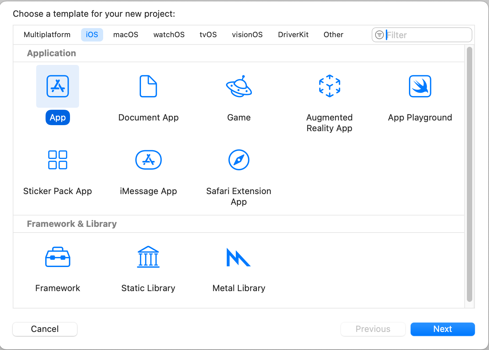
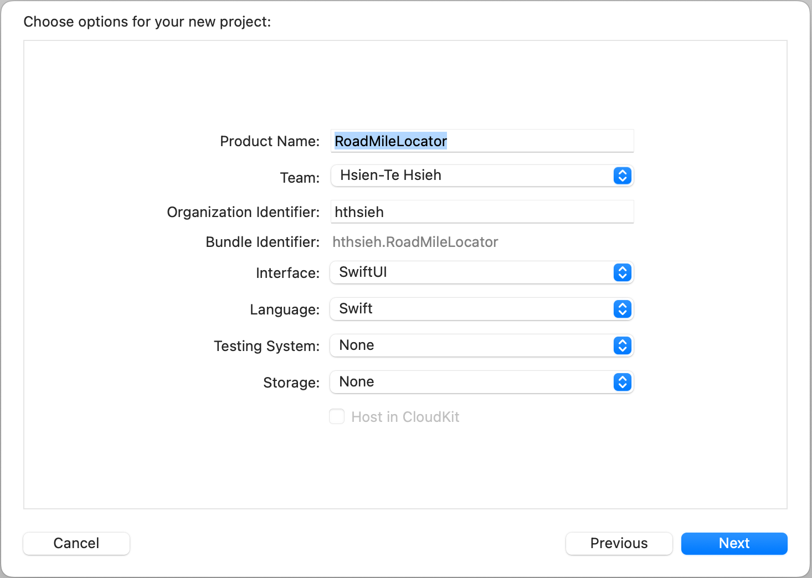
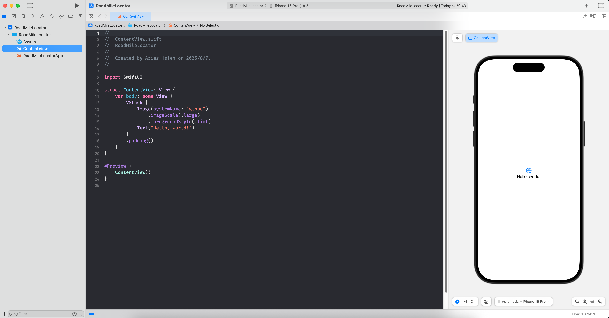
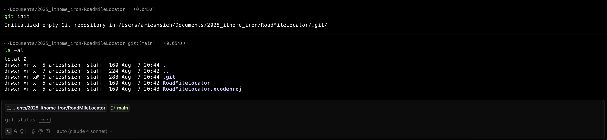
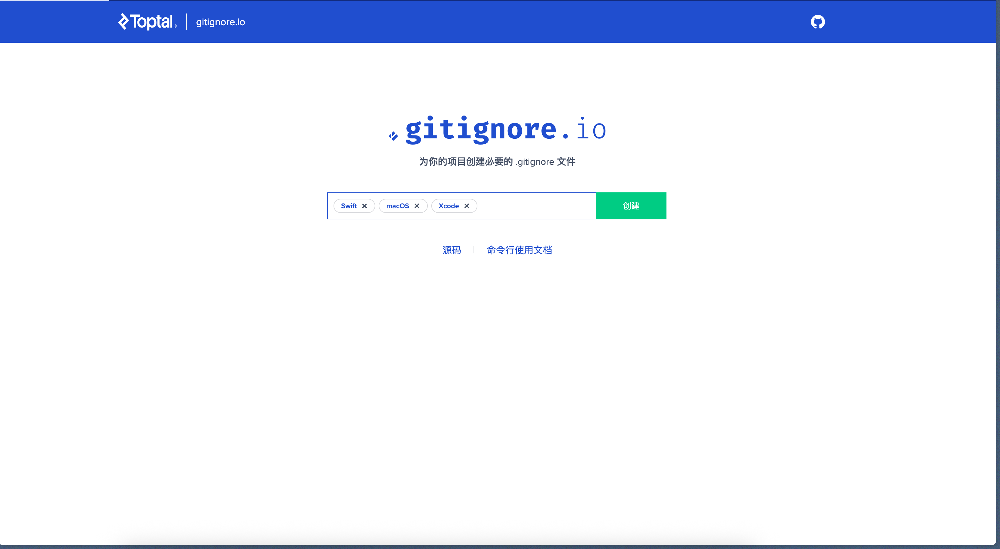
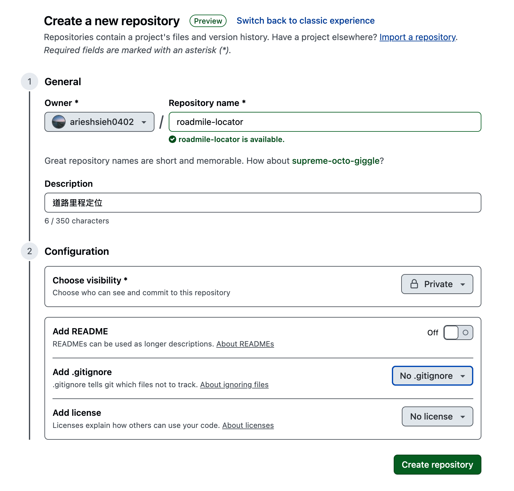
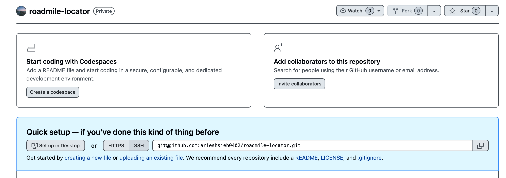
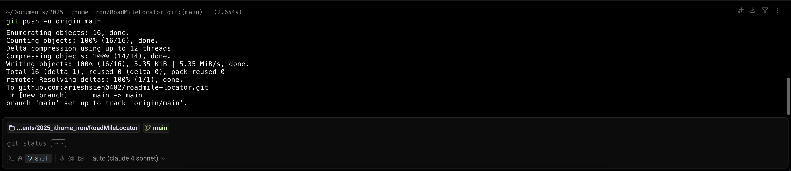
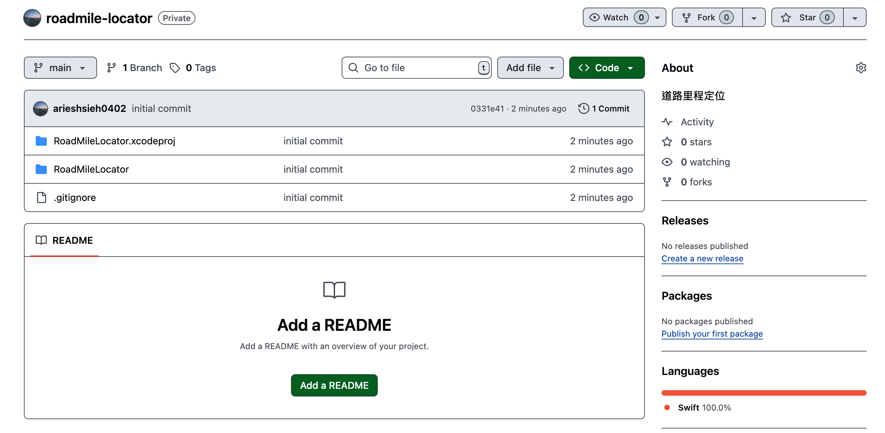

# 建立 Xcode 專案

第一步我們先來建立 Xcode 專案。

打開 Xcode，選取 Create New Project。



>如果你的 mac 還沒有安裝 Xcode，請先到 [App Store](https://apps.apple.com/us/app/xcode/id497799835) 下載。

我們這次要建立的是 iPhone 的 App，因此上方的平台要選擇「iOS」，並選擇 「App」來建立一個新專案。
選擇 Next 來進入下一個流程。



接著會出現要你輸入新建立專案所需的基本資訊。



- **Product Name:** 就是你的專案名稱(Project Name)，組織名稱(Organization Identifier)因為我是個人，所以我就設定自己的名稱。

- **Bundle identifier:** 這個蠻重要的，iOS Xcode 的 bundle identifier 是用來辨識你的 App，相當於應用的「身份證字號」。也就是說，每個上架到 App Store 以及安裝到設備上的 App 都必須有獨一無二的 bundle identifier，不能與他人或自己已有的 App 重覆，否則無法上架或安裝。

- **Interface:** 這裡可以選擇 UIkit 或是 SwiftUI，我們這次要使用 SwiftUI 來建立 App。

- **Language:** 我們使用 Swift。

Testing System 與 Storage 就先保持預設值 None 不選擇。讓我們按 Next 前進下一個畫面。




***Hello world!***

一個最最基本的 SwiftUI iOS App 模板建立好啦～

接著我們要建立起開發的好習慣，也就是使用 Git 來進行版本控制。


# Git 版本控制

## Git 是什麼？為什麼我們需要 git?

Git 是一種分散式版本控制系統，用來記錄和管理檔案（通常是程式碼）隨時間變化的歷史版本。它讓使用者可以隨時回溯到任一歷史版本，清楚知道誰在什麼時候做了哪些修改，並支援多人協同開發。
即使這次是由一人開發，使用版本控制也能幫助自己管理進度、紀錄思路變化，以及避免不小心覆蓋或遺失重要檔案，是一種良好的開發習慣。

如果沒有接觸過 git 的人，覺得有點抽象不太好理解的話，你可以想像你正在一個***平行世界***中，同時進行十個不同的世界線，不管失敗或成功，每個分支（Branch）都是一條可以自由切換、比較與融合的時空線。Git 就是讓你可以穿越這些可能性的工具，不會因為一個錯誤決定，而回不去更早那個「關鍵時間點」。總而言之，git 給你機會逆轉人生的能力。

## Git flow

Git flow 是一種基於 git 的開發流程。它會把工作分成幾個不同的「分支(Branch)」，常見的有[^1]：

- main（或 master，舊稱，現在主要皆用 main 稱呼）: 是穩定、隨時可發布給使用者的版本，就像最終產品。
- develop: 主要開發的地方，所有新功能的基礎都從它開始，也會把完成的功能合併回這裡。
- feature: 用來開發新功能，都是從 develop 分出來，做完再回合併回 develop。
- release: 準備發佈版本的地方，會在這裡做最後測試和修正，完成後合併回 main 和 develop。
- hotfix: 用來快速修復已上線的問題，修完也會合併回 main 和 develop 避免問題重現。

這樣的開發方式將開發工作分隔到不同區域，可以避免同時改同一部分發生混亂，也能隨時應付緊急修復和發布，讓程式碼品質和管理更好、更清楚。

然而，在這個專案中，考量到只有我一人開發，採用了比較簡化的 Git flow，原則上只會使用以下分支：

- main: 保存每個正式、穩定且準備發布的版本。只在確認功能完成並測試無誤後，才將開發分支的變更合併到 main。
- develop: 平日主要在此開發新功能和修改內容，完成的功能即時保留在這裡。當功能開發完成並經過測試，準備要發佈就會合併進 main。
- feature: 依據不同功能建立不同的 feature 分支，待開發測試完畢後會合併回 develop 分支。

## 將專案納入 git 版控

### 初始化 git repo

要將專案（資料夾）納入 git 版控，要先對該資料夾進行 git 初始化，
使用 terminal 在目標資料夾路徑下指令：

```shell
git init
```

並使用 `ls -al` 指令查看多了一個 `.git` 的隱藏資料夾，表示初始化成功。




### 建立 .gitignore 檔案

在 Git 中，有些檔案不適合加入版本控制，例如編譯後的二進位檔（.dll ）、作業系統自動產生的暫存檔（如 macOS 的 .DS_Store），或者包含敏感資訊的設定檔（例如 API key、資料庫密碼）等。
而在 Xcode 中例如有些使用者設定檔，我們通常也不會加入版控，因為每個開發人員的介面設定、習慣不同，這種類型的檔案就沒有加入版控的必要。

這個時候我們就需要 `.gitignore` 這個文件，建立我們不希望加入版控的清單。

在與 `.git` 同一層的目錄下，輸入：

```shell
vi .gitignore
```
>建立並編輯 `.gitignore`

至於要排除哪些檔案，可以參考 gitignore.io[^2] 這個網站，只要輸入關鍵字，他會自動幫你產生常用的忽略清單。



按下創建後，將內容複製到剛剛建立的 `.gitignore` 後儲存就 OK 了。

### 將檔案加入版控

接下來就是將檔案加入版控了。

```shell
git add .
```

此指令會將當前目錄（包括子目錄）中的所有檔案變更（新增、修改、刪除）加入到 Git 的暫存區（staging area）。暫存區就像準備提交的清單，必須先加進暫存區，Git 才知道要追蹤哪些變更。

```shell
git commit -m ‘Initial commit’
```

將暫存區已準備好的檔案提交（commit）到本地 repo，形成一個版本紀錄，`-m` 參數後面接的是 commit 訊息，我們通常用來描述此次 commit 的內容。
這裡的 `Initial commit` 通常用於專案第一次提交，代表基礎版本開始被追蹤。

### 建立並關聯遠端 repository

完成本地的 commit 後，下一步通常是將這些變更推送（push）到 GitHub 的遠端 repo。會這樣做是因為不僅可以備份你的程式碼，也方便跨設備同步及團隊協作。

先到 Github 上建立一個新的 repo



這裡我就設為 private repo，然後因為剛剛已經建立了 `.gitignore`，這裡就不建立了，好了就按 Create repository。




建立完成後這裡會顯示 HTTP/SSH 的 URL，至於要用哪一個，這裡不多加詳述，可以參考網路上其他人的說明[^3]來決定你要用哪個。

我們剛剛已經 commit 到本地 repo 了，接下來要與剛剛在 github 上開好的遠端 repo 建立關聯，在 terminal 輸入：

```shell
git remote add origin YOURREPOURL.git
```

接著推送到 github

```shell
git push -u origin main
```



以上結果，`branch 'main' set up to track 'origin/main'.` 表示「本地的 main 分支與遠端的 main 分支已建立關聯」，
表示我們已成功建立關聯了～

接著到 github 上查看，專案資料夾已成功推送上去。




# 小結

雖然這個系列主要是記錄 iOS 開發，但我還是決定把 git 的流程也寫進來。一方面是作為自己的開發過程紀錄，另一方面也能順便整理一下 git 的基本知識。畢竟不論是個人還是團隊開發，良好的版本控制習慣都能讓專案管理更有條理，也能避免許多不必要的麻煩。希望這篇能幫助剛開始接觸 iOS 或 git 的朋友，建立起要好好做版控的基礎認知。


[^1]: https://www.atlassian.com/git/tutorials/comparing-workflows/gitflow-workflow
[^2]: https://www.toptal.com/developers/gitignore
[^3]: https://hoyis-note.coderbridge.io/2021/10/01/Git%E4%B8%AD%E4%BD%BF%E7%94%A8HTTPS%E5%92%8CSSH%E5%8D%94%E8%AD%B0%E7%9A%84%E5%8D%80%E5%88%A5-%E8%88%87%E5%A6%82%E4%BD%95%E8%A8%AD%E5%AE%9A/
