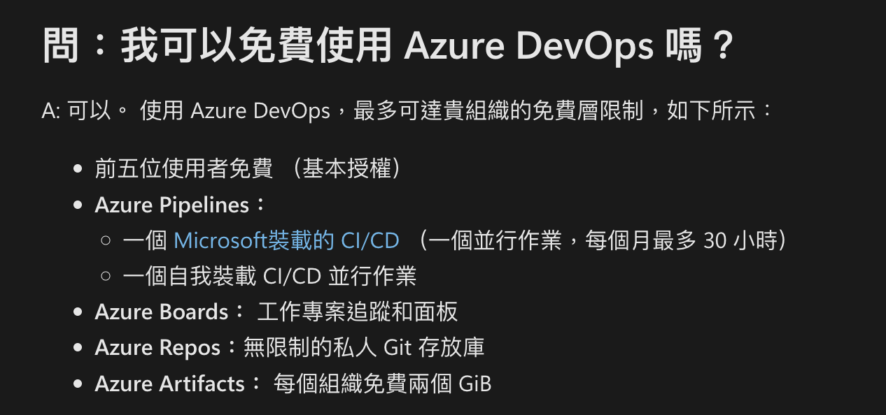
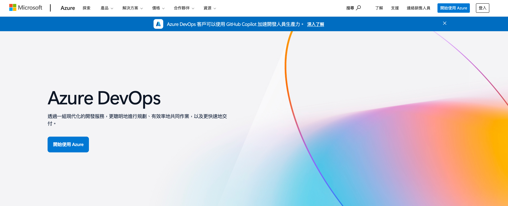
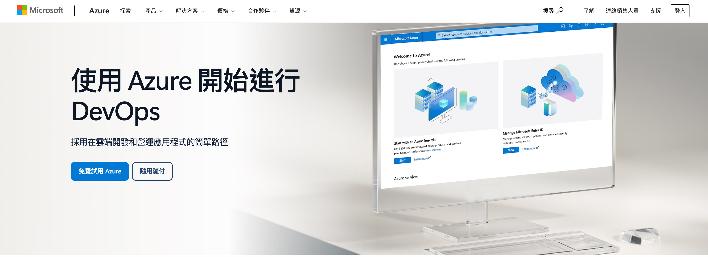
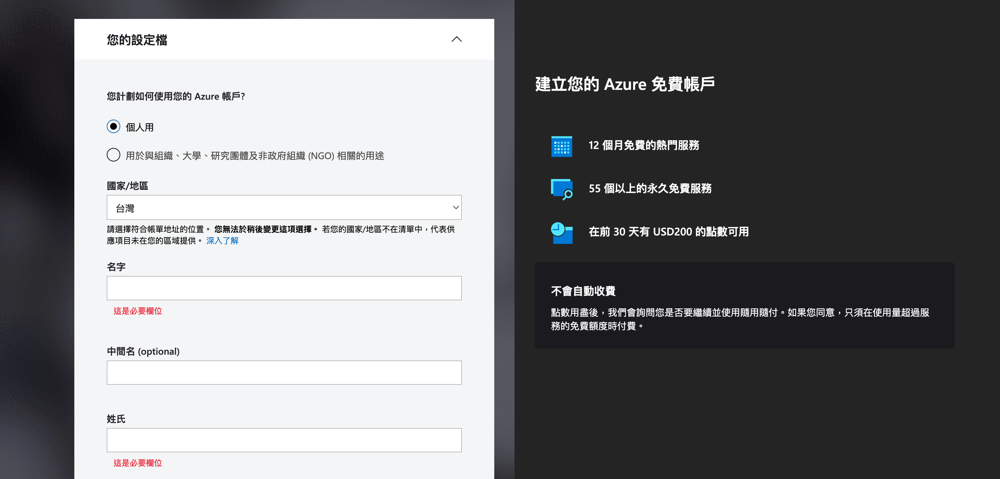
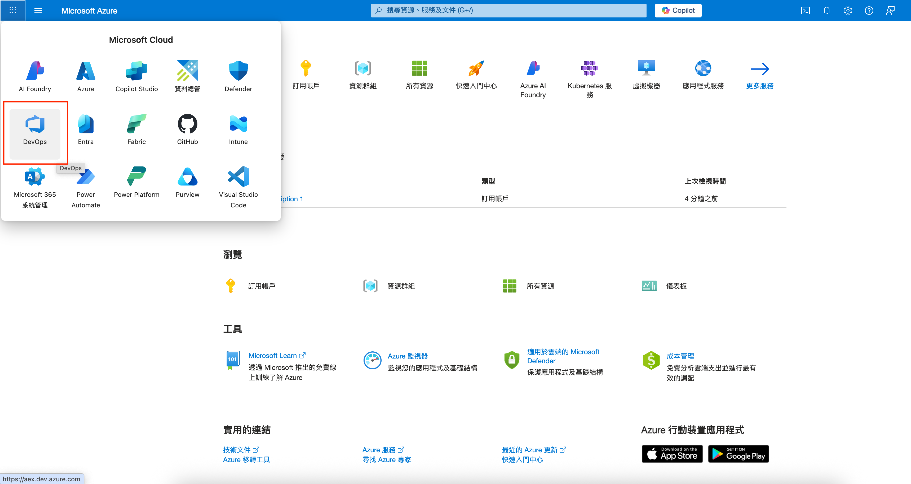
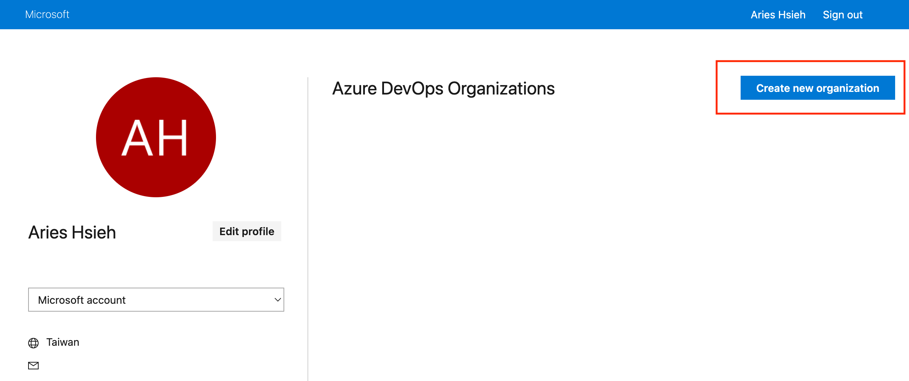
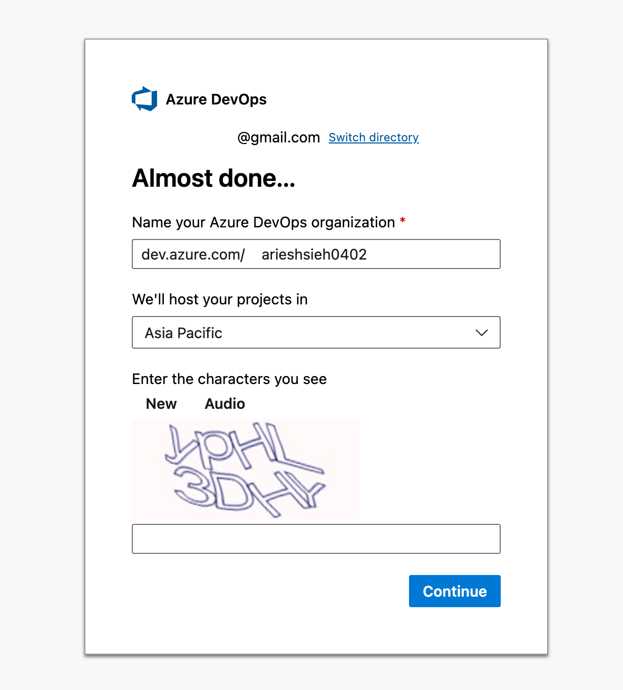
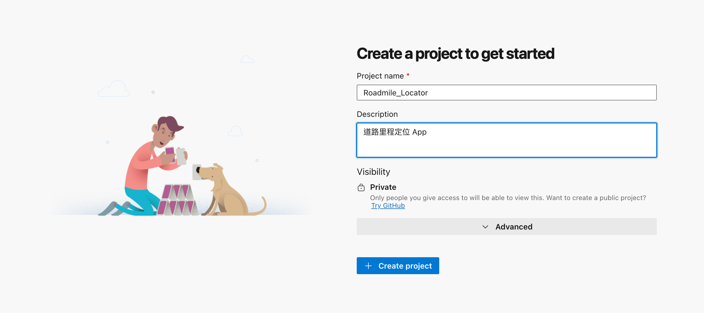
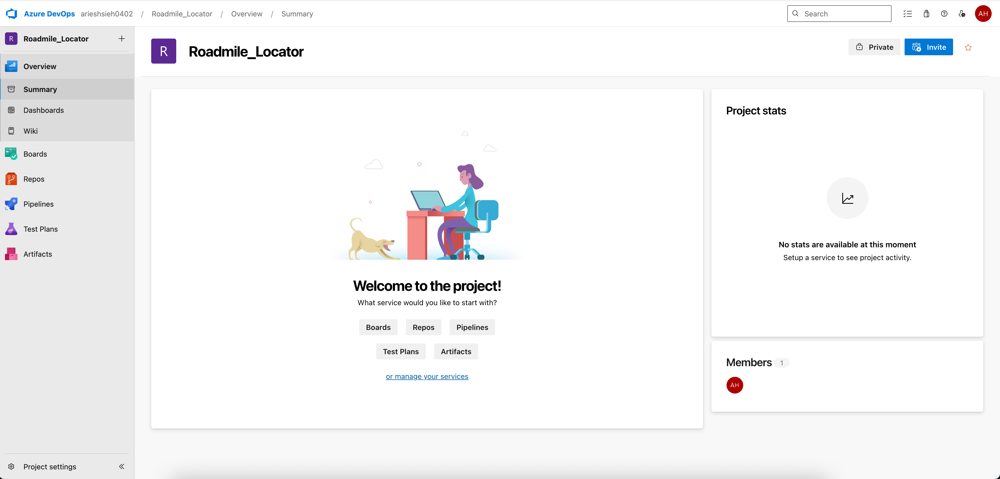

# Azure DevOps 設定

## 什麼是 Azure DevOps？

Azure DevOps 是微軟提供的開發工具服務平台，整合了版本控制、工作項目追蹤、自動化建置等功能。對於 iOS 開發者來說，它提供了：

- Azure Repos：Git 版本控制系統
- Azure Pipelines：自動化建置和部署工具
- Azure Boards：專案管理和工作追蹤
- Azure Test Plans：測試管理工具
- Azure Artifacts：套件管理系統

## Azure DevOps 免費方案

依據[官方說明](https://learn.microsoft.com/zh-tw/azure/devops/organizations/billing/billing-faq?view=azure-devops&viewFallbackFrom=vsts&tabs=new-nav)，個人開發者可以享有以下免費額度：



- 無限量的私人 Git 儲存庫
- 最多 5 位 Azure DevOps 使用者
- 每月 1,800 分鐘的 Pipeline 執行時間
- 2GB 的 Azure Artifacts 儲存空間

這些免費額度對於個人專案來說已經相當充足。

## 建立 Azure DevOps 帳號

1. 前往 [Azure DevOps](https://azure.microsoft.com/services/devops/) 官網



2. 點擊「開始使用 Azure」按鈕



3. 使用 Microsoft 帳號登入（如果沒有就註冊）。第一次啟用 Azure 帳號，會要你填一些基本資料，就照著填。



最後他會要你填信用卡，但基本上他就只是要你綁一張卡，Azure DevOps 有免費額度可以用，基本上個人使用是用不完的，後面會提到。

## 建立組織（Organization

登入後，第一步是建立一個組織。

你可以從 [Azure Portal](https://portal.azure.com/) 進入，或是直接進入 [Azure DevOps](https://dev.azure.com/)。
如果你是從 Azure Portal 進入，就點選左上角，然後選 Azure DevOps。



接著，

1. 點擊「Create new organization」



2. 選擇組織名稱（需要是唯一的），並選擇主機位置（建議選擇較近的區域，如 Asia Pacific）



## 建立專案（Project）

在組織內建立新專案：

1. 點擊「New project」
2. 輸入專案名稱



>在 Advanced 選項中：
>- **版本控制系統**：預設為 Git，這是目前最普及的版本控制系統
>- **工作項目流程（Work item process）**：
>   - Basic：最簡單的工作追蹤流程，只有三種狀態（To Do、Doing、Done），適合小型專案或個人開發
>   - Agile：較完整的敏捷開發流程，包含使用者故事（User Stories）、任務（Tasks）等
>   - Scrum：完整的 Scrum 開發流程，包含產品待辦清單（Product Backlog）、衝刺規劃（Sprint）等
>   - CMMI：最複雜的流程，適合需要嚴格變更控制的大型專案
>- **可見度**：預設為 Private（私人），只有被邀請的成員才能存取
>
>因為這是個人專案，我們選擇 Basic 流程就足夠了。
>詳細差別的介紹可以參考[微軟官方說明](https://learn.microsoft.com/zh-tw/azure/devops/boards/work-items/guidance/choose-process?view=azure-devops&tabs=agile-process)。

建立完畢後，我們終於有點樣子了～



這邊就先不詳述左邊那一列是什麼，之後用到的時候會逐一介紹。

## 取得 Azure Repos repo

建立專案後，Azure DevOps 會自動為我們建立一個 Git repo。首先，我們需要將這個空的 repo clone 到本地：

1. 在專案頁面左側選單中點選 Repos
2. 點擊右上角的 Clone 按鈕
3. 複製 HTTPS 的 URL（或是 SSH，如果你已設定好 SSH key）

>如果使用 HTTPS，記得要先按 Generate Git Credentials，他會給你一組密碼，本地 git clone 的時候輸入。


在你想要存放專案的目錄下執行：

```shell
git clone YOUR_REPO_URL
```

接著他會要你輸入剛剛產生的密碼，貼上就對了。

# 建立 Xcode 專案

## 設定 .gitignore

在開始將專案加入版控前，先建立 `.gitignore` 檔案：

```shell
vi .gitignore
```
>建立並編輯 `.gitignore`

至於要排除哪些檔案，可以參考 gitignore.io[^1] 這個網站，只要輸入關鍵字，他會自動幫你產生常用的忽略清單。


按下創建後，將內容複製到剛剛建立的 `.gitignore` 後儲存就 OK 了。

## 建立 iOS App 專案

現在我們已經有了一個乾淨的本地 repo，接著要在這個目錄中建立 Xcode 專案。

打開 Xcode，選取 Create New Project。


>如果你的 mac 還沒有安裝 Xcode，請先到 [App Store](https://apps.apple.com/us/app/xcode/id497799835) 下載。

我們這次要建立的是 iPhone 的 App，因此上方的平台要選擇「iOS」，並選擇 「App」來建立一個新專案。
選擇 Next 來進入下一個流程。


接著會出現要你輸入新建立專案所需的基本資訊。


- **Product Name:** 就是你的專案名稱(Project Name)，組織名稱(Organization Identifier)因為我是個人，所以我就設定自己的名稱。

- **Bundle identifier:** 這個蠻重要的，iOS Xcode 的 bundle identifier 是用來辨識你的 App，相當於應用的「身份證字號」。也就是說，每個上架到 App Store 以及安裝到設備上的 App 都必須有獨一無二的 bundle identifier，不能與他人或自己已有的 App 重覆，否則無法上架或安裝。

- **Interface:** 這裡可以選擇 UIkit 或是 SwiftUI，我們這次要使用 SwiftUI 來建立 App。

- **Language:** 我們使用 Swift。

Testing System 與 Storage 就先保持預設值 None 不選擇。讓我們按 Next 前進下一個畫面。


***Hello world!***

一個最最基本的 SwiftUI iOS App 模板建立好啦～

## 提交初始專案

現在我們可以將 Xcode 專案加入版控了：

```shell
git add .
git commit -m 'Init commit'
git push -u origin main
```

>因為我們是從空的 repo clone 下來的，所以不需要執行 `git init` 和 `git remote add origin`。

# 小結

今天我們完成了 Azure DevOps 環境設定和 Xcode 專案的建立。
下一篇我們將開始進行專案的基礎開發，並更深入地學習如何使用 Azure Repos 進行版本控制。

[^1]: https://www.toptal.com/developers/gitignore
