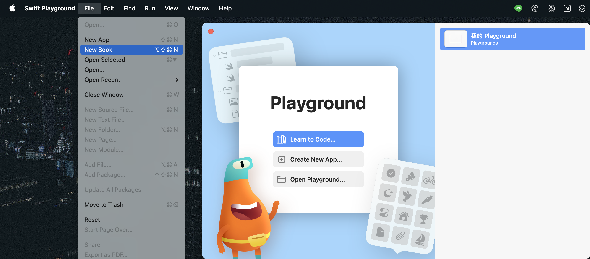
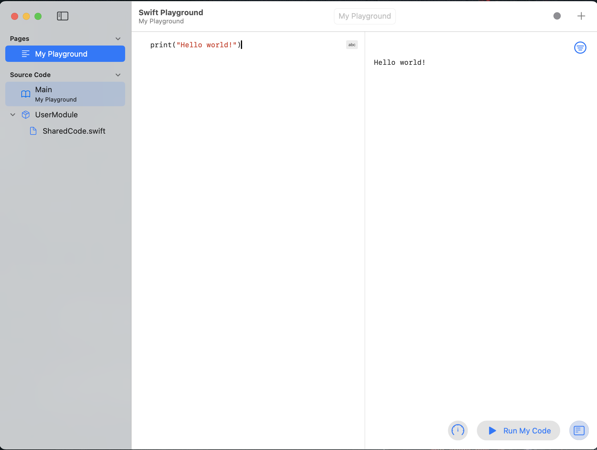
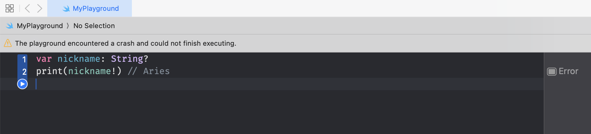

# Swift 語言基礎入門

本篇將帶大家快速認識 Swift 語言的基礎語法，適合完全沒有 iOS 或 Swift 經驗的初學者。內容包含：變數、常數、資料型別、型別推斷、型別安全與基本運算等。如果這些你都已經了解，可以略過這個部分。

## 實用工具

在學習新的語法時，我都喜歡自己實際操作驗證一次。Swift 可以使用 Apple 官方推出的 [Playground](https://www.apple.com/tw/swift/playgrounds/) 來執行 Swift 程式碼。本文將以 macOS 版本為例。

下載完畢打開 App 後，點擊左上方 File，選擇 New Book：



建立好新的 playground 後點擊進入，就可以在程式碼區域輸入你要執行的 code，按下右下角的 Run My Code，右側邊欄就會顯示執行結果。




## 變數與常數

在 Swift 中，使用 `var` 宣告變數（可變），使用 `let` 宣告常數（不可變）。

```swift
var age = 36        // 變數，可重新賦值
let name = "Aries"  // 常數，不可重新賦值
```

一個重要的原則是，除非你確定這個值未來需要被改變，否則一律使用 let 宣告。如此一來，確保了某些值不會在程式的其他地方被意外修改，增加程式碼的安全性與可預測性。

## 常見資料型別

Swift 是強型別語言，常見型別有：
- `String`：文字字串
- `Int`：整數
- `Double`：浮點數
- `Bool`：布林值（true/false）

```swift
var city: String = "Taipei"
var year: Int = 2025
var price: Double = 99.9
var isOpen: Bool = true
```

## 型別推斷與型別安全

Swift 會自動推斷型別，但仍然型別安全，不能將不同型別直接混用。

```swift
let score = 100         // 推斷為 Int
let pi = 3.14159        // 推斷為 Double
let isValid = false     // 推斷為 Bool
```

型別安全範例：
```swift
let number = 10
let text = "10"
// let result = number + text // 錯誤：Int 不能直接與 String 相加
// Binary operator '+' cannot be applied to operands of type 'Int' and 'String'
```

## 基本運算符號

Swift 支援常見運算：
- 加法：`+`
- 減法：`-`
- 乘法：`*`
- 除法：`/`
- 餘數：`%`

```swift
let a = 7
let b = 3
let sum = a + b      // 10
let diff = a - b     // 4
let prod = a * b     // 21
let div = a / b      // 2
let mod = a % b      // 1
```

## Optional 型別

Swift 有一個非常重要的語法特色：Optional 型別。這是 Swift 為了安全處理「值可能不存在」的情境而設計的。

### 為什麼需要 Optional？

在許多程式語言中，如果你嘗試存取不存在的值（例如 null、nil），常常會造成程式崩潰。Swift 為了避免這種錯誤，設計了 Optional 型別，讓你明確表示「這個變數可能有值，也可能沒有值」。

你可以把 Optional 型別想像成一個大禮包。String 型別的變數裡裝的一定是字串；但 String? 這個 Optional 型別的大禮包，打開後裡面可能是一個字串，也可能是空的 (nil)。在使用大禮包裡的東西前，你必須先打開大禮包檢查，這就是「拆包」的過程。

### Optional 的語法

在型別後面加上 `?`，就代表這個變數是 Optional 型別。

```swift
var nickname: String? = "Aries"
var petName: String? = nil
```
上例中，`nickname` 可能有值（"Aries"），也可能是 nil；`petName` 則目前沒有值。

### 如何取出 Optional 的值？

Optional 不能直接當作一般型別使用，必須「拆包」才能取得裡面的值。

#### 1. 強制拆包（Force Unwrapping）

```swift
var nickname: String? = "Aries"
print(nickname!) // Aries
```

在變數後方加上 ! 可以強制取出裡面的值，但如果該變數是 nil，程式會立刻崩潰。除非你 100% 確定此刻一定有值，否則應避免使用。



#### 2. Optional Binding

```swift
var petName: String? = nil
if let name = petName {
    print("寵物名：\(name)")
} else {
    print("沒有寵物名")
}
```

這是最安全也最推薦的作法之一，使用 `if let` 或 `guard let` 來判斷是否有值。

這樣可以安全地判斷是否有值，如果有，值會被指派給新的常數 name，並在 if 區塊內使用。

>至於這裡為什麼叫做 binding，因為在程式語言中，「binding」通常指的是「將一個值綁定到一個名稱（變數或常數）上」。在 optional binding 中，我們將 optional 內部的值（如果存在）綁定到一個新的非 optional 變數或常數上，也就是這裡的 `name`。

#### 3. Nil-Coalescing Operator

```swift
let input: String? = nil
let value = input ?? "預設值"
print(value) // 預設值
```

除了透過 `if let` 判斷，我們也可以在 Optional 值為 nil 時，直接提供一個預設值。
範例程式碼的意思是：「如果 input 有值，就使用 input 的值；如果 input 是 nil，就使用『預設值』這個字串」。

### Optional 在實務上的意義

Optional 讓程式更安全，它在編譯階段就強迫開發者必須思考「值可能不存在」的情境，並做出對應的處理，大幅減少了因為 nil 值而在執行階段造成的錯誤。這也是 Swift 強型別設計理念的體現。


# 小結
今天我們認識了 Swift 的基本構成要素，從宣告資料的 var 與 let，到各種資料型別，並理解了 Swift 強調的「型別安全」概念，以及最重要的 Optional，學會如何安全地處理可能不存在的值。

下一篇，我們將繼續探索 Swift 的其他重要語法。
