# SwiftUI 基礎元件介紹

在昨天中，我們學習了 Swift 語言的基礎語法。今天，我們要開始探索 SwiftUI 的基本元件和佈局方式。SwiftUI 採用宣告式語法，讓我們能夠更直覺地描述介面該長什麼樣子，而不是一步步告訴程式要如何建立它。

## 基本元件介紹

### Text：文字顯示
`Text` 是 SwiftUI 中最基本的文字顯示元件，可以加上各種修飾符來調整外觀：

```swift
Text("Hello, SwiftUI!")
    .font(.title)           // 設定字型大小
    .foregroundColor(.blue) // 設定文字顏色
    .bold()                 // 設定粗體
    .padding()             // 加上內距
```

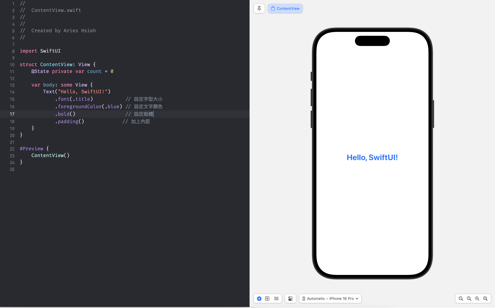

而 padding 本身是透明的，所以這裡是看不出來的。因此我們可以改成這樣：

```swift
Text("Hello, SwiftUI!")
    .font(.title)
    .foregroundColor(.blue)
    .bold()
    .background(.yellow) // 加上黃色背景
    .padding()
    .background(.blue)   // 加上藍色背景
```

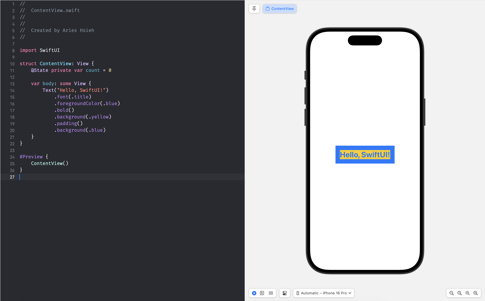

我們替這個 Text 先加上黃色背景，然後再加上 `.padding()` 修飾符，最後再加上藍色背景，最後效果如上圖所示。

這裡可以帶出一個 SwiftUI 蠻重要的觀念，蠻值得一提的觀念：

#### SwiftUI 修飾符的順序與「視圖組合」概念

上面 Text 的程式碼可以這樣分析：

`Text("Hello, SwiftUI!")` 最先被 `background(.yellow)` 包裹，這是「文字本身範圍」的背景。接著 `.padding()` 為文字 + 黃背景增加內距。最後再套用 `.background(.blue)`，這個藍色背景覆蓋在包含內距的整個區域上。

而 SwiftUi 修飾符的順序是有意義的，順序的安排會影響視圖結構。SwiftUI 會**依序**將每個修飾符包裹上一層新的視圖。也就是說，不同順序下，背景會出現在不同的層級。
舉例來說，若把 `.background(.blue)` 放到 `.padding()` 之前，就只會給文字 + 黃背景，不會包含 padding 範圍。

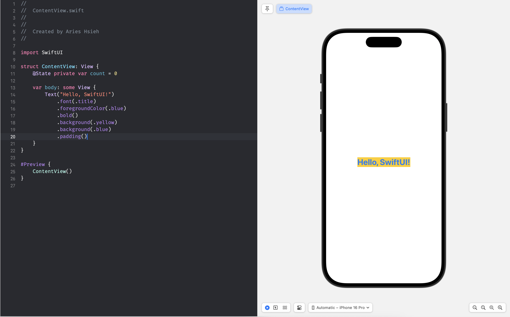


### Image：圖片顯示

`Image` 可以顯示專案內的圖片資源或系統圖示：

```swift
// 顯示專案中的圖片
Image("image")
    .resizable()          // 允許調整大小
    .scaledToFit()        // 保持比例縮放
    .frame(width: 300)    // 設定寬度

// 使用系統圖示
Image(systemName: "heart.fill")
    .foregroundColor(.red)
```

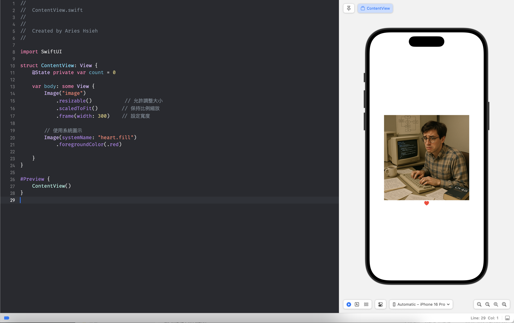

### Button：按鈕元件

`Button` 能讓使用者進行互動，包含顯示內容和點擊動作：

```swift
Button(action: {
    // 點擊時執行的程式碼
    print("按鈕被點擊")
}) {
    // 按鈕的外觀
    Text("登入")
        .foregroundColor(.white)
        .padding()
        .background(Color.teal)
        .cornerRadius(8)
}
```

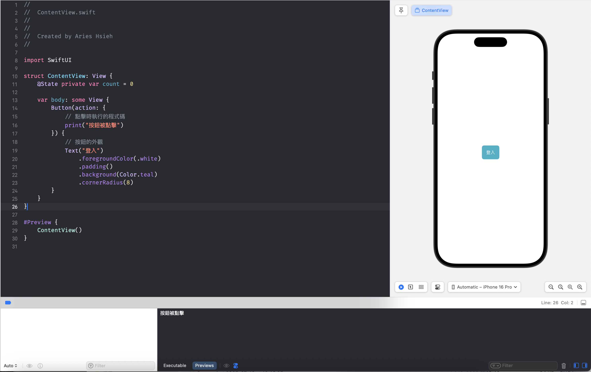

---

## 狀態管理：@State 與 @Binding

在 SwiftUI 中，我們使用特殊的屬性包裝器來管理元件的狀態：

### @State：管理元件內部狀態

當某個值會影響畫面顯示，且會隨著使用者操作而改變時，我們使用 `@State`：

```swift
struct CounterView: View {
    @State private var count = 0  // 宣告 @State 變數

    var body: some View {
        VStack {
            Text("計數: \(count)")
            Button("增加") {
                count += 1  // 修改狀態，畫面會自動更新
            }
        }
    }
}
```

實際畫面如下，當你按下按鈕，`count` 變數加 1 後，Text 會自動更新，不需要你手動去更新 UI。

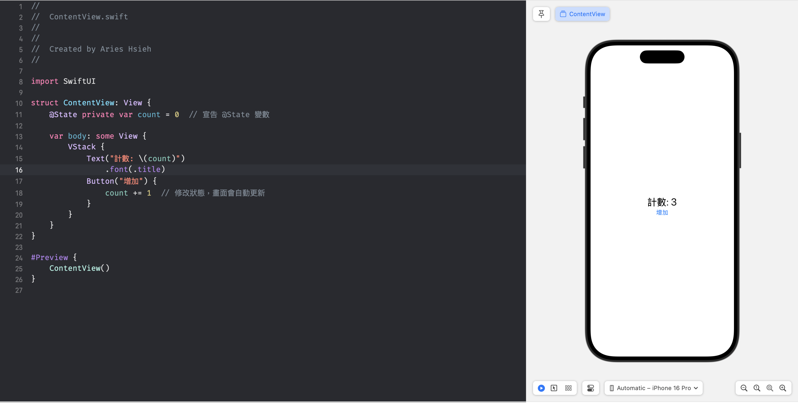


然而，UI 更新這件事情在 UIKit 裡，不論你是透過什麼方式（例如 ViewModel, delegate）等方式，都必須由開發者自行處理。

這邊舉一個最簡單的方式為例：

```swift
import UIKit

class ViewController: UIViewController {

    var currNumber: Int = 0

    @IBOutlet weak var numberLabel: UILabel!

    @IBAction func btnTapped(_ sender: Any) {
        currNumber += 1
        numberLabel.text = "\(currNumber)"
    }

    override func viewDidLoad() {
        super.viewDidLoad()
        numberLabel.text = "\(currNumber)"
    }
}
```

在 `btnTapped()` 裡面，你除了要處理 `currNumber` 數值的更新外，你同時也得處理 `numberLabel` 的 UI 更新。
或者另外一種寫法：

```swift
import UIKit

class ViewController: UIViewController {

    var currNumber: Int = 0 {
       didSet {
            numberLabel.text = "\(currNumber)"
       }
    }

    @IBOutlet weak var numberLabel: UILabel!

    @IBAction func btnTapped(_ sender: Any) {
        currNumber += 1
        numberLabel.text = "\(currNumber)"
    }

    override func viewDidLoad() {
        super.viewDidLoad()
        numberLabel.text = "\(currNumber)"
    }
}
```

這種寫法使用了 `didSet` 這個 Property Observer 來自動處理 UI 的更新。

### @Binding：元件間的資料綁定

當需要在不同元件間共享和同步狀態時，使用 `@Binding`：

```swift
struct ColorPanel: View {
    @Binding var color: Color  // 綁定父元件的顏色狀態

    var body: some View {
        Button("切換顏色") {
            color = (color == .red ? .blue : .red)
        }
        .padding()
        .background(color)
        .foregroundColor(.white)
        .cornerRadius(8)
    }
}

struct ContentView: View {
    @State private var currentColor: Color = .red

    var body: some View {
        VStack {
            Text("當前顏色：\(currentColor == .red ? "紅色" : "藍色")")
                .font(.title)
            ColorPanel(color: $currentColor)  // 傳遞「遙控器」
        }
    }
}
```

實際運作畫面如下：

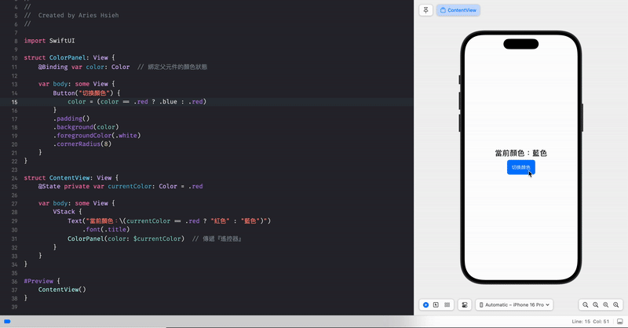

這段程式碼實作了一個顏色切換器的功能，`ContentView` 維護一個可變的顏色狀態 `currentColor`，初始值為紅色 `.red`，畫面上用文字顯示當前顏色（紅色或藍色）。而我們使用 `ColorPanel` 這個元件來建立一個按鈕，該按鈕的背景色會隨 `currentColor` 變化，點擊按鈕時，會將顏色在紅色和藍色之間切換。

父元件 `ContentView` 透過 `@State` 持有顏色狀態，並用 `$currentColor` 把綁定（Binding）傳給子元件 `ColorPanel`，這裡可以把 binding 想像成「遙控器」。`ColorPanel` 接收遙控器後，能讀取此遙控器的資料，並遙控改變父元件的 `currentColor`。按鈕的背景因此隨顏色狀態實時更新，文字也同步顯示變更後的顏色名稱。


***為什麼我們需要這樣做？***

這樣的做法我們可以確保所有顯示都同步更新，不會出現不一致的情況，父元件的 `Text` 和子元件的 `Button` 背景都會同時改變，也避免多個地方各自儲存同樣的資料副本，造成管理上的混亂。由父元件負責「持有資料」，子元件負責「顯示和操作」，這樣的資料流向是很清晰的：

>父 -> 子傳遞，子 -> 父回饋

***沒有這樣做會如何？***

```swift
import SwiftUI

struct ColorPanel: View {
    @State private var color: Color = .red  // 子元件自己的狀態

    var body: some View {
        Button("切換顏色") {
            color = (color == .red ? .blue : .red)
        }
        .padding()
        .background(color)
        .foregroundColor(.white)
        .cornerRadius(8)
    }
}

struct ContentView: View {
    @State private var currentColor: Color = .red  // 父元件自己的狀態

    var body: some View {
        VStack {
            Text("當前顏色：\(currentColor == .red ? "紅色" : "藍色")")
                .font(.title)
            ColorPanel()  // 沒有傳遞綁定
        }
    }
}

#Preview {
    ContentView()
}
```

父元件和子元件各自有獨立的狀態 `currentColor` 與 `color`。當按下按鈕時，子元件按鈕背景會變，但父元件的文字不會更新，因為兩邊的資料不同步。

---

## 基本佈局容器

SwiftUI 提供了三種基本的堆疊容器來排列元件：

### VStack：垂直堆疊
```swift
VStack(spacing: 20) {  // spacing 設定元件間距
    Text("第一行")
    Text("第二行")
    Text("第三行")
}
```

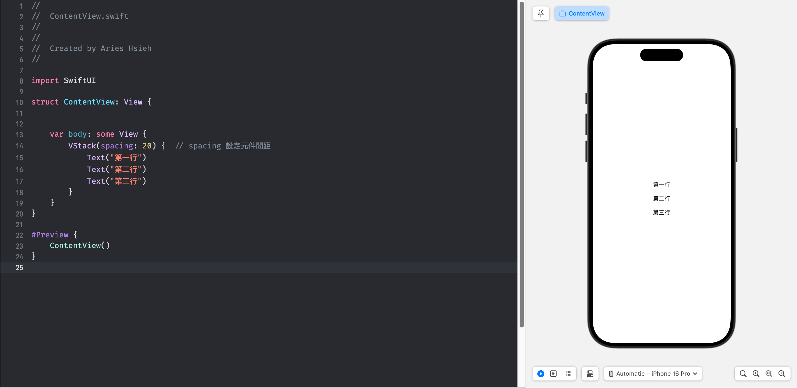

### HStack：水平堆疊
```swift
HStack(alignment: .center) {  // alignment 設定對齊方式
    Image(systemName: "person")
    Text("使用者名稱")
}
```

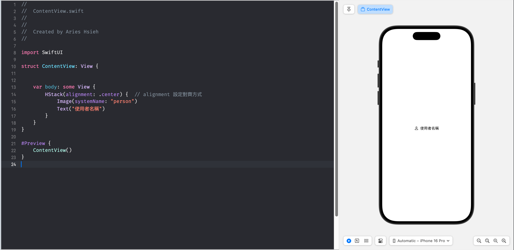

### ZStack：重疊堆疊
```swift
ZStack {  // 後面的元件會疊在前面的上方
    Color.blue        // 背景
    Text("前景文字")   // 文字會顯示在藍色背景上
}
```

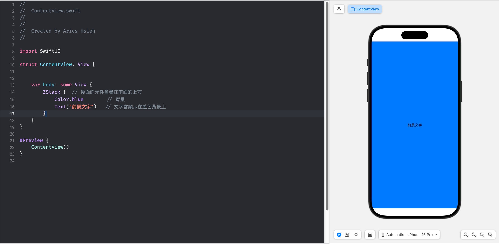

## 綜合使用：組合式佈局

讓我們運用上面學到的 VStack、HStack 和 ZStack 來製作一個簡單的組合式佈局：

```swift
struct CombinedStacksView: View {
    var body: some View {
        VStack(spacing: 20) {
            // 上方的標題區塊
            Text("Stack 範例")
                .font(.largeTitle)
                .bold()

            // 中間的卡片區塊
            ZStack {
                // 底層的背景
                RoundedRectangle(cornerRadius: 10)
                    .fill(Color.blue.opacity(0.2))
                    .frame(height: 100)

                // 上層的內容
                HStack(spacing: 15) {
                    Image(systemName: "star.fill")
                        .foregroundColor(.yellow)
                        .font(.title)

                    VStack(alignment: .leading) {
                        Text("主標題")
                            .font(.headline)
                        Text("副標題")
                            .font(.subheadline)
                            .foregroundColor(.gray)
                    }
                }
            }
            .padding(.horizontal)
        }
        .padding()
    }
}
```

這個範例同時運用了三種 Stack：
- 使用 VStack 作為最外層的垂直佈局
- 使用 ZStack 創建一個帶背景的卡片效果
- 使用 HStack 和 VStack 的巢狀組合來排列圖示和文字

實際效果如下：

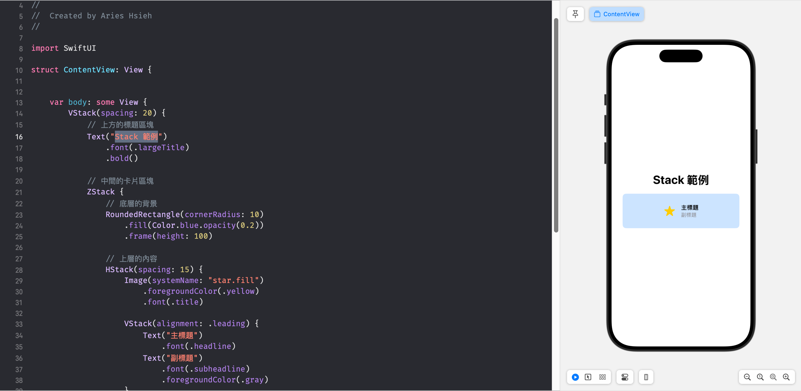

## 本日小結

今天我們學習了 SwiftUI 的基本元件和佈局系統。SwiftUI 的宣告式語法讓我們能更直觀地描述想要的介面，而狀態管理機制則讓畫面能自動根據資料變化更新。雖然這些都是最基本的元件，但它們是構建更複雜介面的基礎。

在接下來的系列中，我們會繼續探索更多進階的 SwiftUI 功能，並逐步實作我們的里程標 App。

