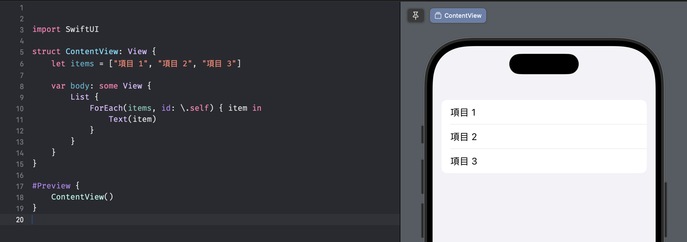
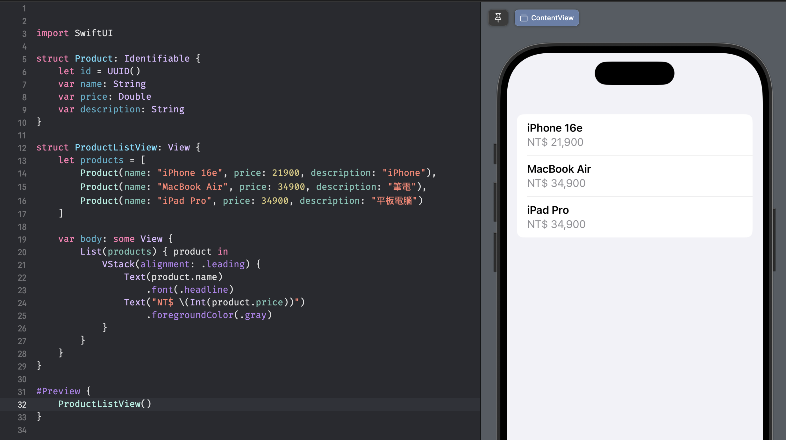
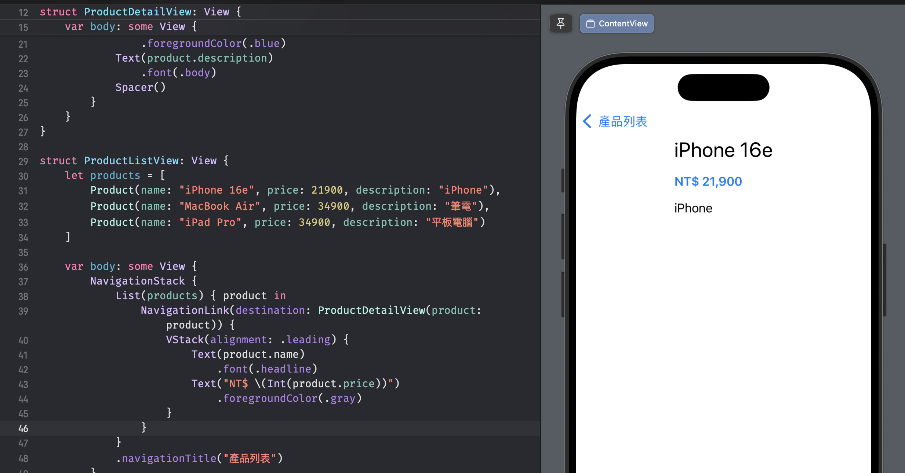

# SwiftUI 列表與導航

在 iOS 中，列表（List）和導航（Navigation）是兩個非常重要的基礎元件。前者用於展示大量資料，後者則為畫面切換機制。今天我們將探討這兩個重要的主題，並透過實作一個簡單的列表應用來理解相關概念。

## List 元件與 ForEach 的基本使用

SwiftUI 的 List 元件使用方式如下：

```swift
struct ContentView: View {
    

    var body: some View {
        List {
            ForEach(items, id: \.self) { item in
                Text(item)
            }
        }
    }
}
```



在上面的例子中，我們使用了 `ForEach` 來遍歷陣列中的元素。

### id 是什麼？

id 參數用於為 ForEach 中的每個項目提供唯一的標識符。SwiftUI 透過這個標識符來識別和追蹤 list 中的每個視圖。當使用 `id: \.self` 時，表示直接使用被遍歷集合中的**元素本身**作為其唯一標識符。這種方式適用於集合中的元素本身是簡單且唯一的類型，例如 `Int`、`String`。

使用 `\.self` 作為 id 的前提是，你的資料集合 items 中的元素類型必須遵守 `Hashable` 協議。Hashable 能確保每個元素都可以被計算出一個唯一的雜湊值，從而讓 SwiftUI 能區分它們。

常見的 Hashable 類型包括：
- String
- Int
- Double
- UUID

而當資料發生變化時，SwfitUI 就可以透過 `id` 確定哪些項目新增、移除或修改，以便只更新發生變動的視圖。

### Identifiable 協定的應用

但當你的資料不是屬於 String, Int 此類 data type，例如是你自訂的某個 Struct，就必須遵循 Identifiable 協議。

Identifiable 協議要求你提供一個名為 id 的屬性，該屬性必須是唯一且可雜湊的（Hashable）。通常會使用 UUID 來保證唯一性，例如：

```swift
struct Product: Identifiable {
    let id = UUID()
    var name: String
    var price: Double
    var description: String
}

struct ProductListView: View {
    let products = [
        Product(name: "iPhone 16e", price: 21900, description: "iPhone"),
        Product(name: "MacBook Air", price: 34900, description: "筆電"),
        Product(name: "iPad Pro", price: 34900, description: "平板電腦")
    ]

    var body: some View {
        List(products) { product in
            VStack(alignment: .leading) {
                Text(product.name)
                    .font(.headline)
                Text("NT$ \(Int(product.price))")
                    .foregroundColor(.gray)
            }
        }
    }
}
```



在 ForEach 中，不再需要手動指定 id 參數，SwiftUI 會自己使用 product.id。

## 實現畫面導航

接下來，我們將使用 `NavigationStack` 和 `NavigationLink` 來實現產品列表到詳細資訊的導航：

```swift
struct ProductDetailView: View {
    let product: Product

    var body: some View {
        VStack(alignment: .leading, spacing: 16) {
            Text(product.name)
                .font(.title)
            Text("NT$ \(Int(product.price))")
                .font(.headline)
                .foregroundColor(.blue)
            Text(product.description)
                .font(.body)
            Spacer()
        }
    }
}

struct ProductListView: View {
    let products = [
        Product(name: "iPhone 16e", price: 21900, description: "iPhone"),
        Product(name: "MacBook Air", price: 34900, description: "筆電"),
        Product(name: "iPad Pro", price: 34900, description: "平板電腦")
    ]

    var body: some View {
        NavigationStack {
            List(products) { product in
                NavigationLink(destination: ProductDetailView(product: product)) {
                    VStack(alignment: .leading) {
                        Text(product.name)
                            .font(.headline)
                        Text("NT$ \(Int(product.price))")
                            .foregroundColor(.gray)
                    }
                }
            }
            .navigationTitle("產品列表")
        }
    }
}
```

以上程式碼定義了兩個主要的 SwiftUI view：

- ProductListView: 用一個 List 顯示所有產品的摘要資訊。
- ProductDetailView: 當使用者點擊列表中的任一產品時，顯示該產品的完整詳細資訊。

NavigationStack 是用於建立 navigation stacl 的容器 view。它提供了一個 stack，可以將新的 view push 到畫面上方，並提供返回按鈕。

NavigationLink 則用於觸發 navigation。它由兩部分組成：

- destination: 指定當使用者點擊這個連結時，要導覽到的目標 view。在這裡，它創建了一個 ProductDetailView 的 instance，並將對應的 product 資料傳遞進去。
- label (即後方的 closure {...}): 指定這個連結在畫面上顯示的內容。這裡它是一個 VStack，包含了產品的名稱和價格。



點擊列表上商品後呈現的 ProductDetailView。

# 小結

今天我們學習了 SwiftUI 中的列表和導航功能，這兩個元件在 iOS 應用開發中很常用。

下一篇文章，我們將探討更進階的主題。如果您對今天的內容有任何問題，歡迎在下方留言討論。
