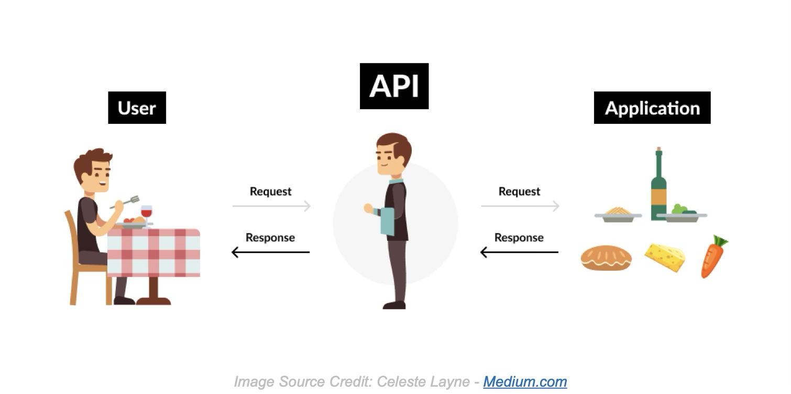
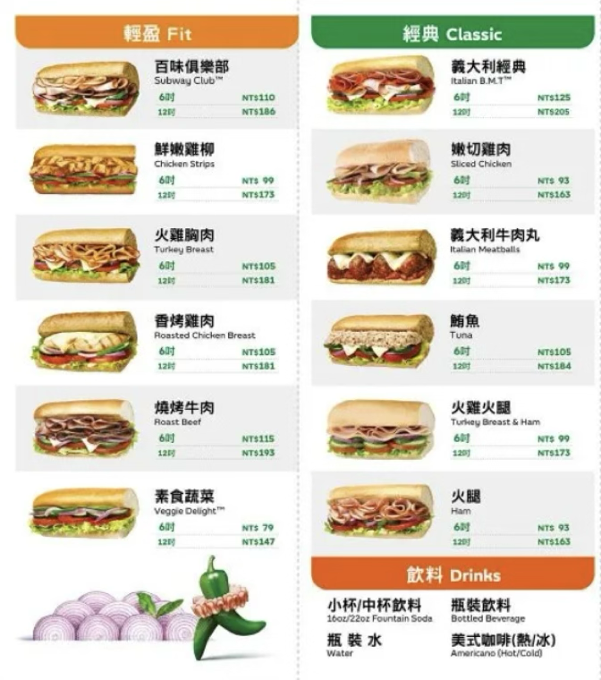
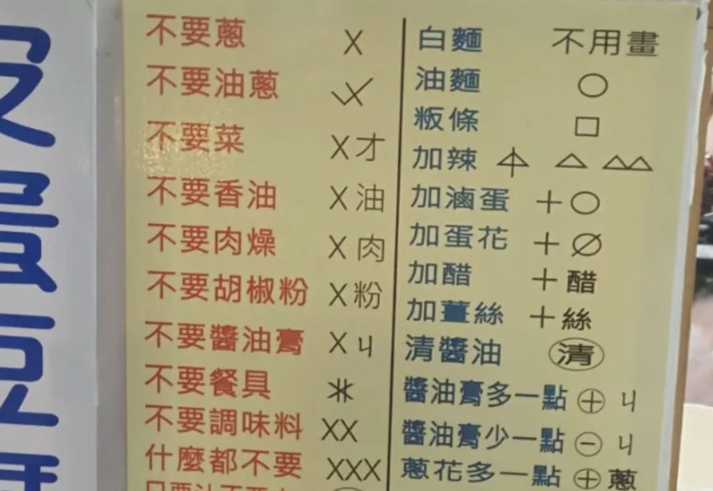
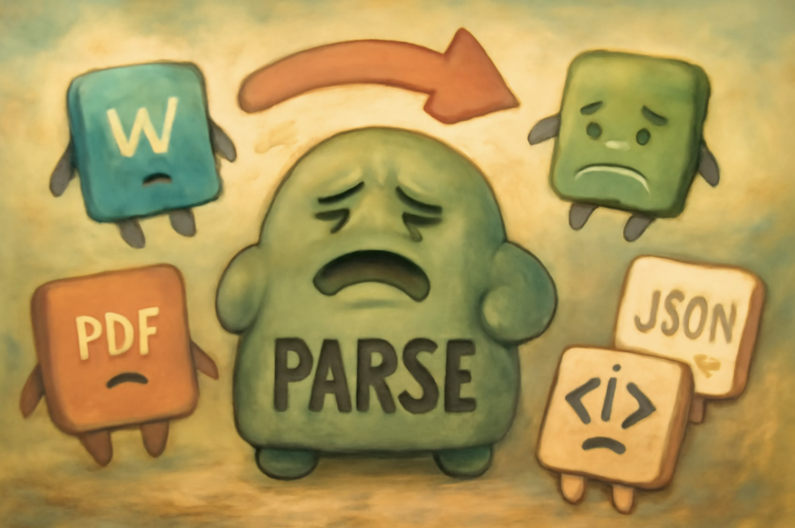
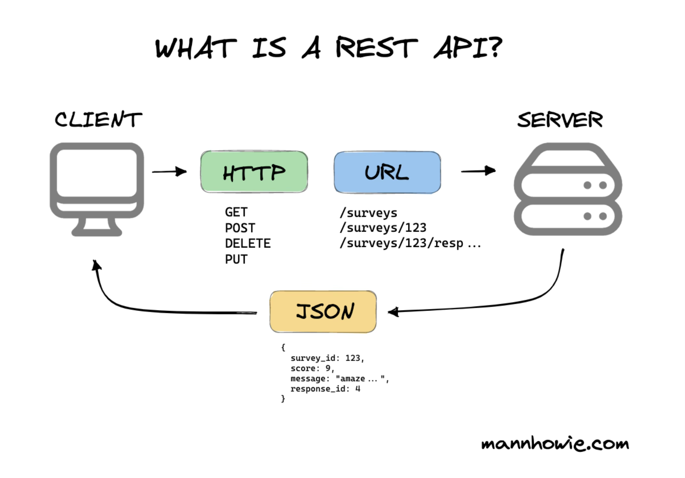
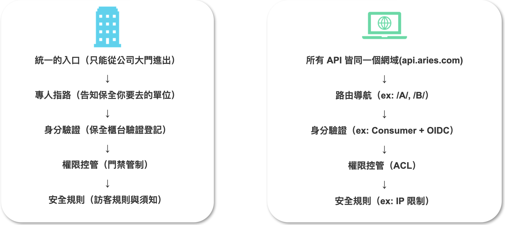

# 前言

本篇算是整理下目前自己對 API 的理解，算是雜談性質，就記錄一下吧。

# 什麼是 API (Application Program Interface) ?

## 從文義解釋開始

從文義解釋來看，API 的基本定義是：軟體之間溝通的介面，允許不同系統有規範地交換資料。API 規範了如何向服務提出請求、需要的資料格式，以及回傳結果的形式。

然而文義解釋總是過於抽象，我們還是舉例來說明會比較清楚。在介紹何謂 API 時，最常聽到，會用餐廳點餐來比喻，我這裡也不免俗地用這個方式來說明。

## 餐廳的例子

>Image Source Credit: Celeste Layne - [Medium.com](https://medium.com/programming-for-design-practices/a-is-for-application-api-basics-744661bb95a2)

你是餐廳的顧客，菜單代表「服務可以提供那些資料、功能」。當你向服務生點餐（發送請求），服務生將你的請求帶給廚房（資源所在，也就是後端系統）。廚房根據菜單和你的選擇（麵要加大不要辣）的選擇製作食物（處理請求）。最後，服務生把餐點（回應）端給你。

在這個比喻中，服務生就像 API，客戶端（顧客）不直接與後端（資料、邏輯、資源）打交道，而是透過 API 這個介面來溝通下單和取得結果，省去彼此理解內部細節的麻煩。

但是，工具的目的是為了解決問題，重要的不是工具本身，而是背後要解決的那個問題。因此我們要進一步思考的是，如果沒有 API，會如何？

軟體之間就必須「直接訪問」彼此的資料或功能，彼此須了解對方的內部細節，如同點菜時顧客沒有按照制式的菜單點餐，廚房根本不知道怎麼出菜，最後本人必須進廚房了解每一道手續，如此一來餐廳根本無法運作。但若真的讓顧客直接進餐廳，如此，就會缺乏安全隔離，外部程式可以隨意取得資料，使系統變得脆弱，就像顧客可能將病原體帶入廚房，污染食材。同時，維護上若有需要調整，將會修改困難，比方說內部實作細節更改，取用者要如何取得資料，必須重新理解取用過程。

舉例來說，如果沒有 API，你開發一個 App，需要取得 google 地圖的資料、處理金流等功能時，你得直接接觸這些系統的底層，理解提供服務者的內部結構才能夠拿到你想要的東西。

## 訂購人的困境

OK，現在每一家餐廳都有自己的菜單與訂購單，解決了廚房的溝通問題。這解決了單一廚房點餐的問題，基本上只要看得懂上面菜單的文字，就可以知道這張單要出甚麼內容。我們有了 API 了！

但若場景變成：要對多個餐廳要同時下單，你是訂便當股長，就會遇到要對應不同便當店，要看懂每家的菜單格式，還要想辦法看懂各位同事自由格式的信件內容，也就是你要適應不同格式，結果就是增加了溝通成本。

例如上圖，每間餐廳的菜單風格迥異。

## 開發人員的困境

回到開發場景。來做個系統吧，資訊人員一定會幫我們解決這個問題，降低便當股長的離職率。但資訊人員遇到了問題，那就是他要去串接的每個店家，他的訂購單格式都不一樣，此時面對了一些抉擇：

1. 鍛鍊資訊人員，所有店家都客製作下去，但這可能會提高資訊人員離職率。
2. 訓練資訊人員的溝通能力，配合專案經理，以及外部合作商，談訂一個共同的規格。

很遺憾的，上面那兩個選項，偉大的老闆選了項目 1，為了不影響其他合作商，所以決定讓自己的工程師處理。

如果每個合作對象（例如不同餐廳）都用自己的格式來傳遞資料，資訊人員（工程師）就必須針對每一種格式，開發不同的「解析」方法。舉例來說：

- 有的店家用 Word 檔案下訂單，有的用 Excel，有的用 PDF，有的直接寄圖片，有的用網頁表單。工程師就要寫很多不同的程式，來讀取和理解這些不同的檔案格式。

- 如果店家改變了檔案格式（例如 Word 從 2003 版換成 2007 版），工程師的程式就可能失效，要重新修改。

- 有的 Excel 檔案可能被植入病毒，還要擔心安全問題。

- 如果是圖片，還要用影像辨識技術來「看懂」圖片內容，萬一圖片字體換了，辨識又會出錯。

這種做法叫「土法煉鋼」，就是沒有標準、每次都要重新處理，導致工作量大、維護困難。

## 一起訂個規格吧！

為了讓不同系統能順利合作，避免不同格式造成整合的混亂，因此，我們需要替 API 訂定標準格式，讓大家都能看懂、用得上。國際上有常見的標準：WSDL（SOAP/XML）、REST API（JSON/XML）。

現在業界的主流是採用 RESTful 風格來設計我們的 API，並統一使用 JSON 做為資料交換的格式。這解決了很大的問題，就像我們規定一個跨國團隊會議時，規定大家都要講英文(RESTful)，而且書面報告都要用 A4 紙(JSON 格式)，溝通的基礎已經建立。

但是，問題還沒完全解決。

即便我們都同意講英文，用 A4 紙，但每次開會前，主辦方還是要另外準備一份厚厚的「會議議程與名詞解釋」(API 文件)，並告訴大家：

- 這次要討論的確切主題是什麼(API 的路徑是什麼)？
- 發言的時候要提出哪些具體證據、數據(Request 內容要包含哪些欄位)?
- 會議結論的格式(Response 內容要長什麼樣子)?

在資訊系統開發的場景，就是開發人員每次要串接一支新的 API 時，都要去閱讀 API 文件，然後開始動手寫程式碼。但每個人文件寫的方式可能都不一樣，文件也可能會有寫得不清楚的地方，這些都會增加溝通成本與錯誤。因此這個時候，統一規格很重要，而更進一步，我們可以讓文件變成機器看的懂的標準化語言，這個東西就是 OpenAPI Specification。

## OAS — API 的標準化規格書

OAS 是 [Open API Specification](https://spec.openapis.org/oas/latest.html) 的簡稱，是一種標準化的 API 規範與文檔。

OAS 就是那本標準字典，他用統一格式 (YAML / JSON)描述所有 API 的細節，人看得懂，機器也能解析，並自動產生文件跟程式碼，減少人工錯誤
前後端協作串接時可以更順利。

# APIM(API Management)

API Management，顧名思義就是管理 APIs。那，問題是，為什麼需要管理 API？管理或不管理的區別是什麼？

同樣地，也舉個生活中的場景為例。

以公司大樓管理為例，如果你有去過門禁管制嚴格的大樓，你必須從唯一的出入口，通常是正門進出。然後你走進去後，保全會問你是誰，你要去哪裡。
假設你說你要去金控資訊處，他可能會打電話給樓上的資訊處作確認，你是否真的有在這個時間要預約過來拜訪。接著，你進電梯後，可能會幫你刷卡跟按指定的樓層，其他樓層你按了都沒有用。如此一來，對於訪客來說事情就變得很單純，他們只需要知道公司的大門在哪，然後出示身分證明或門禁卡即可。

而從 API 的角度來說，唯一的大門口就像公司所有的 API 對外都是同一個 domain name，而透過不同的路徑，APIM 會判斷要將你導到哪個服務。
接著透過在 APIM 上設定誰可以來 consume 這項資源(服務後面代表的是資源)，並且透過身分驗證以即授權機制，來決定是否放行。

## API 沒有統一管理會發生什麼事？

我們可以假想幾個情境：

**情境一：A 子公司需要開發一個新功能，要同時串接「人資 API」與「績效 API」。**

API url 會從原本的：

https://api.aries.com/HR/employees

https://api.aries.com/KPI/KPILists

變成：

http://api.hr/api/v1/employees

http://kpi.api/api/v3/KPILists

這將造成維護災難。若明天人資系統的 API url 有變更，則必須通知所有正在使用這個 API 的人，請他們修改程式碼跟佈署。
同時，也造成知識斷層，新人不知道要去哪裡找這些 API 的位址，只能到處問人，大幅降低開發效率。

**情境二：資安長下令，所有的 API 認證機制要實作 OIDC 認證。**

此時每一支 API 的後端開發團隊都必須在自己的程式裡，用自己的程式語言（Java, Python, .NET…）去實作一套幾乎一樣的 OIDC 驗證邏輯。如果有一百個服務，就得重工一百次。這是***重工***。

A 團隊的實作可能有小瑕疵，B 團隊的錯誤訊息格式跟 C 團隊不一樣，這會讓要串接 API 的對象感到非常困惑，這是***標準不一***的問題。

承上，因為無法保證每個團隊都把安全邏輯實作確實，只要有一個團隊的實作出現漏洞，系統就必須承擔風險，這是***安全風險***的問題。

**情境三：當系統無法連線，誰能回答「為什麼」?**

當今天系統掛掉了，來找是誰的問題。現在：

- 使用者的問題？
- 網路轉發問題？
- 身分驗證服務的問題？
- 後端服務炸掉？

1. 你可能要先問呼叫者「防火牆有開嗎？」、「連線 IP 有改嗎？」。
2. 接著你可能會去問網管，有沒有收到誰誰誰的流量？你們轉發是怎麼設定的？
3. 你可能又思考，那是身分驗證掛掉嗎？然後你要去問公司負責管理的人。
4. 如果前面都沒問題，那問題可能是出現在後端服務？你又要去跟後端的團隊確認，請他們進入主機查 log。

但這些東西如果有 APIM，就可以從 APIM 的 log 上作集中查看，可以快速找到問題可能出現在哪一個環節。

我們可以用表格來總結有無 APIM 的差異：

| 項目       | 有 APIM                                                                                           | 無 APIM                                                                                  |
| ---------- | ------------------------------------------------------------------------------------------------- | ---------------------------------------------------------------------------------------- |
| 對子公司   | 單一、穩定的入口，易於探索與串接。                                                                 | 需要管理多個、易變的後端位址，維護成本高                                                 |
| 安全性     | 集中式的安全策略，由 APIM 統一標準實施身分驗證與授權，標準一致，易於更新。                         | 安全邏輯分散在各個後端服務，需重複開發，標準不一，容易產生漏洞。                         |
| 可觀測性   | 集中式的監控與日誌，能快速定位問題，分析 API 使用狀況。                                             | 分散式的日誌，難以掌握全局，故障排除較為耗時費力。                                       |
| 治理與敏捷性 | 簡單方式管理 Consumer 權限，後端服務可獨立更新而不影響前端呼叫者。                                 | 權限管理與後端變更需要協調多方，反應速度慢。                                             |

## 從資產守護者到價值創造引擎

我們前面討論了很多，如果沒有 APIM 會有多麼混亂、沒有效率與危險。但這只是從 API 治理的角度來看。APIM 可以更進一步地從防止出事變成促成好事。在數位時代，一家公司最有價值的資產，以金融業來說，不只是實體的錢，而是各個系統裡的數據、資料與服務能力。而要如何讓這些數位資產能夠有效、安全被利用，API 的治理就相當的重要。透過 APIM 將不同的 API 用標準化封裝、確保安全與品質。

比方說，人壽子公司想要開發一款 APP，有個功能需要驗證客戶是否為銀行的 VIP 客戶，以提供特殊的優惠。此時有兩種做法：

**做法一：銀行「直接開一個 API」讓人壽子公司呼叫**

銀行開發團隊與人壽開發團隊開會（討論規格細節），客製化出一個「人壽 → 銀行」的 API。
那未來若證券子公司、甚至是產險子公司看到這支 API 很好用，也想要呢？再開「證券 → 銀行」及「產險 → 銀行」的 API？

那有其他更多人想要用，再加開？

有十支 API，未來有變動就要改十次。

**做法二：透過 APIM，將「VIP 客戶狀態」發布成一個受管理的服務**

現在我們用 APIM 的思維來看待這個需求，銀行的開發團隊工作不再是「為保險公司開一個 API」，而是「發布一個名為『VIP 客戶狀態查詢』的標準化數位產品。銀行只要專注於商業邏輯，其他技術細節例如認證授權等安全措施交由 APIM 來集中處理。

# 小結

工具終究只是工具，重點是我們要用它解決什麼問題、開啟什麼機會。

回過頭來看，API 就像企業的服務入口，OAS 是標示服務細節的清單，而 APIM 則是整個入口的管理中心。沒有 API，外部或內部團隊就得繞遠路、自己摸索；有了 API 卻沒有規格，就像入口的標示牌各寫各的，讓人看得霧煞煞；有了規格但缺乏管理，入口雖然存在，但安全檢查、流量管制、使用紀錄都一團亂。

APIM 讓 API 從「能用」變成「好用、可持續用」。它讓技術團隊少踩坑、少重工，讓商業團隊更快落實踐想法，甚至能把原本鎖在系統裡的能力，變成可以創造新價值的產品。
