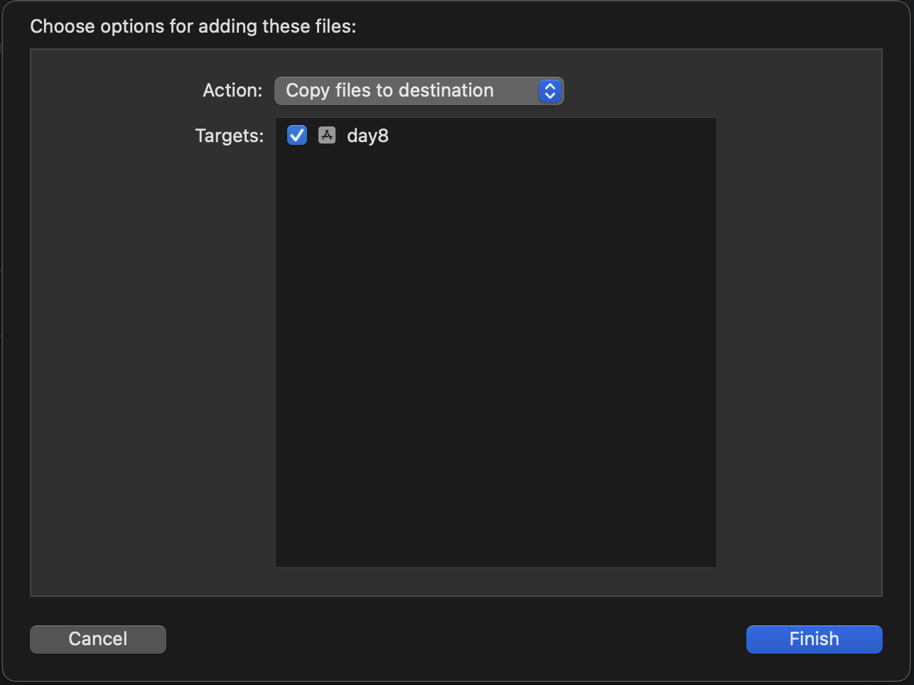
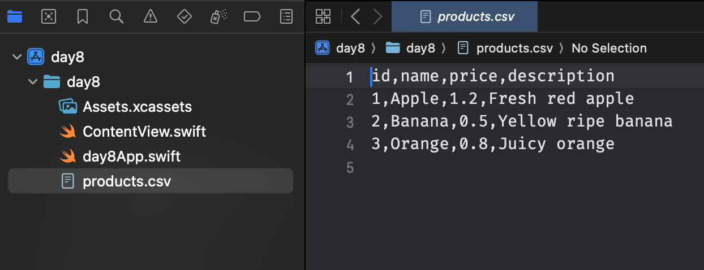

# 前言

在 App 開發中，有時需要從專案內置的資源檔（如 CSV、JSON）讀取資料。CSV 是用逗點分隔值的檔案，我們可以將之轉化為 SwiftUI 列表。這項操作技能很實用，因為許多資料都是以這種簡單的格式儲存的，而我們這次要實作的 App 也會需要使用到這個功能，因此有必要先了解一下這個主題。

要完成這個任務，我們需要理解並掌握以下幾個核心概念：

- 讀取 App 內部檔案：學習如何使用 Bundle 來定位並讀取包含在我們 App 安裝包內的資源檔案，例如這次要用的 `products.csv`。
- 資料解析 (Parsing)：取得原始的文字資料後，我們需要將其一行一行地解析，並將每個欄位轉換成我們定義好的 `Product` 資料結構，這個過程稱為資料解析。
- 動態列表 List：這個我們在昨天有使用過了，今天也會用到它。
- Identifiable 協定：我們的資料模型（Product struct）必須遵循 Identifiable 協定，告訴 SwiftUI 如何唯一識別每一個項目。

那我們就開始吧。

# Step 1：將 products.csv 加入 Xcode 專案

我們先將 products.csv 檔案拖曳到 Xcode 左側的專案導覽器中，並確保在跳出的視窗中勾選了 "Copy files to destination" 以及您的 App Target。



按下 Finish 後，可以看到檔案成功被加入到專案裡頭。




# Step 2：定義產品資料模型

我們需要建立一個 struct 來對應 CSV 中的每一行資料。為了讓 SwiftUI 的 List 能識別每個項目，這個 struct 必須遵循 Identifiable 協定。

```swift
import Foundation

struct Product: Identifiable {
    let id: Int
    let name: String
    let price: Double
    let description: String
}
```

# Step 3: 建立 SwiftUI view 與讀取邏輯

接下來，我們建立主要的 SwiftUI view。在這個 view 中，我們將：

- 建立一個 @State 變數 products 來儲存從 CSV 讀取的資料。
- 使用 .onAppear 修飾符，在視圖出現時執行讀取 CSV 的邏輯。
- 建立一個 List 來顯示所有產品。

## 讀取 CSV 檔

我們需要建立一個讀取 CSV 的函式，程式碼如下：

```swift
// 讀取並解析 CSV 檔案的函式
private func loadData() {
    // 1. 在專案中尋找 products.csv 的路徑
    guard let path = Bundle.main.path(forResource: "products", ofType: "csv") else {
        print("找不到 CSV 檔案")
        return
    }

    do {
        // 2. 將檔案內容讀取為一個字串
        let content = try String(contentsOfFile: path, encoding: .utf8)

        // 3. 將字串按行分割，並移除第一行 (標頭)
        let lines = content.split(separator: "\n").dropFirst()

        // 4. 遍歷每一行，解析資料並建立 Product 物件
        self.products = lines.compactMap { line in
            let columns = line.split(separator: ",").map { String($0) }
            guard columns.count == 4,
                    let id = Int(columns[0]),
                    let price = Double(columns[2]) else {
                return nil
            }
            return Product(id: id, name: columns[1], price: price, description: columns[3])
        }
    } catch {
        print("讀取檔案時發生錯誤: \(error)")
    }
}
```

>private 是一個「存取控制」關鍵字。將函式標記為 private 表示只有在 ContentView 這個 struct 內部才能呼叫它。從外部是看不到也無法使用這個函式的。在這個範例裡 loadData() 的唯一目的就是為 ContentView 載入資料，其他任何地方都不應該、也不需要知道它的存在。將其設為私有，可以避免其他程式碼不小心呼叫它。

我們逐行分析函式內部的程式碼：

1. 尋找檔案路徑

```swift
guard let path = Bundle.main.path(forResource: "products", ofType: "csv") else {
    print("找不到 CSV 檔案")
    return
}
```

- 要做什麼？

  要在 App 的資源包 (Bundle) 中找到 products.csv 這個檔案的實際存放路徑。

- 如何做到？

  Bundle.main.path(...) 是 Apple 官方提供的標準方法，用來存取 App 內部的資源。

>可以把 App Bundle 想像成一個 「資源包裹」。當 Xcode 編譯並打包 App 時，它會將程式碼執行檔、圖片、音效、.csv 檔案，以及所有您加入專案的資源，全部整理好放進一個資料夾，這個資料夾就稱為 App 的 Main Bundle。

- 為什麼用 guard let？

  尋找檔案的操作是有可能失敗的（例如，你忘了把檔案加到專案裡，或是檔名打錯）。guard let 語法確保 path 必須有值（檔案找到了），程式才能繼續往下走。如果找不到檔案 (else 的部分)，它會立刻 print 出錯誤訊息並用 return 結束函式。（if let 是另一種用法，但適合場景不太相同）。

2. 處理讀取錯誤

```swift
do {
    let content = try String(contentsOfFile: path)
    // ... 後續解析程式碼 ...
} catch {
    print("讀取檔案時發生錯誤: \(error)")
}
```

因為讀取檔案可能會失敗（例如檔案毀損），因此這裡使用 do-try-catch。若成功讀取，我們將 CSV 內容讀取為一個字串。
此時若 print content，結果會是：

```
id,name,price,description
1,Apple,1.2,Fresh red apple
2,Banana,0.5,Yellow ripe banana
3,Orange,0.8,Juicy orange
```

3. 解析資料

接著，我們需要將這個字串轉換成 `[Product]` 陣列，以便 List 讀取。

```swift
let lines = content.split(separator: "\n").dropFirst()

self.products = lines.compactMap { line in
    // ...
}
```

- `content.split(separator: "\n")`

  CSV 檔案的內容是用「換行符 (\n)」來分隔每一筆資料的，所以我們先用它把字串切成一行一行的陣列。

- `.dropFirst()`

  將 CSV 的第一行欄位標題 (id,name,price,description)，去掉。

- `lines.compactMap { ... }`

  我們需要遍歷每一行文字，並將其轉換為一個 Product 物件。這裡使用了 Swift 的高階函式 compactMap，避免某行資料格式有問題無法解析，而回傳 `nil`，compactMap 會自動忽略掉這個 nil 值，以便我們過濾掉無效資料，確保最終的 products 陣列裡全都是有效的 Product 物件。

4. 驗證並轉換每一行資料

```swift
let columns = line.split(separator: ",").map { String($0) }
guard columns.count == 4,
      let id = Int(columns[0]),
      let price = Double(columns[2]) else {
    return nil // <--- 如果失敗，就回傳 nil
}
return Product(id: id, name: columns[1], price: price, description: columns[3])
```

接著，我們在 compactMap 的 closure 裡，將單行文字轉換成一個 Product 物件。
因為每一行內部是用「逗號 (,)」來分隔欄位的，所以我們先用 `line.split(separator: ",")` 切出各個欄位。

而當我們用 split 切割一個字串（例如 "1,Apple,1.2,Fresh red apple"）時，為了效能考量，Swift 回傳的並不是一個 `[String]`，而是一個 `[Substring]`子字串陣列。Substring 就像是原始字串的一個「切片」或「視圖」，它共享著原始字串的記憶體，所以建立起來非常快。但它並不是一個獨立的 String 物件。詳情可參考[蘋果官方文件說明](https://developer.apple.com/documentation/swift/substring)。

因此，我們需要將 `[Substring]` 陣列中的每一個元素，使用 `.map { String($0) }` 都轉換成一個獨立的 String。
最後，如果所有驗證都通過，就用這些轉換好的資料建立一個 Product 物件並回傳。

5. 更新 UI


```swift
import SwiftUI

struct ContentView: View {
    // 使用 @State 屬性包裝器來儲存產品陣列
    // 當這個陣列改變時，SwiftUI 會自動更新視圖
    @State private var products: [Product] = []

    var body: some View {
        // 使用 NavigationStack 為列表提供標題和導覽列
        NavigationStack {
            // List 會根據 products 陣列中的每個項目，動態生成列表行
            List(products) { product in
                // 使用 VStack 垂直排列每個產品的資訊
                VStack(alignment: .leading, spacing: 5) {
                    // 主標題：顯示產品名稱和價格
                    HStack {
                        Text(product.name)
                            .font(.headline)
                        Spacer()
                        Text(String(format: "$%.2f", product.price))
                            .font(.subheadline)
                            .foregroundColor(.secondary)
                    }

                    // 次要資訊：顯示產品描述
                    Text(product.description)
                        .font(.body)
                        .foregroundColor(.gray)
                }
                .padding(.vertical, 5) // 為每個列表行增加一些垂直間距
            }
            .navigationTitle("商品列表") // 設定導覽列標題
            .onAppear(perform: loadData) // 當視圖出現時，呼叫 loadData 函式
        }
    }
}
```
