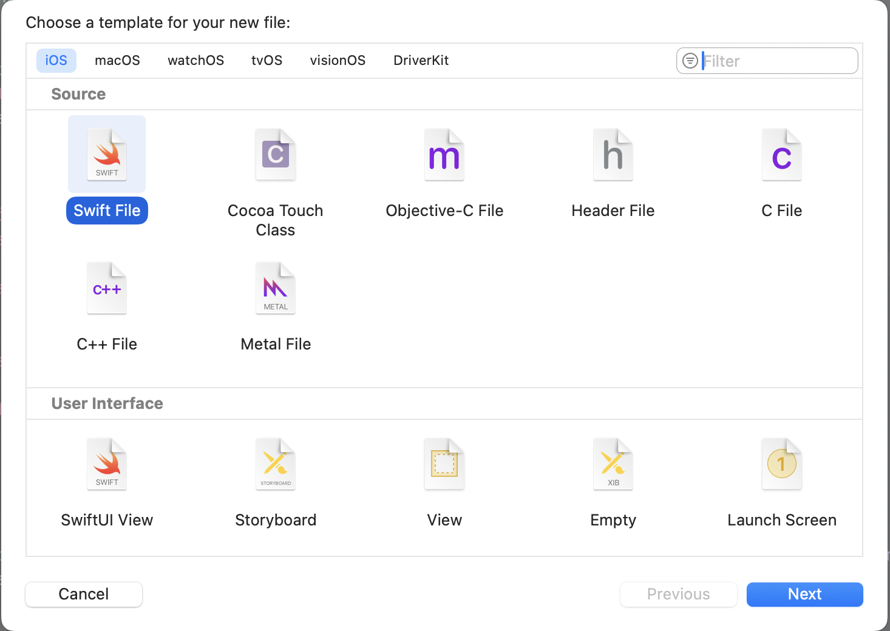
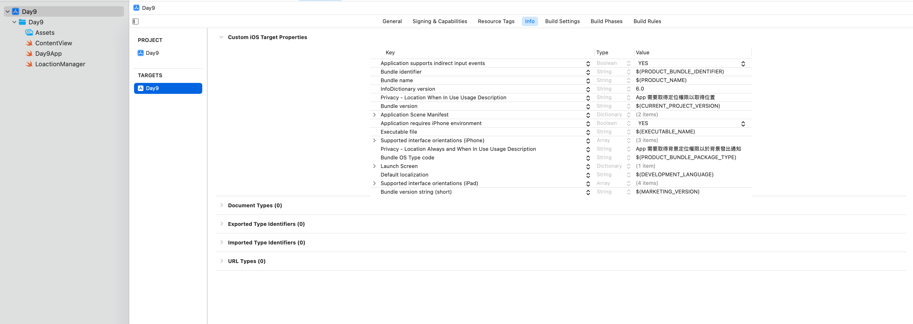
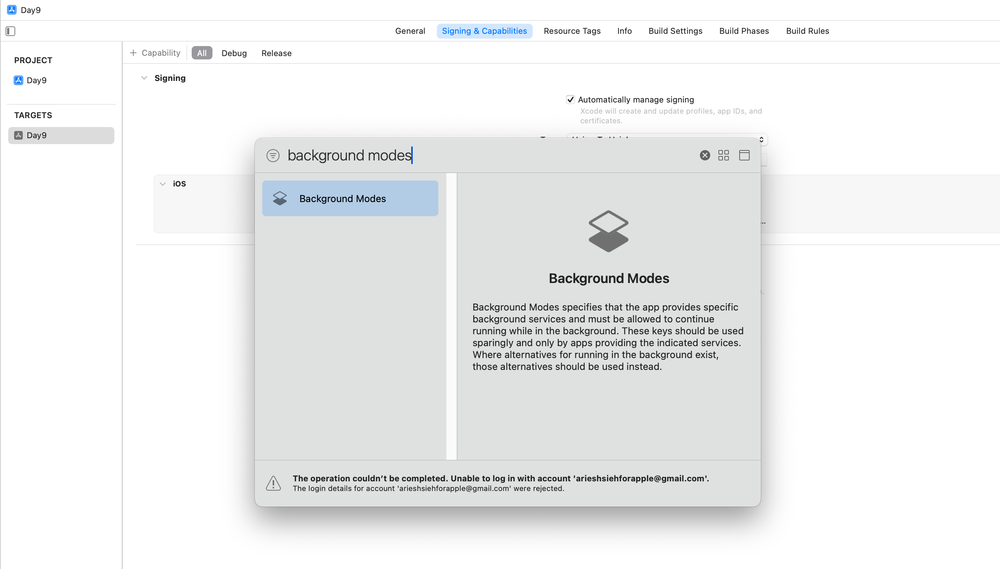
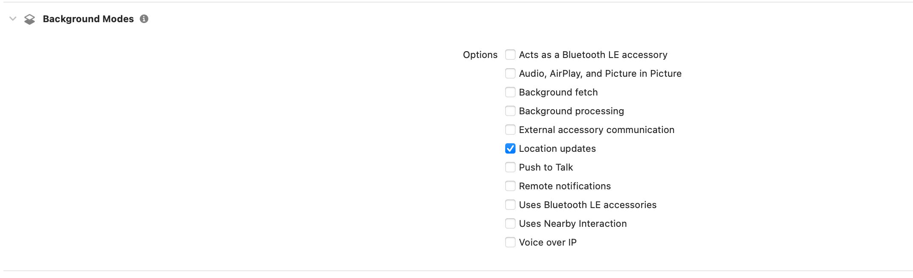
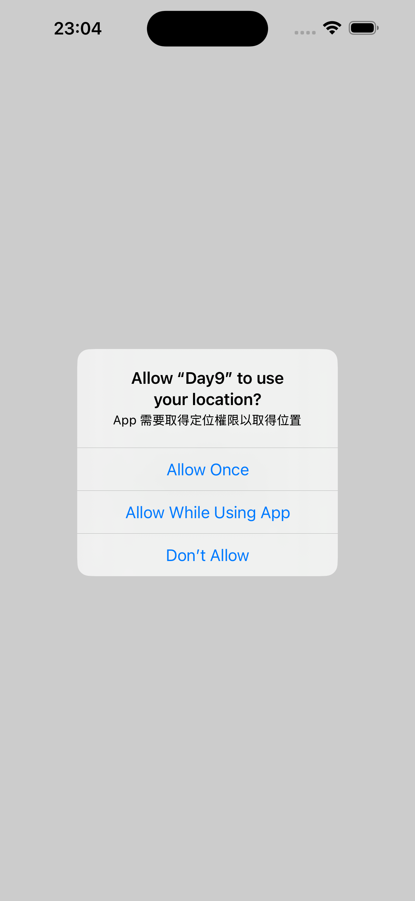
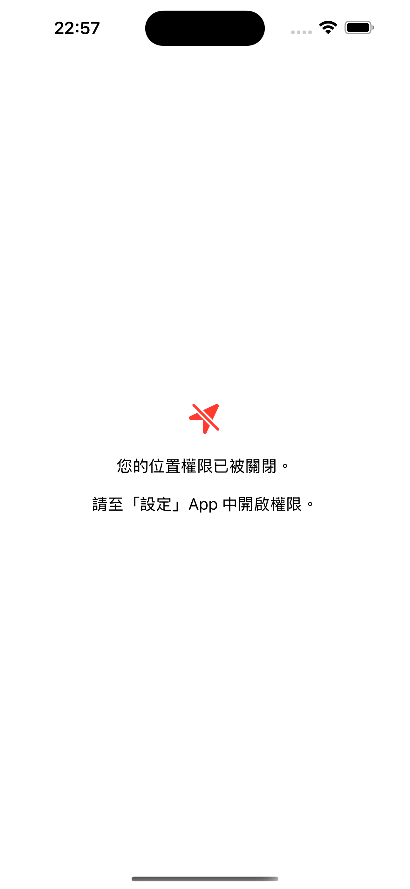
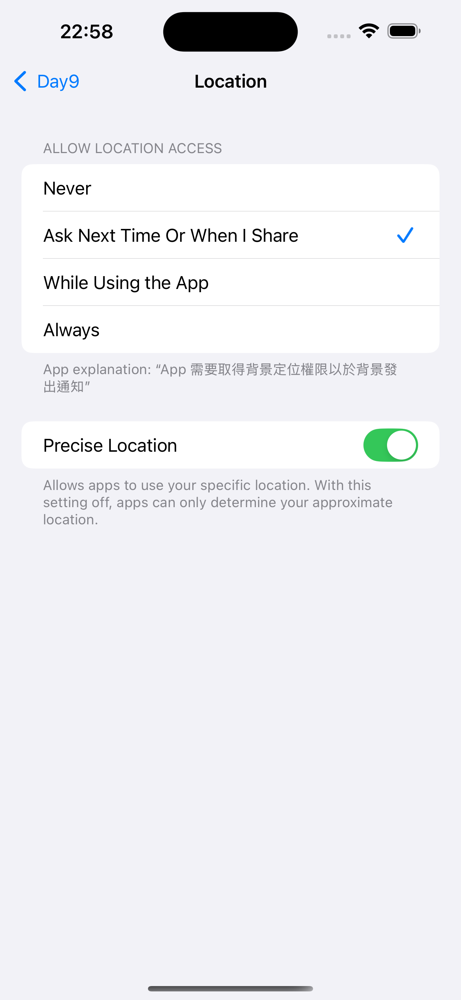
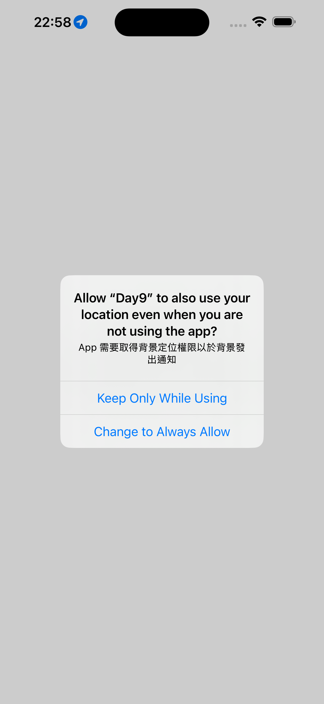
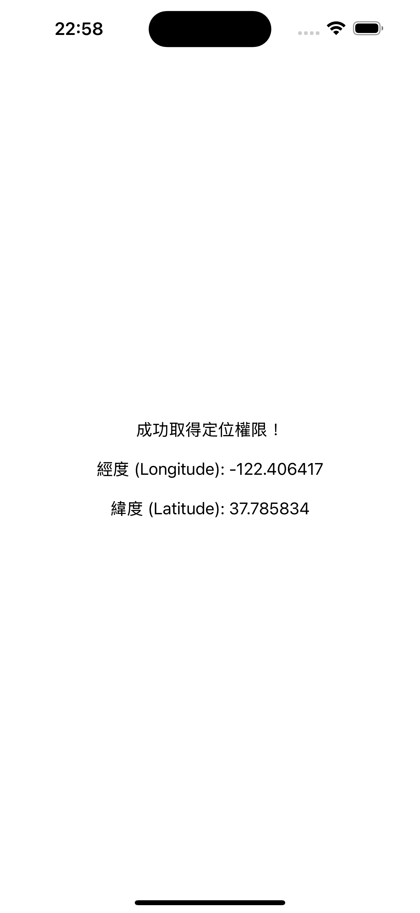

# 前言

Core Location 是 iOS 開發中用於處理地理位置相關功能的框架。今天的目標是了解如何使用 Core Location 來管理權限以及獲取用戶的當前位置。

# 使用 CLLocationManager 管理權限與更新位置

首先我們先在專案資料夾建立一個新的 .swift 檔 `LoactionManager.swift`。



可以在專案資料夾按快捷鍵 `cmd + N`，選擇 iOS -> Swift File。

我們的目的是建立一個獨立的管理者 LocationManager，它會處理向使用者請求定位權限、接收座標更新、並將這些資訊即時「發布」給 SwiftUI 介面，讓畫面可以根據最新的位置或權限狀態自動更新。

```swift
import CoreLocation

class LocationManager: NSObject, ObservableObject, CLLocationManagerDelegate {
    // ....
}
```

- **NSObject:** 繼承自 NSObject。因為 Core Location 框架是基於早期 Objective-C 的設計模式。

- **ObservableObject:** 遵循 ObservableObject 協定。這是一個來自 Combine 框架的宣告，表示這個物件可以被 SwiftUI 的 View 所「觀察」。一旦物件內被 `@Published` 標記的屬性發生改變，它會自動通知所有正在觀察它的 View 進行更新。

>Combine 框架是用來在 Swift 中以聲明式方式處理資料流與非同步事件的工具，簡單說就是你不用自己到處寫通知、代理或 callback 處理資料或事件的一套工具。

- **CLLocationManagerDelegate:** 必須遵循 CLLocationManagerDelegate 協定，LocationManager 才有能力處理「權限狀態改變」或「位置更新」等 delegate method。

接著我們需要：

```swift
class LocationManager: NSObject, ObservableObject, CLLocationManagerDelegate {
    private let manager = CLLocationManager()
    @Published var authorizationStatus: CLAuthorizationStatus = .notDetermined
    @Published var lastSeenLocation: CLLocation?

    // ...
}
```

因為我們只會在這裡存取 CLLocationManager 物件，故用 private 來初始化。`@Published var authorizationStatus...`，`@Published` 是一個 Property Wrapper，每當 `authorizationStatus` 的值改變時，它會自動發出通知給訂閱者。

`var authorizationStatus: CLAuthorizationStatus`，宣告一個變數來儲存當前的定位權限狀態（例如：尚未決定、已允許、已拒絕）。由於 App 剛啟動時，我們不知道權限狀態，故給它一個初始值 `.notDetermined`。

`@Published var lastSeenLocation: CLLocation?`，同樣地，宣告一個帶有 `@Published` 的變數，用來儲存最後一次收到的使用者位置。它的型別是 Optional，因為在獲得授權或收到更新之前，可能還沒有任何位置資訊。

```swift
override init() {
    super.init()
    manager.delegate = self
    manager.desiredAccuracy = kCLLocationAccuracyBest
    self.authorizationStatus = manager.authorizationStatus
}
```

在初始化方法中，`manager.delegate = self` 要告訴 `CLLocationManager`（`manager`），所有定位相關的事件（如權限改變、位置更新）都請通知我（`self`，也就是這個 `LocationManager` 實例）。」

```swift
func requestPermission() {
    manager.requestWhenInUseAuthorization()
}
```

此方法到時候可以方便我們從 View 中呼叫，呼叫 `requestWhenInUseAuthorization()`，觸發 iOS 系統彈出「僅在使用 App 期間允許」的權限請求視窗。

```swift
func locationManagerDidChangeAuthorization(_ manager: CLLocationManager) {
    let status = manager.authorizationStatus
    DispatchQueue.main.async {
        self.authorizationStatus = status
    }

    switch manager.authorizationStatus {
    case .notDetermined:
        manager.requestWhenInUseAuthorization()
    case .authorizedWhenInUse:
        manager.startUpdatingLocation()
        manager.requestAlwaysAuthorization()
    case .authorizedAlways:
        manager.startUpdatingLocation()
    default:
        break
    }
}
```

這是 CLLocationManagerDelegate 的 delegate 方法，每當 App 的定位權限狀態發生任何改變時，例如使用者按下「允許」或「拒絕」，這個方法就會被自動呼叫。

`self.authorizationStatus = status` 將 `authorizationStatus` 更新為最新的狀態，並觸發 `@Published` 發出通知，讓 SwiftUI View 更新畫面。

`switch manager.authorizationStatus { ... }` 則根據最新的權限狀態執行不同的邏輯：
- `.notDetermined`: 如果狀態是未知的，嘗試請求權限。
- `.authorizedWhenInUse`: 如果使用者只允許了「使用時」，就開始更新位置，並接著請求「永遠允許」的權限（如果有需要）。
- `.authorizedAlways`: 如果已經獲得了最高權限，直接開始更新位置。
- `default`: 對於其他情況（如 `.denied` 或 `.restricted`），不做任何事。

接著，取得位置後要跟更新 lastSeenLocation：

```swift
func locationManager(_ manager: CLLocationManager, didUpdateLocations locations: [CLLocation]) {
    DispatchQueue.main.async {
        self.lastSeenLocation = locations.last
    }
}
```

最後來個錯誤處理，以便開發中查錯：

```swift
func locationManager(_ manager: CLLocationManager, didFailWithError error: Error) {
    print("定位失敗: \(error.localizedDescription)")
}
```

完整程式碼如下：

```swift
import Foundation
import CoreLocation

class LocationManager: NSObject, ObservableObject, CLLocationManagerDelegate {
    private let manager = CLLocationManager()
    @Published var authorizationStatus: CLAuthorizationStatus = .notDetermined
    @Published var lastSeenLocation: CLLocation?

    override init() {
        super.init()
        manager.delegate = self
        manager.desiredAccuracy = kCLLocationAccuracyBest
        self.authorizationStatus = manager.authorizationStatus
    }

    func requestPermission() {
        manager.requestWhenInUseAuthorization()
    }

    func locationManagerDidChangeAuthorization(_ manager: CLLocationManager) {
        let status = manager.authorizationStatus
        DispatchQueue.main.async {
            self.authorizationStatus = status
        }

        switch manager.authorizationStatus {
        case .notDetermined:
            manager.requestWhenInUseAuthorization()
        case .authorizedWhenInUse:
            manager.startUpdatingLocation()
            manager.requestAlwaysAuthorization()
        case .authorizedAlways:
            manager.startUpdatingLocation()
        default:
            break
        }

    }

    func locationManager(_ manager: CLLocationManager, didUpdateLocations locations: [CLLocation]) {
        DispatchQueue.main.async {
            self.lastSeenLocation = locations.last
        }
    }

    func locationManager(_ manager: CLLocationManager, didFailWithError error: Error) {
        print("定位失敗: \(error.localizedDescription)")
    }
}
```

# Info.plist 設定權限

在處理我們的畫面之前，要需要處理用戶授權的問題，這也是我認為 iOS 開發有一點小複雜（惱人）的地方。只要你要取用用戶的任何權限，你必須要到 target 的 Info 去設置權限。



左側邊欄點選你的專案，右邊選擇你的 target，最上方的分頁選擇 Info，下方的「Custom iOS Target Properties」即是設定權限的地方。

>這裡實際上編輯的是 Info.plist 的文件，這是一份基於 xml 格式的文件，每個 key 會有對應的 value，且 Xcode 看到的 key 名稱，與實際上在 Info.plist 裡的 key 名稱會不相同。

與定位有關的有三個，比較如下：

1.	Privacy – Location When In Use Usage Description(Key：`NSLocationWhenInUseUsageDescription`)

僅在 App 前景使用時允許存取使用者位置，當呼叫 `requestWhenInUseAuthorization()` 時，跳出你於 Value 設定的文字。

2.	Privacy – Location Always Usage Description(Key：`NSLocationAlwaysUsageDescription`)

允許 App 在前景與背景持續存取位置。**已在 iOS 11 後被廢棄**，新專案應改用下列「Location Always and When In Use Usage Description」。

3.	Privacy – Location Always and When In Use Usage Description(Key：`NSLocationAlwaysAndWhenInUseUsageDescription`)

允許 App 在前景與背景持續存取位置。當呼叫 `requestAlwaysAuthorization()`（而且使用者已先通過 WhenInUse）時，跳出你於 Value 設定的文字。

結論是，如果你需要背景也取用使用者位置，你必須設定 1. 與 2.。再加上開啟 Background modes:



同樣在左側邊欄點選你的專案，右邊選擇你的 target，最上方的分頁選擇 Signing & Capabilities，左側點選「+ Capability」，搜尋 Background modes 並加入。



加入後下方會出現 Background modes 區塊，並勾選 Loaction updates。

到這裡權限處理才算告一段落。

# 於 ContentView 中使用 LocationManager

我們終於可以來處理畫面與邏輯了～

首先我們要先建立剛剛寫好的 LoactionManager 物件：

```swift
@StateObject var locationManager = LocationManager()
```

將 locationManager 加上 `@StateObject`，SwiftUI 會持有並自動監控這個物件內所有被 `@Published` 標記的狀態，一旦那些狀態改變，View 就會自動重新渲染。

完整範例如下：

```swift
var body: some View {
    VStack(spacing: 20) {
        switch locationManager.authorizationStatus {

        case .notDetermined:
            ProgressView()
            Text("正在請求定位權限...")

        case .restricted, .denied:
            Image(systemName: "location.slash.fill")
                .font(.largeTitle)
                .foregroundColor(.red)
            Text("您的位置權限已被關閉。")
            Text("請至「設定」App 中開啟權限。")

        case .authorizedWhenInUse, .authorizedAlways:
            Text("成功取得定位權限！")
            if let coordinate = locationManager.lastSeenLocation?.coordinate {
                Text("經度 (Longitude): \(coordinate.longitude)")
                Text("緯度 (Latitude): \(coordinate.latitude)")
            } else {
                ProgressView()
                Text("正在取得您的位置...")
            }

        @unknown default:
            Text("發生未知的錯誤")
        }
    }
    .multilineTextAlignment(.center)
    .padding()
}
```

我們用 switch 來處理不同授權的狀況。

1. 第一次啟動時



2. 拒絕時



3. 拒絕後，去設定改為下次問我



4. 重新打開，選擇使用時允許後，會再跳出是否永遠取用



5. 成功取用位置



# 本日小結

今天我們深入學習了 Core Location 的基本用法，從建立 LocationManager、處理權限，到即時取得並顯示使用者的地理位置。分點總結一下：

- 如何用 `CLLocationManager` 請求定位權限，並根據不同授權狀態做出對應處理
- 如何利用 `@Published` 和 `@StateObject` 讓 SwiftUI 介面自動反映資料變化
- Info.plist 權限設定與背景定位的必要步驟

明天我們將進一步探索 MapKit，學習如何將位置資訊在地圖上可視化。
