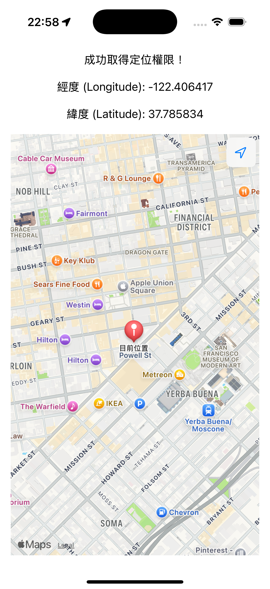

# 前言

在前一天我們已經學會了如何使用 Core Location 來取得用戶位置，而今天我們要進一步將位置資訊反映在地圖上。我們可以使用 MapKit 此一蘋果提供的地圖框架，此框架提供了顯⽰、導覽地圖，在地圖上加上標記，覆蓋物等功能。

今天簡單三個目標：

1. 顯示地圖
2. 鏡頭定位在「目前位置」
3. 在目前位置放一個大頭針（Marker）

# 將地圖 view 加入畫面將位置資訊顯示在地圖上

我們可以延續昨天使用 Core Location 的專案，使用我們已經建立好的 LoactionManager 來取得位置，並且將位置顯示在地圖上。

首先引入 MapKit:

```swift
import MapKit
```

在 MapKit 當中，我們找到這個初始化方法：

```swift
@MainActor @preconcurrency
public init<C>(
    position: Binding<MapCameraPosition>,
    bounds: MapCameraBounds? = nil,
    interactionModes: MapInteractionModes = .all,
    scope: Namespace.ID? = nil,
    @MapContentBuilder content: () -> C
) where Content == MapContentView<Never, C>, C : MapContent
```

說明一下幾個參數：

- **position: Binding**

  `Binding<MapCameraPosition>`，作用是透過雙向綁定，允許程式碼與地圖之間都能改變相機位置，常用值有：
  - `.automatic` - 自動決定相機位置
  - `.userLocation(fallback: .automatic)` - 跟隨使用者位置
  - `.region(MKCoordinateRegion(...))` - 指定特定區域與縮放程度
  - `.camera(MapCamera(...))` - 3D 相機控制（高度、俯仰角等）


- **bounds: MapCameraBounds? = nil**

  作用是限制地圖相機可移動的邊界範圍，預設值為 `nil`（無限制）。通常用於防止使用者將地圖拖拽到不相關區域。

- **interactionModes: MapInteractionModes = .all**

  用於控制使用者可以與地圖進行的互動類型，預設值為 `.all`（允許所有互動）。


接下來就構建我們的 Map View，首先宣告一個 `MapCameraPosition` 類別的 `@State` 變數以作為雙向綁定的初始化參數：

```swift
@State private var position: MapCameraPosition = .automatic
```

而因為我們不特別限制使用者互動，`interactionModes` 設為 `.all` 即可。

```swift
Map(position: $position, interactionModes: .all) {
    if let coord = locationManager.lastSeenLocation?.coordinate {
        Marker("目前位置", coordinate: coord)
    }
}
```

這邊我們使用 locationManager 最後取得的使用者位置 lastSeenLocation 的經緯度 coordinate，作為參數傳入 `Marker` 這個地圖大頭針，
取得使用者位置後，標示在地圖上。

# 使用 onChange 來持續跟蹤使用者位置

當使用者的位置持續變動時，我們有時需要地圖畫面持續跟隨，為了達到這個效果，我們要使用 `onChange` 這個 modifier。

```swift
/// - Parameters:
///   - value: The value to check against when determining whether
///     to run the closure.
///   - initial: Whether the action should be run when this view initially
///     appears.
///   - action: A closure to run when the value changes.
///   - oldValue: The old value that failed the comparison check (or the
///     initial value when requested).
///   - newValue: The new value that failed the comparison check.
///
/// - Returns: A view that fires an action when the specified value changes.
nonisolated public func onChange<V>(
    of value: V,
    initial: Bool = false,
    _ action: @escaping (_ oldValue: V, _ newValue: V) -> Void
) -> some View where V : Equatable
```

透過監聽 `value` 的變化，你可以決定要做什麼相對應的處理。

```swift
.onChange(of: locationManager.lastSeenLocation) { oldLocation, newLocation in
    // 舊值與新值都存在時，比較距離
    if let old = oldLocation, let new = newLocation {
        if metersBetween(old, new) > 15 {
            let c = new.coordinate
            position = .region(
                MKCoordinateRegion(
                    center: c,
                    span: MKCoordinateSpan(latitudeDelta: 0.01, longitudeDelta: 0.01)
                )
            )
        }
    } else if let new = newLocation { // 第一次定位：old 為 nil，只用 new
        let c = new.coordinate
        position = .region(
            MKCoordinateRegion(
                center: c,
                span: MKCoordinateSpan(latitudeDelta: 0.01, longitudeDelta: 0.01)
            )
        )
    }
}
```

我們監聽 `locationManager.lastSeenLocation`，每當 `LocationManager` 收到新的 GPS 座標時，這個屬性就會更新，`onChange` 會自動捕捉到這個變化，並執行內部的處理邏輯。

而因為 GPS 定位存在誤差，可能每秒都有 1-5 公尺的飄移，即便是站在原地不動的情境，座標可能會一直更新，此時若更新畫面，地圖將會不斷「抖動」，使用體驗便不是很好。因此，為了提供流暢的使用體驗，我們可以透過 `onChange` 的 closure 裡的兩個參數 `oldValue` 與 `newValue` 來判斷，只有當新位置與舊位置相距超過 15 公尺時，才移動地圖相機。而 App 剛啟動或第一次獲得定位權限時的處理，因為 `oldLocation` 是 `nil`，就直接將地圖相機移動到使用者目前位置。

```swift
position = .region(
    MKCoordinateRegion(
        center: c,                    // 新的座標中心
        span: MKCoordinateSpan(       // 縮放程度
            latitudeDelta: 0.01,      // 緯度範圍（約 1.1 公里）
            longitudeDelta: 0.01      // 經度範圍（約 1.1 公里）
        )
    )
)
```

這裡我們使用 `.region(...)`，將地圖的縮放程度控制不要太大或太小(0.01 度 ≈ 1.1 公里範圍)。





功能完成～

完整程式碼如下：

```swift
import SwiftUI
import CoreLocation
import MapKit

struct ContentView: View {
    @StateObject var locationManager = LocationManager()
    @State private var position: MapCameraPosition = .automatic

    var body: some View {
        VStack(spacing: 20) {
            switch locationManager.authorizationStatus {

            case .notDetermined:
                ProgressView()
                Text("正在請求定位權限...")

            case .restricted, .denied:
                Image(systemName: "location.slash.fill")
                    .font(.largeTitle)
                    .foregroundColor(.red)
                Text("您的位置權限已被關閉。")
                Text("請至「設定」App 中開啟權限。")

            case .authorizedWhenInUse, .authorizedAlways:
                Text("成功取得定位權限！")
                if let coordinate = locationManager.lastSeenLocation?.coordinate {
                    Text("經度 (Longitude): \(coordinate.longitude)")
                    Text("緯度 (Latitude): \(coordinate.latitude)")
                } else {
                    ProgressView()
                    Text("正在取得您的位置...")
                }
                Map(position: $position, interactionModes: .all) {
                    if let coord = locationManager.lastSeenLocation?.coordinate {
                        Marker("目前位置", coordinate: coord)
                    }
                }
                .mapControls({
                    MapUserLocationButton()
                })
                .onChange(of: locationManager.lastSeenLocation) { oldLocation, newLocation in
                    // 舊值與新值都存在時，比較距離
                    if let old = oldLocation, let new = newLocation {
                        if metersBetween(old, new) > 15 {
                            let c = new.coordinate
                            position = .region(
                                MKCoordinateRegion(
                                    center: c,
                                    span: MKCoordinateSpan(latitudeDelta: 0.01, longitudeDelta: 0.01)
                                )
                            )
                        }
                    } else if let new = newLocation { // 第一次定位：old 為 nil，只用 new
                        let c = new.coordinate
                        position = .region(
                            MKCoordinateRegion(
                                center: c,
                                span: MKCoordinateSpan(latitudeDelta: 0.01, longitudeDelta: 0.01)
                            )
                        )
                    }
                }
            @unknown default:
                Text("發生未知的錯誤")
            }
        }
        .multilineTextAlignment(.center)
        .padding()
    }

    func metersBetween(_ a: CLLocation, _ b: CLLocation) -> CLLocationDistance {
        a.distance(from: b)
    }
}

#Preview {
    ContentView()
}
```

# 本日小結

今天我們學會了如何將 Core Location 取得的使用者位置，結合 MapKit 在地圖上即時顯示，並用 Marker 標記目前位置。

明天我們將介紹 Geofencing（地理圍欄）這個功能，這也是我們 App 會用到的技術。透過 Geofencing，可以讓 App 偵測使用者是否進入或離開特定區域，實現自動提醒、紀錄或觸發特定行為，非常適合用來做公路里程標的定位與通知。
