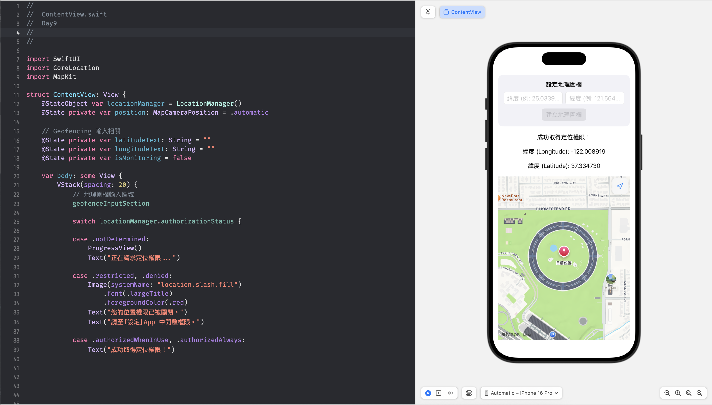
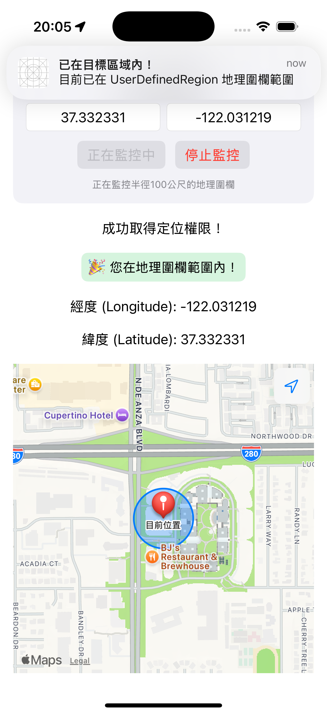
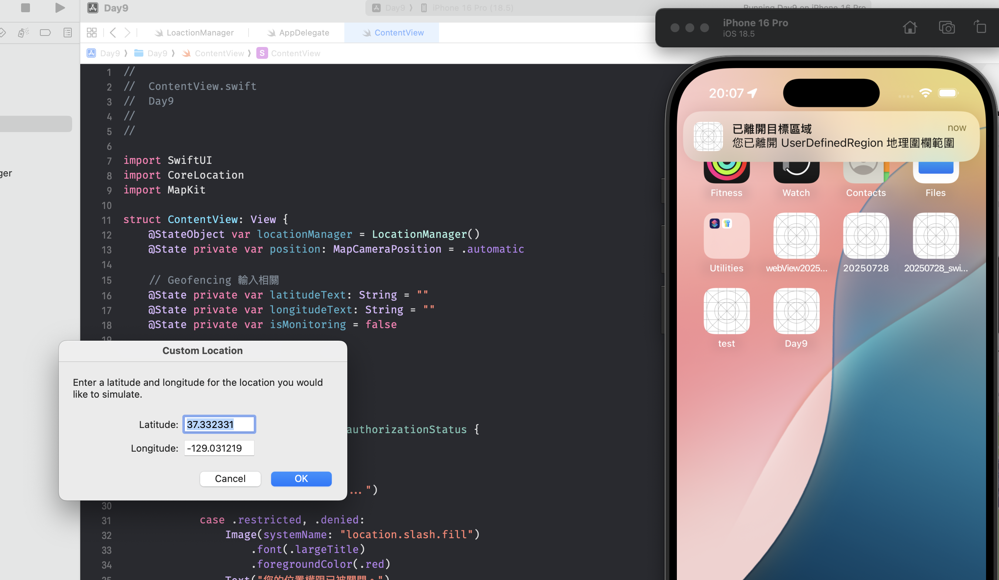
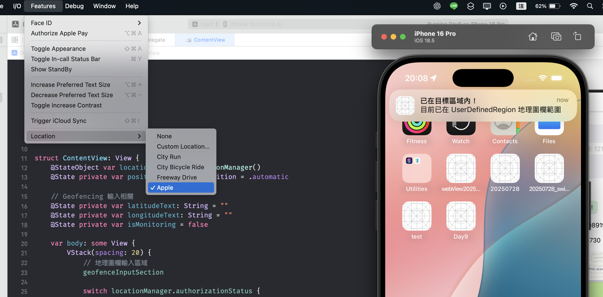

# 前言

在昨天的內容中，我們學會如何利用 Core Location 搭配 MapKit 即時取得並標記用戶的位置。今天，我們將實作地理圍欄（Geofencing）技術，它不僅能偵測使用者是否進入或離開特定區域，還能結合本地通知即時提醒，我們的 App 之後也會用到這個技術。

# 什麼是 Geofencing？

Geofencing（地理圍欄）是一種以座標為中心、半徑為範疇的虛擬區域，透過 Core Location 框架自動監控使用者是否進入或離開該範圍，並能觸發事件通知，例如打卡、到站提醒、商圈推播都跟這個技術相關。

# 實作

## 介面設計

首先在 ContentView.swift 設計一個簡單的輸入區，供使用者自訂要監控的目標緯度與經度。

```swift
@State private var latitudeText: String = ""
@State private var longitudeText: String = ""
@State private var isMonitoring = false // 依據是否監控中，UI 隨之改變

// ...

// MARK: - Geofencing 輸入介面
private var geofenceInputSection: some View {
    VStack(spacing: 12) {
        Text("設定地理圍欄")
            .font(.headline)

        HStack {
            TextField("緯度 (例: 25.033964)", text: $latitudeText)
                .keyboardType(.decimalPad)
                .textFieldStyle(.roundedBorder)

            TextField("經度 (例: 121.564468)", text: $longitudeText)
                .keyboardType(.decimalPad)
                .textFieldStyle(.roundedBorder)
        }

        HStack(spacing: 12) {
            Button(isMonitoring ? "正在監控中" : "建立地理圍欄") {
                startGeofencing() // 開始監控，待後面實作
            }
            .disabled(isMonitoring || latitudeText.isEmpty || longitudeText.isEmpty)
            .buttonStyle(.borderedProminent)

            if isMonitoring {
                Button("停止監控") {
                    stopGeofencing() // 停止監控，待後面實作
                }
                .buttonStyle(.bordered)
                .foregroundColor(.red)
            }
        }

        if isMonitoring {
            Text("正在監控半徑100公尺的地理圍欄")
                .font(.caption)
                .foregroundColor(.secondary)
        }
    }
    .padding()
    .background(Color(.systemGray6))
    .cornerRadius(12)
}
```

為了讓 `body` 不要太肥，我們把這個輸入區域包在一個 `geofenceInputSection` computed property 裡，之後再只要像用變數一樣取用`geofenceInputSection`，直接把它放在 `body` 裡。

```swift
var body: some View {
    VStack {
        geofenceInputSection
        // 其他內容
    }
}
```

另外，宣告了 `isMonitoring` 這個 `@State` 變數，來決定要呈現尚未監控/開始監控狀態的 UI。



## 修改 LocationManager，加入地理圍欄邏輯

我們將主要邏輯都封裝在 LoactionManager 這個類別，負責處理權限、位置追蹤，以及 Geofencing 監控等工作。

### 「永遠」定位權限

Geofencing 需要「永遠」定位權限（.authorizedAlways），因為只有這種情況下 App 才能在背景（甚至完全關閉時）收到觸發事件。

```swift
func locationManagerDidChangeAuthorization(_ manager: CLLocationManager) {
    let status = manager.authorizationStatus
    DispatchQueue.main.async {
        self.authorizationStatus = status
    }

    switch manager.authorizationStatus {
    case .notDetermined:
        manager.requestWhenInUseAuthorization()
    case .authorizedWhenInUse:
        manager.startUpdatingLocation()
        manager.requestAlwaysAuthorization() // 記得要在這裡請求取用永遠允許取得位置權限
    case .authorizedAlways:
        manager.startUpdatingLocation()
    default:
        break
    }
}
```

### 允許通知權限

我們目的希望偵測到進出變動時，App 要推播通知使用者，因此我們也要取得此權限。

```swift

override init() {
    super.init()

    // ...

    // 請求通知權限
    requestNotificationPermission()
}

// ...

private func requestNotificationPermission() {
    UNUserNotificationCenter.current().requestAuthorization(options: [.alert, .sound, .badge]) { granted, error in
        if let error = error {
            print("通知權限請求失敗：\(error.localizedDescription)")
        } else {
            print(granted ? "已允許通知權限" : "使用者拒絕通知權限")
        }
    }
}
```

>記得還要去 Info 設置 「Privacy - User Notifications Usage Description」權限取用敘述。

#### 允許 App 於前景時收到推播通知

預設如果 App 在前景(Foreground)時是不會收到推播通知的，如果需要這個功能，要在 AppDelegate 實作：

```swift
import SwiftUI
import UserNotifications

class AppDelegate: NSObject, UIApplicationDelegate, UNUserNotificationCenterDelegate {
    func application(
        _ application: UIApplication,
        didFinishLaunchingWithOptions launchOptions: [UIApplication.LaunchOptionsKey : Any]? = nil
    ) -> Bool {
        UNUserNotificationCenter.current().delegate = self
        return true
    }

    // 在 App 前景時顯示通知
    func userNotificationCenter(
        _ center: UNUserNotificationCenter,
        willPresent notification: UNNotification,
        withCompletionHandler completionHandler: @escaping (UNNotificationPresentationOptions) -> Void
    ) {
        completionHandler([.banner, .sound, .badge])
    }
}
```

>在 SwiftUI 專案，不會像 UIKit 一樣預設出現 AppDelegate.swift 這個檔案，你必須要自行建立 AppDelegae 這個 NSObject 的 subclass，並且遵循 UIApplicationDelegate 這個協定。

### 建立與監控 Geofencing

在程式裡，我們需要先檢查裝置有沒有支援 geofencing，還有權限是不是「永遠允許」。這兩個都通過之後，才會去建立一個圓形的範圍：給它中心點座標，再加上一個半徑。另外一個小細節是，如果我們之前已經建立過同樣名字的 region，要記得先清掉，否則會重複監控。最後，就是把新的 region 交給 CLLocationManager 開始監控，並立刻確認「現在位置是不是已經在範圍內？」。

完整的程式碼長這樣：

```swift
func startGeofencing(latitude: Double, longitude: Double, identifier: String = "UserDefinedRegion") {
    // 1. 裝置支援檢查
    guard CLLocationManager.isMonitoringAvailable(for: CLCircularRegion.self) else {
        print("此裝置不支援地理圍欄監控")
        return
    }
    // 2. 權限檢查（是否為 Always）
    guard manager.authorizationStatus == .authorizedAlways else {
        print("需要 Always 定位權限才能使用地理圍欄，正在請求...")
        manager.requestAlwaysAuthorization()
        return
    }
    // 3. 經緯度檢查
    let center = CLLocationCoordinate2D(latitude: latitude, longitude: longitude)
    guard CLLocationCoordinate2DIsValid(center) else {
        print("中心座標無效")
        return
    }
    let radius: CLLocationDistance = 150

    // 4. 清除同名 region，避免重複
    for region in manager.monitoredRegions where region.identifier == identifier {
        manager.stopMonitoring(for: region)
    }

    // 5. 建立並開始監控
    let region = CLCircularRegion(center: center, radius: radius, identifier: identifier)
    region.notifyOnEntry = true
    region.notifyOnExit = true

    manager.startMonitoring(for: region)
    // 7. 立即請求狀態，確認目前是否已在圈內
    manager.requestState(for: region)
}
```

而是「是否在範圍內」這件事情，要反應在 UI 上，因此我們需要一個 `@State` 變數 `isInGeofence` 來追蹤。

```swift
@Published var isInGeofence: Bool = false
```

#### Geofencing delegate methods

我們要使用 geofencing 提供的幾個代理方法以知悉目前位置是否在追蹤範圍內，並且在裡頭需要時發送推播通知：

- **didDetermineState:** 啟用追蹤時確認狀態。

- **didEnterRegion:** 進入目標範圍時，設為 isInGeofence = true 並送出「已到達目標區域」通知。

- **didExitRegion:** 離開範圍即 isInGeofence = false，並推送「已離開目標區域」。

```swift
func locationManager(_ manager: CLLocationManager, didEnterRegion region: CLRegion) {
    DispatchQueue.main.async {
        self.isInGeofence = true
    }
    sendNotification(
        title: "已到達目標區域！",
        body: "您已進入 \(region.identifier) 範圍"
    )
}

func locationManager(_ manager: CLLocationManager, didExitRegion region: CLRegion) {
    DispatchQueue.main.async {
        self.isInGeofence = false
    }
    sendNotification(
        title: "已離開目標區域",
        body: "您已離開 \(region.identifier) 範圍"
    )
}

func locationManager(_ manager: CLLocationManager, didDetermineState state: CLRegionState, for region: CLRegion) {
    switch state {
    case .inside:
        DispatchQueue.main.async {
            self.isInGeofence = true
        }
        sendNotification(title: "已在目標區域內！", body: "目前已在 \(region.identifier) 範圍內")
    case .outside:
        DispatchQueue.main.async {
            self.isInGeofence = false
        }
    case .unknown:
        print("狀態未知: \(region.identifier)")
    @unknown default:
        break
    }
}

private func sendNotification(title: String, body: String) {
    let content = UNMutableNotificationContent()
    content.title = title
    content.body = body
    content.sound = .default

    let request = UNNotificationRequest(
        identifier: UUID().uuidString,
        content: content,
        trigger: nil
    )

    UNUserNotificationCenter.current().add(request) { error in
        if let error = error {
            print("發送通知失敗: \(error.localizedDescription)")
        }
    }
}
```

#### UI 觸發 geofencing 監控

剛剛在 ContentView 中，geofenceInputSection 裡的 Button 綁定了 startGeofencing 與 stopGeofencing。這兩個方法的目的是，負責銜接 UI 與我們剛剛在 LoactionManager 裡建立的邏輯。

- 當使用者輸入完緯經度並按下「建立地理圍欄」時，startGeofencing 通知 LocationManager 開始進行監控，並把 UI 狀態改成「正在監控」給畫面做顯示。

- 當使用者想要關閉監控時，stopGeofencing 通知 LocationManager 停止監控，並把 UI 狀態設為「未監控」。

```swift
private func startGeofencing() {
    guard let lat = Double(latitudeText),
        let lon = Double(longitudeText) else {
        return
    }

    locationManager.startGeofencing(
        latitude: lat,
        longitude: lon,
        identifier: "UserDefinedRegion"
    )
    isMonitoring = true
}

private func stopGeofencing() {
    locationManager.stopGeofencing(identifier: "UserDefinedRegion")
    isMonitoring = false
}
```

### 驗證功能

基本的功能已完成，接下來我們來實驗看看是否能夠成功運作。

為了方便切換定位，這邊使用模擬器進行測試，步驟如下：

1. 取得模擬器當前定位，並將經緯度輸入進行監控。
2. 將 App 滑入背景，修改模擬器定位。
3. 再將模擬器定位改回最初的位置。



最初的位置就設定在 Apple Park，開始追蹤後，有成功跳出在範圍內的通知。

接著將 App 滑入背景，修改模擬器位置為別的地方，可以看到有跳出跑到範圍外的通知：



最後再將模擬器定位改回 Apple Park:



# 本日小結

今天我們完成了 Geofencing 的基本實作：從介面輸入經緯度，到 LocationManager 的權限處理、推播設定，再到實際建立地理圍欄與監控進出事件，整個流程算是跑通了。雖然程式碼不算長，但需要同時顧到定位權限、通知權限，有是有點小複雜（？

接下來，文章內容會從「單一技術的練習」轉向「實際 App 的開發」。在開始寫程式碼之前，我會先帶大家看一下 Azure DevOps 的 Board，用它來規劃 App 功能，拆成一個個小任務（task），之後再照著這些任務逐步實作。
