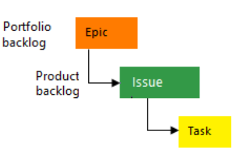
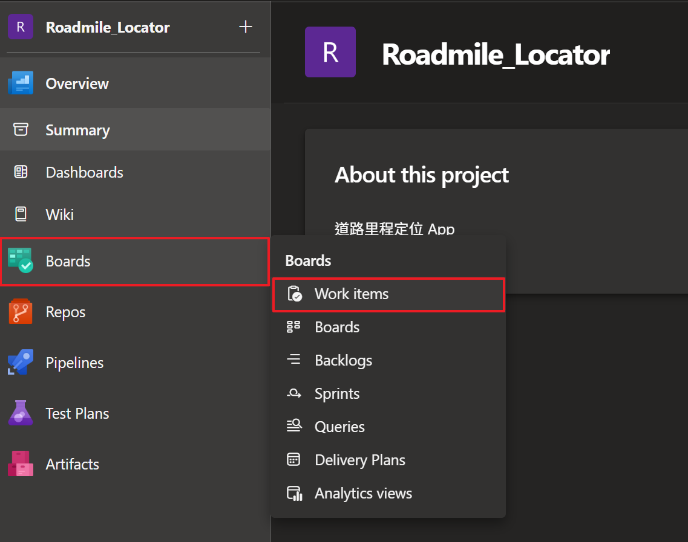
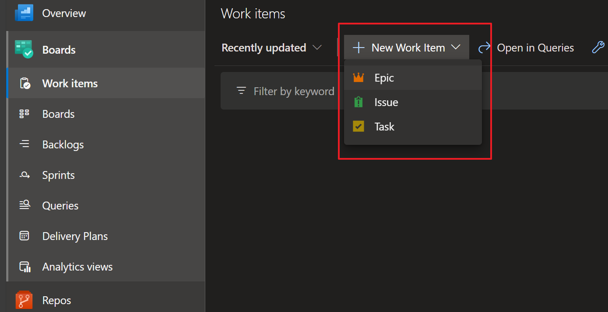
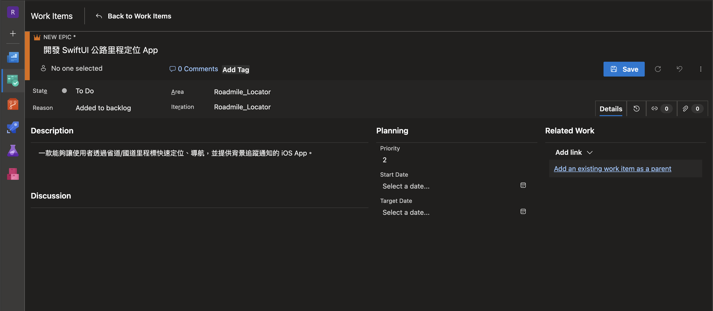
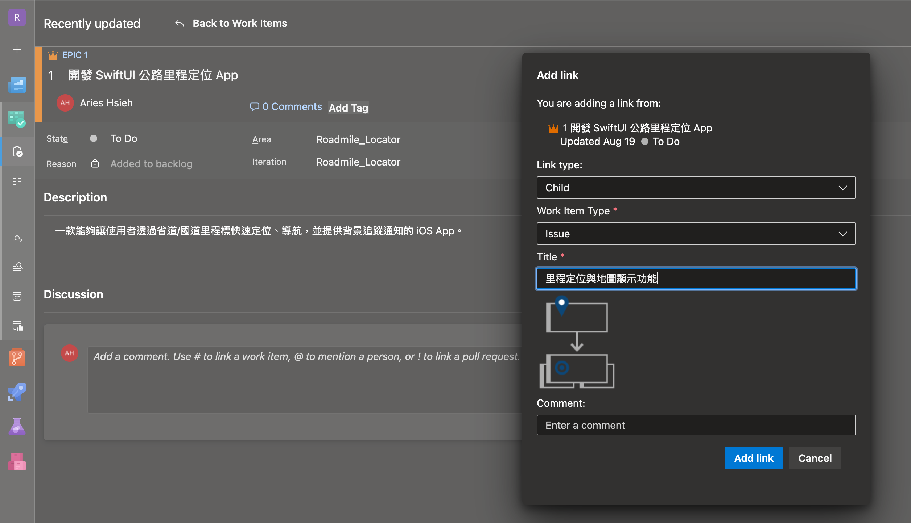
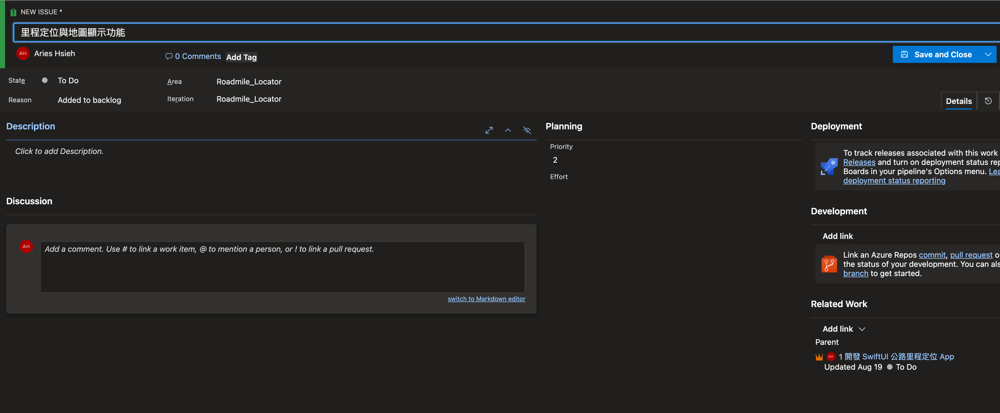
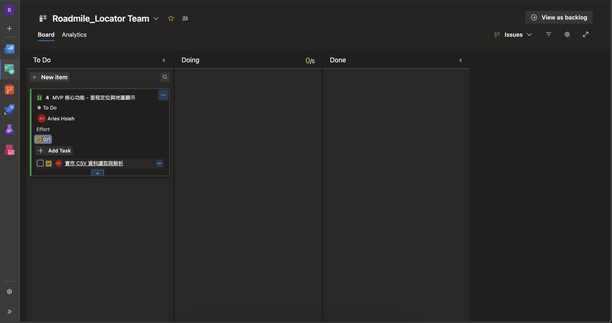

# 前言

在 Day 1 的時候有提到，在我剛進公司時，公司正好在導入 Azure DevOps 作為專案管理工具。這讓我有機會從零開始學習如何使用這個工具，並且在實際的工作中應用它，也因此體會到了專案管理工具對於軟體開發的重要性與價值。例如，它能幫助團隊更清楚地了解專案進度、分配任務、追蹤 Bug 等等；每一個工作項目都能被清楚地記錄與追蹤，讓整個開發流程變得更有條理。而原本今年鐵人賽想單純撰寫 SwiftUI App 的計畫，但想了一下，或許我可以嘗試把我使用 Azure DevOps 的經驗也融入其中，也是個不錯的結合。

# 什麼是 Azure Boards?

Azure Boards 是一個基於網頁的服務，讓團隊可以一起規劃、追蹤和討論整個開發過程的工作，並且支援敏捷式方法。它提供了可自訂的平台來管理各種工作項目，讓團隊能夠有效協作並簡化工作流程。

如果用更白話的方式來說，Azure Boards 就像是「專案進度白板」的進化版。想像你和同事要一起做一個 App，大家會把要做的事情（像是設計畫面、寫程式、修 bug）一條一條寫在便利貼上，貼在牆上，然後每天早上一起討論誰要負責什麼、做完了沒。Azure Boards 就是把這種「便利貼牆」搬到網路上，而且還加了很多自動化和追蹤功能。

舉個實際例子，假設你們團隊要開發一個新的功能，大家可以在 Azure Boards 上建立一個「Issue」，分配給負責的人，設定截止日期，還能隨時更新進度。如果有 bug，直接開一個新的工作項目，標記為「Bug」，讓大家都知道目前有什麼問題需要解決。你可以根據專案規模選擇不同的流程（像是 Basic 或 Agile），小型團隊可以用最簡單的方式管理，大型團隊則能用更細緻的分工。

總結來說，Azure Boards 就是幫助團隊把所有待辦事項、進度、問題都集中管理，讓大家不會漏掉重要的事，也能清楚看到專案的整體進展。

依據團隊與專案的不同，Azure Boards 提供四種流程選擇：

- Agile：使用敏捷式規劃方法時使用，適合追蹤 User Story，並可選擇性地在面板上追蹤 Bug。
- Basic：適合小型團隊或個人專案，簡化工作項目結構，讓管理更直觀。
- Scrum：適合正式執行 Scrum。
- CMMI：當小組遵循更正式的專案方法時選擇。

詳細可參考[微軟說明](https://learn.microsoft.com/zh-tw/azure/devops/boards/work-items/guidance/choose-process?view=azure-devops&tabs=agile-process)。

我們公司是使用 Agile 流程，但在這個專案中，我會使用 Basic 流程來進行管理。因為這個專案的規模較小，且我主要是個人開發，所以 Basic 流程就足夠了。其他的我沒有接觸過，如果想要了解差異，可以參考[微軟官方文件](https://learn.microsoft.com/zh-tw/azure/devops/boards/work-items/about-work-items?view=azure-devops&tabs=agile-process#track-work-with-different-work-item-types)。

## Basic process

在 Basic 架構中，預設有 Epic → Issue → Task 的階層。Epic 處於最高層級，其包含下一層級的 Issue，而 Issue 則包含其下一層級的 Task。

Portfolio Backlog 與 Product Backlog 這兩個概念主要用在專案管理的分層。Portfolio Backlog，在 Basic 下定義為 Epic，代表「策略層級」的大型目標或專案階段，用來規劃整體方向、重要里程碑，例如「開發新 App」、「擴展到新市場」。通常跨多個產品或多個團隊，時間跨度較長。而 Product Backlog，在 Basic 下定義為 Issue，代表「產品層級」的具體需求、功能、缺陷或改善事項，用來管理產品要做的事，例如「新增會員註冊功能」、「修正推播通知 bug」。Issue 通常是可執行、可分配的工作，時間跨度較短。

簡單來說：

- Portfolio backlog（Epic）是「大方向、大目標」，屬於策略規劃。
- Product backlog（Issue）是「具體要做的事」，屬於產品開發細節。

但就我的理解，這些並沒有絕對的定義，主要是為了讓團隊可以依照自己的專案規模和管理需求來彈性使用，但官方建議，Epic 用來追蹤「大型工作目標」或「重要里程碑」，Issue 用來追蹤「具體需求、問題或待辦事項」，Task 則是「可執行的細項工作」。

---

## 架構我們的 Azure board

回到我們的專案，按照目前的 App 的構思，可以先這樣初步規劃：

- Epic: 開發 SwiftUI 公路里程定位 App
  - 一款能讓使用者透過省道/國道里程標快速定位、導航，並提供背景追蹤通知的 iOS App。

- Issue:

  - UI/UX 前期規劃
      - 進行 App 介面與使用者流程的初步設計。

  - 里程定位與地圖顯示
    - 完成 App 最基本的功能：讀取資料、讓使用者搜尋單一里程點，並在地圖上顯示結果。

  - 地理圍欄通知功能
    - 使用地理圍欄功能，追蹤選定標記點。

  - 單元測試
    - 建立單元測試。

  - CI/CD 建設
    - 規劃並最終建立自動化建置與測試的 CI/CD Pipeline。

接著再就該 issue 建立預計要完成的 tasks。

## 建立 work item

在 Project 首頁的左側邊欄，找到 Boards -> Work items

點選「+ New Work Item」，這裡我們可以建立 Epic、Issue 和 Task。

這裡我們先建立 Epic。

簡單說明一下這個頁面。每一個 work item，你可以把該工作項 assign 給某個人，初始建立的 「State」 是 「To Do」，如果要開始進行可以改為 「Active」。你可以在「Description」裡面對該工作項目撰寫敘述等。建立完成後就可以按下「Save」儲存建立此工作項目。

儲存後，我們接下來要基於此 Epic 建立 Issue，在右側的「Related Work」區域，點選「Add link」。

在彈出視窗中，因為 Issue 是基於 Epic 的，因此「Link type」要選擇 Child，「Work Item Type」選擇 Issue，並在「Title」輸入你要建立的 Issue 名稱，接著按下 Add link 即可。

接著按下 Add link 後，再點選 Save and Close，就建立完畢。

建立 Task 也是相同邏輯，這邊就不再重複步驟。

>另一種建立 work item 的方式是，你可以在 Backlog 檢視模式當中，在欲建立 work item 的上階層，左方有個「+」號，這樣就不用再點進去上階層的 work item，並省去選擇 Parent 或 Child 的步驟。

把接下來預計會處理到的 work items 建立完畢。

# 本日小結

明天就可以按照規劃好的項目開始開發了！
