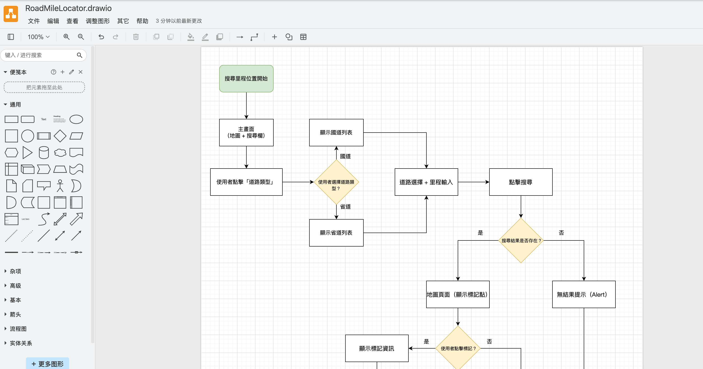
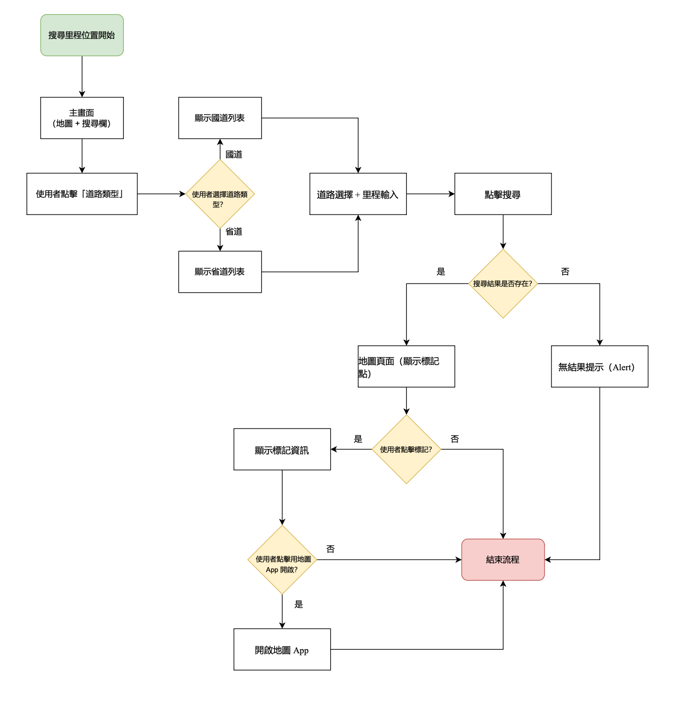

# 前言

在我們開始繪製使用者介面之前，我們將先聚焦在使用者流程 (User Flow)。

這就好比建築師在蓋房子前，不會先煩惱沙發要買什麼顏色，而是會先畫出整棟建築的平面圖與動線規劃。使用者流程圖幫助我們釐清，使用者為了達成某個特定目標，需要依序經過哪些畫面、點擊哪些按鈕。

預先規劃好完整的流程，再針對每一個環節去設計對應的畫面，才能確保 App 的功能環環相扣，既不會做出無用的設計，也不會遺漏掉關鍵的操作步驟。

# 什麼是使用者流程圖？

使用者流程圖（User Flow Diagram）它描繪了使用者為達成特定目標時，從進入 App 開始到完成任務的完整路徑。流程圖聚焦在：

1. 使用者如何在不同畫面/功能之間移動

2. 每個操作觸發的系統反應與後續分支

3. 各種異常或錯誤狀況下的備援流程

4. 決策點與不同選擇導致的結果

它與 Wireframe 不同在於，流程圖專注於流程的邏輯性與連貫性，而 Wireframe 則專注於畫面的佈局與排版。

## 流程圖的價值

當你在規劃流程圖時，你會用使用者的角度去看待操作過程，同時會意識到過程中的可能的瑕疵或邏輯不順的地方。如果沒有事先思考就開始開發，你很可能開發到一半才發現有問題，例如「啊，使用者從這個頁面要怎麼回到上一頁？」或是「等等，如果使用者沒登入，這個按鈕按下去會發生什麼事？」 此時修改的成本可能會相當地高，最慘甚至可能導致整個功能必需重新設計。

而從另一個角度來看，事先進行這個過程，同時也會思考如何提升使用者體驗，確保每個使用者路徑都有清楚的起點、過程與結果，讓使用者在使用 App 時感到順暢自然。

## 工具 - draw.io

我通常使用 [draw.io](https://www.drawio.com/) 這個工具來建立流程圖，它是免費、功能完整且支援多種匯出格式的流程圖工具。流程圖的圖示皆有代表的意義，例如：

- 圓角矩形（開始/結束）：代表流程的起點與終點

- 矩形（畫面/動作）：代表具體的畫面或使用者動作

- 菱形（決策點）：代表需要判斷或選擇的節點

- 箭頭（流向）：表示流程的方向與順序

>流程圖的重點是釐清邏輯，而不是畫得漂亮。就算一開始用筆和紙在便條紙上畫草稿也完全沒問題。工具只是輔助，能幫助我們把腦中的邏輯具象化，才是最重要的。

## 規劃專案 App 的流程

在我們的 App 構想中，包含了地理圍欄通知、搜尋歷程等功能，但在本篇文章中，我們將以核心功能公路里程搜尋為例，從頭到尾走一遍使用者流程圖的規劃過程。掌握了這個概念，實作其他功能的流程圖時，原理都是一樣的。

### 範例：搜尋特定里程點

App 最基本的功能流程，這裡我就使用 draw.io 來繪製：

可以輸出成圖片：

流程從綠色的「開始」到紅色的「結束」。頁面與動作 (矩形)則代表使用者看到的畫面或執行的操作。抉擇點 (菱形)則為使用者需要做選擇，且不同的選擇會導向不同結果的地方。

1. 開始 → 主畫面

使用者打開 App，看到地圖及上方的搜尋欄。

2. 點擊「道路類型」→ 抉擇：國道或省道？

這是使用者的第一個岔路，根據使用者的選擇（國道／省道），系統會載入不同的道路列表。

3. 顯示列表 → 道路選擇 + 里程輸入

使用者從列表中選定一條具體的道路（如：國道一號），並在下方的欄位輸入里程數字。

4. 點擊搜尋 → 抉擇：搜尋結果是否存在？

系統拿著「道路編號」和「里程」去跟資料做比對是否存在：

- 是：順利地走向了成功路徑。

- 否：使用者會被引導至另一條「查無結果」的路徑，接著便結束流程。

5. 地圖頁面（顯示標記點）

若搜尋成功，App 會自動將地圖移動到目標位置，並在上面放置一個醒目的圖標 (Pin)。到這一步，App 的核心任務已經完成。使用者已經得到了他想要的視覺化結果。

6. 可選的「延伸路徑」

從「地圖頁面（顯示標記點）」之後，設計了兩層可選的延伸互動：

7. 抉擇：使用者點擊標記？

- 否：使用者可能看一眼就滿足了，流程在此就可以結束。

- 是：使用者想知道更多資訊，於是我們進入下一步。

8. 顯示標記資訊 → 抉擇：用地圖 App 開啟？

畫面上會彈出一個小視窗顯示詳細資料，並提供一個「在地圖 App 中顯示」的按鈕。

- 否：使用者看完資訊就關閉視窗，流程結束。

- 是：App 會跳轉至地圖 App ，開始導航，流程也在此結束。

# 本日小結

以上就是我們 App 核心功能的完整使用者流程圖。把它詳細地畫出來之後，接下來要怎麼動工，整個開發的輪廓就清晰多了。在規劃其餘功能的流程圖，概念基本上是差不多的，這裡就不一一畫給大家看囉！我們明天就進入 UI 的部分～
