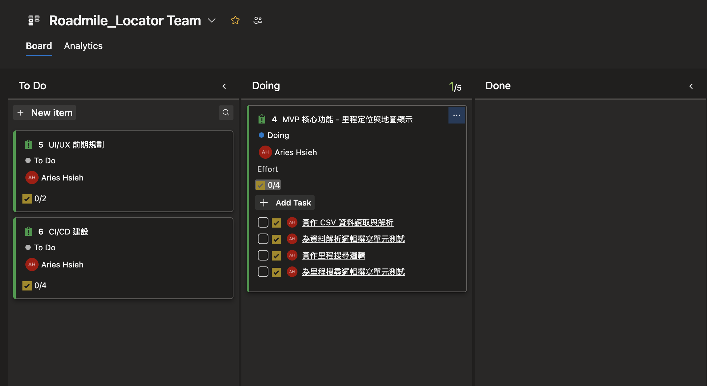
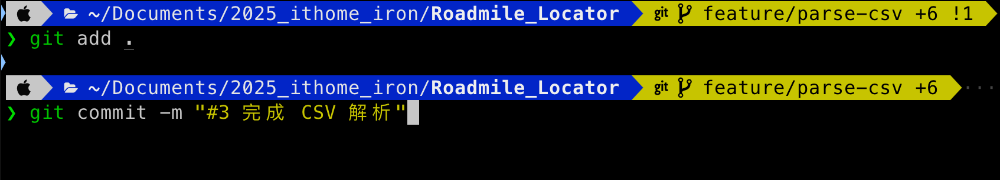
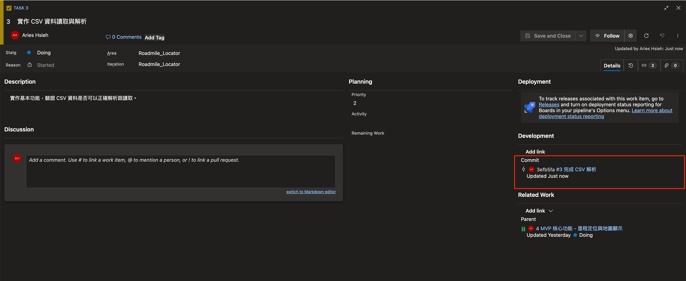
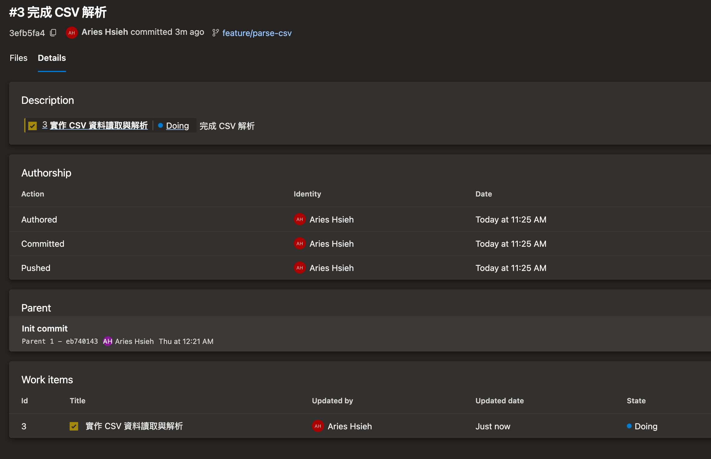

# 前言

昨天我們在 Azure Board 上把目前所需的 work items 開立完畢，今天就正式要進入我們這次 App 的實作範圍了！

要開工了～把要開發的 issue 拉到「Doing」區塊。



這個 issue 要先做，因為這次我想要實作的功能，應該說仰賴政府公開的這份資料能否正確讀取跟運用...不然就沒戲唱了XD

先用 VS code 來看一下這兩份 CSV(省道與國道)長什麼樣子：


我們現在的目標是，讀取 CSV 檔案，然後將其轉成我們定義好的物件類型。


# Git 分支規劃

- 從 main 分出 develop
- 再從 develop 分出 feature/parse-csv 分支
- 於 feature/parse-csv 分支進行開發


# 資料結構

依據 CSV 欄位，定義我們需要的結構：

```swift
struct ProvincialMileageMarker {
    let roadNumber: String      // 公路編號
    let county: String          // 隸屬縣市
    let wgs84Lon: Double        // 坐標-E-WGS84
    let wgs84Lat: Double        // 坐標-N-WGS84
    let township: String        // 隸屬鄉鎮
    let location: String        // 設置位置
    let content: String         // 牌面內容
    let condition: String       // 現況
    let direction: String       // 牌面方向
}

struct HighwayMileageMarker {
    let roadNumber: String      // 國道編號
    let county: String          // 隸屬縣市
    let wgs84Lon: Double        // 坐標X-WGS84
    let wgs84Lat: Double        // 坐標Y-WGS84
    let display: String         // 牌面內容
    let direction: String       // 方向與備註
}
```

# 資料讀取與顯示

搭配 Combine，建立 RoadDataManager，實作資料背景讀取與在 Day 9 介紹過的 Combine 來自動更新畫面：

```swift
class RoadDataManager: ObservableObject {
    @Published var highwayMarkers: [HighwayMileageMarker] = []
    @Published var provincialMarkers: [ProvincialMileageMarker] = []
    @Published var highwayFailedCount: Int = 0
    @Published var provincialFailedCount: Int = 0

    func loadData() {
        // 背景讀取，讀取完畢後切換回主執行緒更新資料
        DispatchQueue.global().async {
            let (highways, highwayFails) = self.loadHighwayMarkersWithFailures(from: "highway_markers")
            let (provincials, provincialFails) = self.loadProvincialMarkersWithFailures(from: "provincial_markers")

            DispatchQueue.main.async {
                self.highwayMarkers = highways
                self.provincialMarkers = provincials
                self.highwayFailedCount = highwayFails
                self.provincialFailedCount = provincialFails
            }
        }
    }

    // ...

    private func loadHighwayMarkersWithFailures(from csvName: String) -> ([HighwayMileageMarker], Int) {
        guard let path = Bundle.main.path(forResource: csvName, ofType: "csv"),
              let text = try? String(contentsOfFile: path, encoding: .utf8) else {
            return ([], 0)
        }
        let rows = parseCSV(text).dropFirst()
        var result: [HighwayMileageMarker] = []
        var failed = 0

        for (index, cols) in rows.enumerated() {
            // 檢查欄位數量
            guard cols.count >= 10 else {
                print("Highway row \(index + 2) failed: expected ≥10 columns but got \(cols.count). data = \(cols)")
                failed += 1
                continue
            }
            // 檢查經度轉型
            guard let lon = Double(cols[4]) else {
                print("Highway row \(index + 2) failed at column 4 (WGS84 Lon): value = '\(cols[4])'")
                failed += 1
                continue
            }
            // 檢查緯度轉型
            guard let lat = Double(cols[5]) else {
                print("Highway row \(index + 2) failed at column 5 (WGS84 Lat): value = '\(cols[5])'")
                failed += 1
                continue
            }

            let m = HighwayMileageMarker(
                roadNumber: cols[0],      // 國道編號
                county: cols[1],          // 隸屬縣市
                wgs84Lon: lon,            // 坐標X-WGS84
                wgs84Lat: lat,            // 坐標Y-WGS84
                display: cols[8],         // 牌面內容
                direction: cols[9]        // 方向與備註
            )
            result.append(m)
        }
        return (result, failed)
    }
}


// ContentView
struct ContentView: View {
    @StateObject private var dataManager = RoadDataManager()

    var body: some View {
        VStack(alignment: .leading, spacing: 16) {
            Button("讀取資料") {
                dataManager.loadData()
            }
            .padding()
        }
    }
}
```

這裡快速複習一下 Combine：

>Combine 是 SwiftUI 用來處理非同步事件流的框架；RoadDataManager 遵循 Combine 的 ObservableObject 協定，表示它是一個可被監測（觀察）的物件；物件中用 @Published 標註的屬性會在變更時自動發送通知給監聽者；而在 SwiftUI 的 View 裡，我們用 @StateObject 來持有並監聽這個 ObservableObject 實例，當物件內的 @Published 屬性變動時，View 會自動更新畫面。

簡單來說，RoadDataManager 會先載入資料，接著解析 CSV，過程中檢查欄位數量、解析時檢查每列的欄位數量是否符合預期（國道為 10 欄、省道為 23 欄以上），不符就跳過並計數失敗筆數。
另外也確保必要欄位能正確轉成 Double 如經緯度，若失敗同樣跳過並計數。

在 ContentView 中按下 Button 後讀取資料，接著我們先讓他簡單顯示出來：


初步測試顯示資料可成功讀取，看來這資料可以用！

接著趕緊先 commit & push。在 commit message 的開頭加上 # 字號，後面的數字是 work item 的編號，這樣就可以將 commit 與 work item 關聯起來。



在 Task 3 頁面的右方，可以看到剛剛的 commit 有成功關聯起來。



在 commit 頁面，也會看到與之關聯的 work item。



這對於日後追蹤很有幫助！

---

資料來源：

1. 國道：[政府開放資料平台](https://data.gov.tw/dataset/98447)
2. 省道：[交通部政府開放資料](https://www.motc.gov.tw/201506260001/app/govdata_list/view?module=&id=1615&uid=201705110046)
