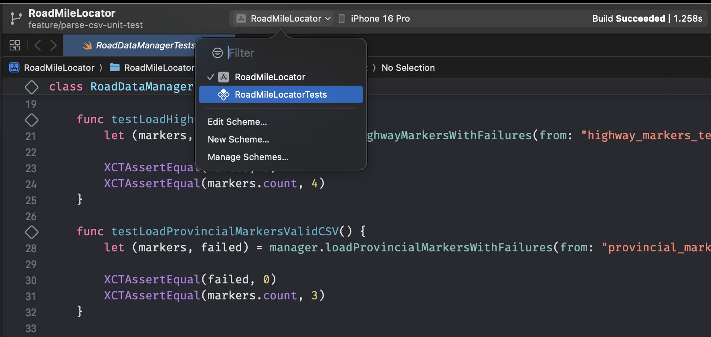
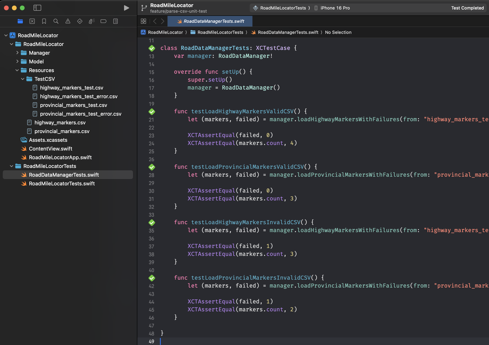

# 前言

昨天完成了實際資料的 CSV 讀取與解析，接著我們需要確保這個功能未來不會不小心被改壞，或是測試遇到不合格的資料（欄位數不夠、無法轉型）時，能妥善計算失敗筆數並略過。

# 使用 XCTest 來完成單元測試

XCTest 是 Apple 官方的測試框架，可以用來建立 unit tests, performance tests 還有 UI tests。詳細可參考[官方文件](https://developer.apple.com/documentation/xctest)。

## Step 1: 建立測試目標 (Test Target)

因為一開始在建立專案時，沒有勾選 Include Tests，所以我們現在必須手動新增。

在專案左側列表，點選專案最上層專案名稱。在「Targets」區域點擊左下角的加號 (+)，新增一個「Unit Testing Bundle」，並給這個測試目標命名（例如 RoadMileLocatorTests），完成建立。

## Step 2: 編寫測試檔案

### 預設測試 template

建立完成後，會看到已經存在一個檔名同 test target 檔案：

```swift
import XCTest

final class RoadMileLocatorTests: XCTestCase {

    override func setUpWithError() throws {
        // Put setup code here. This method is called before the invocation of each test method in the class.
    }

    override func tearDownWithError() throws {
        // Put teardown code here. This method is called after the invocation of each test method in the class.
    }

    func testExample() throws {
        // This is an example of a functional test case.
        // Use XCTAssert and related functions to verify your tests produce the correct results.
        // Any test you write for XCTest can be annotated as throws and async.
        // Mark your test throws to produce an unexpected failure when your test encounters an uncaught error.
        // Mark your test async to allow awaiting for asynchronous code to complete. Check the results with assertions afterwards.
    }

    func testPerformanceExample() throws {
        // This is an example of a performance test case.
        measure {
            // Put the code you want to measure the time of here.
        }
    }
}
```

這個是由 Xcode 自動產生的單元測試的 Template：

以下是各個部分的用途：

#### `setUpWithError()`

在每一個測試方法（以`test`開頭的函式）執行之前都會被呼叫，例如你可以在這裡初始化你要測試的物件。

#### `tearDownWithError()`

在每一個測試方法執行完畢之後都會被呼叫，例如釋放 `setUpWithError` 中建立的物件或重置狀態。

#### `testExample()`

在 XCTest 中，所有測試方法的名稱都必須以 `test` 開頭，這裡是一個 example，你可以刪除並換成你自己的測試，例如 `testLoadValidHighwayCSVData()`。`XCTAssert` 系列的函式就是用在這裡，來驗證你的程式碼是否產生了預期的結果。

#### `testPerformanceExample()`

效能測試的範例，你可以將想測量效能的程式碼放在 `measure { ... }` 區塊中。Xcode 會多次執行這段程式碼並計算平均執行時間。

### 自訂測試檔案

雖然 Xcode 會預設產生一個測試檔案，但這裡我選擇不直接使用它，而是為 RoadDataManager 建立了一個專屬的測試檔案 RoadDataManagerTests.swift。當測試檔案的命名直接對應到它所要測試的類別時，整個專案的測試結構便一目了然。未來，當我需要修改或擴充 RoadDataManager 的功能時，我能夠立刻找到對應的測試案例來進行驗證或更新。

在專案左側列表的測試目標資料夾，在裡面建立一個新的 Swift 檔案 RoadDataManagerTests.swift。在檔案頭部加入 import XCTest 和 @testable import YourAppModuleName，讓測試能引用專案內的類別。

```swift
import XCTest
@testable import RoadMileLocator

class RoadDataManagerTests: XCTestCase {
    // ...
}
```

```swift
var manager: RoadDataManager!

override func setUp() {
    super.setUp()
    manager = RoadDataManager()
}

func testLoadHighwayMarkersValidCSV() {
    let (markers, failed) = manager.loadHighwayMarkersWithFailures(from: "highway_markers_test")

    XCTAssertEqual(failed, 0)
    XCTAssertEqual(markers.count, 4)
}

func testLoadProvincialMarkersValidCSV() {
    let (markers, failed) = manager.loadProvincialMarkersWithFailures(from: "provincial_markers_test")

    XCTAssertEqual(failed, 0)
    XCTAssertEqual(markers.count, 3)
}

func testLoadHighwayMarkersInvalidCSV() {
    let (markers, failed) = manager.loadHighwayMarkersWithFailures(from: "highway_markers_test_error")

    XCTAssertEqual(failed, 1)
    XCTAssertEqual(markers.count, 3)
}

func testLoadProvincialMarkersInvalidCSV() {
    let (markers, failed) = manager.loadProvincialMarkersWithFailures(from: "provincial_markers_test_error")

    XCTAssertEqual(failed, 1)
    XCTAssertEqual(markers.count, 2)
}
```

這幾個測試 func 讀取的是預先放入專案裡的測試 CSV 檔案，針對不同的情境進行測試。
以 `testLoadHighwayMarkersValidCSV()` 來說，讀取的是正常的 CSV 檔案，

```swift
XCTAssertEqual(failed, 0)
XCTAssertEqual(markers.count, 4)
```

`XCTAssertEqual()` 是一種「斷言」，這邊 `XCTAssertEqual(failed, 0)` 斷言的是 `failed` 為 0，如果結果符合斷言，那就會通過。
`XCTAssertEqual(markers.count, 4)` 則是斷言 CSV 總共解析出 4 行資料（測試資料塞了 4 行）。其他的就以此類推，放有問題的測試資料，測試我們的函式是否能正確判斷有錯誤資料，例如：


```
國道編號,隸屬縣市,坐標X-TWD97,坐標Y-TWD97,坐標X-WGS84,坐標Y-WGS84,公告樁號,性質,牌面內容,方向與備註
國道1號高架路段,新北市,312583.472,2773241.373,121.6203311,我是座標,14100,指45,014K+100,北上
國道1號高架路段,新北市,312484.618,2773230.258,121.6193508,25.06599366,14200,指45,014K+200,北上
國道1號高架路段,新北市,312381.503,2773217.897,121.6183282,25.06588633,14300,指45,014K+300,北上
國道1號高架路段,臺北市,312284.096,2773205.918,121.6173622,25.0657822,14400,指45,014K+400,北上
```

我把第一列資料的座標改為非數字「我是座標」，以測試型別轉換時是否能正確跳過錯誤。

## Step 3：執行測試

點擊 Xcode 上方選擇剛剛新增的測試目標（Scheme）。



點擊選單 Product > Test 執行所有測試。Xcode 下方會顯示測試結果，綠色表示通過，紅色表示失敗。



當然，若只想要測試某個項目，也可以直接點擊測試 function 左側的菱形執行該項測試。

# 本日小結

今天學會了如何使用 XCTest 來快速建立單元測試，之後這部分會整合在 pipeline 中執行自動化測試～明天繼續！
