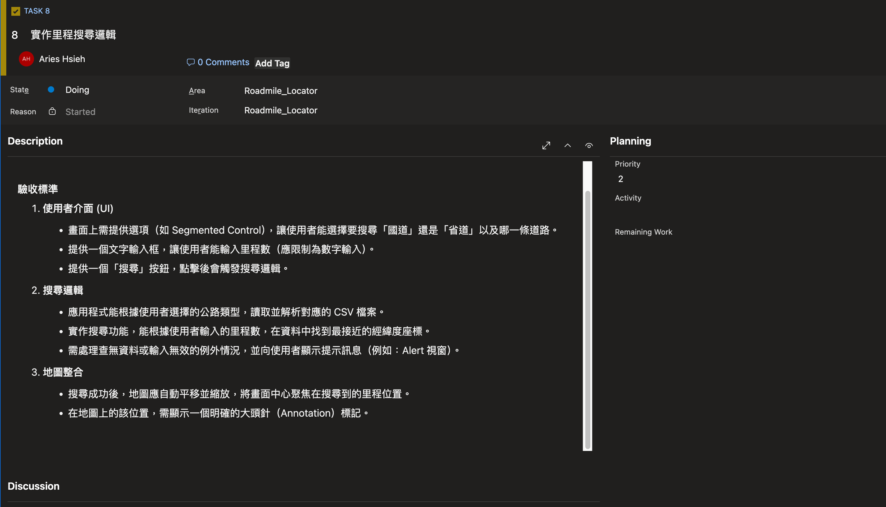
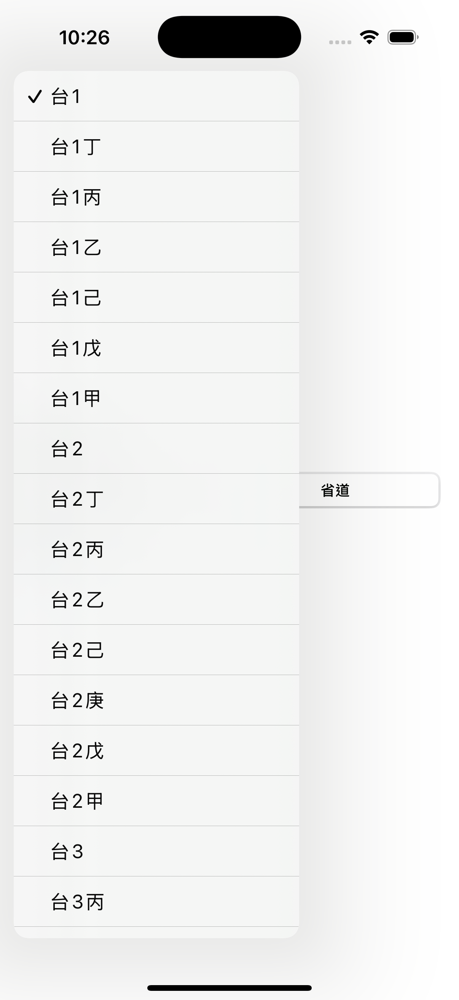
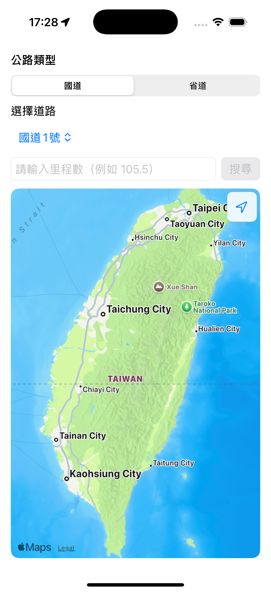

今天要做另一個重要功能，我們要讓使用者能根據選擇的公路類型（國道／省道）和輸入的里程數，從預載的 CSV 資料中進行搜尋，並在地圖上精準標示出對應的地理位置。


>可以在 Description 當中詳細描述這張 task 要完成些什麼事情，訂定「驗收標準（Acceptance Criteria）」。這是用來明確定義該 task 完成的條件和品質要求，確保開發人員和 user 對任務的完成有共同認知。即使是 Basic 架構，清楚的驗收標準依然能幫助提升開發效率和品質，避免誤解或遺漏需求。

那就來解決掉這張 task 吧！

---

# 任務拆分

里程搜尋這個任務，可以拆分成三大區塊：


1. 輸入
    - 選擇國道／省道
    - 選擇道路
    - 里程輸入（公里）

2. 搜尋
    - 從 CSV 解析後的物件中，篩出該道路的所有里程點
    - 轉為可比較的「公里數」再找最近距離
    - 設定一個最大容忍差距（例如 2 公里），超過就視為查無合理結果

3. 顯示
    - 地圖置中到結果的區域
    - 放上一個大頭針（顯示牌面或公里數）。

但是，其實資料來源內容不太相同，解析規則要怎麼處理就會是個問題，例如國道牌面格式是「014K+800」，省道是「5.1」這種浮點數字串。重點是要將把人看得懂的牌面，轉成程式能比較的數字。哪些算、哪些不算，遇到異常如何處理，重點應該在這裡。

至於搜尋邏輯採「最近距離」而不是「完全匹配」的原因很簡單：資料可能不完整。這是資料源的限制，只能說這是一種取捨。如果最近的點也超過 2 公里，就直接回「查無合理結果」，避免在資料有缺或輸入不準時，硬給一個很遠的點誤導使用者。若兩個點距離一樣近，可以選「里程較小」或「較大」，比較符合沿著里程增加方向搜尋的直覺。

另外，搜尋邏輯的效能，先採取 linear time 就好，先把功能跑起來，目前手機端資料量還在可接受範圍內，未來若有進一步需要，效能不夠再談索引或空間資料結構，現階段主要先以完成 MVP 為主。


---

# 使用 Picker 建立道路選擇器

## Enum 的運用

我們目前的資料有國道與省道，因為之後的資料、邏輯都會個別綁定在這兩個類型上，因此我們可以用 enum 來列舉這兩個項目：

```swift
enum RoadCategory: String, CaseIterable, Identifiable {
    case highway = "國道"
    case provincial = "省道"
    var id: String { rawValue }
}
```

這裡遵循了兩個特殊協定，CaseIterable 是為了讓 enum 能用 allCases 列出所有選項，方便做需要迭代的 Picker/Segment。而 Identifiable + var id 是讓每個選項有唯一識別，如此一來可以用 rawValue 當 id，可直接被 ForEach 使用，不必再加上 `id: \.self`。

## Picker / Segmented

有了 enum，可以先來做國道/省道的選項，通常會使用 Segment：

```swift
struct ContentView: View {
    @State private var category: RoadCategory = .highway

    var body: some View {
        VStack(alignment: .leading, spacing: 12) {
            // 類型選擇
            Picker("公路類型", selection: $category) {
                ForEach(RoadCategory.allCases) { category in
                    Text(category.rawValue).tag(category)
                }
            }
            .pickerStyle(.segmented)
        }
    }
}
```

這裡使用的 SwiftUI 元件是 `Picker`，pickerStyle 選擇 segmented。在 Picker 當中，迭代 RoadCategory enum，並對每一個項目使用 `.tag`，這樣被綁定的 `category` 變數才會知道使用者選了哪一個選項。

接著要建立一個道路選擇器讓使用者選擇例如哪一條省道，這裡也用 Picker 就好：

```swift
@State private var selectedRoad: String = ""

// ...

Picker("選擇道路", selection: $selectedRoad) {
    ForEach(availableRoadNumbers, id: \.self) { roadNumber in
        Text(roadNumber).tag(roadNumber)
    }
}
```

這裡用 `availableRoadNumbers` 這個 computed property (計算屬性) 來動態產生道路清單。它會根據使用者選擇的 category，決定要處理國道還是省道的資料。

```swift
private var availableRoadNumbers: [String] {
    switch category {
    case .highway:
        let all = dataManager.highwayMarkers.map { $0.roadNumber }
        return uniqueSortedRoadNumbers(from: all)
    case .provincial:
        let all = dataManager.provincialMarkers.map { $0.roadNumber }
        return uniqueSortedRoadNumbers(from: all)
    }
}
```

## Map 高階函式

第一步，我們用 map 這個高階函式，把每一筆物件 map 成單純的 roadNumber 字串。這裡會回傳充滿重複資料的原始道路編號陣列。

>補充說明：$0 是 closure 中第一個參數的簡寫。當 closure 只用到一個參數時，可以用 $0 取代命名參數。例如 .map { $0.roadNumber } 其實等同於 .map { item in item.roadNumber }。

但這個原始陣列還不能直接用，所以最後，我們把這個列表交給 uniqueSortedRoadNumbers() 這個函式，回傳一個乾淨、唯一且排序正確的清單給 Picker 使用。




Good, 把列表整理出來了～

# 建立基本 UI

先把基本的搜尋框 UI 建構起來，使用 `TextField`，並指定 `.keyboardType` 為數字鍵盤，以及使用 `Button` 建立搜尋按鈕，並將兩者放入 `HStack` 水平堆疊。

```swift
struct ContentView: View {
    @State private var category: RoadCategory = .highway
    @State private var selectedRoad: String = ""
    @State private var mileageInput: String = "" // 新增里程輸入的狀態變數

    var body: some View {
        VStack(alignment: .leading, spacing: 12) {
            // ... Picker 程式碼 ...

            HStack {
                TextField("請輸入里程數（例如 105.5）", text: $mileageText)
                    .keyboardType(.decimalPad)
                    .textFieldStyle(.roundedBorder)

                Button("搜尋") {
                    searchAction()
                }
                .buttonStyle(.borderedProminent)
                .disabled(!canSearch)
            }
        }
    }
}
```

這邊為了增進使用者體驗以及避免誤按按鈕，我們可以用 `.disable` 修飾符，綁定 `canSearch` 計算屬性，在不允許/無法搜尋的情況禁用搜尋按鈕。

```swift
private var dataLoaded: Bool {
    !dataManager.highwayMarkers.isEmpty || !dataManager.provincialMarkers.isEmpty
}

private var canSearch: Bool {
    dataLoaded && !selectedRoad.isEmpty && Double(mileageText) != nil
}
```

然後是地圖的部分：

```swift
struct ContentView: View {
    // ...

    @State private var cameraPosition: MapCameraPosition = .automatic

    // ...

    var body: some View {

        // ...

        Map(position: $cameraPosition) {

        }
        .mapControls {
            MapUserLocationButton()
            MapCompass() // 指北針
            MapScaleView() // 比例尺
        }
        .frame(maxWidth: .infinity, maxHeight: .infinity)
        .cornerRadius(12)

        // ...
    }
}
```

基本的 UI 雛形出來了～



# 本日小結

今天我們把里程搜尋功能的公路類型及道路列表給建立起來了。從定義 RoadCategory enum 開始，我們用 SwiftUI 的 Picker 和 SegmentedPickerStyle 快速搭建了公路類型與道路選擇的 UI。接著，我們透過一個計算屬性 (availableRoadNumbers)，結合 map 函式與一個處理排序和唯一性的輔助函式，成功地讓道路選單能根據使用者選擇的類型動態更新。

明天我們就要來填上核心的「搜尋」與「顯示」邏輯了，包含處理里程輸入，接收並驗證使用者輸入的公里數，並實作搜尋函式，處理不同里程格式的解析，找出最近的地理位置，最後在地圖上顯示結果。

完成這幾步，我們最關鍵的功能就算大功告成了！
