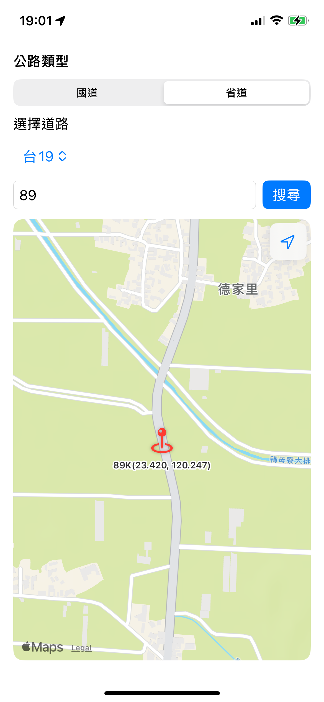
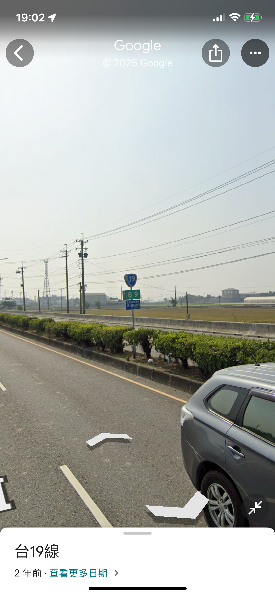
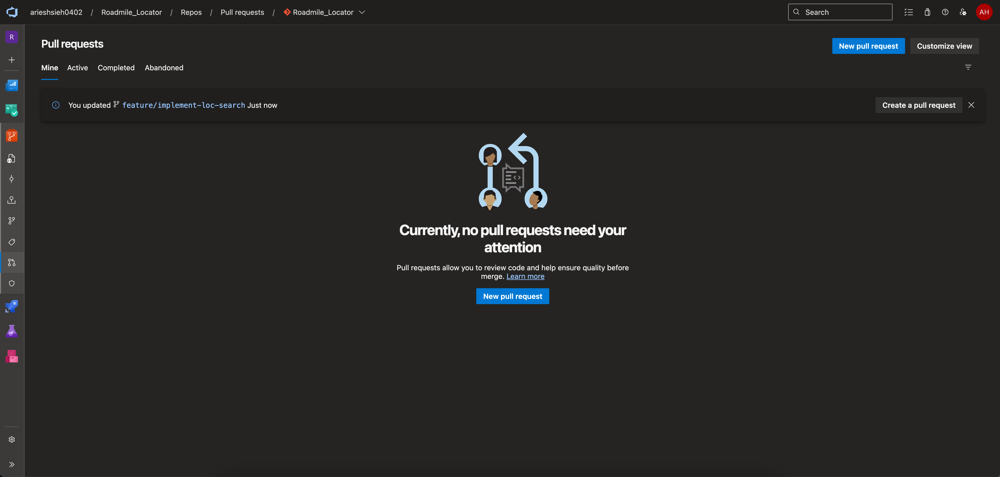
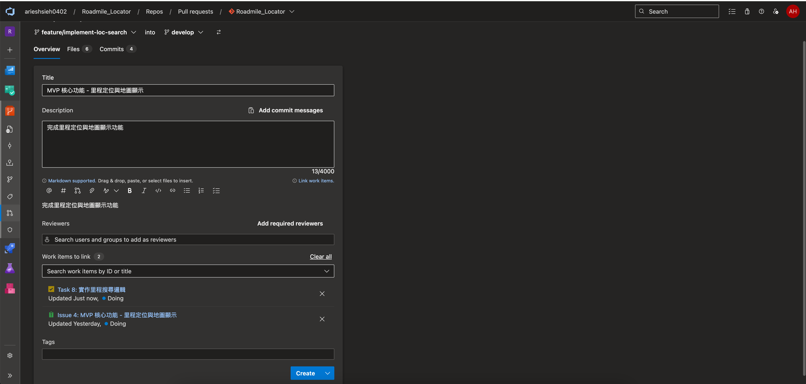
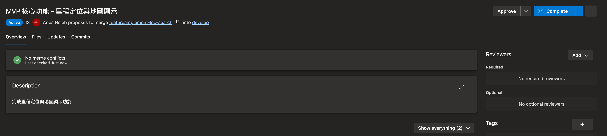
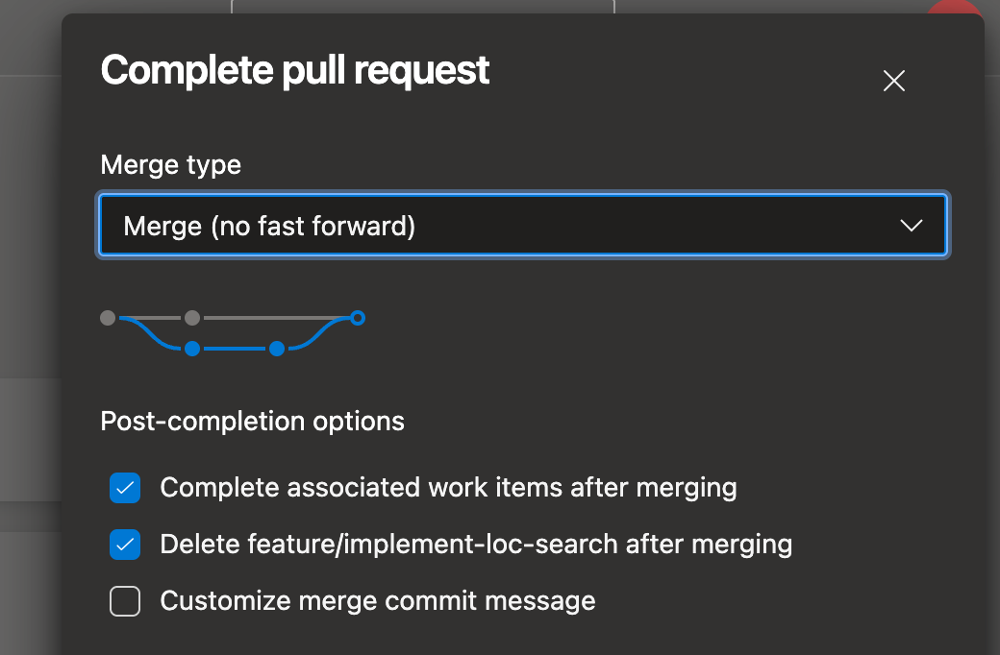
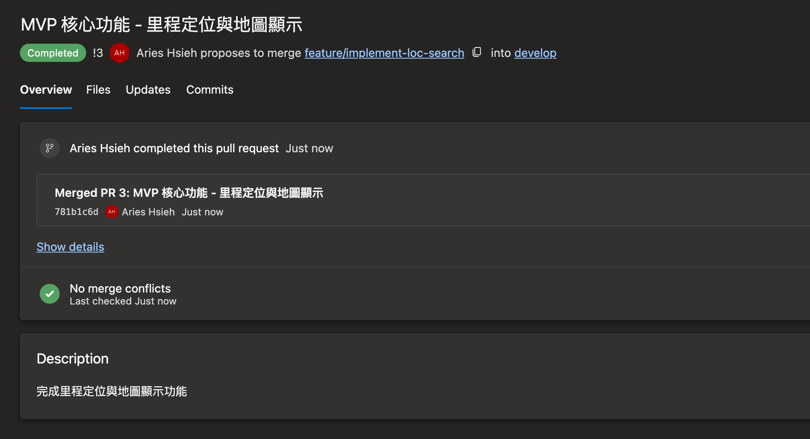

今天要來填上核心的「搜尋」與「顯示」邏輯了，包含處理里程輸入，接收並驗證使用者輸入的公里數，並實作搜尋函式，處理不同里程格式的解析，找出最近的地理位置，最後在地圖上顯示結果。

---

# 實作搜尋邏輯

## filter 高階函式

在搜尋按鈕按下之後，我們要執行的是 `searchAction()` 這個函式。第一步，透過 `filter` 此另一個 Swift 的高階函式來篩選我們要的資料：

```swift
private func searchAction() {
    let candidates = dataManager.highwayMarkers.filter { $0.roadNumber == selectedRoad }
}
```

filter 函式的呼叫，它需要一個 closure 作為參數，這個 closure 就是你的「篩選條件」。filter 會依序將 highwayMarkers 陣列中的每一個元素傳入這個 closure。Closure 會回傳一個布林值，如果 closure 對某個元素回傳 true，filter 就會把這個元素保留下來，放進新的陣列；如果回傳 false，這個元素就會被丟棄。

因此，`{ $0.roadNumber == selectedRoad }` 表示，目前正在檢查的這個物件，它的 roadNumber 是否等於使用者選擇的 selectedRoad？假設要搜尋的是國道 1 號，最後 filter 會回傳一個新的陣列 candidates，裡面只包含所有 roadNumber 是國道 1號的 HighwayMileageMarker 物件。這個 candidates 陣列就是我們接下來要進行里程搜尋的目標資料。


## 泛型、Closure 與 KeyPath

在這個 App ，核心功能是根據使用者輸入的里程，從資料中找出最接近的地理位置。然而，國道省道的資料來源、格式不盡相同。例如，國道的里程牌面可能是「014K+800」，而省道則是「5.1」這樣的浮點數。如果為兩者各寫一套搜尋邏輯，會導致程式碼大量重複且難以維護。為了解決這個問題，因此可以設計一個通用的搜尋函式。

為了達到這個目的，必須運用到 Swift 的幾個功能：

1. 泛型 (Generics)：我們用泛型 `<T>` 來定義這個函式，使其不限定處理特定的資料型別。這讓函式的宣告看起來像這樣，其中 `T` 可以是任何我們想傳入的資料型別：

```swift
private func findClosestMarker<T>(
    in items: [T],
    targetMile: Double,
    mileExtractor: (T) -> Double?,
    titleExtractor: (T) -> String,
    latKey: KeyPath<T, Double>,
    lonKey: KeyPath<T, Double>,
    maxAllowedDiffKm: Double? = nil
) -> // ... 回傳值
```

這樣一來，不論傳入的是國道標記陣列還是省道標記陣列都能處理。

2. Closure 與 KeyPath 作為參數：

現在函式本身不認得特定資料結構，我們就必須在呼叫它時，把「如何解析資料」的方法當作參數傳遞進去。

```swift
mileExtractor: (T) -> Double?
```

我們傳入一個閉包，這個閉包知道如何將特定格式（如 "014K+800"）轉換成可供比對的 `Double?` 格式公里數。

```swift
// 國道
let result = findClosestMarker(
    // ...

    mileExtractor: { parseHighwayMile(display: $0.display) },

    // ...
)

// 省道
let result = findClosestMarker(
    // ...

    mileExtractor: { parseProvincialMile(display: $0.content) },

    // ...
)
```

這樣我們就可以依據不同的情況，分別傳入 `parseHighwayMile()` 或 `parseProvincialMile()` 的邏輯。

同樣地，我們也用 `KeyPath` 傳入取得緯度 (`latKey`) 和經度 (`lonKey`) 的路徑，告訴函式請用 KeyPath 去 T 身上找到那個 Double 型別的屬性，從而函式就知道要去哪裡找座標資料。

```swift
// 定義
private func findClosestMarker<T>(
    // ...

    latKey: KeyPath<T, Double>,
    lonKey: KeyPath<T, Double>,

    // ...
) -> (title: String, coordinate: CLLocationCoordinate2D, mile: Double, diff: Double)? {

    for item in items {
        // ..

        // 使用 KeyPath 在泛型物件當中找尋 wgs84Lat, wgs84Lon
        let coord = CLLocationCoordinate2D(latitude: item[keyPath: latKey], longitude: item[keyPath: lonKey])

        // 其餘處理最近里程比較、差距過遠之門檻檢查等邏輯
    }

    // ..
}

// 呼叫
let result = findClosestMarker(
    // ...

    latKey: \.wgs84Lat,
    lonKey: \.wgs84Lon,

    // ...
)
```

最後，`findClosestMarker()` 會回傳最匹配的結果。

## 以頭針顯示於地圖

得到結果後要做的事情是將它顯示在地圖上。我們取得結果的名稱（里程牌面）及所在經緯度，首先要先更新地圖位置：

```swift
struct MarkerPin: Identifiable {
    let id = UUID()
    let title: String
    let coordinate: CLLocationCoordinate2D
}

private func showOnMap(title: String, coordinate: CLLocationCoordinate2D) {
    pins = [MarkerPin(title: title, coordinate: coordinate)]

    withAnimation {
        cameraPosition = .region(
            MKCoordinateRegion(
                center: coordinate,
                span: MKCoordinateSpan(latitudeDelta: 0.01, longitudeDelta: 0.01)
            )
        )
    }
}
```

使用 `withAnimation` 可以讓地圖平移效果更滑順。我們把新的 region 塞到 `cameraPosition` 這個狀態變數，綁定他的 `Map()` 物件就會自動更新：

```swift
Map(position: $cameraPosition) {
    ForEach(pins) { pin in
        Annotation("\(pin.title)\(pin.coordinate)", coordinate: pin.coordinate) {
            Image(systemName: "mappin.and.ellipse")
                .font(.title)
                .foregroundStyle(.red)
                .shadow(radius: 2)
    }
}
.mapControls {
    MapUserLocationButton()
    MapCompass()
    MapScaleView()
}
.frame(maxWidth: .infinity, maxHeight: .infinity)
.cornerRadius(12)
```

`Annotation` 是大頭針物件，我們讓他的標題顯示為牌面名稱及經緯度，然後給他一張系統圖示，跟簡單設計一下外觀。`.mapControls` 是附加於地圖上的一些工具，例如 `MapUserLocationButton` 是使用者定位按鈕，`MapCompass` 是指北針，而 `MapScaleView` 是比例尺。想了解更多可參考[官方說明](https://developer.apple.com/documentation/swiftui/view/mapcontrols(_:))。

## 測試功能

經過一番努力，搜尋邏輯的核心功能終於完成。是時候見證成果了！
我們將 App build and run，模擬一次完整的使用者操作流程，驗證這套系統是否能準確地將抽象的里程數字，對應到現實世界中的具體地理位置。

1. 公路類型：選擇「省道」。
2. 道路：從列表中選擇「台19線」。
3. 里程：在輸入框中鍵入「89」。




按下「搜尋」按鈕後，App 畫面上的地圖作出了反應，地圖中心平移到一個新的位置，並在上面標示出一個紅色的圖釘，顯示著「89K」的字樣。
第一步成功了！但這只是程式內的驗證，為了確認這個結果是否精準無誤，將 App 找到的經緯度座標，複製並貼到 Google Maps 中查看街景服務。



在畫面中央，一支熟悉的綠色路牌清晰可見，上面印著的正是——「台 19 線 89 公里」（我朝思暮想的 1989 XD）。

這證明了我們的資料解析、篩選邏輯和搜尋演算法是正確且有效的！

# Pull Request

我們現在已經完成了一個 Issue，也是時候可以將現在開發的分支合併回 develop 了。

我們到 Azure 的 Repo 的 Pull Request 頁面。



接著點選 New pull request。



你可以在這裡輸入基本的標題、描述，也可以關聯相關的 work item，這樣日後回頭才會更清楚這次的 PR 做了什麼事情。好了之後就按 Create。



這邊會幫你審查程式碼有無衝突，沒衝突的話就按右上角的 Completed。



這裡可以選擇合併模式，這會決定你的線圖長什麼樣子。也可以勾選合併後自動完成相關的 work item，以及刪除被合併的分支。

選好後就下一步。



這樣就合併完成了。

# 本日小結

今天，我們成功地完成了 MVP 關鍵的核心功能：

我們利用 filter 高階函式，從資料庫中精準地篩選出使用者指定道路的所有里程點，為後續的搜尋做好準備；面對國道與省道不同的里程格式，我們沒有選擇重複撰寫兩套邏輯，而是透過 Swift 泛型 (Generics)、閉包 (Closure) 與 KeyPath，設計了一個可重用的 findClosestMarker 函式，將如何解析里程、如何取得座標等與特定資料結構相關的任務，交由呼叫端以參數的形式傳入。

搜尋到結果後，我們利用 MapKit 的 Annotation，將最接近的里程點以大頭針的形式清晰地標示在地圖上，並透過 withAnimation 讓地圖的平移動畫更加滑順自然。

最後，我們也完成了一次完整的開發循環，將實現功能的 feature 分支透過 Pull Request (PR) 合併回 develop 主幹，並關聯了對應的 Work Item。這不僅是程式碼的合併，也代表著一個需求的完整交付。

完成這項核心功能後，我們的 App 已經從一個靜態的資料瀏覽器，蛻變成一個真正能解決問題的實用工具。下一步，我們將繼續完善周邊功能與使用者體驗，讓這個 MVP 更加完整。
