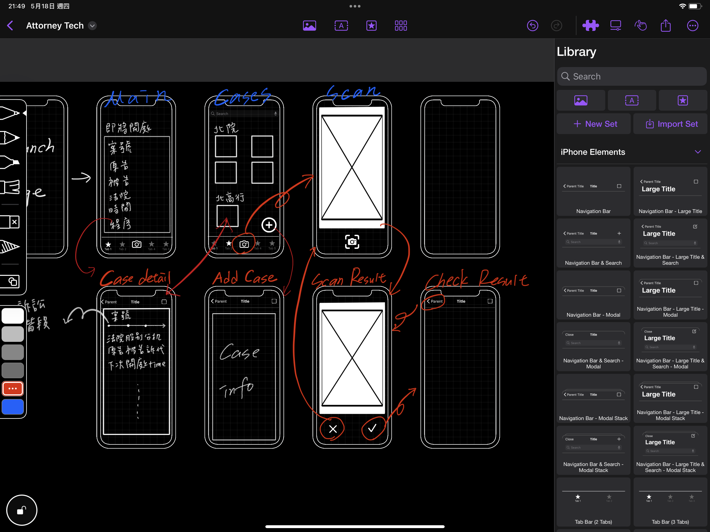
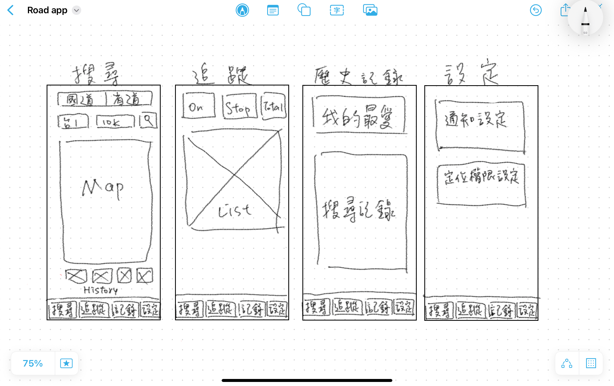
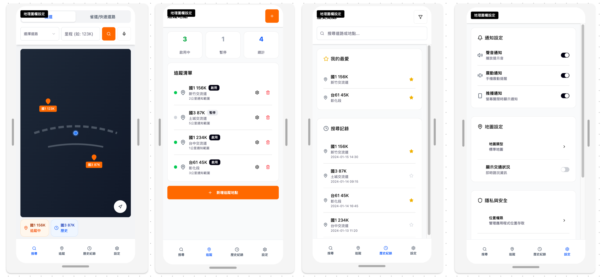

# 前言

來到第 17 天了，在我們開始用 SwiftUI 刻畫畫面之前，有一個更重要、更基礎的步驟，那就是 UI/UX 前期規劃。今天，我們將專注於第一項任務：App 畫面草圖。

為什麼我們需要先畫草圖？想像一下你要蓋一棟房子，你會直接叫工人來開始蓋嗎？當然不會，你會先找建築師畫設計圖。開發 App 也是一樣的道理。直接開始寫程式碼就像在沒有藍圖的情況下蓋房子，很容易導致結構混亂，最終花費更多時間修改。

# 手繪 Wireframe or AI 工具？

## Wireframe

一般來說，最初會從手繪草圖開始。你只需要一支筆和一張紙（或平板），可以快速畫出多種版本的設計，不滿意就立刻劃掉重來，幾乎沒有任何時間和金錢成本。

這個階段，我們完全不用考慮顏色、字體或精美的圖示。所有的精力都集中在「畫面上該放什麼元件？」、「按鈕應該在哪裡？」以及「使用者如何從 A 畫面跳到 B 畫面？」這些核心問題上。它能幫助你將腦中模糊的想法具體化，並檢查流程是否順暢。

手繪草圖其實就是 Wireframe (線框圖) 的一種形式。Wireframe（線框圖）是 App 的低保真度設計原型，像是 App 的骨架或藍圖。它通常由簡單的線條和方框組成，用來呈現：

- 內容佈局：各個區塊（如圖片、文字、列表）在畫面中的位置。
- 核心元件：包含哪些按鈕、輸入框、導航欄等。
- 資訊架構：如何組織畫面上顯示的資訊。

Wireframe 主要著重於功能，而非視覺設計，同時也確保開發者和設計師在動手前對 App 的樣貌和流程有一致的理解。

這張圖是我以前開發 App 時所畫過的草圖，使用的軟體是 Mockup，可以看到就是很大概的元件佈局以及流程。

## AI 工具的新可能

現在有一些 AI 工具，可以讓你用文字描述你想要的畫面，然後自動生成視覺設計稿或 Wireframe，甚至直接給你完整的 UI 設計。這類工具（如 Figma AI 等）非常適合作為初期發想的輔助，幫助你快速探索不同的設計方向。若你的 App 很簡單，或是只是想快速做個 MVP，那或許很適合直接請 AI 幫你產出畫面設計。

但不論是自己全手動繪製，或是請 AI 產出，本質上你都還是得必須先透過自己思考你的 UI 佈局，畢竟請 AI 產，你還是得給予具一定精準度的提示，否則產出結果可能不如預期。

而且，AI 產出的設計需要專業評估。你需要檢查功能完整性，是否涵蓋所有必要功能？流程是否符合使用者習慣？設計是否能實際開發實現？或是否符合你的 App 定位？

## 我的實際嘗試

### 手繪先行

先手繪基本流程，用平板快速勾勒頁面架構。

- 搜尋畫面：國道/省道、道路選擇，地圖區域使用卡片包裝，下方有歷史紀錄。
- 追蹤畫面：上方有 On, Stop, Total 表示追蹤地點的狀態，下方是追蹤地點清單。
- 記錄畫面：歷史紀錄裡有我的最愛區塊以及搜尋紀錄區塊。
- 設定畫面：使用者可以在這裡設定通知與定位權限。

### AI 設計的評估與調整

接著，試著請 AI 來產一份 UI 設計，看看成果如何。

我的使用方式跟工具是，先跟 Perplexity 溝通我的 App 功能與大概的架構，請他幫我產一份提示詞，再用該提示詞請 Figma AI 產 UI 設計。

>當然也可以直接請 AI 依據草圖產出 UI，但我自己的實驗結果，用文字敘述的方式會比較精確，但也可能跟我畫得不夠仔細有關，大家可以自己實驗看看囉。

成果意外地還不錯，不錯到我都懷疑自己有沒有辦法刻出來......

這是我第一次開發的時候使用 AI 來輔助產出 UI，我認為這種結合傳統 Wireframe 與 AI 工具的方式還不錯。先手繪基本流程，再透過 AI 輔助細部設計，用草圖或是具體的 prompt 讓 AI 產生視覺化設計，他甚至會增加你可能沒有想到的更好設計，最後再人工審查與調整。

重要的是，無論使用什麼工具，都要回到需求本質，即我們的公路里程 App 目前要解決的核心問題是什麼？例如：我可能不需要顯示路況，或是通知設定部分這比較像是 Android 的設定方式，道路資訊可能沒有這麼詳細的資訊（例如交流道名稱），我認為現階段可能也不需要再追蹤頁面提供新增追蹤地點的按鈕，我想要讓使用者流程盡量單純......等等。

# 下一步規劃
明天我們會繼續 UI/UX 前期規劃的第二部分：使用者流程圖，將這些靜態的畫面串連成完整的使用者旅程。透過流程圖，我們能確保每個功能都有清楚的起點、過程與結果，避免使用者迷失在複雜的操作中。
