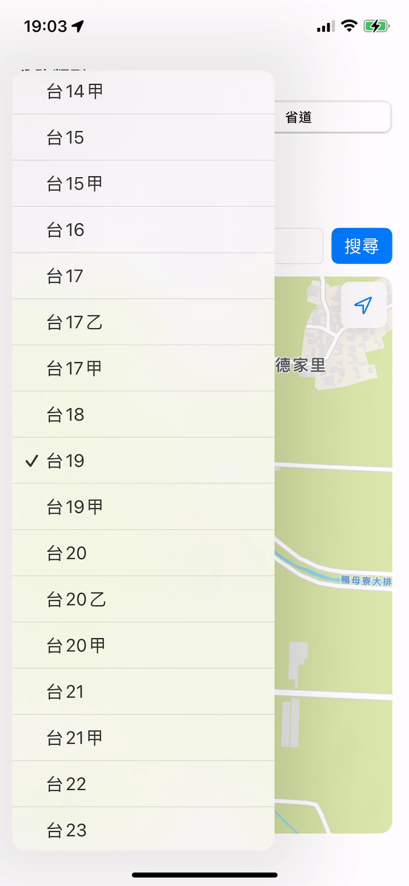
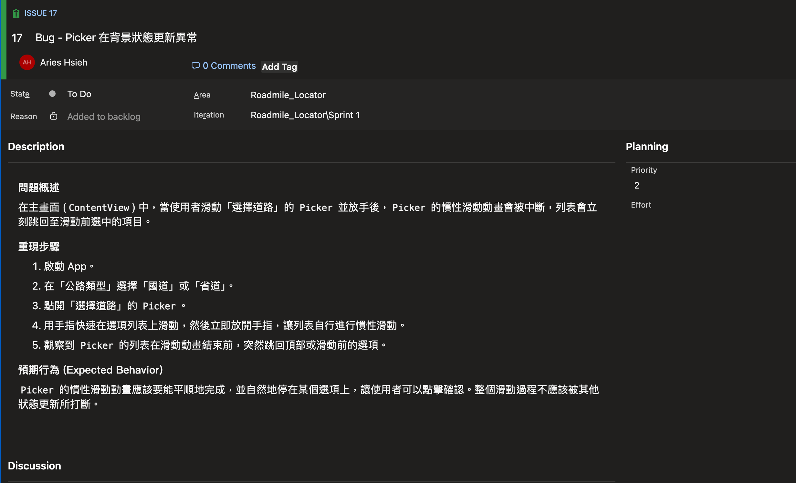

在我們昨天的進度中，我們建立了一個選擇道路的 Picker。但正當我興高采烈地測試時，發現了一個奇怪的 bug：當我快速滑動 Picker 的選項列表，手指一放開，列表的慣性滑動動畫到一半，它就自己重新整理了。



我的第一個反應是：「蝦米，這啥鬼？」我反覆檢查程式碼，Picker 的 `selection` 明明只綁定了 `@State private var selectedRoad`，在滑動過程中，這個變數的值也沒改變，為什麼它會自己跳回去？難道是 SwiftUI 的 bug？

# Troubleshooting

## SwiftUI View 的計算本質

經過一番研究（問 AI...XD），我發現問題的根源要回到 SwiftUI 對於 View 的本質：
>在 SwiftUI 裡，View 不是靜態的畫面，而是由「狀態 (State)」推導出來的結果。

我們透過以下簡單的例子再一次複習 SwiftUI 畫面更新的概念：

```swift
struct CounterView: View {
    @State private var count = 0

    var body: some View {
        VStack {
            Text("Count: \(count)")
            Button("加一") {
                count += 1
            }
        }
    }
}
```

這裡的 `body` 是一個 compute property，它的職責是根據目前的狀態 `count`，回傳一個描述 UI 的藍圖。輸入是 `count` 的值，輸出是一個新的 View，只要 count 改變，**整個 body**就會重新被計算，畫面就會跟著更新。這表示，只要一個 View 所依賴的任何一個「狀態來源」(@State, @StateObject 等) 發生改變，SwiftUI 就會重新執行這個 View 的 body 屬性，計算出一個新的 View 結構。

## 檢視專案程式碼

OK，複習了這個概念之後，回到我們專案的程式碼：

```swift
struct ContentView: View {

    @StateObject var locationManager = LocationManager() // 兇手

    // ...

    var body: some View {
        VStack(alignment: .leading, spacing: 12) {

            // ...

        }
    }
    // ...
}
```

還記得我們在 Day 9 Core Location 基礎時有建立一個管理使用者位置的 `locationManager` 嗎？這個物件一直被保留在專案中（因為之後會用到 XD），也就是說，在我們的 ContentView 中，它透過 @StateObject 監聽著 locationManager 的一舉一動！有沒有要破案的感覺？我們來釐清一下流程：


1. 使用者滑動 Picker：一個平順的滑動動畫正在進行。

2. 背景狀態更新：就在此時，locationManager 在背景更新了 GPS 位置，這個更新通知了 ContentView。

3. ContentView 收到通知後，立刻觸發 body 的重新計算，以反應這個新狀態。

4. body 的重算，Picker 被銷毀重建，一個全新的 Picker 被建立出來。舊 Picker 正在執行的滑動動畫，就這樣被中斷並銷毀了。

5. 新的 Picker 根據 $selectedRoad 目前的值（也就是滑動前的值）來設定自己的初始外觀，於是，在我們看來，就是 Picker 跳回最後選取的選項。

為了證明這件事，只好無情地註解掉 `@StateObject var locationManager = LocationManager()`......


Amazing! Bug 消失了～

但是沒有人這樣做的啦，就算是 workaround 也太粗暴了。

## 該獨立的 View 就讓它獨立

正確的做法應該是，將 Picker 相關的邏輯，隔離到一個獨立 View 中，可以這樣做：

1. 建立 RoadPickerView

```swift
struct RoadPickerView: View {
    let title: String
    let availableRoads: [String]
    @Binding var selection: String

    var body: some View {
        VStack(alignment: .leading) {
            Text(title)
            Picker(title, selection: $selection) {
                ForEach(availableRoads, id: \.self) { roadNumber in
                    Text(roadNumber).tag(roadNumber)
                }
            }
        }
    }
}
```

我們替道路選擇 Picker 建立一個獨立的 View，透過 @Binding 將選擇結果回傳。

2. 在 ContentView 中使用它

```swift
// 在 ContentView 的 body 中
// ...
RoadPickerView(
    title: "選擇道路",
    availableRoads: availableRoadNumbers,
    selection: $selectedRoad
)
// ...
```

如此一來，當 LocationManager 再次更新時，ContentView 的 body 依然會重算。但當它計算到 RoadPickerView(...) 這一行時，因為：

- 傳入的 title 沒變。
- 傳入的 availableRoads 沒變。
- 傳入的 selection 也沒變。

於是 SwiftUI 會跳過對 RoadPickerView 的更新，直接重用上一次的實例。如此一來 RoadPickerView 沒有被銷毀和重建，它內部的 Picker 動畫自然就能順利跑完，效果會跟剛剛把 LocationManager 註解掉的結果一樣（對，我懶得再錄影並且轉為 gif 了...真的請相信我有解掉 QQ）。

# Azure Board 開立 bug 單

別忘了，我們這次開發有使用 Azure 作為管理工具，因此遇到了這個 bug，必須先開立 work item。

但是...我們的 process 選擇了 basic，只有 Epic, Issue 和 Task，沒有 Bug 單可以開啊～

沒關係，我們參考微軟爸爸的[說明](https://learn.microsoft.com/en-us/azure/devops/boards/backlogs/manage-bugs?view=azure-devops)：

>Bug work item types aren't available with the Basic process. The Basic process tracks bugs as Issues and is available when you create a new project from Azure DevOps Services or Azure DevOps Server 2020 or later versions.

也就是說，你要開 bug 就用 issue 來開。好，聽微軟的建議，就開 issue。



開完之後就可以來改程式碼，改完後記得 commit message 加上此 issue 的編號，然後 push，並且開立 PR，merge 回 develop 分支。
>養成好習慣，此種解決 bug 的分支名稱，可以命名為 bugFix/<簡述你的 bug>

# 本日小結

今天我們沒有前進去開發新功能，
而是解決了一個在 SwiftUI 開發中容易踩的一個雷，讓我們對 SwiftUI 的運作原理有了更扎實的理解，
並且在 Azure Boards 上以 Issue 的形式記錄了這個 bug，並在修復後將 bugFix 分支合併回 develop。這個過程確保了每一次的程式碼變更都有跡可循。
