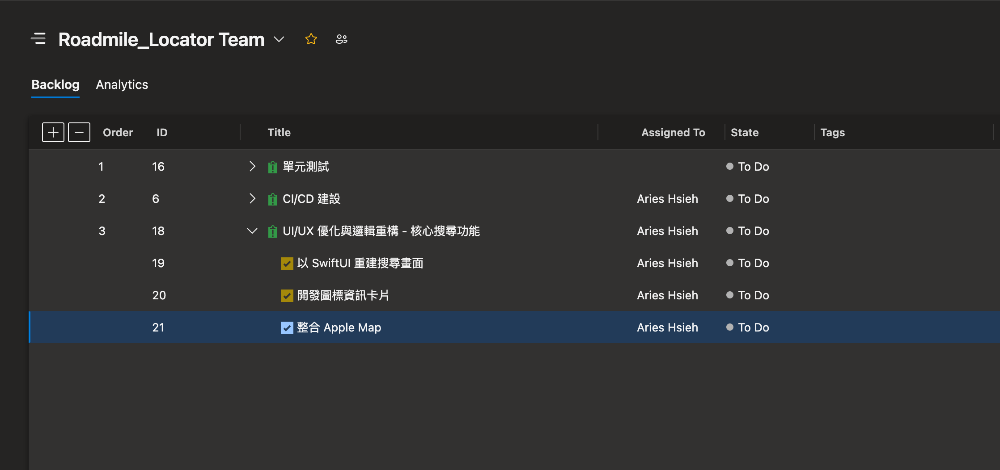
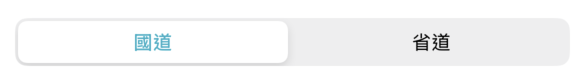
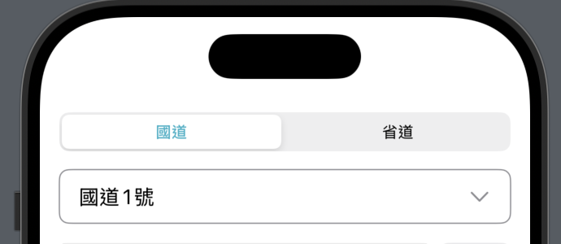
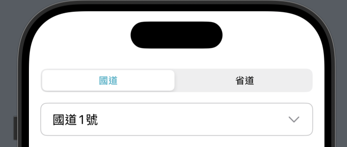
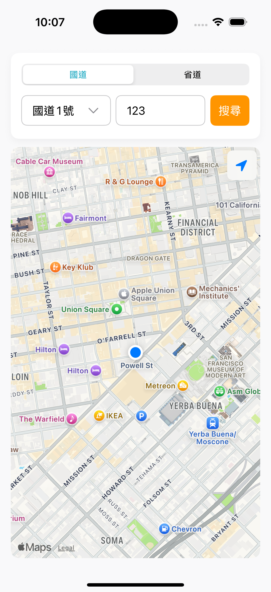
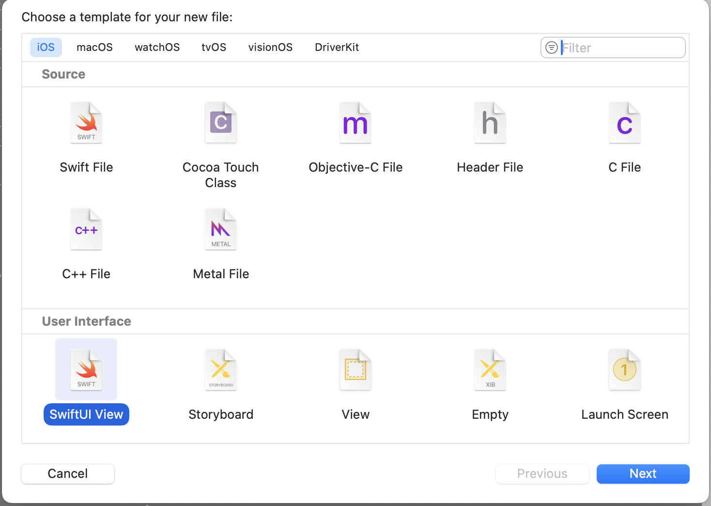
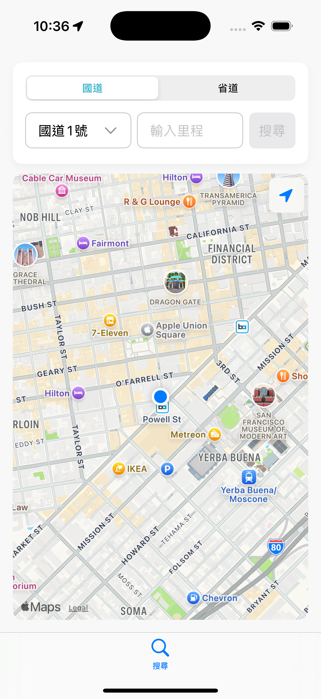

# 開立 Issue, Task

現在有新的任務了，我們要依據前兩天的規劃來開發 App，這是新的任務，先在 Azure Board 上把 work items 開好。



# 在 SwiftUi 中自訂元件樣式

當你使用 SwiftUI 框架提供的元件，通常來說你能夠自訂的部分不多，不然就會受到許多限制。以 `Picker` 來說，你能改的部分大概就是選擇/未被選擇的字體顏色、背景等。如果你要完全客製化，那你可能得自己使用其他元件來自己刻。

除了自己刻之外，一般來說方法有：

## 調用 UIKit 方法

使用 UISegmentedControl.appearance()。

這是使用 UIKit 的方式來更改元件外觀，**但會影響到 App 中 所有的 Segmented 外觀**。可以在 View 的 init() 或在 Picker 的 .onAppear 修飾符來設定，例如：

```swift
struct ContentView: View {
    // ...

    init() {
        UISegmentedControl.appearance().setTitleTextAttributes(
            [.foregroundColor: UIColor.systemTeal], for: .selected
        )
    }

    // ...
}
```



## 使用第三方函式庫

另一個方法是使用第三方函式庫（例如 Introspect）

若你不想更動 App 中所有的 Segmented，只希望針對特定的 Picker 進行修改，可以使用 [Introspect](https://github.com/siteline/swiftui-introspect?tab=readme-ov-file) 這類函式庫。它能讓你取得 SwiftUI 元件背後的 UIKit 元件，並直接對其進行設定。

他的用法類似這樣：

```swift
Picker("類型1", selection: $selectedCategory1) {
    Text("A").tag(0)
    Text("B").tag(1)
    Text("C").tag(2)
}
.introspect(.picker(style: .segmented), on: .iOS(.v16, .v17, .v18)) { segmentedControl in
    segmentedControl.backgroundColor = UIColor.systemBlue.withAlphaComponent(0.2)
    segmentedControl.selectedSegmentTintColor = UIColor.systemBlue
    segmentedControl.setTitleTextAttributes([
        .foregroundColor: UIColor.white
    ], for: .selected)
    segmentedControl.setTitleTextAttributes([
        .foregroundColor: UIColor.systemBlue
    ], for: .normal)
}
.pickerStyle(.segmented)
```

但我自己測試，這個套件會讓 SwiftUI 的 Preview 功能壞掉的樣子，但我沒有研究太多，有人有研究的話可以留言幫忙補充。

---

回到本專案，我沒有要對 Segment 做太多的修改，我只想改個被選中選項文字的顏色～

因此我會在 `ContentView` 的 `init()` 裡加上

```swift
init() {
    UISegmentedControl.appearance().setTitleTextAttributes(
        [.foregroundColor: UIColor.systemTeal], for: .selected
    )
}
```

## 可自訂 label 的原生元件

以「選擇道路」這個功能為例，其實 SwiftUI 已經有很方便的元件可以用，就是 `Menu`。這個元件可以做出下拉選單，而且它的 `label` 可以放你想要的內容。

舉個例子：

```swift
Menu {
    ForEach(availableRoads, id: \.self) { road in
        Button(action: { selection = road }) {
            Text(road)
        }
    }
}
```

這裡我們用 `ForEach` 幫每條道路都建立一個 `Button`，點下去就會選擇那條路。

接下來，`Menu` 的 `label` 部分就可以自己設計外觀：

```swift
Menu {
    // ...
} label: {
    HStack {
        Text(selection)
            .foregroundColor(.primary)
        Spacer()
        Image(systemName: "chevron.down")
            .foregroundColor(.gray)
    }
}
```

這裡我用一個 `HStack`，左邊放選到的文字，右邊放一個下拉箭頭（用 SF Symbols 的 chevron.down），中間用 `Spacer()` 把兩邊撐開。這樣看起來就很像一般的下拉選單。

如果想讓它更像表單元件，可以加上一些修飾：

```swift
HStack {
    // ...
}
.padding(.horizontal)
.frame(height: 44)
.background(
    RoundedRectangle(cornerRadius: 8)
        .stroke(Color.gray)
)
```

- `.padding(.horizontal)`：讓內容左右有點空間，不會貼邊。
- `.frame(height: 44)`：固定高度，看起來比較舒服。
- `.background(...)`：加上一個有圓角的灰色邊框。

這樣就能快速做出一個有圓角方框、下拉箭頭的選單，外觀也很容易調整！



但仔細看～這邊框的灰色好像太灰了，在 `Color.` 裡面好像也找不到更淺的灰色。

這個時候我們可以使用 UIKit 的 UIColor 來幫忙！

我們可以這樣使用：

```swift
.stroke(Color(UIColor.separator))
```

這裡把 UIKit 的顏色（UIColor）轉成 SwiftUI 的 Color。UIColor.separator 是 Apple 定義的系統分隔線顏色，也就是在 UIKit 裡 UITableView 的 cell 分隔線、TextField 的邊框線，都是用這個顏色。



這樣好看多了！

接下來就是按照我們之前學過的方式，逐一將佈局建立起來。



>上半部我比較喜歡卡片式的風格設計，因此與原本 AI 產出來的略有不同。

# Tab bar

在開始建立 tab bar 之前，我們先把原本全部塞在 ContentView 裡面的畫面獨立到另一個 MapView。

首先，新增一個資料夾，選擇 SwiftUI View。



接著命名為 MapView，我們只要把目前建立好的畫面都貼到這個檔案裡面，接著回到 ContentView 將原本的程式碼清空，並加上：

```swift
struct ContentView: View {
    @State private var selectedTab = 0

    var body: some View {
        TabView(selection: $selectedTab) {
            MapView()
                .tabItem {
                    Label("搜尋", systemImage: "magnifyingglass")
                }
                .tag(0)
        }
        .toolbarBackground(Color.white, for: .tabBar) // 可自訂背景顏色
    }
}
```

MapView() 是原本包含所有的畫面，現在被乾淨地封裝成一個獨立的 View，並作為第一個 Tab 的內容。`.tabItem { ... }` 這個修飾符定義了 Tab Bar 上對應按鈕的外觀，包含圖示和文字。

`.tag(...)` 為每個 Tab 設定一個唯一的標籤（通常是整數或字串），讓我們可以控制 Tab 的切換（透過 selectedTab 這個 @State 變數）。



這樣 tab bar 就建立好了～

明天我們繼續把這個頁面完成！
