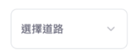
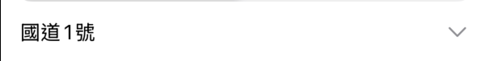

# 開立 Issue, Task

現在有新的任務了，我們要依據前兩天的規劃來開發 App，這是新的任務，先在 Azure Board 上把 work items 開好。


# 在 SwiftUi 中自訂元件樣式

當你使用 SwiftUI 框架提供的元件，通常來說你能夠自訂的部分不多，不然就會受到許多限制。以 `Picker` 來說，你能改的部分大概就是選擇/未被選擇的字體顏色、背景等。如果你要完全客製化，那你可能得自己使用其他元件來自己刻。

除了自己刻之外，一般來說方法有：

## 調用 UIKit 方法

使用 UISegmentedControl.appearance()。

這是使用 UIKit 的方式來更改元件外觀，**但會影響到 App 中 所有的 Segmented 外觀**。可以在 View 的 init() 或在 Picker 的 .onAppear 修飾符來設定，例如：

```swift
struct ContentView: View {
    // ...

    init() {
        UISegmentedControl.appearance().setTitleTextAttributes(
            [.foregroundColor: UIColor.systemTeal], for: .selected
        )
    }

    // ...
}
```


## 使用第三方函式庫

另一個方法是使用第三方函式庫（例如 Introspect）

若你不想更動 App 中所有的 Segmented，只希望針對特定的 Picker 進行修改，可以使用 [Introspect](https://github.com/siteline/swiftui-introspect?tab=readme-ov-file) 這類函式庫。它能讓你取得 SwiftUI 元件背後的 UIKit 元件，並直接對其進行設定。

他的用法類似這樣：

```swift
Picker("類型1", selection: $selectedCategory1) {
    Text("A").tag(0)
    Text("B").tag(1)
    Text("C").tag(2)
}
.introspect(.picker(style: .segmented), on: .iOS(.v16, .v17, .v18)) { segmentedControl in
    segmentedControl.backgroundColor = UIColor.systemBlue.withAlphaComponent(0.2)
    segmentedControl.selectedSegmentTintColor = UIColor.systemBlue
    segmentedControl.setTitleTextAttributes([
        .foregroundColor: UIColor.white
    ], for: .selected)
    segmentedControl.setTitleTextAttributes([
        .foregroundColor: UIColor.systemBlue
    ], for: .normal)
}
.pickerStyle(.segmented)
```

但我自己測試，這個套件會讓 SwiftUI 的 Preview 功能壞掉的樣子，但我沒有研究太多，有人有研究的話可以留言幫忙補充。

---

回到本專案，我沒有要對 Segment 做太多的修改，我只想改個被選中選項文字的顏色～

因此我會在 `ContentView` 的 `init()` 裡加上

```swift
init() {
    UISegmentedControl.appearance().setTitleTextAttributes(
        [.foregroundColor: UIColor.systemTeal], for: .selected
    )
}
```

## 可自訂 label 的原生元件



以「選擇道路」這個元件為例，我們可以用 `Menu` 這個元件來達到接近上圖的效果。

`Menu` 是 SwiftUI 提供可以建立下拉式選單的元件，而且我們可以在它的 `label` 裡面放我們想要的 view。

```swift
Menu {
    ForEach(availableRoads, id: \.self) { road in
        Button(action: { selection = road }) {
            Text(road)
        }
    }
}
```

在 `Menu` 這個下拉式選單中，我們依序對每條道路建立對應的 `Button`。

```swift
Menu {

    // ...

} label: {
    HStack {
        Text(selection)
            .foregroundColor(.primary)
        Spacer()
        Image(systemName: "chevron.down")
            .foregroundColor(.gray)
    }
}
```

而在 `label` 裡，我們放入一個 `HStack` 容器來包含 `Text` 與 `Image`。`Spacer()` 是一個看不見但具有彈性的空白 view。Spacer 會自動填滿所有可用的剩餘空間。因為它被放在文字和圖片之間，所以它會把左邊的 Text 推到最左側，把右邊的 Image 推到最右側。

下拉箭頭則選取 Apple 內建的 SF Symbols 圖示庫的 chevron.down。系統內建的 SF Symbols 種類很多，可以滿足絕大部分情況的需求。



接下來處理外框的部分。

```swift
HStack {
    // ...
}
.padding(.horizontal)
.frame(height: 44)
.background(
    RoundedRectangle(cornerRadius: 8)
        .stroke(Color.gray)
)
```

1. .padding(.horizontal)

在水平方向（也就是左右兩側）增加一些預設的空白距離，讓內容不會完全貼齊邊框，看起來更舒適。

2. .frame(height: 44)

將整個 HStack 的高度固定為 44 points，讓它看起來不會那麼窄。

3. .background(...) + RoundedRectangle(cornerRadius: 8)

添加一個帶有邊框的圓角矩形背景層，圓角的半徑為 8 點

4. .stroke(Color.gray)

.stroke(...) 表示只繪製這個形狀的邊框，而不是用顏色填滿它，並用灰色來繪製這個圓角矩形的邊框線。


