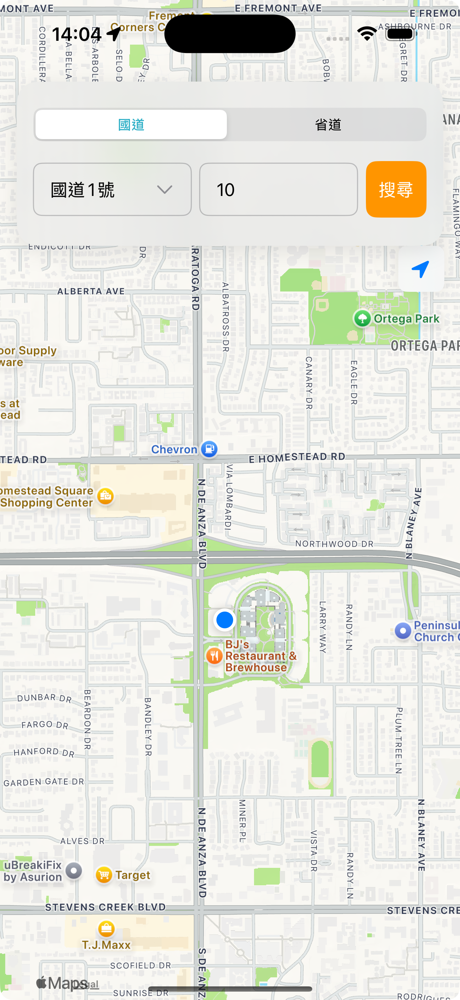
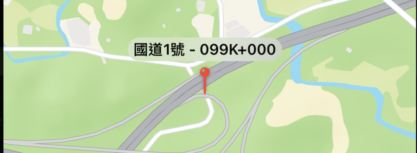
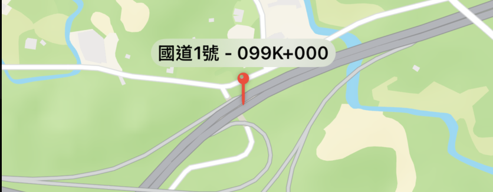

今天我們先繼續把 UI 調整跟草圖接近一致。目前上半部的選項與下方的地圖區塊是分開的，為了讓選項卡片能夠疊在地圖上，我們要將這些既有元件放到 `ZStack` 裡。

```swift
var body: some View {
    ZStack(alignment: .top) {
        Map(position: $cameraPosition) {
            ForEach(pins) { pin in
                Annotation("", coordinate: pin.coordinate) {

                        // ...
                    }
                }
            }
        }
        VStack {
            VStack(spacing: 18) {
                Picker("公路類型", selection: $category) {
                    ForEach(RoadCategory.allCases) { category in
                        Text(category.rawValue).tag(category)
                    }
                }
                .pickerStyle(.segmented)
                HStack {
                    RoadPickerView(
                        availableRoads: availableRoadNumbers,
                        selection: $selectedRoad
                    )
                    // ...
                    TextField("輸入里程", text: $mileageText)

                    // ...

                    Button(action: {
                        // ...
                    }) {
                }
            }
            // 上半部卡片樣式
            .padding(EdgeInsets(top: 25, leading: 16, bottom: 25, trailing: 16))
            .background(.ultraThinMaterial)
            .cornerRadius(20)
            .shadow(color: .black.opacity(0.1), radius: 10, y: 5)
        }
    }
}
```

最底層是 Map，接著是包含著公路類型選擇 Picker、道路選擇 Menu及里程輸入欄的 `VStack`。另外，使用 `.background(.ultraThinMaterial)` 套用一些毛玻璃效果與陰影，微微透視後面的 Map，整體而言會更自然，效果如下：



接著，我們要讓地圖圖釘顯示有意義的名稱，我們更改地圖的 Annotation：

```swift
Annotation("", coordinate: pin.coordinate) {
    VStack() {
        Text("\(pin.roadNumber) - \(pin.title)")
            .font(.callout.weight(.semibold))
            .padding(.horizontal, 6)
            .padding(.vertical, 3)
            .background(.ultraThinMaterial, in: Capsule())
        Image(systemName: "mappin")
            .font(.title)
            .foregroundStyle(.red)
            .shadow(radius: 2)
    }
}
```



嗯，名稱有顯示了，但是地圖針的位置跑掉了，往下位移到了道路外。因為 `VStack` 的工作非常單純：它會將它裡面的所有子視圖，一個接一個地、從上到下垂直排列起來。所以加上 `Text` 後，`Image` 圖針就被往下擠了。為了解決這個問題，我們應該改用 `ZStack`，並且做一些微調：

```swift
Annotation("", coordinate: pin.coordinate) {
    ZStack(alignment: .bottom) {
        Image(systemName: "mappin")
            .font(.title)
            .foregroundStyle(.red)
            .shadow(radius: 2)
            .alignmentGuide(.bottom) { d in d[.bottom] }
        Text("\(pin.roadNumber) - \(pin.title)")
            .font(.callout.weight(.semibold))
            .padding(.horizontal, 6)
            .padding(.vertical, 3)
            .background(.ultraThinMaterial, in: Capsule())
            .offset(y: -36)
    }
}
```

`ZStack` 是沿著 Z 軸（螢幕的深度方向）來排列視圖。它會將所有子視圖在同一個位置上，一個疊一個地放好，就像一疊卡牌，寫在程式碼越後面的視圖，會被疊在越上面。另外，為了
確保無論圖釘圖示本身有多大，它在地圖上的錨點永遠是圖釘的針尖，`.alignmentGuide(.bottom) { d in d[.bottom] }` 這行程式碼告訴 ZStack：「在進行底部對齊時，請使用這個 Image 自己的最底部邊緣作為對齊的基準點」。

處理好圖釘後，因為在 ZStack 中，標籤預設是和圖釘疊在同一個位置的，使用 .offset 將標籤在垂直方向上純視覺地向上移動 36 點，讓它看起來在圖釘上方。

調整後的結果如下：



這樣看起來正常了，沒有再跑掉了。

接著就是讓使用者點選圖標後顯示進一步資訊與操作了，明天繼續～
