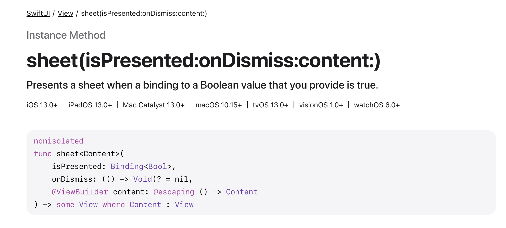
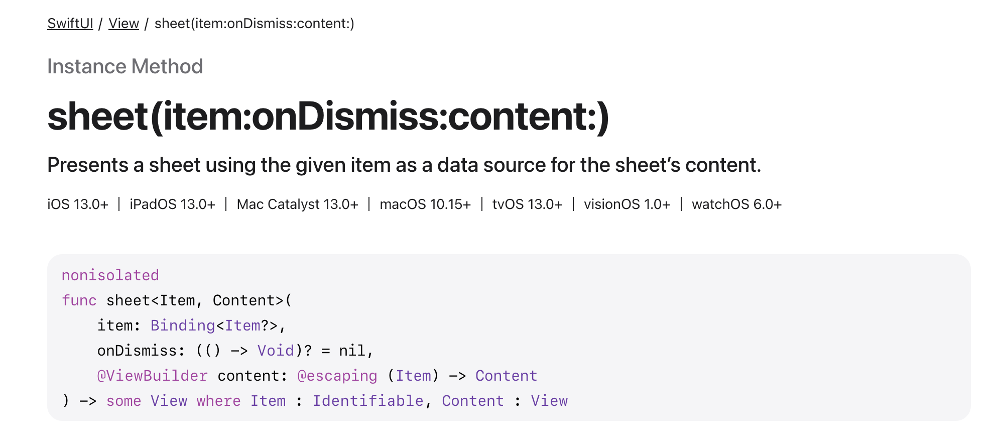
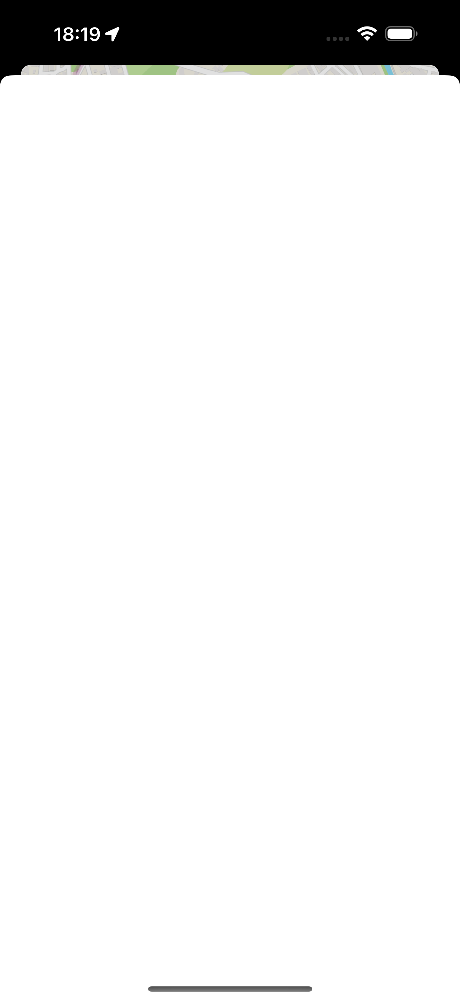
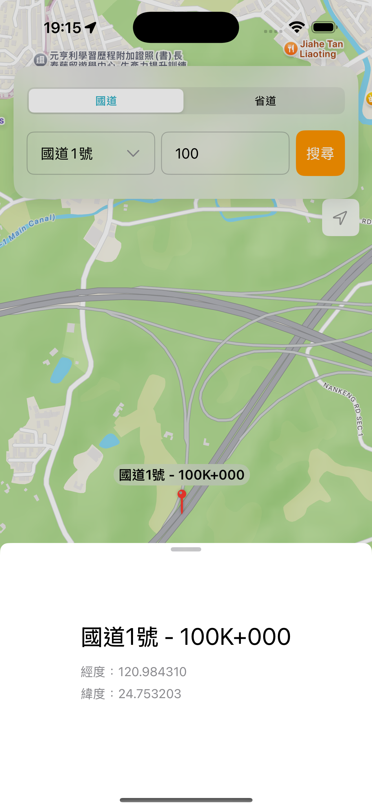

接續昨天的進度，現在地圖上的圖標已經能按照資料集的經緯度精確標出位置，並在圖標上方顯示道路名稱與里程數。然而，僅有這些資訊是不夠的，我們需要提供一個更豐富的互動方式，讓使用者能深入了解每個地點的詳情。

一個常見的解決方案是，讓使用者點擊圖標後，從螢幕下方彈出一個包含詳細資訊的 sheet。這種做法不僅能呈現更多內容，還能確保使用者無需離開當前頁面，從而避免割裂感，提供流暢的使用體驗。

# 選擇最適合的 Sheet 呈現方式

要使用 SwiftUI 彈出 sheet，蘋果官方提供了幾種不同的方法，其中最常見的兩種是：

1. sheet(isPresented:onDismiss:content:)



這個方式是綁定一個 Bool 參數，來判斷是否需要 present sheet。

2. sheet(item:onDismiss:content:)



這裡的 item 綁定的是一個可選型別 (Optional) 的物件，透過當這個參數傳入的物件為是否為有值來決定彈出 sheet 與否。這應該是會比較適合我們的實作方式，因為我們的 sheet 內容是要與圖標物件綁定的。

考慮到我們的 sheet 需要顯示特定圖標的詳細資訊，第二種方法顯然更適合我們的實作場景。

# 步驟一：綁定狀態與觸發事件

首先，我們在 MapView 中宣告一個 @State 變數 selectedPin，它的型別是 MarkerPin?（可選的 MarkerPin）。因為使用者一開始尚未選擇任何圖標，所以它的初始值為 nil。

```swift
@State private var selectedPin: MarkerPin? = nil
```

接著，我們在 MapView 的最外層容器 ZStack 上附加 .sheet 修飾符，並將它的 item 參數綁定到 $selectedPin。

```swift
var body: some View {
    ZStack(alignment: .top) {
        Map(position: $cameraPosition) {
            // ..
        }
    }
    .sheet(item: $selectedPin) { pin in
        // 在這個閉包中，`pin` 就是使用者所點擊的那個 MarkerPin 物件
        // 我們將在這裡建構 sheet 的內容
    }
}
```

現在，我們只需要在使用者點擊圖標時，將該圖標的物件指派給 selectedPin 即可。我們回到 Annotation 的程式碼，為其加上 .onTapGesture 事件：

```swift
Annotation("", coordinate: pin.coordinate) {
    ZStack(alignment: .bottom) {

        // ...

    }
    .onTapGesture {
        selectedPin = pin // 當圖標被點擊，將其設為 selectedPin
    }
}
```

至此，點擊圖標已經可以成功觸發一個空的 sheet 彈出了！

# 步驟二：獨立且客製化的 Sheet



目前這個 sheet 不僅沒有內容，還佔據了整個螢幕，完全遮擋了後面的地圖。為了解決這個問題，並保持程式碼的整潔，我們將 sheet 的內容抽離成一個獨立的 SwiftUI View，命名為 PinDetailSheet。

在新的 PinDetailSheet.swift 檔案中，我們定義其外觀與所需資料：

```swift
struct PinDetailSheet: View {

    var body: some View {
        VStack(alignment: .leading, spacing: 16) {
            Text("\(pin.roadNumber) - \(pin.title)")
                .font(.title)

            VStack(alignment: .leading, spacing: 8) {
                Text("經度：\(pin.coordinate.longitude)")
                    .font(.subheadline)
                    .foregroundStyle(.secondary)
                Text("緯度：\(pin.coordinate.latitude)")
                    .font(.subheadline)
                    .foregroundStyle(.secondary)
            }
        }
    }
}
```

然後，我們回到 MapView，在 .sheet 修飾符中使用這個新建立的 PinDetailSheet，並加上一些客製化設定來調整它的外觀和行為：


```swift
.sheet(item: $selectedPin) { pin in
    PinDetailSheet(pin: pin)
        .presentationDetents([.fraction(0.33)])
        .presentationDragIndicator(.visible)
        .presentationContentInteraction(.scrolls)
}
```

這裡使用幾個 modifier，`.presentationDetents([.fraction(0.33)])` 表示將螢幕總高度的 33% (三分之一) 設為一個停靠點，所以這個 sheet 在彈出時，會固定在這個三分之一的高度，不會完全蓋住後面的地圖。`.presentationDragIndicator(.visible)` 顯示 sheet 頂部那條灰色小橫槓（拖曳指示器），告訴使用者這是一個可以向下拖曳來關閉的視窗。

讓我們來看看最終的效果。



結果符合預期！

## Sheet 無法彈出？

我在測試的時候，發現有時 sheet 無法彈出。研究了一下，發現因為我們接受觸碰事件的 view 是 Map，Map 本身就有一連串的點擊事件，因此如果我們自訂了

```swift
.onTapGesture {
    selectedPin = pin // 當圖標被點擊，將其設為 selectedPin
}
```

有時候會無法被系統偵測到。因此，我們可以用 `highPriorityGesture` 來優先判斷，如果是點擊在 Annotation 的 ZStack 上的觸碰事件，優先處理 `selectedPin = pin`。

```swift
.highPriorityGesture( // 1. 使用高優先級手勢
    TapGesture()
        .onEnded { _ in // 2. 在手勢結束時觸發動作
            selectedPin = pin
        }
)
```

# 本日小結
今天我們完成了地圖互動中點擊圖標並顯示詳細資訊的部分。明天，我們將繼續完善 sheet 裡的功能，將加入「在 Apple Maps 或 Google Maps 中打開」，方便使用者透過這些地圖 App 以查看街景等近一步的資訊。
