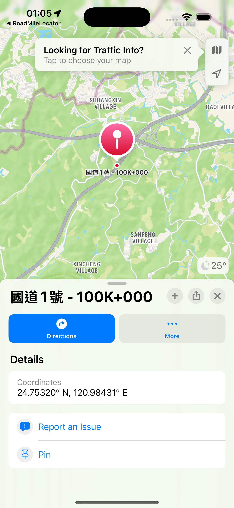
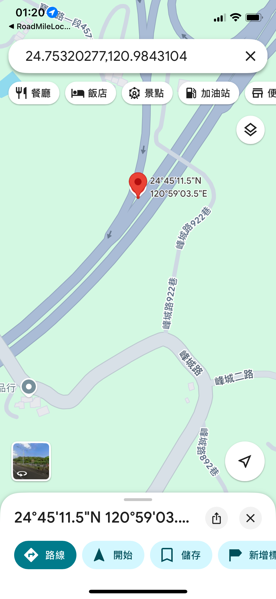
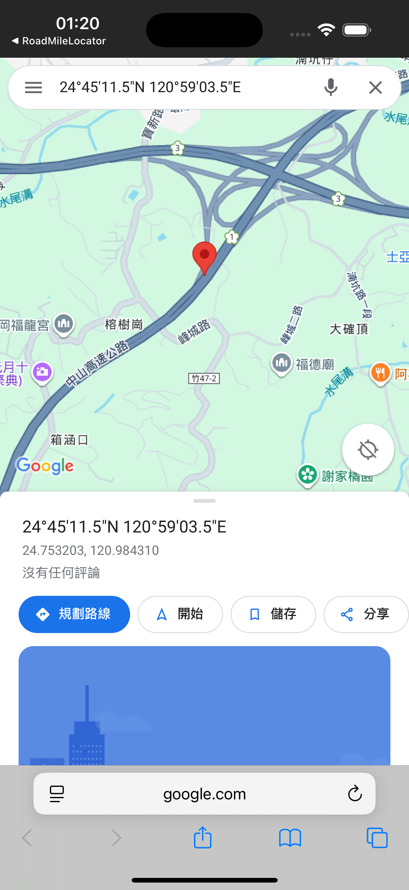

今天要來完成將圖標地點用 Apple Maps 或 Google Maps 來開啟。

# URL Scheme

要在 App 之間進行跳轉，就如同網站一般，URL Scheme 是一種特殊的網址格式，它允許 App之間互相溝通、啟動或直接跳轉到 App 內的特定功能頁面。你可以將它想像成專門用來定位 App 功能的網址。

一個 URL Scheme 的結構大概是：`scheme://host/path?query`，scheme 是 App 的唯一識別符，例如 google maps 的 URL Scheme 為 `comgooglemaps://`。Host / Path 是主機與路徑，用來指定 App 內部的特定功能或頁面。Query 為查詢參數，用於傳遞資料給 App。例如，在購物 App 中打開特定商品頁面，可以透過參數傳遞商品編號。

開發者在 App 中註冊一個專屬的 URL Scheme。當使用者在手機的任何地方（例如另一個 App 或網頁瀏覽器）點擊這個特殊格式的 URL 時，作業系統（如 iOS 或 Android）會識別這個 Scheme，並啟動對應的 App，同時將後續的路徑和參數傳遞給它處理。

# iOS 中 URL Scheme 的基本實踐

在 iOS 開發中，我們常需要透過 URL Scheme 來啟動另一個 App 或跳轉到其特定頁面。核心的實作會圍繞著 UIApplication 的兩個主要方法：`open(_:options:completionHandler:)` 和 `canOpenURL(_:)`。

要從 App A 跳轉到 App B，最直接的方式是使用 `open(_:options:completionHandler:)` 方法。這個 API 是用來取代在 iOS 10 中被棄用的舊版 openURL:。

假設我們要開啟的 App B 其 URL Scheme 為 AppB，實作程式碼如下：

```swift
@IBAction func jumpToOtherApp(_ sender: Any) {
    let scheme = "AppB://"
    // 1. 根據 Scheme 建立 URL 物件
    guard let url = URL(string: scheme) else { return }

    // 2. 呼叫 open 方法來嘗試開啟
    UIApplication.shared.open(url, options: [:]) { success in
        if success {
            print("成功開啟 AppB")
        } else {
            print("開啟失敗")
        }
    }
}
```

一個重要的經驗是，open 方法的執行並不受白名單限制。只要目標 App（AppB）確實安裝在使用者的裝置上，且 URL Scheme 正確，這個呼叫就能成功開啟它。

既然直接 open 就能運作，那為什麼我們還需要 `canOpenURL(_:)` 這支 API 呢？

canOpenURL 的主要目的在於「查詢」，它讓開發者可以在嘗試跳轉前，先判斷系統上是否有任何 App 能夠回應這個 URL Scheme。例如，如果檢查後發現使用者並未安裝 App B，我們可以引導他們前往 App Store 下載，而不是讓 open 呼叫然後就無聲無息地失敗。

然而，自 iOS 9 起，基於隱私保護，蘋果對 canOpenURL 的使用加上了限制。App 不能再任意探測使用者安裝了哪些應用程式。你必須在專案的 Info.plist 檔案中，明確宣告您打算查詢的 URL Schemes。這個宣告是透過 LSApplicationQueriesSchemes 這個鍵來設定的，它是一個包含多個 Scheme 字串的陣列。

# UI 建立

在談完了 URL Scheme 的基本觀念，接下來要回到我們的 App，我們先需要安插跳轉到 Apple Maps 與 Google Maps 的按鈕到我們的 sheet 上。


>這邊也可以看到我們將 PinDetailSheet 獨立出來的好處，這樣就可以透過 SwiftUI 的 Preview 來針對這個元件進行預覽。

兩個按鈕（Apple Maps 和 Google Maps）水平放置在一個 HStack 容器中。透過對每個按鈕都設定 `.frame(maxWidth: .infinity)`，它們會平均分配可用的橫向空間，因此兩個按鈕會一樣寬，並共同填滿整個畫面的寬度。

順帶一提，我這裡按鈕的實際功能，也就是開啟地圖的邏輯，是透過 closure openInMaps 和 openInGoogleMaps 從外部傳入的。這樣可以將畫面的呈現與功能邏輯分離，讓  PinDetailSheet 變得更加單純。

```swift
struct PinDetailSheet: View {
    // ...
    let openInMaps: () -> Void
    let openInGoogleMaps: () -> Void
    // ...

    var body: some View {

            // ...

        VStack(spacing: 12) {
            HStack(spacing: 12) {
                // Apple Maps Button
                Button(action: openInMaps) { // 點擊後會執行傳入的 closure
                    HStack {
                        Image(systemName: "apple.logo")
                        Text("Apple Maps")
                    }
                    .frame(maxWidth: .infinity)
                }
                .buttonStyle(.bordered)
                .tint(.secondary)

                // Google Maps Button
                Button(action: openInGoogleMaps) { // 點擊後會執行傳入的 closure
                    HStack {
                        Image(systemName: "map")
                        Text("Google Maps")
                    }
                    .frame(maxWidth: .infinity)
                }
                .buttonStyle(.bordered)
                .tint(.secondary)
            }
        }
    }
    .padding(EdgeInsets(top: 12, leading: 16, bottom: 20, trailing: 16))
}
```

# 跳轉邏輯建立

## Apple Maps

Apple Maps 因為是蘋果官方內建的 App，因此不需要我們自己操作 `open(_:options:completionHandler:)`，而是使用 Mapkit 提供的方法跳轉。

```swift
private func openInAppleMaps(coordinate: CLLocationCoordinate2D, name: String) {
    let placemark = MKPlacemark(coordinate: coordinate)
    let mapItem = MKMapItem(placemark: placemark)
    mapItem.name = name
    mapItem.openInMaps()
}
```

MKPlacemark 是用來存放地理資訊，例如經緯度座標、地址等。這裡我們用傳入的座標來初始化它。接著，用建立好的 placemark 來建立一個 MKMapItem 物件。MKMapItem 是 Apple Map 上的一個具體項目，不僅包含位置資訊，還能帶有名稱、電話號碼等屬性。

最後，呼叫 `openInMaps()` 方法開啟 Apple Maps，並將畫面帶到到 mapItem 所代表的位置上：



## Google Maps

而 Goole Maps 是外部第三方 App，就必須得呼叫跳轉的 API：

1. Info.plist 加入 LSApplicationQueriesSchemes

```xml
<key>LSApplicationQueriesSchemes</key>
<array>
    <string>comgooglemaps</string>
</array>
```

2. 實作跳轉邏輯

```swift
private func openInGoogleMaps(coordinate: CLLocationCoordinate2D, name: String) {
    let urlScheme = "comgooglemaps://?q=\(coordinate.latitude),\(coordinate.longitude)&zoom=14"
    let webURL = "https://www.google.com/maps/search/?api=1&query=\(coordinate.latitude),\(coordinate.longitude)"

    if let appURL = URL(string: urlScheme), UIApplication.shared.canOpenURL(appURL) {
        UIApplication.shared.open(appURL, options: [:], completionHandler: nil)
    } else if let browserURL = URL(string: webURL) {
        UIApplication.shared.open(browserURL, options: [:], completionHandler: nil)
    }
}
```

同樣地，將經緯度資訊帶入 URL Scheme 中，詳細用法可以參考 [Google 官方文件](https://developers.google.com/maps/documentation/urls/ios-urlscheme?hl=zh-tw)的說明。

如果 `canOpenURL` 回傳 false，我們就用網頁版打開 Google Maps。

## 測試結果

實機測試，有安裝 Google Maps App，可以成功用 App 開啟。



而用模擬器測試，因為未安裝 Google Maps App，所以用網頁版打開。



# 本日小結

今天我們成功地為 App 整合了開啟外部地圖的功能。我們學習了 URL Scheme 的基本概念，並實際運用它來與 Apple Maps 和 Google Maps 進行互動。

雖然同樣是開啟地圖，但內建的 Apple Maps 我們可以使用 MapKit 框架中簡潔的 MKMapItem.openInMaps() 方法；而對於第三方的 Google Maps，則需要我們手動組合 URL Scheme，並透過 canOpenURL 搭配白名單來檢查 App 是否安裝，以提供更完善的使用者體驗與備用方案。

明天我們將實作地理圍欄 (Geofencing)，當使用者開車靠近我們預先設定好的里程標時，App 將能自動發出通知提醒。

而里程定位與地圖顯示功能這個功能也算開發完成，同樣記得在一個功能完成後，合併回 develop 分支，並且將相關的 work items 給 close 掉，再來進行我們的下一步。
