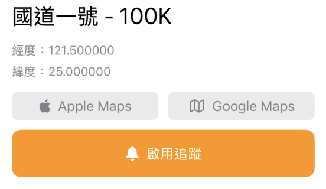

# 前言

今天要來完成的是地理圍欄(Geofencing)功能，讓使用者可以針對選定的里程位置訂閱通知，當進入/離開該區域時，會收到推播通知。

關於在 LoactionManager 裡面實作有關包含定位權限、通知權限以及建立與監控 Geofencing 的邏輯，我們在 Day 11 時已經有相當程度的介紹了，因此今天主要是將 UI 建立好，並串接以上的邏輯，而重點會放在「如何管理追蹤狀態」這件事情上，我們等等進一步談這部分。

# UI

昨天在 PinDetailSheet 裡面加上了 Apple Maps 與 Google Maps 的按鈕，現在我們要加上讓使用者控制啟用追蹤的按鈕：

```swift
struct PinDetailSheet: View {
    // ...
    let isTracking: Bool // 判斷是否正在追蹤
    let onToggleTracking: () -> Void // 點擊追蹤按鈕後執行的邏輯
    // ...

    var body: some View {

            // ...

        VStack(spacing: 12) {
            HStack(spacing: 12) {
                // Apple Maps Button
                // Google Maps Button
            }
            Button(action: onToggleTracking) {
                HStack {
                    Image(systemName: isTracking ? "bell.slash.fill" : "bell.fill")
                    Text(isTracking ? "取消追蹤" : "啟用追蹤")
                }
                .frame(maxWidth: .infinity)
                .padding(.vertical, 4)
            }
            .buttonStyle(.borderedProminent)
            .tint(isTracking ? .red : .orange)
            .controlSize(.large)
        }
    }
    .padding(EdgeInsets(top: 12, leading: 16, bottom: 20, trailing: 16))
}
```



# 追蹤邏輯

## 消失在空間中的 geofence

在我們 Day 11 中所實作的追蹤功能，會遭遇到一個問題是，在 App 設定追蹤地點後，此時若關閉 App，再次打開後並無法取得關閉前追蹤的點，因為 UI 所綁定的狀態（追蹤狀態）是存在記憶體裡的，當你 App 關閉後重啟，這些資訊將不存在，所以對使用者而言，他「看不出來」現在正在追蹤某個地點。

然而，iOS 的 geofence 區域會在系統層級持久化儲存。也就是說，若該地點未經使用者主動清除（或是移除 App），該地點會持續被記錄在系統層級。也就是說，當使用者再次開啟 App，這些追蹤會持續被監控，並且在進入區域時發出通知，但使用者從 UI 上並無法得知自己正在追蹤哪個地點，也無從取消。

## 保持追蹤狀態的持久化

因此最佳實踐應該是，將追蹤的地理區域資訊持久化儲存在本地（例如 UserDefaults）。這樣即使 app 被關閉，重啟後也能讀取這些持久化資料，更新 UI 告訴使用者目前正在追蹤的地點。

```swift
import Foundation

struct PersistenceManager {
    private static let userDefaults = UserDefaults.standard
    private static let trackedPinKey = "trackedPinKey"

    /// 儲存正在追蹤的 Pin
    static func saveTrackedPin(_ pin: MarkerPin) {
        do {
            let encoder = JSONEncoder()
            let data = try encoder.encode(pin)
            userDefaults.set(data, forKey: trackedPinKey)
        } catch {
            print("無法將 tracked pin 編碼: \(error)")
        }
    }

    /// 讀取已儲存的 Pin
    static func loadTrackedPin() -> MarkerPin? {
        guard let data = userDefaults.data(forKey: trackedPinKey) else {
            return nil
        }
        do {
            let decoder = JSONDecoder()
            let pin = try decoder.decode(MarkerPin.self, from: data)
            return pin
        } catch {
            print("無法將 tracked pin 解碼: \(error)")
            return nil
        }
    }

    /// 清除已儲存的 Pin
    static func clearTrackedPin() {
        userDefaults.removeObject(forKey: trackedPinKey)
    }
}
```

這裡 Xcode 會發出警告 Instance method 'encode' requires that 'MarkerPin' conform to 'Encodable'，因為 UserDefaults 只能儲存一些基本的 data type，參照官方文件說明為：

>A default object must be a property list—that is, an instance of (or for collections, a combination of instances of) NSData, NSString, NSNumber, NSDate, NSArray, or NSDictionary. If you want to store any other type of object, you should typically archive it to create an instance of NSData.

而 `MarkerPin` 是一個我們自訂的 struct，必須要轉成 NSData 來儲存，而 `MarkerPin` 就必須遵循 Codable 協議。因此，我們要回頭修改 `MakerPin`。

