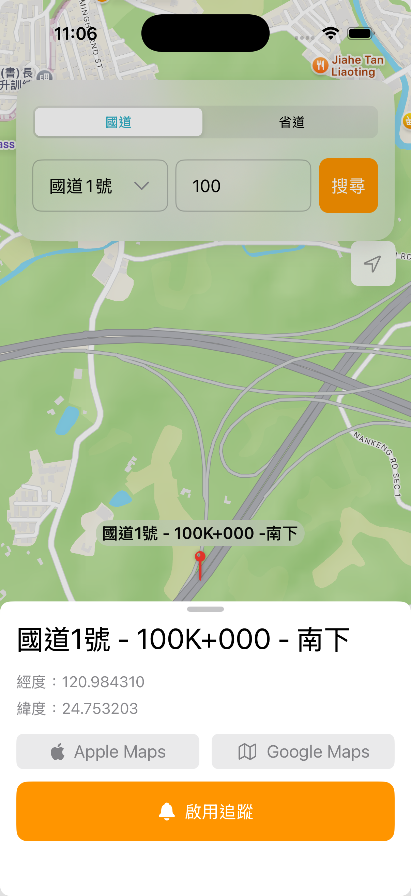
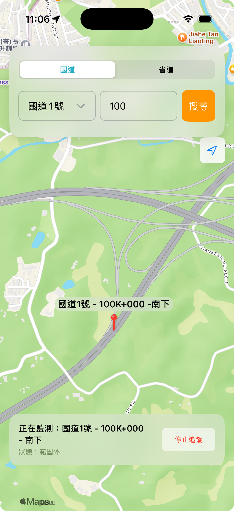

# 前言

今天要來完成的是地理圍欄(Geofencing)功能，讓使用者可以針對選定的里程位置訂閱通知，當進入/離開該區域時，會收到推播通知。

關於在 LoactionManager 裡面實作有關包含定位權限、通知權限以及建立與監控 Geofencing 的邏輯，我們在 Day 11 時已經有相當程度的介紹了，因此今天主要是將 UI 建立好，並串接以上的邏輯，而重點會放在「如何管理追蹤狀態」這件事情上，我們等等進一步談這部分。

# 新增啟用追蹤按鈕

昨天在 PinDetailSheet 裡面加上了 Apple Maps 與 Google Maps 的按鈕，現在我們要加上讓使用者控制啟用追蹤的按鈕：

```swift
struct PinDetailSheet: View {
    // ...
    let isTracking: Bool // 判斷是否正在追蹤
    let onToggleTracking: () -> Void // 點擊追蹤按鈕後執行的邏輯
    // ...

    var body: some View {

            // ...

        VStack(spacing: 12) {
            HStack(spacing: 12) {
                // Apple Maps Button
                // Google Maps Button
            }
            Button(action: onToggleTracking) {
                HStack {
                    Image(systemName: isTracking ? "bell.slash.fill" : "bell.fill")
                    Text(isTracking ? "取消追蹤" : "啟用追蹤")
                }
                .frame(maxWidth: .infinity)
                .padding(.vertical, 4)
            }
            .buttonStyle(.borderedProminent)
            .tint(isTracking ? .red : .orange)
            .controlSize(.large)
        }
    }
    .padding(EdgeInsets(top: 12, leading: 16, bottom: 20, trailing: 16))
}
```



# 追蹤邏輯

## 消失在空間中的 geofence

在我們 Day 11 中所實作的追蹤功能，會遭遇到一個問題是，在 App 設定追蹤地點後，此時若關閉 App，再次打開後並無法取得關閉前追蹤的點，因為 UI 所綁定的狀態（追蹤狀態）是存在記憶體裡的，當你 App 關閉後重啟，這些資訊將不存在，所以對使用者而言，他「看不出來」現在正在追蹤某個地點。

然而，iOS 的 geofence 區域會在系統層級持久化儲存。也就是說，若該地點未經使用者主動清除（或是移除 App），該地點會持續被記錄在系統層級。也就是說，當使用者再次開啟 App，這些追蹤會持續被監控，並且在進入區域時發出通知，但使用者從 UI 上並無法得知自己正在追蹤哪個地點，也無從取消。

## 保持追蹤狀態的持久化

因此最佳實踐應該是，將追蹤的地理區域資訊持久化儲存在本地（例如 UserDefaults）。這樣即使 app 被關閉，重啟後也能讀取這些持久化資料，更新 UI 告訴使用者目前正在追蹤的地點。

### 建立管理 UserDefault 的 manager

```swift
import Foundation

struct PersistenceManager {
    private static let userDefaults = UserDefaults.standard
    private static let trackedPinKey = "trackedPinKey"

    /// 儲存正在追蹤的 Pin
    static func saveTrackedPin(_ pin: MarkerPin) {
        do {
            let encoder = JSONEncoder()
            let data = try encoder.encode(pin)
            userDefaults.set(data, forKey: trackedPinKey)
        } catch {
            print("無法將 tracked pin 編碼: \(error)")
        }
    }

    /// 讀取已儲存的 Pin
    static func loadTrackedPin() -> MarkerPin? {
        guard let data = userDefaults.data(forKey: trackedPinKey) else {
            return nil
        }
        do {
            let decoder = JSONDecoder()
            let pin = try decoder.decode(MarkerPin.self, from: data)
            return pin
        } catch {
            print("無法將 tracked pin 解碼: \(error)")
            return nil
        }
    }

    /// 清除已儲存的 Pin
    static func clearTrackedPin() {
        userDefaults.removeObject(forKey: trackedPinKey)
    }
}
```

這裡 Xcode 會發出警告 Instance method 'encode' requires that 'MarkerPin' conform to 'Encodable'，因為 UserDefaults 只能儲存一些基本的 data type，參照官方文件說明為：

>A default object must be a property list—that is, an instance of (or for collections, a combination of instances of) NSData, NSString, NSNumber, NSDate, NSArray, or NSDictionary. If you want to store any other type of object, you should typically archive it to create an instance of NSData.

而 `MarkerPin` 是一個我們自訂的 struct，必須要轉成 NSData 來儲存，而 `MarkerPin` 就必須遵循 Codable 協議。因此，我們要回頭修改 `MakerPin`。

### 修改 MarkerPin 以遵循 Codable 協議

```swift
struct MarkerPin: Identifiable, Equatable {
    let id = UUID()
    let roadNumber: String
    let title: String
    let coordinate: CLLocationCoordinate2D

    static func == (lhs: MarkerPin, rhs: MarkerPin) -> Bool {
        lhs.id == rhs.id
    }
}
```

這是我們現在的 `MarkerPin`，而當你遵循 Codable 後，編譯器會跳出警告：

>Cannot automatically synthesize 'Decodable' because 'CLLocationCoordinate2D' does not conform to 'Decodable'

因為 `CLLocationCoordinate2D` 是內建的 sturct，預設不支援 Codable，故我們需要自己定義一個 struct 來遵循。

```swift
struct CodableCoordinate: Codable {
    let latitude: CLLocationDegrees
    let longitude: CLLocationDegrees

    init(coordinate: CLLocationCoordinate2D) {
        self.latitude = coordinate.latitude
        self.longitude = coordinate.longitude
    }

    var coordinate: CLLocationCoordinate2D {
        CLLocationCoordinate2D(latitude: latitude, longitude: longitude)
    }
}
```

前面提到，UserDefaults 只能存 String/Number/Data 等簡單型別，CLLocationCoordinate2D 沒有遵循 Codable，不能直接存。於是用 CodableCoordinate 裝兩個 Double，latitude、longitude。

但現在外部使用 `MarkerPin` 時取用 coordinate 時，為了避免因為型別更改而需更改取用方式，我們宣告 `coordinate` 這個計算屬性，把可編碼的經緯度數值還原成 Core Location 的座標型別，讓外部仍用 `CLLocationCoordinate2D` 存取。

>CodableCoordinate 之所以能遵循 Codable，是因為它「實際儲存的成員」只有兩個可編碼的基礎型別 Double（CLLocationDegrees 本質上是 Double），雖然它對外提供了一個方便取用的 CLLocationCoordinate2D 計算屬性，但那不是它的儲存屬性，因此不影響遵循 Codable。

```swift
struct MarkerPin: Identifiable, Codable {
    var id: String { "\(roadNumber)|\(title)|\(direction)" }
    let roadNumber: String
    let title: String
    private let _coordinate: CodableCoordinate

    var coordinate: CLLocationCoordinate2D {
        _coordinate.coordinate
    }

    init(roadNumber: String, title: String, coordinate: CLLocationCoordinate2D) {
        self.roadNumber = roadNumber
        self.title = title
        self._coordinate = CodableCoordinate(coordinate: coordinate)
    }
}
```

`MarkerPin` 的對外 init 收的 coordinate 參數仍然是 `CLLocationCoordinate2D` 型別，但為了可編碼，真正存起來的是 CodableCoordinate，所以在 init 裡做一次轉換為內部私有儲存屬性 `_coordinate`。另外，因為接下來會用 id 來判斷儲存在 UserDefault 裡的圖標與使用者點選的圖標，而不在是用兩個物件的比較，因此移除遵循 Equatable 協定及其必須實作的函式。

另外，這裡可以注意到，我將 id 從 UUID 改為 String { "\(roadNumber)|\(title)|\(direction)" }，理由是我發現每次重啟後，重新從 CSV 產生資料時都會重新生成新的 UUID，導致同一地點在 SwiftUI 看起來變成不同的元素，進而影響後續 id 判斷。故這裡改為用道路名稱 + 牌面資訊 + 方向作為唯一識別，這三個組合應該是不會有重複組合。

>因此，所以我也另外在圖標資訊上顯示了方向性（順向、逆向、雙向、南下或北上），而搜尋結果回傳哪個方向，目前是取與使用者輸入距離最接近位置的牌面，但這樣還要修改許多邏輯與介面，之後有機會再進一步拓展讓使用者自行選擇方向的功能。

### MapView 讀取並回復追蹤地點

接著我們便可以回到 MapView，

```swift
struct MapView: View {
    // ...
    @State private var trackingPin: MarkerPin? = nil

    // ...

    var body: some View {
        ZStack(alignment: .top) {
            // ...
        }
        .onAppear(perform: {
            dataManager.loadData()
            restoreTrackingState()
        })
        .sheet(item: $selectedPin) { pin in
            PinDetailSheet(
                pin: pin,
                isTracking: pin.id == trackingPin?.id,
                onToggleTracking: {
                    if trackingPin?.id == pin.id {
                        // --- 停止追蹤 ---
                        locationManager.stopAllGeofencing()
                        trackingPin = nil
                        PersistenceManager.clearTrackedPin() // 清除 UserDefaults
                    } else {
                        // --- 開始追蹤 ---
                        trackingPin = pin
                        locationManager.startGeofencing(
                            latitude: pin.coordinate.latitude,
                            longitude: pin.coordinate.longitude,
                            roadNumber: pin.roadNumber,
                            title: pin.title
                        )
                        PersistenceManager.saveTrackedPin(pin) // 儲存到 UserDefaults
                    }
                },
                // ..
            )
            // ..
        }
    }
    private func restoreTrackingState() {
        if let savedPin = PersistenceManager.loadTrackedPin() {
            self.trackingPin = savedPin

            showOnMap(
                roadNumber: savedPin.roadNumber,
                title: savedPin.title,
                direction: savedPin.direction,
                coordinate: savedPin.coordinate
            )
            locationManager.checkInitialGeofenceState()
        }
    }
}
```

另外，我們還需要一個狀態卡片，在地圖上持續顯示，這樣使用者會知道正在啟用某個地點的追蹤。這個卡片需要再整個地圖的最上層顯示，因此使用 `.overlay` 是一個好選擇。

```swift
.overlay(alignment: .bottom) {
    if let tracked = trackingPin {
        HStack {
            VStack(alignment: .leading, spacing: 4) {
                Text("正在監測：\(tracked.roadNumber) - \(tracked.title) - \(tracked.direction)")
                    .font(.subheadline.weight(.semibold))

                Text(locationManager.isInGeofence ? "狀態：已進入範圍 ✅" : "狀態：範圍外")
                    .font(.caption)
                    .foregroundColor(locationManager.isInGeofence ? .green : .secondary)
            }
            Spacer()
            Button(role: .destructive) {
                locationManager.stopAllGeofencing()
                trackingPin = nil
                PersistenceManager.clearTrackedPin() // 清除 UserDefaults
            } label: {
                Text("停止追蹤")
                    .font(.caption)
                    .padding(.horizontal, 10)
                    .padding(.vertical, 6)
            }
            .buttonStyle(.bordered)
        }
        .padding()
        .background(.ultraThinMaterial, in: RoundedRectangle(cornerRadius: 16))
        .padding(.horizontal)
        .onTapGesture {
            withAnimation {
                cameraPosition = .region(
                    MKCoordinateRegion(
                        center: tracked.coordinate,
                        span: MKCoordinateSpan(latitudeDelta: 0.01, longitudeDelta: 0.01)
                    )
                )
                showOnMap(roadNumber: tracked.roadNumber, title: tracked.title, direction: tracked.direction, coordinate: tracked.coordinate)
            }
        }
    }
}
```



1. App 啟動時

MapView 的 .onAppear 被觸發，從 UserDefaults 讀取並解碼之前儲存的 MarkerPin 資料。如果成功讀取，就設置 trackingPin，並顯示在地圖上，並於 LocationManager 檢查是否在監控某個區域。

2. 開始追蹤:

當使用者點擊啟用追蹤按鈕。trackingPin 狀態被更新為新的地點，先清除所有舊的監控，再啟動新的監控，並將新的 trackingPin 物件編碼成 JSON Data，並存入 UserDefaults。

3. 停止追蹤:

當使用者點擊取消追蹤（或 overlay 的停止追蹤）按鈕，清除所有地理圍欄監控，並且從 UserDefaults 中移除追蹤紀錄。

# 本日小結

今天完成了地理圍欄追蹤的 UI，並將追蹤按鈕接上邏輯，把追蹤中的地點以本地持久化保存，解決了 geofence 會持續監控、但 UI 狀態在重啟後「消失」的落差問題，讓重啟 App 也能正確顯示與控制目前的追蹤地點狀態。明天再來著手進行測試！
