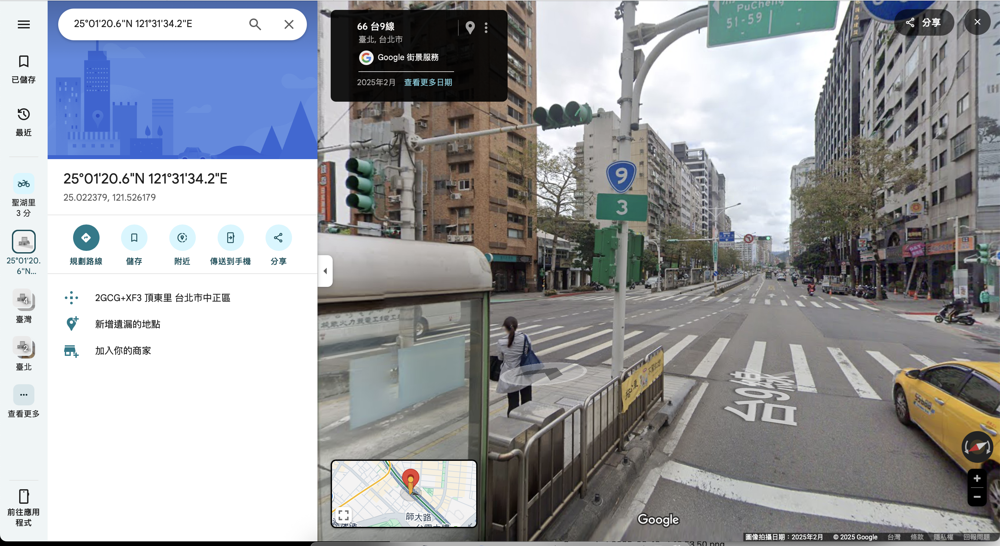
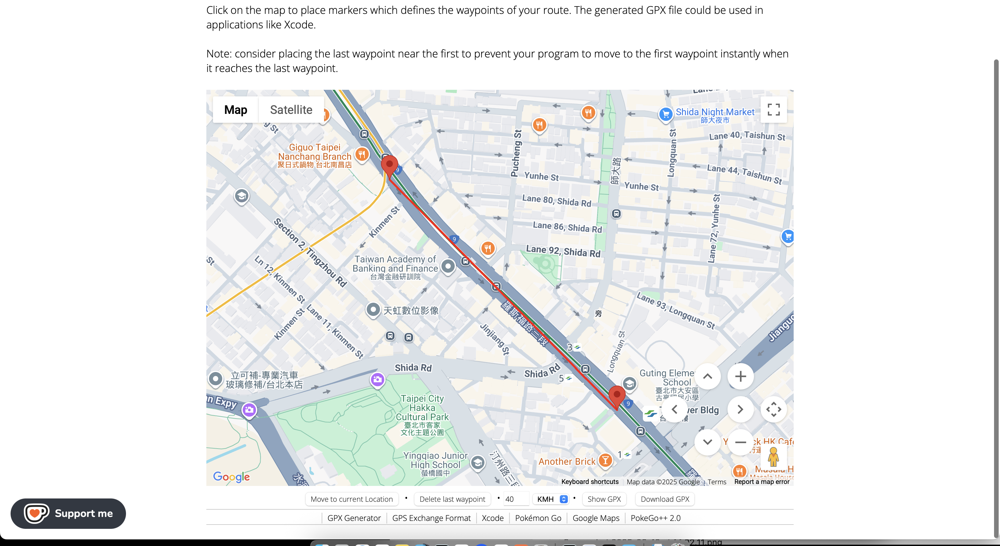
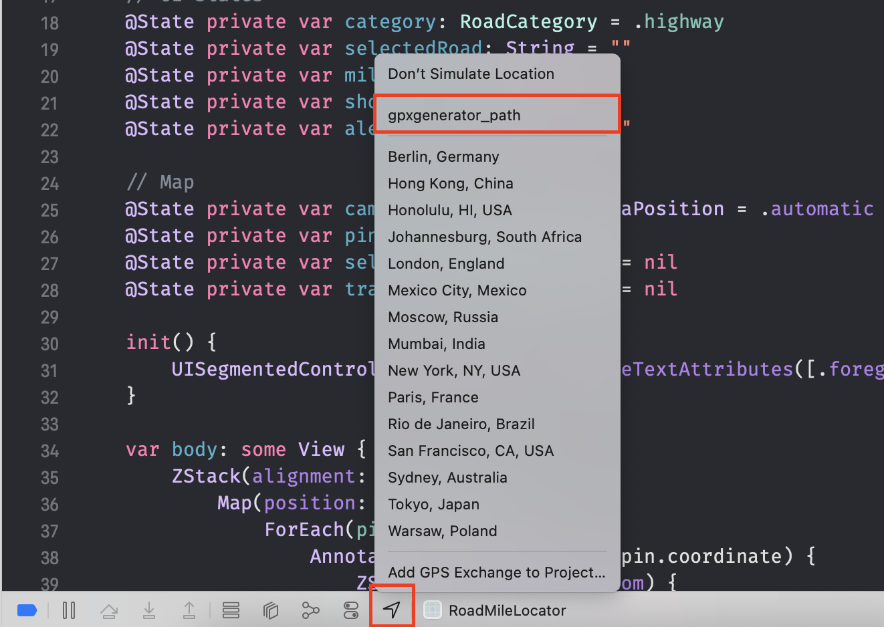
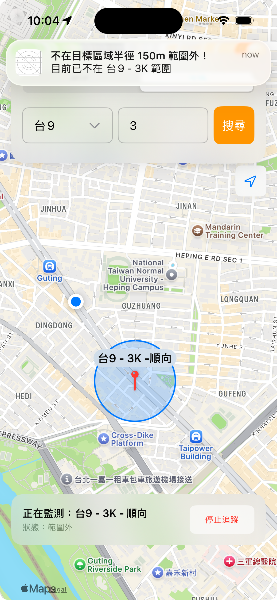
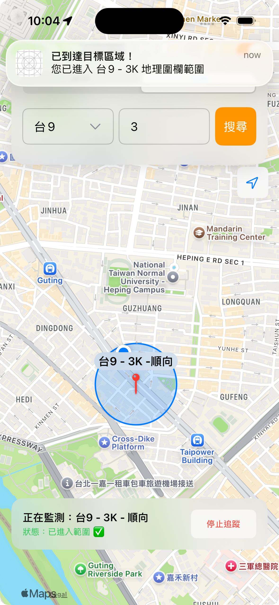
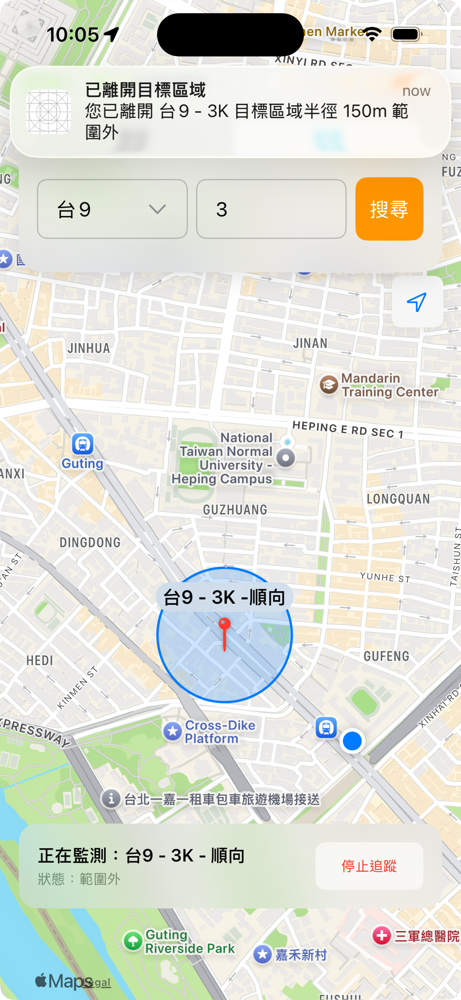
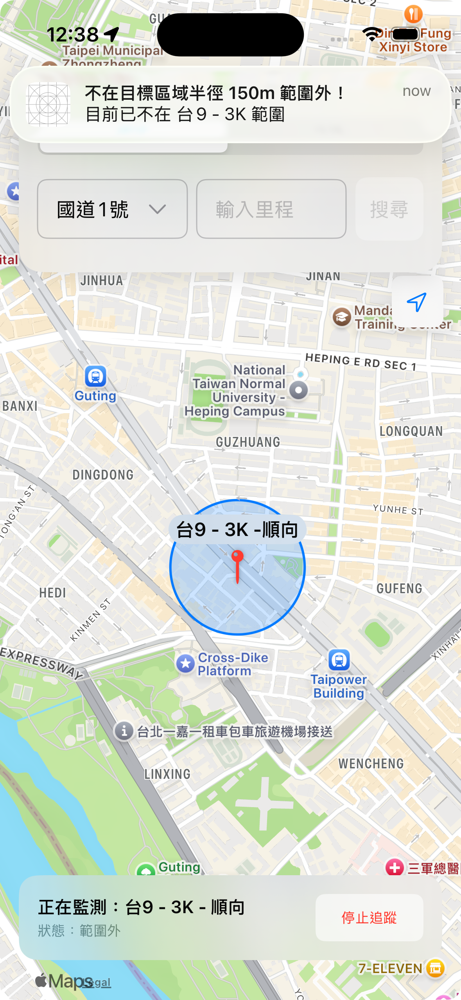

# 前言

首先簡要回顧前幾天的進度：

- Day 11：我們實作了地理圍欄的核心功能，讓 App 能夠在用戶進入或離開特定區域時觸發事件 。

- Day 21 & 22：我們優化了地圖互動，實現了點擊圖釘後彈出詳細資訊視窗（Sheet），並加入了跳轉至 Apple Maps 或 Google Maps 的功能 。

- Day 23：我們導入了 UserDefaults 和 Codable，實現了追蹤狀態的持久化。現在 App 即使關閉重啟，也能記得正在追蹤的地點 。

但程式碼跑起來是一回事，但在真實世界中是否可運作又是另一回事，所以今天的核心任務是驗證。我們將設計一系列的測試情境，徹底檢驗地理圍欄通知的穩定性與準確性，並記錄測試過程與結果。

# 測試準備

## 使用 GPX 檔案進行定位模擬

### 新增 GPX 檔案

為了確保測試的準確性與可重複性，我們需要一個可靠的方法來模擬使用者的移動。在 Day 11 測試地理圍欄功能時，我們是透過直接修改模擬器定位座標的方式來進行，雖然可行，但操作上較為繁瑣且不易模擬連續的路徑。今天我們將採用另一種方式，那就是在 Xcode 專案中匯入 GPX 檔案，用它來模擬「進入區域」與「離開區域」的完整行為。

GPX（GPS Exchange Format）是一種標準的 XML 格式，可以用來記錄 GPS 座標點。你可以在 Xcode 裡面直接新增一個 GPX 檔案，Xcode 會提供一個標出蘋果總部的座標預設的模板。

```xml
<?xml version="1.0"?>
<gpx version="1.1" creator="Xcode">

    <!--
     Provide one or more waypoints containing a latitude/longitude pair. If you provide one
     waypoint, Xcode will simulate that specific location. If you provide multiple waypoints,
     Xcode will simulate a route visiting each waypoint.
     -->
    <wpt lat="37.331705" lon="-122.030237">
        <name>Cupertino</name>

        <!--
         Optionally provide a time element for each waypoint. Xcode will interpolate movement
         at a rate of speed based on the time elapsed between each waypoint. If you do not provide
         a time element, then Xcode will use a fixed rate of speed.

         Waypoints must be sorted by time in ascending order.
         -->
        <time>2014-09-24T14:55:37Z</time>
    </wpt>

</gpx>
```

這個模板讓我們可以直接修改 `<wpt>` 標籤中的 lat 和 lon數值，將其變更為我們需要的任何地點。不過，若要模擬一條完整的路線，手動輸入每個路徑點的座標顯然不切實際。因此，這裡我們不打算自己逐點加入，而是借助第三方工具來更快速地產出包含連續路徑的 GPX 檔案。

我們的第一步，是先找出要追蹤的目標定位點。例如，我們先利用自己的 App 搜尋功能，找出「台 9 線 3k」這個里程標的位置，為了確保座標的準確性，我們再使用 Google Map 進行二次確認。



接著，開啟[Gpxgenerator](https://www.gpxgenerator.com)這個網站，它允許我們在地圖上點擊來建立路徑點（waypoint）。我們可以在目標定位點的前後各新增一個路徑點，藉此模擬一段行駛車輛從遠方接近、穿越目標、再逐漸遠離的完整行徑路線。



該網站下方還提供了模擬速度的選項，我們可以選定一個適當的速度，然後點選 Download GPX 按鈕。下載完成後，只需將這個檔案拖曳並加入到我們的 Xcode 專案中即可。其內容會類似下方這樣，包含了兩個帶有時間戳的座標點，Xcode 將依此模擬出平滑的移動過程。

```xml
<?xml version="1.0"?>
<gpx version="1.1" creator="gpxgenerator.com">
<wpt lat="25.025477270953566" lon="121.52352028106334">
    <ele>5.73</ele>
    <time>2025-09-03T04:38:08Z</time>
</wpt>
<wpt lat="25.01633861688097" lon="121.53257541869762">
    <ele>7.59</ele>
    <time>2025-09-03T04:39:46Z</time>
</wpt>
</gpx>
```

### 新增視覺輔助元素

為了讓測試過程中的判斷更加直觀，我們需要在地圖上增加兩個重要的視覺元素。

首先是使用者位置的指示。目前我們的地圖在模擬移動時，並不會持續顯示代表使用者的藍點，如此一來將很難從 UI 上判斷使用者是否已經進入了我們設定的地理圍欄範圍。為此，我們在 Map 元件中簡單地加入 UserAnnotation()，這個內建的元件就能夠在地圖上持續顯示使用者當前的模擬位置。

```swift
Map(position: $cameraPosition) {
    ForEach(pins) { pin in
        Annotation("", coordinate: pin.coordinate) {
            // ...
            }
            // ...
        }
    }
    UserAnnotation() // 新增使用者位置指示
```

同理，我們的地理圍欄預設追蹤範圍是以圖標為中心、半徑 150 公尺的圓形區域。為了讓這個範圍在視覺上清晰可見，我們可以在地圖上為這個範圍加上一圈半透明的圖層。這樣一來，使用者是否在範圍內便能一目了然。我們透過在 Map 中加入一段條件判斷程式碼來實現這個效果。

```swift
if let tracked = trackingPin {
    MapCircle(
        center: tracked.coordinate,
        radius: 150
    )
    .foregroundStyle(.blue.opacity(0.2))
    .stroke(.blue, lineWidth: 2)
}
```

這段程式碼會在 trackingPin 有值（即正在追蹤）時，繪製出一個藍色半透明的圓形，其中心和半徑與我們的地理圍欄設定相同。

### 使用 GPX 檔案以模擬移動路徑

前置作業完成後，我們運行 App 於模擬器上，搜尋並選擇追蹤「台 9 線 3k」這個地點。接著，點選 Xcode 視窗底部偵錯工具列的定位箭頭圖示，在彈出的清單中，我們可以看到剛剛加入專案的 GPX 檔案名稱，點選它。



此時，我們將會在模擬器的地圖上看到，代表使用者位置的藍點已經不再靜止，而是開始按照我們在 GPX 檔案中設定好的路徑開始移動了。整個過程清晰地展示了使用者從範圍外、進入範圍、再到離開範圍的完整流程。

1. 目標範圍外：藍點正朝著藍色圓圈移動，但尚未進入。



2. 目標範圍內：藍點已進入藍色圓圈，此時應觸發進入區域的通知。



3. 離開目標範圍：藍點穿越圓圈後繼續前行，並最終離開了藍色區域，此時應觸發離開區域的通知。



接下來，我們測試在 App 被完全關閉後，重新啟動時是否能夠正確地回復先前的追蹤狀態，並繼續監控地理圍欄。

4. 重啟 App



我們從模擬器的多工畫面中將 App 完全滑掉關閉。接著，我們再次點擊桌面圖示重新啟動 App。

正如預期的，App 重啟後，畫面上的藍色追蹤半徑圓圈和底部的追蹤資訊卡都正確被還原了。這證明了我們在 Day 23 實作的 restoreTrackingState() 函式發揮了作用。它在 App 啟動時成功地從 UserDefaults 讀取了先前儲存的 trackingPin 資訊，並重新設定了 UI 狀態。

# 本日小結

今天我們透過引入 GPX 檔案來模擬真實的移動路徑，並在地圖上增加了使用者位置指示器與追蹤半徑圓圈這兩個視覺輔助，對地理圍欄的各個核心功能進行了測試。從基本的進入、離開區域通知，到 App 關閉重啟後的狀態持久性驗證，測試結果皆符合我們的預期。

明天，我們將踏入自動化測試的領域，介紹如何使用蘋果原生的測試框架 XCTest，為我們的 App 建立自動化的防線。
