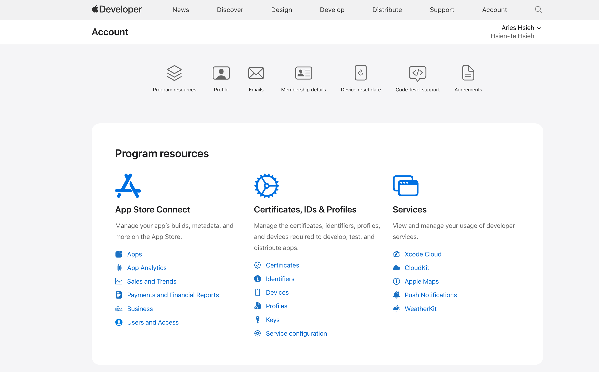
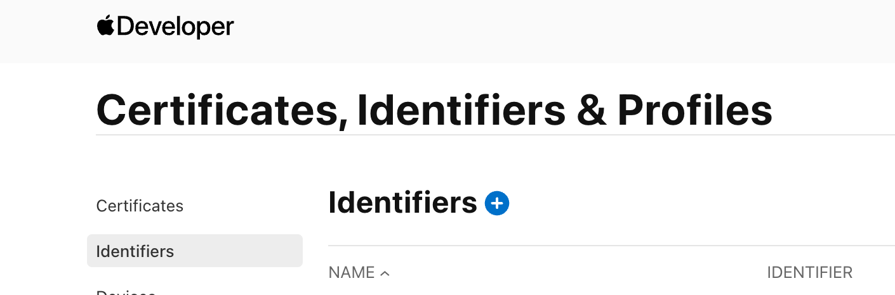
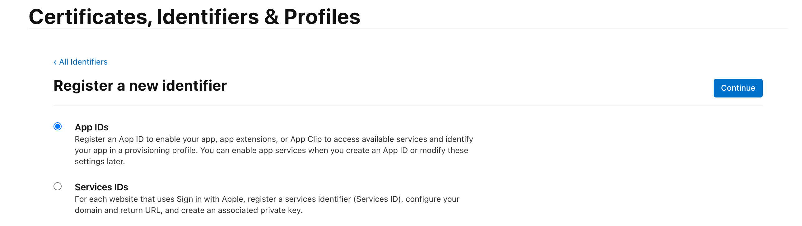
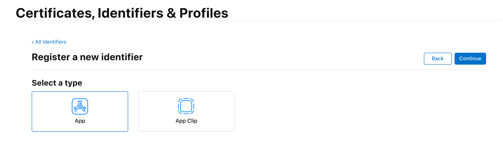
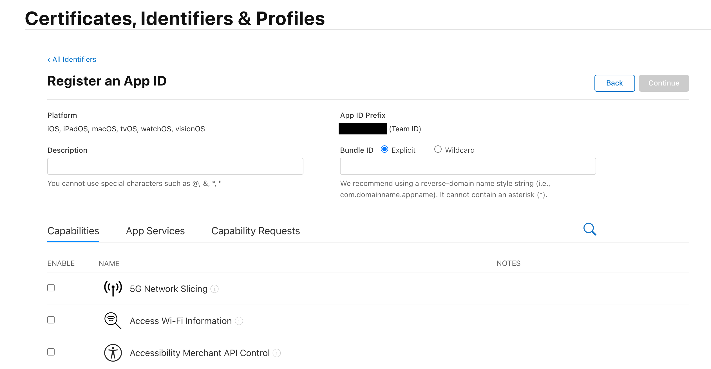
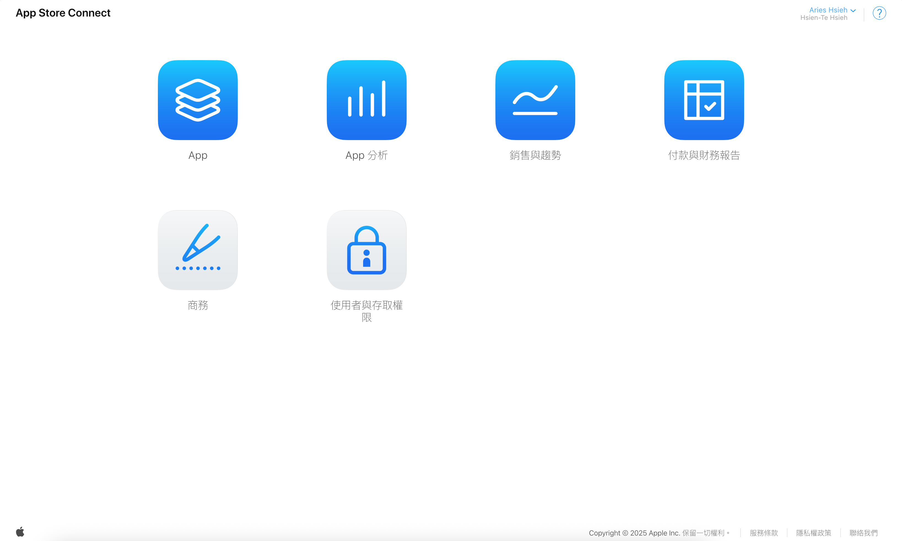
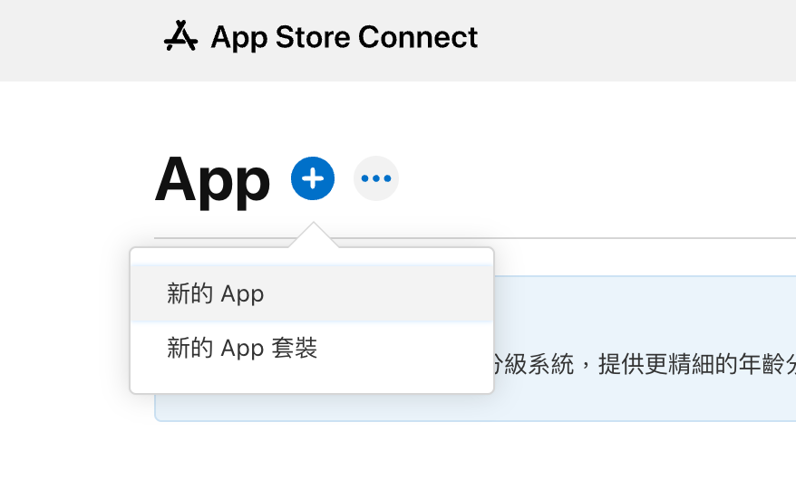
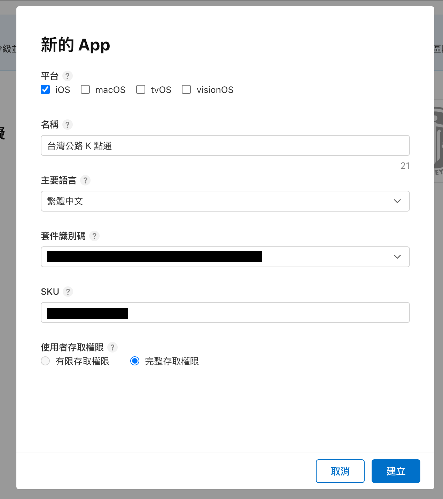
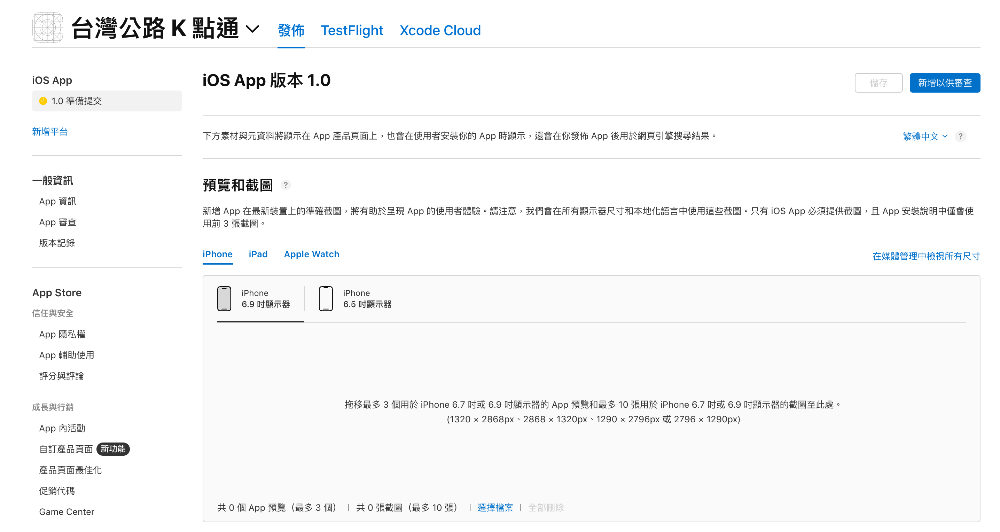

# 前言

時間來到了第 26 天，App「台灣公路 K 點通」(對，取名了XD) 核心功能已大致完成，是時候著手建立一套自動化的 CI/CD (持續整合/持續部署) 流程了。預想目標是，當推送一個新的 Git Tag 時，Azure DevOps 能自動幫我完成**測試、建置、簽署，並將 App 上傳到 App Store Connect**，以供後續提交審查。

但在開始處理 CI/CD 之前，有個前置作業必須先完成，那就是我們必須先在 Apple 的後台註冊我們的 App。

# CI/CD 無法無中生有

在我們的情境當中，CI/CD 工具的角色是更新部署一個**已經存在**的 App 紀錄。它們無法替我們決定 App 的名稱、定價、隱私權政策等需要人工決策的資訊。因此，我們必須先手動完成 App 的註冊與設定，CI/CD 的自動化流程才能接著運作。

整個前置作業分為兩步驟：
1.  在 Apple Developer 網站註冊 App ID
2.  在 App Store Connect 新增 App

---

## 步驟一：在 Apple Developer 網站註冊 App ID

App ID 是你的 App 在 Apple 生態系中獨一無二的識別碼，也稱之為**Bundle Identifier**。CI/CD 工具和 Xcode 都會用這個 ID 來識別你的專案。

1. 登入 Apple Developer 網站
   前往 `developer.apple.com`，使用你的開發者帳號登入。
   >當然，前提是你要有 Apple 的開發者帳號，年費 99 美元。至於如何註冊，這部分網路上的資訊很多，本系列文就不詳加贅述囉！

   

   找到 "Certificates, Identifiers & Profiles"。

2. 註冊新的 Identifier**
    - 在側邊欄選擇 "Identifiers"。

    

    點擊藍色的「+」號按鈕，準備新增。

    - 選擇 "App IDs" 並點擊 "Continue"。

    

    - 選擇類型為 "App" 並點擊 "Continue"。

    

4. 填寫 App ID 資訊
    -   **Description:** 給這個 ID 一個好記的描述，例如「K-Point Map App ID」。
    -   **Bundle ID:** 這是最關鍵的部分！選擇 "Explicit" (明確的)，並填寫你規劃好的 Bundle ID。它必須是全球唯一的，通常採用反向網域名稱格式 (reverse-domain name style)。

    -   **Capabilities:** 在下方列表中，勾選你的 App 會用到的所有功能。

    

5.  **確認並註冊**
    檢查所有資訊無誤後，點擊 "Continue"，然後再點擊 "Register"。

---

## 步驟二：在 App Store Connect 新增 App

接著，我到 App Store Connect 新增 App。這個步驟會建立 App 在 App Store 上的紀錄，並設定所有上架相關的元數據 (Metadata)。
1.  **登入 App Store Connect**
    前往 `appstoreconnect.apple.com`。

2.  **進入「我的 App」區塊**
    點擊 "My Apps" (我的 App)。

    

3.  **新增 App**
    -   點擊左上角的「+」號，選擇 "New App"。

    

4.  **填寫 App 的基本資料**

    

    這時會彈出一個視窗，要求你填寫：
    -   **平台 (Platforms):** 勾選 "iOS"。
    -   **名稱 (Name):** 這將是你的 App 在 App Store 上顯示的名稱。
    -   **主要語言 (Primary Language):** 選擇你的 App 主要使用的語言。
    -   **Bundle ID:** 點擊下拉選單，選擇我們**上一個步驟剛剛建立好的那個 App ID**。
    -   **SKU:** 一個你自己內部使用的產品編號，方便你管理，不會對外顯示。
    -   **使用者存取權:** 選擇完整存取權限。

5.  **建立 App 紀錄**

    

    點擊 "Create" 後，你就成功為你的 App 建立了一個「空殼」紀錄。你會被導到一個需要填寫更多資訊的頁面。

## 總結

到此為止，我們的 App 已經在 Apple 的生態系統中正式註冊了，也建立了它在 App Store 上的基本資料。
接著，我們下一篇文章就開始設定 Azure DevOps，讓 CI/CD 的自動化流程能順利地找到目標，並開始為我們上傳建置版本到 App Store Connect。
