## 前言

在上一篇文章中，我們完成了 iOS 專案的本地端準備工作。現在，我們將實際設定 Azure Pipelines，目標是讓專案能夠自動化建置並部署到 App Store Connect。

## 步驟一：Apple Connect 新增 API 金鑰

為了讓 Azure Pipelines 這類 CI/CD 工具能以自動化的方式將 App 上傳至 App Store Connect，我們必須先產生一組專用的 API 金鑰。這組金鑰將授權 Azure Pipelines 執行上傳等操作。

1. 首先登入 [App Store Connect](https://appstoreconnect.apple.com/) 帳號。

登入後，點擊進入「使用者與存取權限」區塊。


選取「使用者與存取權限」，並要求存取權限。

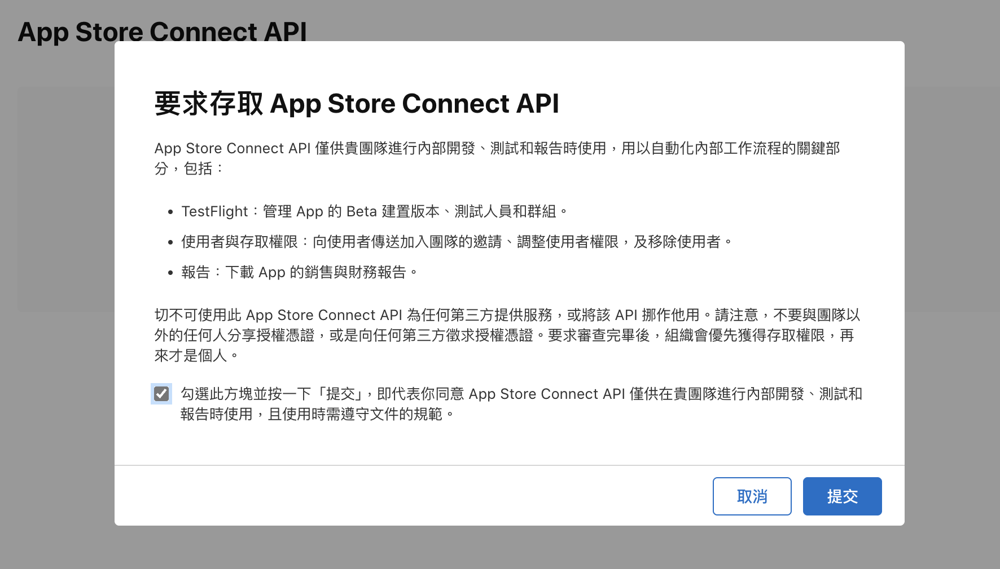

2. 接著，切換到「整合」頁籤，點擊「產生 API 金鑰」。

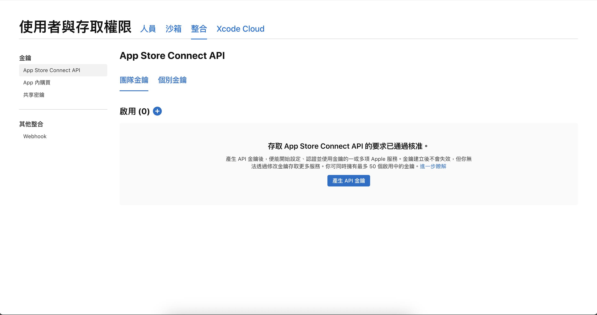


3. 為這組金鑰設定一個好辨識的名稱，並在「存取權限」欄位選擇「App 管理」。這個權限足以讓 Pipeline 執行建置、上傳與發布等任務。

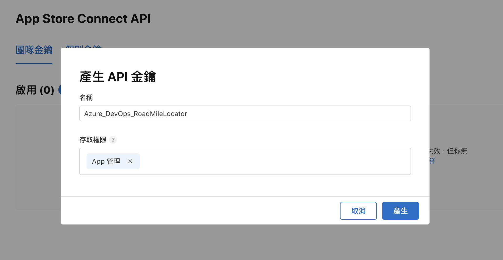

4. 金鑰產生後，請下載 .p8 檔案並妥善保存，因為它只能下載一次。同時，將頁面上的 Key ID 和 Issuer ID 記錄下來，這些資訊在後續設定中都會用到。

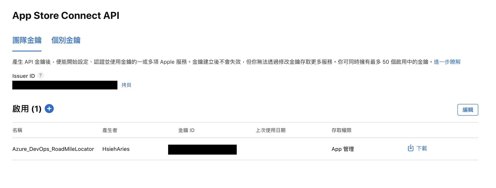


## 步驟二：Azure Pipelines Connection 設定

有了 Apple 提供的憑證後，接下來我們回到 Azure DevOps，設定 Pipeline 與 App Store Connect 之間的橋樑。

### Marketplace 安裝 Apple App Store 外掛

1. 登入 Azure DevOps 並進入專案，點擊頁面右上角的購物袋圖示，選擇「Browse marketplace」。

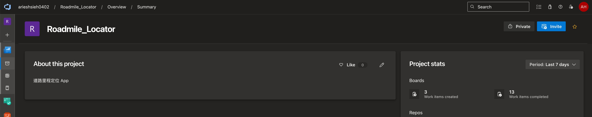

2. 在市集中搜尋「Apple App Store」，找到由 Microsoft 發布的官方外掛。

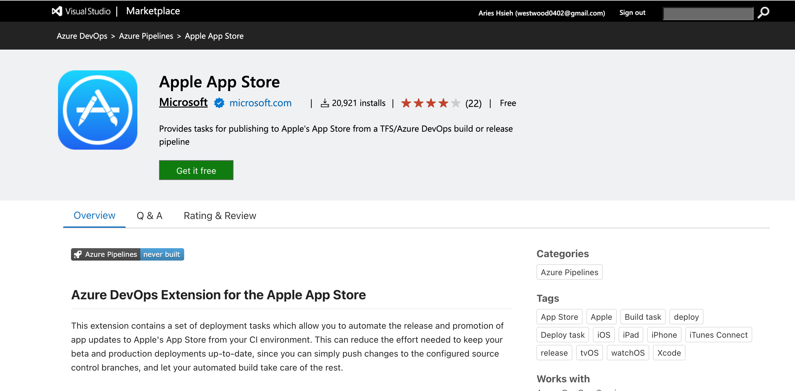

點擊「Get it free」並依照畫面指示完成安裝。此擴充功能提供了在 Pipeline 中與 App Store Connect 互動所需的任務（Task）。

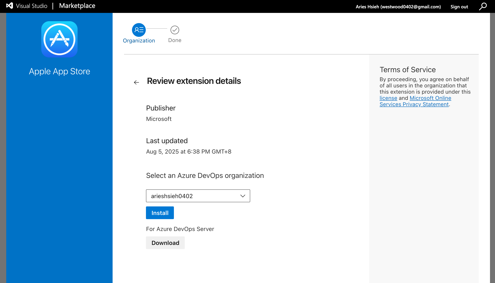

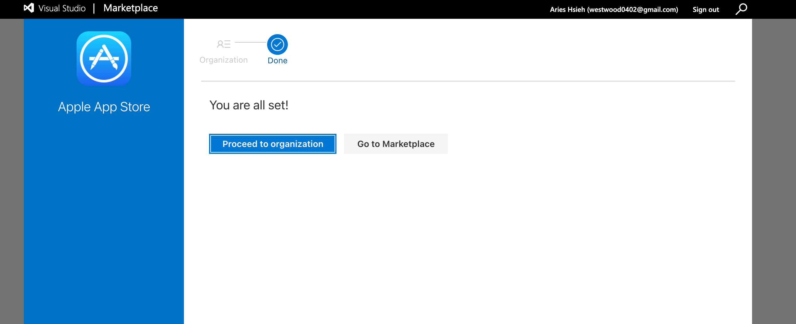

### 建立 Service Connection

1. 回到專案頁面，點擊左下角的「Project settings」（齒輪圖示），在側邊欄的 Pipeline 區塊中找到「Service connections」。

2. 點擊「Create Service Connection」，並在清單中選取我們剛剛安裝的「Apple App Store」。

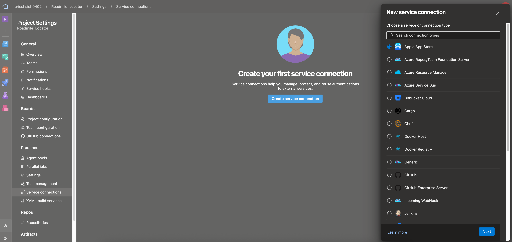

3. 接下來，填入先前在 App Store Connect 取得的資訊。將 .p8 金鑰檔的內容、Key ID 和 Issuer ID 依序填入對應欄位。由於我們的目標是發布到公開的 TestFlight 和 App Store，因此「In house deployment」選項請選擇 No。

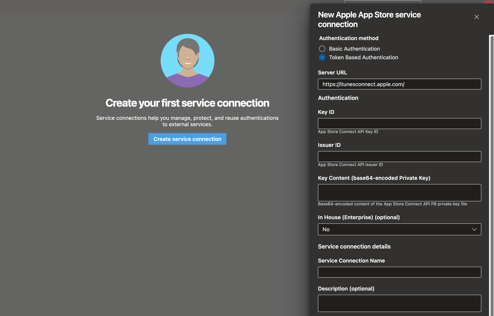

完成後儲存，這樣就成功建立了一個安全的服務連線。

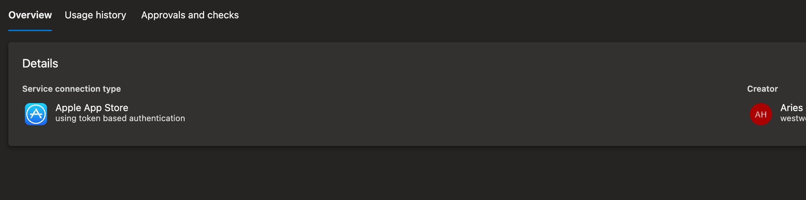

回到專案，點選左下角齒輪，側邊欄 Pipeline -> Service connections，點選 Create Service Connection，選取 Apple App Store。

## 步驟三：建立測試連線 pipeline

在撰寫完整的建置與部署腳本之前，建立一個簡單的 Pipeline 來測試連線是否成功。

### 撰寫 Pipeline YAML

Pipeline 的執行流程是由 YAML 檔案定義的。在專案新增一個專門存放 pipeline yaml 檔的 repo，並新增一個 test-connection.yaml 的檔案：

```yaml
pool:
  vmImage: 'macOS-13'

steps:
- script: echo "Fake IPA file" > fake.ipa
  displayName: '建立假 IPA 檔案'

- task: AppStoreRelease@1
  displayName: '測試 App Store 連線'
  inputs:
    serviceEndpoint: 'App Store Connect API'
    appIdentifier: 'com.example.app'
    releaseTrack: 'TestFlight'
    ipaPath: 'fake.ipa'

- script: echo "App Store 連線測試完成"
```

- pool: 指定要在 macOS-13 環境的虛擬機上執行。
- task: AppStoreRelease@1: 使用先前安裝的外掛所提供的任務，嘗試與 App Store Connect 進行通訊。
- serviceEndpoint: 指定要使用哪一個服務連線來進行驗證。

### 執行測試 Pipeline

1. 在左側欄選擇「Pipelines」，然後點擊「Create Pipeline」。

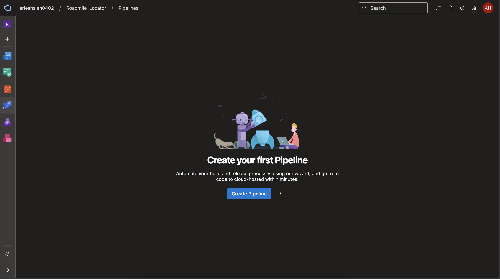

2. 由於 YAML 檔案存放在 Azure Repos Git 中，故選擇第一個選項。

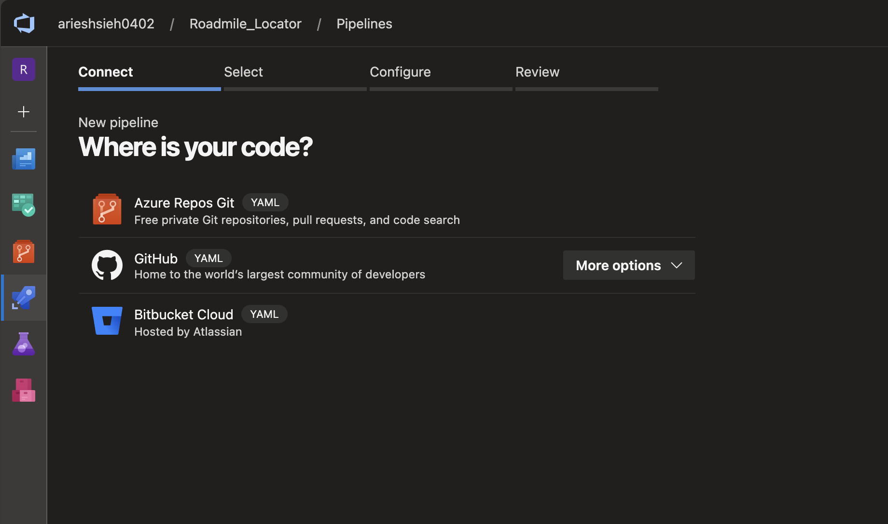

3. 選擇包含 test-connection.yaml 檔案的 repo。

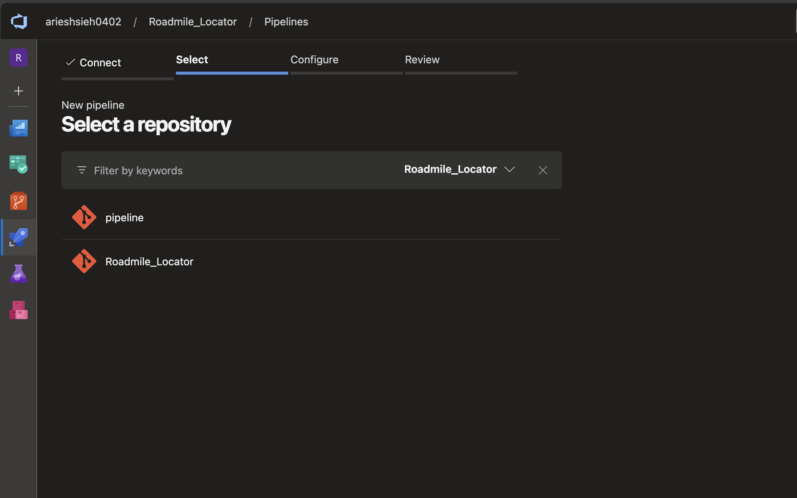

4. 選擇「Existing Azure Pipelines YAML file」，告訴系統我們要使用既有的設定檔。

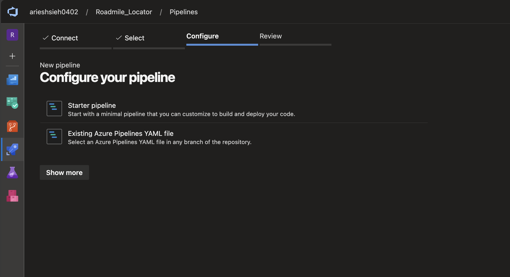

5. 指定 main 分支下的 test-connection.yaml 檔案，然後點擊「Continue」。

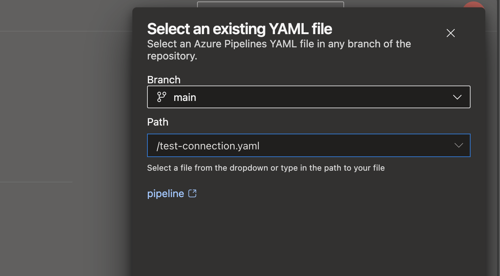

6. 最後，點擊「Run」開始執行。

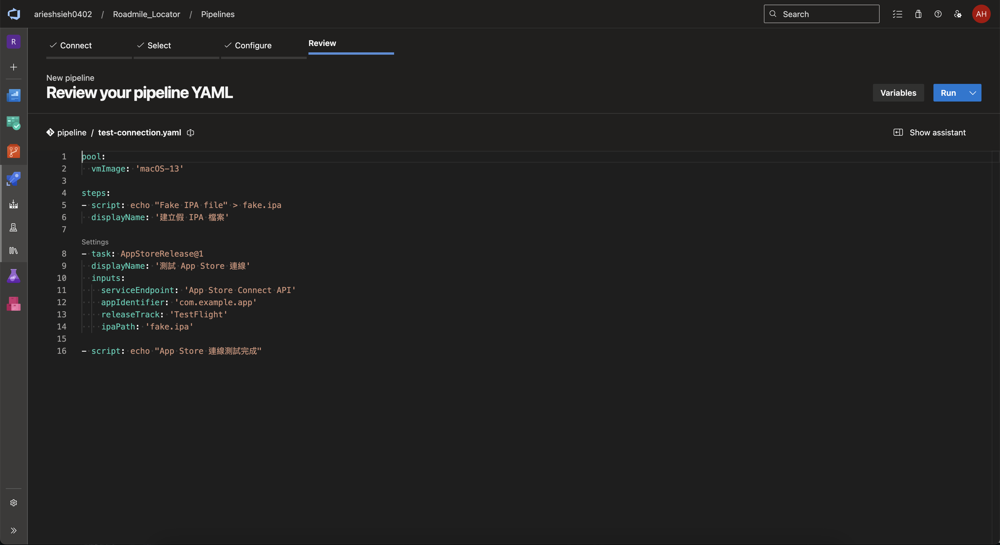

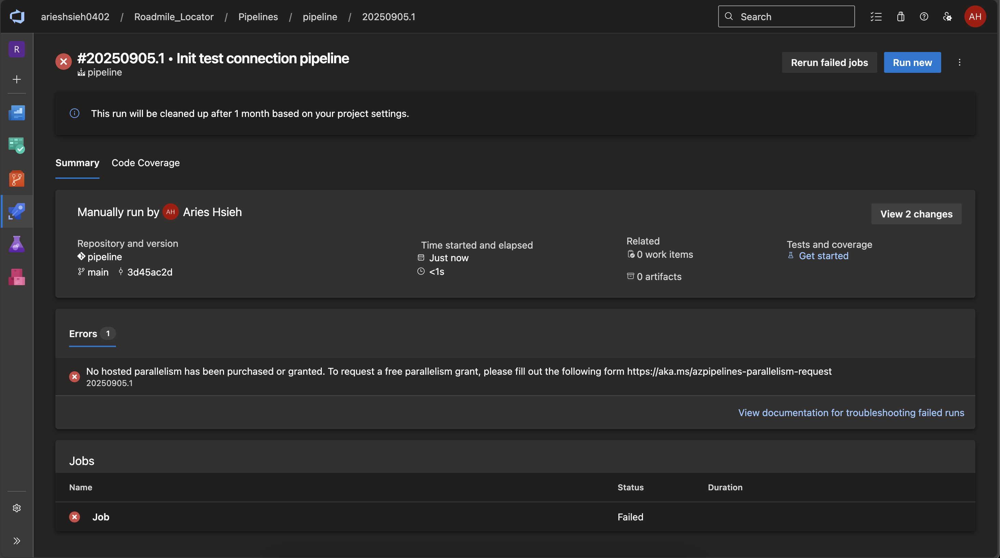

發生錯誤「No hosted parallelism has been purchased or granted」，去查了一下發現，現在 Azure 雖然免費帳號有每月 1800 分鐘的 pipeline 執行時間，但這個必須要填表單申請，詳解可以猜考前人文章。

> 參考資料：[iT 邦幫忙教學](https://ithelp.ithome.com.tw/articles/10268594)

---

經過漫長的等待，終於開通權限了！讓我們重新 run 一次 pipeline：


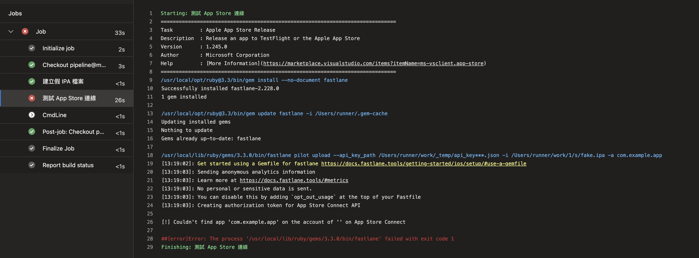

Log 中的 `Creating authorization token for App Store Connect API` 這一行顯示，Fastlane（Azure DevOps 在背景使用的工具）已經成功使用我們在 Service Connection 中設定的 API Key、Key ID 和 Issuer ID 來向蘋果的伺服器進行驗證並取得了授權 token，而因為我們的 appIdentifier 設定為不存在的 com.example.app，因此報錯 `[!] Couldn't find app 'com.example.app' on the account of '' on App Store Connect`，表示在我們的帳號下，找不到 Bundle Identifier 為 com.example.app 的應用程式。

## 本日小結

今天的執行結果達成了我們「測試連線」的目的，並證明了連線是通的。接著，我們就可以替 app 做最後的一些小修改，並且可以正式撰寫 pipeline，將 App 部署到 App Store Connect 上。
