## 為我們的 App 加上 logo

在我們開始寫我們的 pipeline 之前，我突然想到有一件很重要的事情，那就是為我們的 App 加上一個看起來很讚的 icon。App icon 是使用者在 App Store 的第一個接觸點，某種程度上算是決定使用者有沒有興趣的關鍵。

蘋果對 icon 的格式有明確的要求，必須是一個 1024x1024 像素、方形、無圓角、無透明度的 PNG 檔案。當你圖片檔拖入 Xcode 的 Assets.xcassets 中對應的 AppIcon 位置時，Xcode 會自動根據這個圖檔，生成所有需要的尺寸，以適應 iPhone、iPad、通知、Spotlight 搜尋、設定頁面等各種顯示情境。

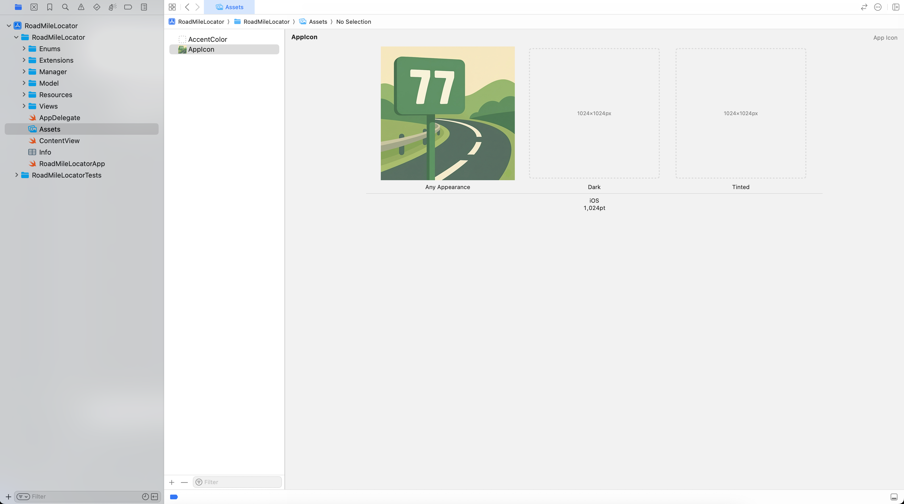

>你也可以按照亮色或暗色主題提供不同的 icon 樣式。

---

接著我們要進入一個十分重要的部分。

## 蘋果的 Code sign 機制

### 為什麼要有這個機制？

蘋果希望確保用戶從 App Store 下載或安裝的每一個 App，都來自於「已知的開發者」，且「未被竄改」。為了實現這個目標，蘋果建立了一套基於數位簽章的信任鏈。

為了達到這個目的，有以下幾個核心概念：

1. 開發者憑證 (Certificate)

可以把它憑證想像為蘋果官方頒發給開發者的身份證，用來證明「該開發者為該開發者本身」。它保證了 App 是由一個已知的、經過蘋果驗證的開發者所建立的。
而憑證又可區分為開發憑證與分發憑證：

- 開發憑證 (Development Certificate): 此張憑證讓開發者可以在自己的測試裝置上安裝和測試 App。
- 分發憑證 (Distribution Certificate): 只有用此憑證簽署的 App，才能上傳到 App Store。

2. App ID
每個 App 具有獨一無二的的全球唯一識別碼，用來特定 App。

3. 描述檔 (Provisioning Profile)

它像一張詳細的通行證，將上述所有資訊綁定在一起，代表了以下事情：

- 誰 (Who)：哪個開發者（憑證）可以簽署這個 App？

- 做什麼 (What)：這個 App（App ID）可以使用哪些服務（如推播通知、iCloud）？

- 在哪裡 (Where)：這個 App 可以在哪些裝置上運行？
    - 開發階段: 一個包含特定裝置 UDID 的列表。
    - 發布階段: App Store 的所有裝置。

當使用者嘗試在裝置上運行 App 時，iOS 會檢查描述檔，確認所有資訊都正確無誤後才能執行。

### 如何實現這個機制？我們該怎麼做？

現在我們了解了「為什麼」，接著來看「如何實現」。

- CSR (Certificate Signing Request)

你需要先在你的 Mac 的鑰匙圈存取 (Keychain Access) 中產生一個 CSR。這個過程會在您的 Mac 上創建一對公私鑰，並把包含公鑰的 CSR 給蘋果。

蘋果收到 CSR 後，會用他們的根憑證為你的公鑰簽章，並產出一份數位憑證 (.cer)。下載這個憑證並安裝到鑰匙圈後，它會自動與你本機的私鑰配對，往後只有您的這台 Mac 才能「簽署」App。

### 本機與 CI/CD 環境的差異

若單純在本機的 Xcode 編譯專案，產出 .ipa 檔並上傳到 App Store Connect，只要你在 Xcode 中勾選「Automatically manage signing」並登入 Apple ID，Xcode 會自動完成 CSR 生成、上傳、下載憑證、建立描述檔等所有繁瑣步驟。而因為是本機編譯，所有憑證和私鑰都存放在你開發 Mac 的鑰匙圈中隨時可用。

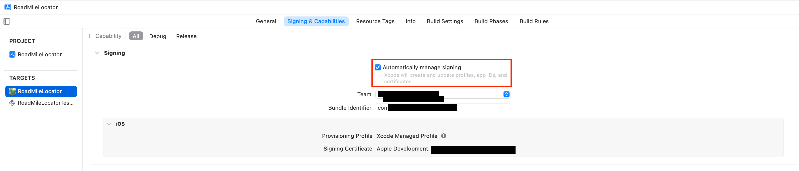

因此在 Xcode 中要上架 App，Xcode 幫你處理了所有這些繁雜工作，我們只要「Archive」和「Distribute」就好，十分單純。

然而，透過外部 CI/CD 工具的情況就大不相同了，

Azure Pipeline 的虛擬機是一個乾淨、無記憶的環境。它不知道你的 Apple ID，也沒有儲存您的私鑰。因此，Xcode 的「自動簽章」在這裡無法運作。

你必須手動告訴這個新環境如何完成簽章，包含：

1. 提供私鑰與憑證: 你必須從 Mac 中匯出包含私鑰的 .p12 檔案，並將存放在 Azure DevOps 的 Secure Files 中。

2. 提供描述檔: 你必須手動從 Apple Developer Portal 下載 App Store 用的 .mobileprovision 檔案，並同樣上傳到 Secure Files。

3. 在 Pipeline 中安裝: 在 YAML 檔案中，您需要使用一系列任務，在每次建置時將這些檔案安裝到虛擬機的臨時鑰匙圈中。

---

## 準備 Apple Code sign 相關檔案

### 產出 CSR 並匯入憑證

首先，打開你 Mac 上的「鑰匙圈存取(Keychain Access)」應用程式。檢查一下你的憑證列表，通常你會看到已有的開發憑證，但可能還沒有用於 App Store 上架的分發憑證。

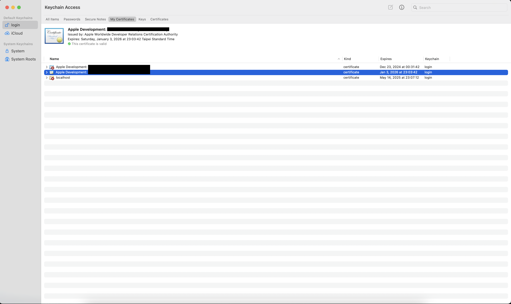

點擊螢幕左上角的選單列「Keychain Access」> 「Certificate Assistant」> 「Request a Certificate From a Certificate Authority...」

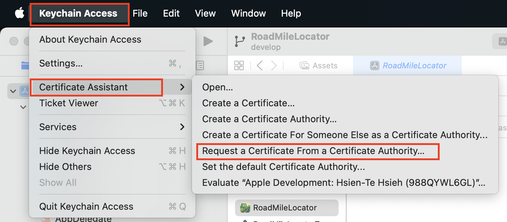

在彈出的視窗中，輸入你的 Email 和名字（建議與 Apple 開發者帳號一致），然後勾選「Saved to disk」選項，點擊 Continue。系統將會在你指定的位置產出一份 CSR 檔案。

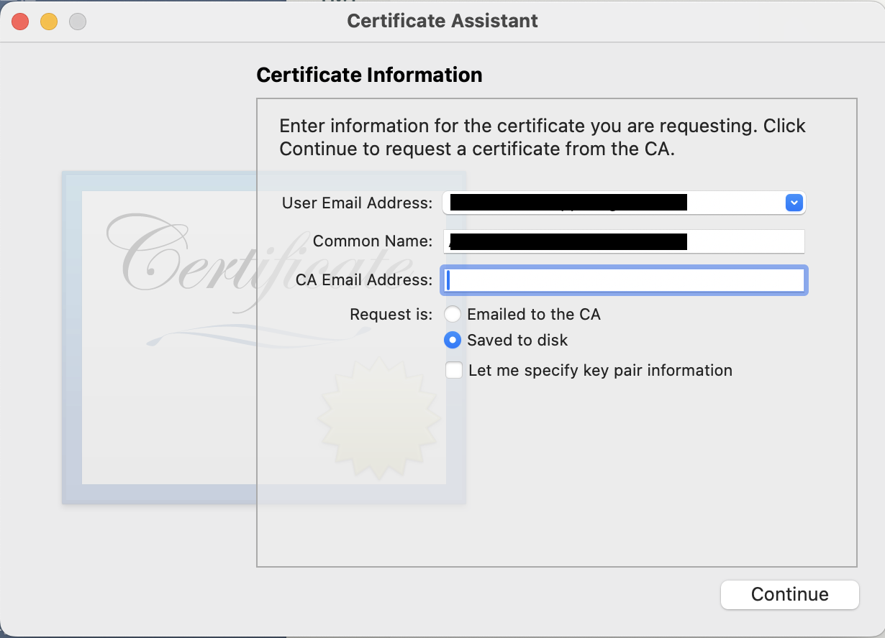

接著到 Apple Developer Portal，選取 Certificates。

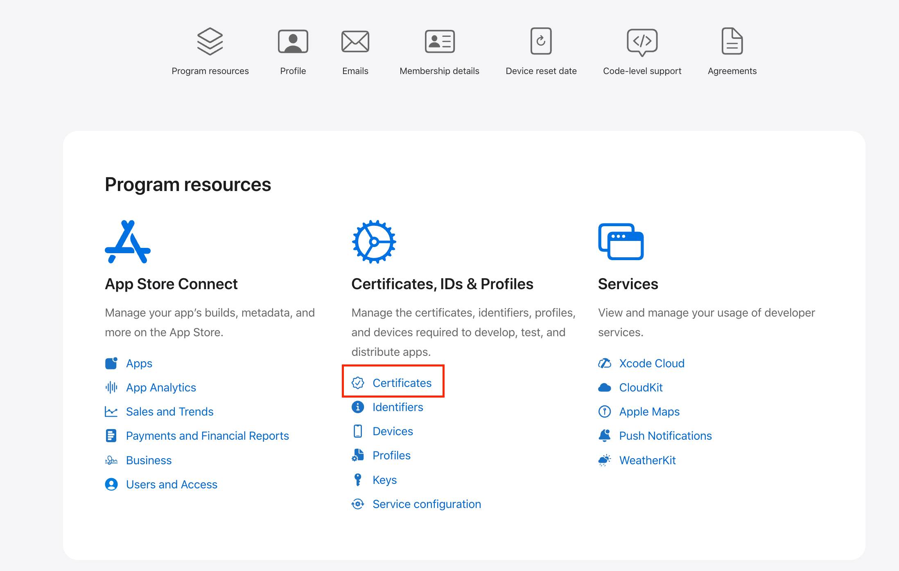

在類型選擇中，我們要選擇 iOS Distribution (App Store and Ad Hoc)，這就是我們上架 App Store 所需的憑證類型，然後點擊 Continue。

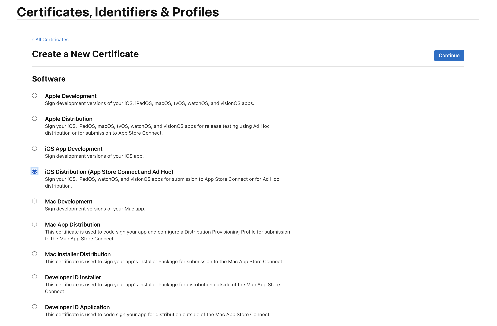

上傳我們剛剛在本地產出的那份 .certSigningRequest (CSR) 檔案。

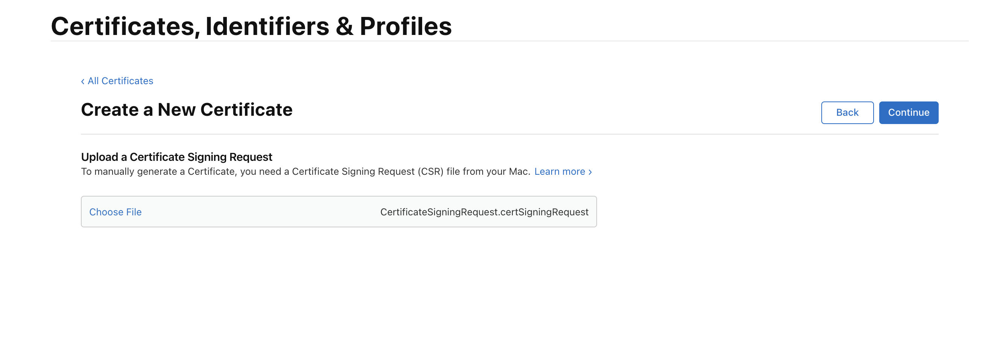

上傳成功後，蘋果就會立即為我們簽發一張分發憑證。點擊「Download」將它下載到你的 Mac 上。

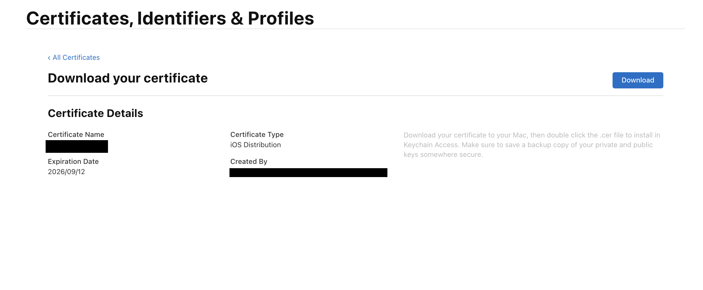

下載後安裝該憑證，就會看到在 keychain 裡面我們多了一張分發憑證。

接著我們需要匯出這份憑證。在該分發憑證上按右鍵，選取「Export...」。將其儲存為 .p12 格式。系統會提示你設定一個匯出密碼，記住這個密碼，因為稍後在 Pipeline 中我們需要用它來解鎖這個檔案。

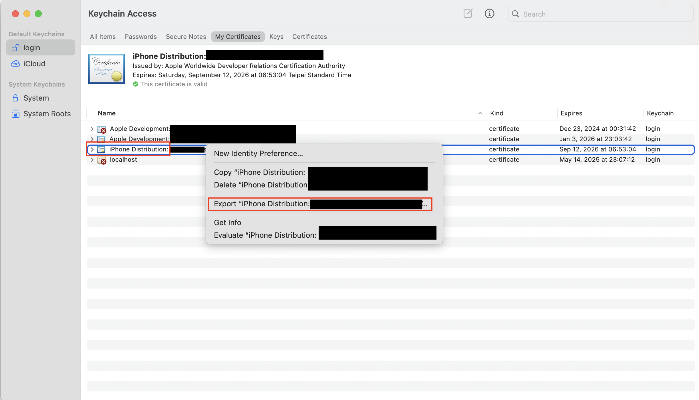

### 建立 Provisioning Profile

有了分發憑證後就可以產出描述檔了！同樣回到 Developer，選擇 Profile：

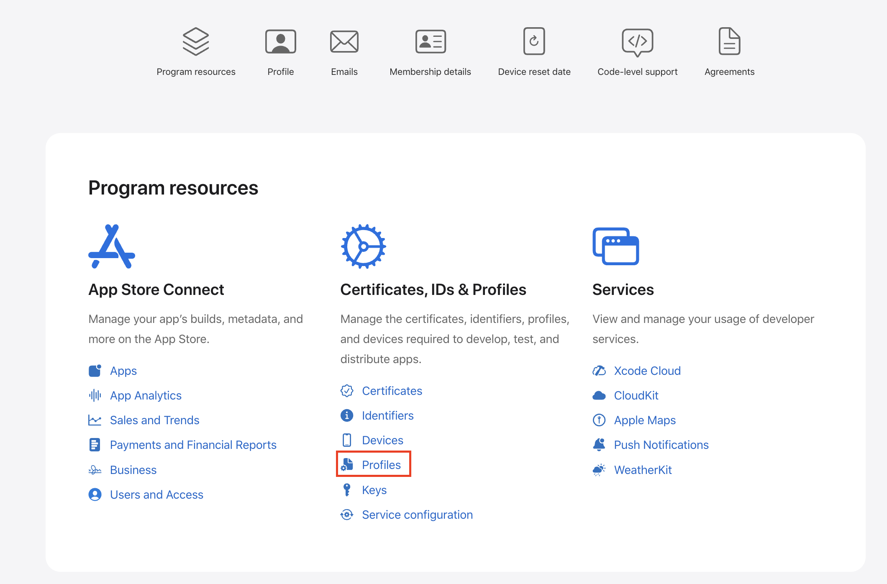

選擇 Distribution 的 App Store Connect。

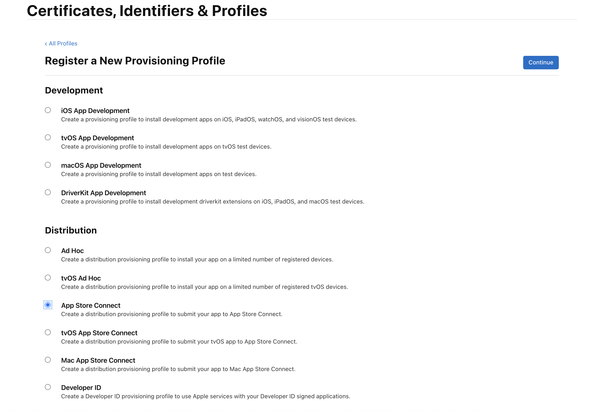

而因為我們已經在 App Stote Connect 註冊我們的 App 了，所以這裡的下拉選單會出現它，並選擇它

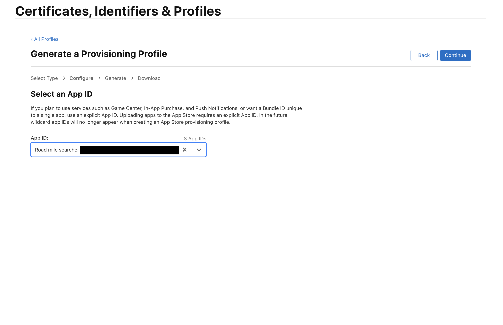

選取我們剛剛建立的分發憑證

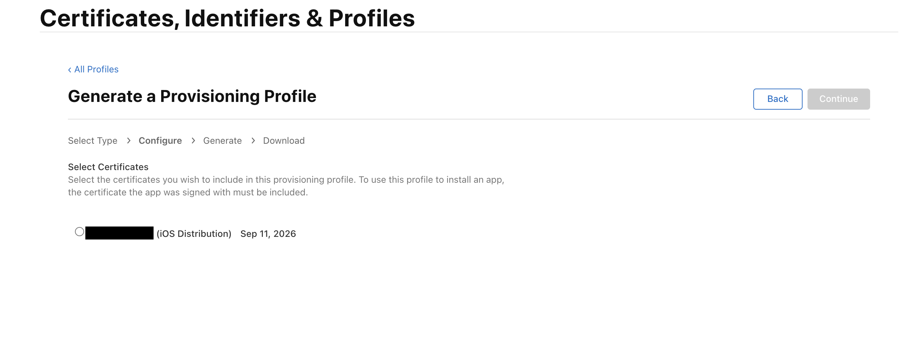

自訂一個描述檔名稱，產出後就可以下載了！

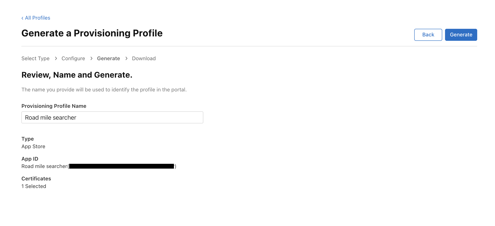

## 匯入 Azure DevOps Pipeline

有了分發憑證與描述檔後，我們回到 Azure DevOps，在側邊欄選擇 Pipelines > Library > Secure files

點擊「+Secure file」，分別將剛剛準備好的 .p12 和 .mobileprovision 檔案上傳。Secure Files 是一個加密的儲存空間，專為存放這類敏感資料而設計，確保它們不會以明文形式暴露出來。

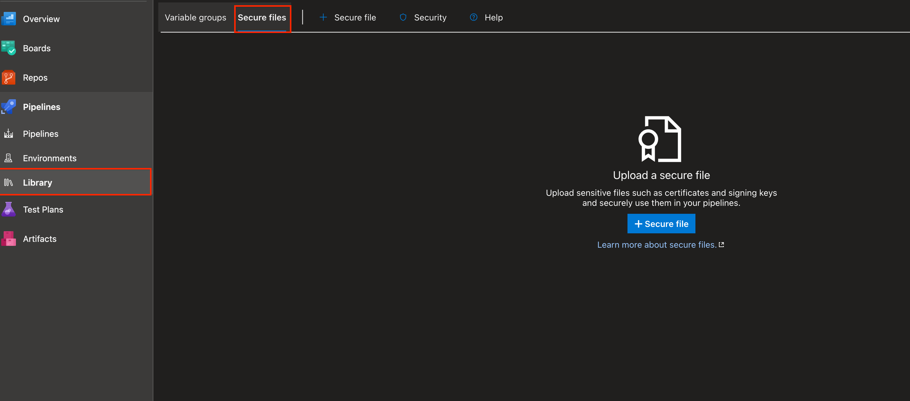

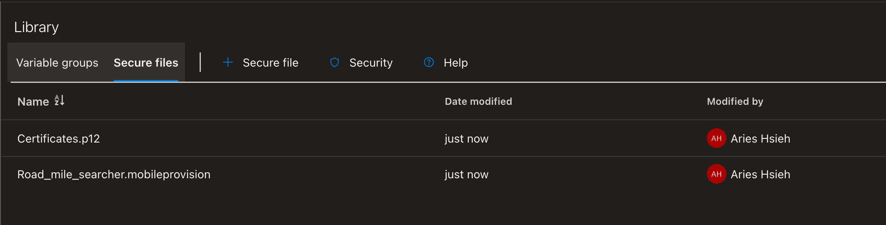

然後再到 Variable group 分頁

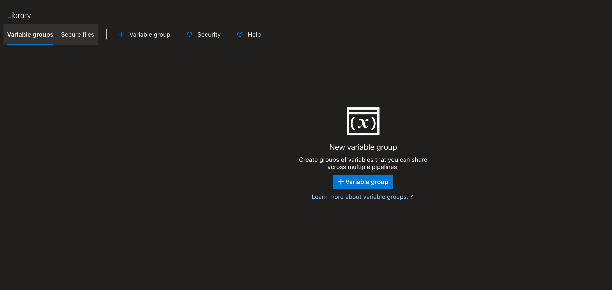

我們新增一個 Variable group，可以自由命名。在這裡，我們可以建立變數，讓 Pipeline 在執行時可以讀取。

點擊「+Add」，新增一個變數，在 Value 欄位中，輸入你匯出 .p12 檔案時設定的密碼。輸入完畢後，點選右側的「鎖頭」圖示。這會將該變數標記為「Secret」，它的值將會被加密儲存，不會顯示在 UI 上，也無法被複製，更重要的是，它不會在 Pipeline 的 log 中被 print 出來。

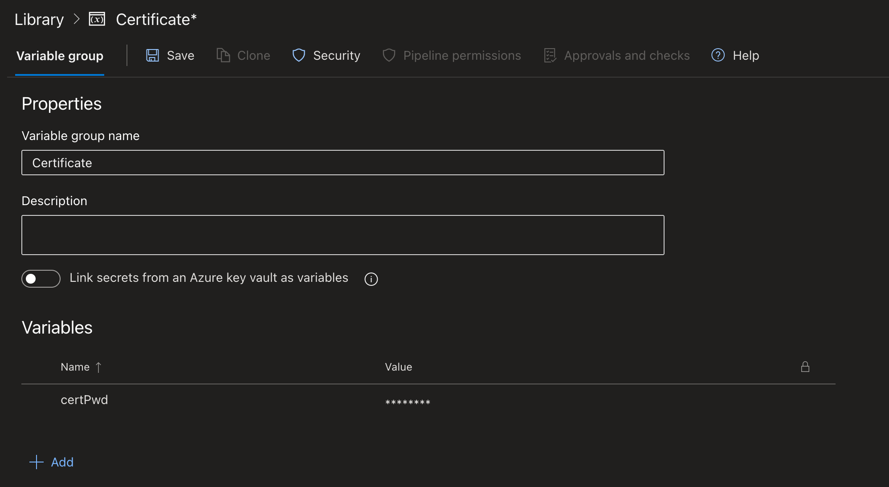

## 建立 Pipeline

前置作業準備完畢，接著可以來撰寫我們的 pipeline 了！

### 觸發條件

首先最重要的是決定 pipeline 應該在「什麼時候」執行，也就是我們必須為它設定觸發條件。

***一條建置與部署 App 的 pipeline，「發布的觸發點，應該是代表『過程』的分支，還是代表『結果』的標籤？」***

這其實是一個蠻值得思考的問題。

我們可能有兩種方案，一個是用 `git tag` 來觸發，另一個是 `main` branch 有變動時觸發。

1. 使用 git tag 作為觸發條件

    當某個 commit 加上例如 v1.0.0 的標籤時，才觸發 pipeline，他的優點是意圖明確，這是最大的優點。建立標籤是一個有意識且慎重的動作。它代表開發團隊一致認為「這個 commit 的狀態已經準備好，可以作為一個特定版本發布了」。因為是有意識的行為，某種程度上可以防止未經測試或不完整的程式碼被意外發布出去。

    同時，版本追蹤性強，每個上傳到 TestFlight 或 App Store 的 build 都會直接對應到一個 tag，而這個 tag 代表版本號，如此一來你可以非常清楚地知道是哪一個版本的程式碼出了問題。

    從開發與維運的角度來看，開發人員可以頻繁地將程式碼 merge 到 main，不用擔心每次合併都會觸發一次發布。發布的權力掌握在需要的人手上，他們可以在適當的時機點決定發布。

    當然，反過來說，這變成需要有個人或角色專門負責在正確的時機點打上標籤。相比合併就自動觸發多了一個手動步驟。另外，如果團隊文化是累積了大量功能後才打一個標籤，main 的多次合併才對應到某個 tag，那麼從程式碼完成到交付測試，中間的等待時間可能會變長。

2. 使用 main 分支被合併作為觸發條件

    只要有任何程式碼被合併進入 main 分支，就立即觸發 pipeline。

    這樣的做法，開發人員一完成功能並合併，幾分鐘後測試人員就能在 TestFlight 上收到新版本。這可以盡可能縮短發現問題和修復問題的時間。另外整個流程從 PR 開始，完全自動，無需任何手動干預，降低了人為疏忽的可能性。同時也確保，讓團隊意識到，任何要合併到 main 的程式碼都必須是正確、品質好，且可運行的，因為只要一合併，它就會被發布。

    同樣地，如此一來即使只是一個小小的修改，合併後也會產生一個新的 TestFlight 版本，且如果 PR 的審查不夠嚴謹，一個有潛在問題的功能被合併後，會立刻影響到所有測試人員。

但回到現在的場景：一人團隊。在單人開發的情境下，兩者似乎沒什麼太大區別，但它們依然代表著兩種不同的工作心態與工作流程。

使用 main 分支合併觸發，省了還要下 tag 的步驟。而頻繁的更新，不小心合進一個有問題的版本，也沒有太大影響。但在日常開發、快速原型驗證的階段，使用 main 分支觸發對單人開發者來說，卻是比較方便的。

而另一方面，選擇使用 git tag 作為觸發時，某種程度上會強迫建立「版本」概念的心態。打上 v1.0.0 標籤這個動作，會強迫你停下來思考：「我這次發布包含了哪些功能？」「這個版本真的完成、可以發布了嗎？」。這有助於您更有條理地思考產品目前的狀態。而且，在一年後，當你想知道某個版本到底改了什麼，或是需要修復一個舊版本的特定問題時，一個清楚 git tag 會幫助你回憶跟查找。

---

回到專案本身，我自己習慣用下 git tag 的方式來管理，因此這裡就先沿用我習慣的方式：

```yaml
# release-iOS.yaml

# 我們不希望這個 YAML 檔所在的 Repo 有任何 push 或 PR 時觸發自己
trigger: none
pr: none

# 定義我們要監聽的目標 Repo
resources:
  repositories:
    - repository: Roadmile_Locator
      type: git
      name: Roadmile_Locator/Roadmile_Locator
      trigger:
        tags:
          include:
            - 'v*' # 符合 'v*' 格式的 tag 將會觸發 pipeline
```

這樣 Pipeline 會在 Roadmile_Locator Repo 出現新版本標籤時觸發。

### 決定在哪裡執行：設定環境與變數

```yaml
# 指定要在內建 Xcode 的 macOS 虛擬機上執行
pool:
  vmImage: 'macOS-15'

# 定義會用到的變數
variables:
  # 匯入我們在 Library 建立的 Certificate 變數群組，這樣才能讀取到憑證密碼
  - group: Certificate
  # 定義一些常用字串，方便後續使用
  - name: scheme
    value: 'RoadMileLocator'
  - name: project
    value: 'RoadMileLocator.xcodeproj'
```

### 設計「做什麼」：編寫執行步驟 (Steps)

我們將在這裡一步步定義具體的執行動作。

#### 取得程式碼並安裝憑證

我們要把準備好的簽署憑證和描述檔安裝到虛擬機中，這樣 Xcode 才能辨認。

```yaml
steps:
# 第 1 步：取得觸發此 Pipeline 的 Repo 原始碼
- checkout: Roadmile_Locator
  displayName: 'Checkout Roadmile_Locator repository'

# 第 2 步：安裝 .p12 憑證，密碼來自變數群組
- task: InstallAppleCertificate@2
  displayName: 'Install Apple Distribution Certificate'
  inputs:
    certSecureFile: 'Certificates.p12'
    certPwd: '$(certPwd)'
    keychain: 'temp'

# 第 3 步：安裝描述檔
- task: InstallAppleProvisioningProfile@1
  displayName: 'Install App Store Provisioning Profile'
  inputs:
    provProfileSecureFile: 'Road_mile_searcher.mobileprovision'
```

#### 測試與建置

在正式打包前，先跑單元測試，測試通過後，再封存 (Archive) 和匯出 .ipa。

```yaml
# 第 4 步：執行單元測試
- task: Xcode@5
  displayName: 'Run Unit Tests'
  inputs:
    actions: 'test'
    scheme: $(scheme)
    sdk: 'iphonesimulator'
    destinationSimulators: 'iPhone 16 Pro'
    publishJUnitResults: true # 將測試結果顯示在報告中

# 第 5 步：封存並匯出 .ipa 檔
- task: Xcode@5
  displayName: 'Archive and Export .ipa'
  inputs:
    actions: 'archive'
    scheme: $(scheme)
    sdk: 'iphoneos' # 正式打包要用 iphoneos
    packageApp: true
    configuration: 'Release'
    signingOption: 'manual'
    # 這兩個變數由前面安裝憑證的任務自動產生，signingOption 為 manual 時必須宣告
    signingIdentity: '$(APPLE_CERTIFICATE_SIGNING_IDENTITY)'
    provisioningProfileUuid: '$(APPLE_PROV_PROFILE_UUID)'
    # 將產出的 .ipa 放到一個暫存目錄
    exportPath: '$(Build.ArtifactStagingDirectory)/ipa'
```

執行到這裡，我們就成功在 Azure 虛擬機產生了一個經過簽署、可以發布的 .ipa 檔案了。

#### 保存與上傳

我們需要將產出的 .ipa 檔案保存下來 (發布成 Artifact)，然後再將它上傳到 App Store Connect。

```yaml
# 第 6 步：將 .ipa 檔發布成產出物，方便日後下載
- task: PublishBuildArtifacts@1
  displayName: 'Publish Build Artifacts'
  condition: succeeded() # 只有在前面步驟都成功時才執行
  inputs:
    PathtoPublish: '$(Build.ArtifactStagingDirectory)/ipa'
    ArtifactName: 'AppPackage'
    publishLocation: 'Container'

# 第 7 步：上傳到 App Store Connect
- task: AppStoreRelease@1
  displayName: 'Upload to App Store Connect'
  condition: succeeded()
  inputs:
    serviceEndpoint: 'App Store Connect API' # 選擇我們設定好的服務連線
    appIdentifier: 'com.hthsieh.RoadMileLocator'
    ipaPath: '$(Build.ArtifactStagingDirectory)/ipa/*.ipa'
    releaseTrack: 'TestFlight' # 上傳到 TestFlight
```

詳細的參數說明可以參考[微軟官方文件](https://learn.microsoft.com/en-us/azure/devops/pipelines/tasks/reference/xcode-v5?view=azure-pipelines)，裡面有蠻詳細的說明的～

## 觸發 Pipeline

萬事俱備，是時候來驗證我們努力的成果了！

>測試之前，記得再次確認要建置的分支（例如 main）上，所有的程式碼都已經合併完畢。

我們前往 Azure DevOps，在左側邊欄找到 Repos，點選 Tags 分頁。接著選取我們的 App 專案 Repo，並按下右上角的 New tag 按鈕。

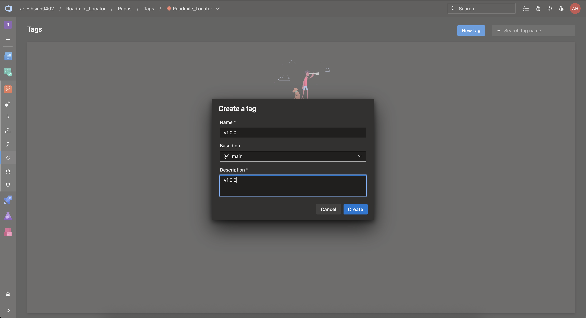

確認版本號以及 branch 無誤後點選 Create，接著到 Azure pipeline 分頁。

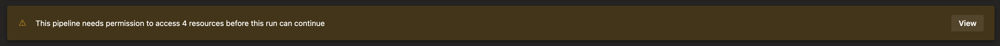

第一次執行時，畫面上出現了需要授權的訊息。這是 Azure DevOps 的安全機制，它告訴我們，這個 Pipeline 需要我們的許可，才能存取先前設定好的 Secure files（我們的憑證）、Variable groups（我們的密碼）以及專案的 Repo。

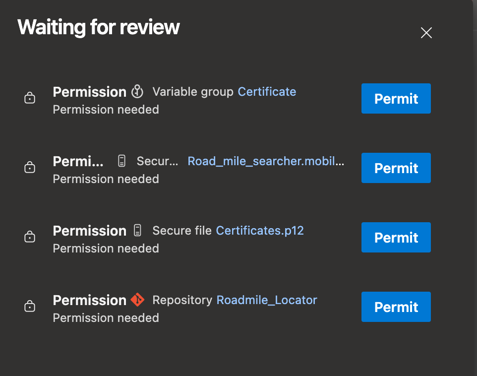

這是很正常的步驟，勇敢地把所有 Permit 按鈕都點下去，給予它執行的權力。授權完畢後，我們的 Pipeline 就會正式啟動了！

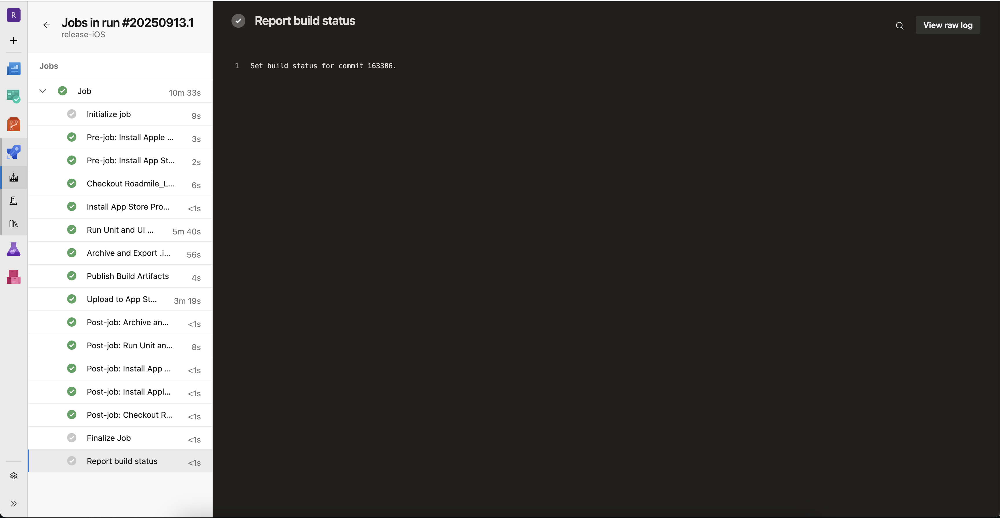

看著畫面上我們定義的每一個步驟：安裝憑證、執行測試、建置封存、上傳... 一個個亮起綠燈，這代表我們在 YAML 檔中寫的腳本都正確無誤地被執行了。

等待了幾分鐘，所有步驟都顯示成功後，打開 App Store Connect，進入 TestFlight 頁面查看

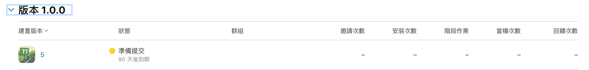

成功了！版本 1.0.0 出現上面，狀態顯示為「準備提交」。這表示我們的 App 已經順利地送到了蘋果的伺服器上。

## 本日小結

今天，我們完成了 CI/CD 中最關鍵的部分，也就是將所有環節串聯起來，實現了從推送一個 Git Tag 到 App 出現在 TestFlight 的全自動化流程，我們不需要再手動操作 Xcode 來完成這件事情，體會到了自動化的魔力，開頭辛苦一次，但之後就可以把時間和精力從重複性的工作中解放出來。

不過，App 出現在 TestFlight 還不是終點。它還只是「準備提交」的狀態。明天，我們就要來處理最後的上架流程：在 App Store Connect 中，我們該如何填寫 App 的各種資訊、設定測試員，並最終按下「提交審查」按鈕。
