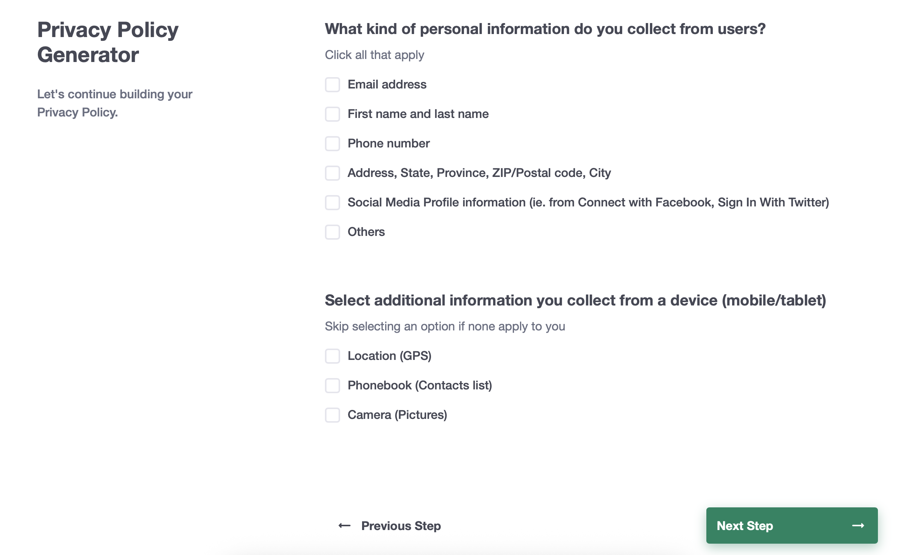
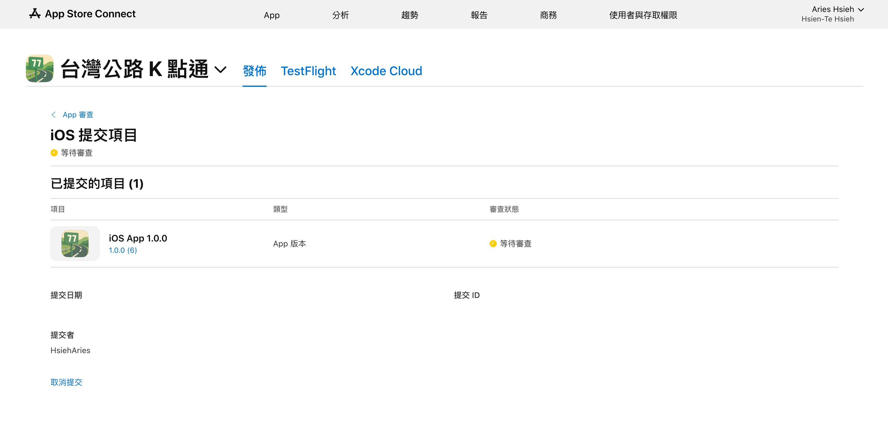
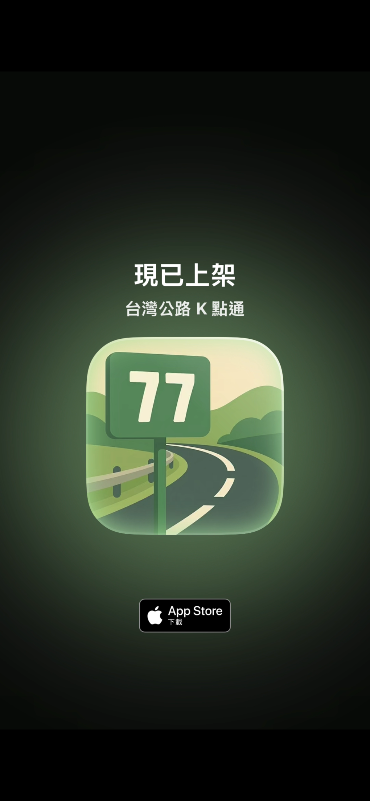

# 前言

經過了前面 28 天的努力，我們的 App 終於來到提交審查的這一步。Apple 的 App Store 審查機制其實算是蠻嚴格的，確保每一款上架的 App 都經過確實審核，所以有不少人會卡在上架的門檻前。

# 蘋果 App Store 上架審查機制

## 權限存取 (Access) vs. 資料收集 (Collect)。

### 資料收集 (Collect)

蘋果的審查規則其實大致上繞不開幾個重點，比方說禁止任何形式的歧視、誹謗、暴力描述，以及色情或鼓勵非法行為的內容。

另一個重點是「隱私權」。Apple 是著名地十分注重隱私，並將這一理念貫徹到 App Store 的每一個角落。其核心要求是：透明與掌控。**開發者必須清楚告知用戶他們收集了什麼資料、為何收集，並給予用戶控制其個人資料的權利。**

開發者在 App Store Connect 提交 App 時，必須誠實地自我報告 App 會收集的各種資料。這些資訊會直接顯示在 App Store 的產品頁面上，供使用者下載前參考。

舉例來說，假設你的 App 是一款健身應用，會記錄用戶的身高、體重等健康資訊，並使用電子郵件註冊。在隱私權標籤中，你就必須勾選「健康與健身」和「聯絡資訊」這兩項，並說明這些資料會「與您連結」，因為它們與用戶的個人帳號綁定。如果你的 App 只是個單機遊戲，完全不收集任何資訊，你也需要在標籤中明確標示「未收集資料」。

回到我們的 App，有取得使用者位置，這樣算不算「收集」資料？我們來看[蘋果官方](https://developer.apple.com/app-store/app-privacy-details/)在 *Data collection* 這一節當中的這段說明：

>“Collect” refers to transmitting data off the device in a way that allows you and/or your third-party partners to access it for a period longer than what is necessary to service the transmitted request in real time.
>“Third-party partners” refers to analytics tools, advertising networks, third-party SDKs, or other external vendors whose code you’ve added to your app.

這段話的重點在於「transmitting data off the device」（將資料從裝置傳輸出去）。

App 取得了使用者的定位資訊，但所有的處理都在裝置上完成，沒有任何 API 會將這些資訊傳送出去。因為資料從未離開裝置，所以並未構成蘋果在隱私權標籤中所定義的「收集」行為。

### 權限存取 (Access)

但我們的 App 確實「存取」了使用者的位置資料。因此我們必須在 Info.plist 中設定 NSLocationWhenInUseUsageDescription，或相關的位置權限，並詳實說明取用理由。設定之後，使用者會看到系統跳出的權限請求視窗，並決定是否允許 App 使用其位置，這是關於「執行時期」的權限管理，與使用者之間的直接互動。

>必須詳實填寫取用理由，蘋果是真的會看的。若你只單純寫「App 需要取用你的位置」，這十之八九會被退件。你必須要說明取用的理由，例如「為在背景監控選定里程樁並於接近時提醒（如接近台7線 77K 時通知），需要背景存取位置。」。

## 隱私權政策

自 2018 年 10 月 3 日起，蘋果強制要求所有提交至 App Store 的新 App 及現有 App 的更新，都必須附上「隱私權政策」。這項規定涵蓋所有 App，甚至包括那些不收集任何使用者資料的 App。

面對 App Store 強制要求提供隱私權政策的規定，對於獨立開發者或小型團隊來說是蠻令人頭痛的一件事情，畢竟撰寫一份符合法規的法律文件不是那麼簡單的事情。這個時候，對於我們這種小齒輪，可以仰賴許多線上工具可以協助我們快速解決這個問題。

在這裡推薦使用 [PrivacyPolicies.com](https://app.privacypolicies.com/wizard/privacy-policy) 這類的線上隱私權政策產生器。

它透過很簡單的引導式問卷，一步步勾選 App 的功能與行為，例如是否收集資料等，很簡單就能產生一份結構完整的隱私權政策。這些產生器產出的範本通常會涵蓋 App Store 的基本要求以及 GDPR 等國際主流法規的要點，你不需要具備法律背景，只需誠實報告 App 資料處理方式。

接著就可以把產出的 url 貼到 App 審查頁面

## 其他

其他必填資訊則沒有什麼特別需要注意的，例如：

1. App 名稱與副標題
2. 年齡分級
3. 上架地區
4. 售價（免費也要填）
5. 支援 URL（填你的個人網站，我是填自己的 GitHub 連結）

比較值得注意的部分有兩個：

1. App 加密文件

簡單來說，如果你的 App 沒有該當下列其中一種情況，只要在 Xcode 專案的 Info.plist 檔案中新增一個名為 `App Uses Non-Exempt Encryption` 的 bool Key，並設定值為 `false`，即可：

- App 使用了專有或非標準的加密演算法。

- App 除了使用 Apple 系統提供的加密外，還整合了其他的標準加密演算法（例如自行嵌入了一個加密函式庫來對檔案進行特殊加密）。

2. 預覽截圖

這也是我一開始覺得有點惱人的點，但現在只要記得：

- iPhone 上傳 6.9 吋（iPhone 14 Pro Max 以後的 Pro Max 或 Plus 機種）

- iPad 上傳 13 吋

其餘必要尺寸蘋果會自動幫你縮放，當然你要自己一個一個對應上傳也沒問題。

詳細規則可以參考[官方說明](https://developer.apple.com/tw/help/app-store-connect/reference/screenshot-specifications/)。

製作截圖，網路上也不少資源，我這裡是使用 [picasso](https://apps.apple.com/tw/app/picasso-app-screenshot-studio/id6472062986?l=en-GB) 這個軟體。

大家可以找自己習慣用的軟體。

## 提交審查

該填的資訊填畢，就可以提交審查了。

審查通過官方會替你做一個很潮的影片：

# 本日小結
看到 App 通過審查的通知，以及那段自動生成的影片時，有一種滿足感。這不僅僅代表一個 App 的完成，更像是為這趟鐵人賽旅程，畫下了一個完美的註腳。

從一個模糊的想法，到使用者流程圖、UI 草稿，再到一行行的 SwiftUI 程式碼，最後處理完這些繁瑣卻必要的上架規則，每一步都是為了此刻而堆砌。

明天，就是我們這趟旅程的最後一天了。我會做個總結，回顧我們這一個月來的成果與心得。
