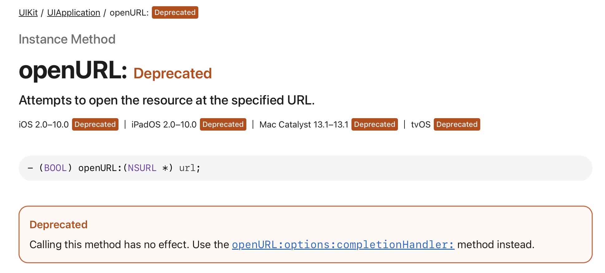
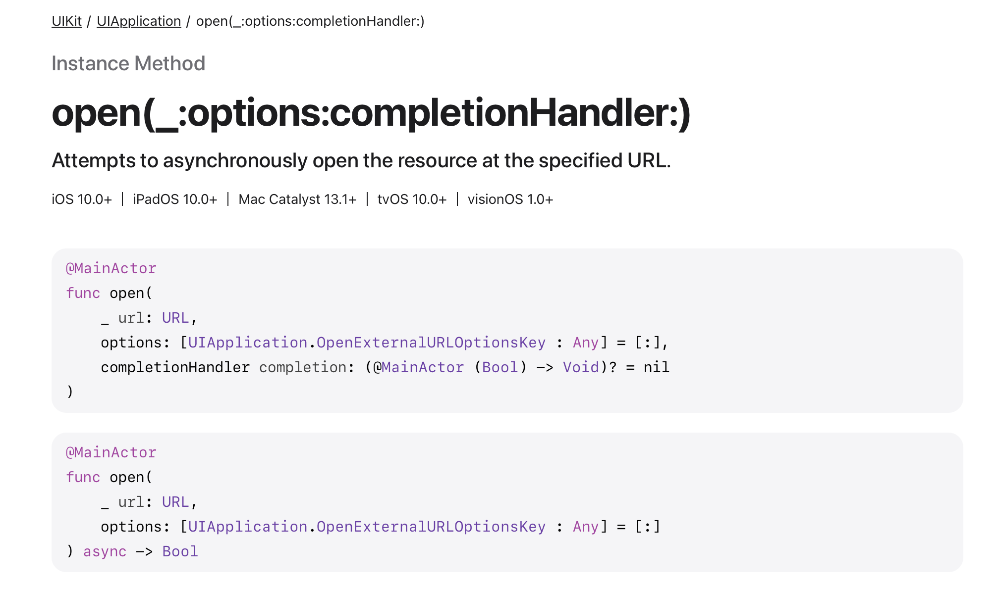
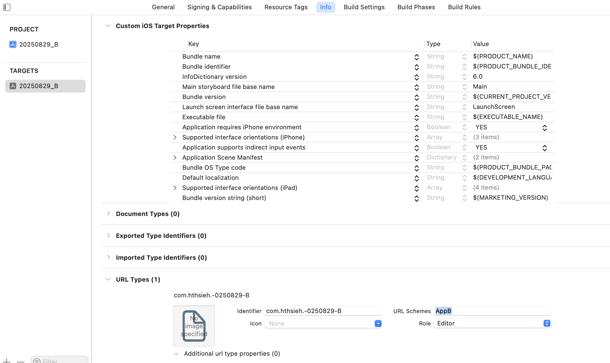
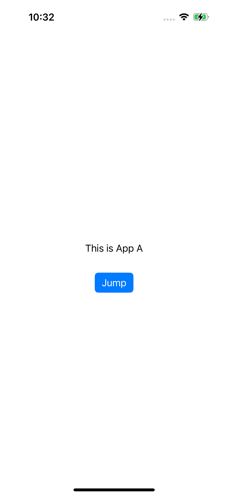
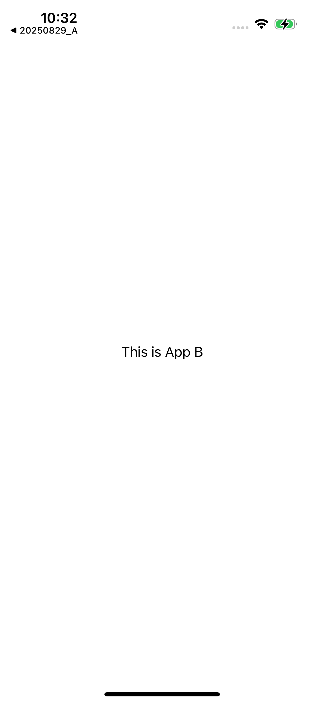
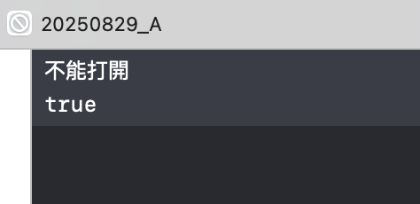

之前因為一直沒有機會去處理到不同 App 之間跳轉的問題，對這塊的東西一直不太熟悉。最近因為遇到 App 不能成功開啟其他 App 的問題，才有機會了解一下。

不能開啟的原因是 App 使用很久以前的 API:



可以看到在 iOS 10 以後就被蘋果棄用了，然而蘋果棄用通常並不表示馬上不能用，所以這支 API 還活了很久一段時間，直到 iOS 18 蘋果才真正不給用。這支 API 已經被 `open(_:options:completionHandler:)` 取代（Objective-C 為 `openURL:options:completionHandler:`）:



---

雖然這個問題解決了，但我想藉此機會多了解一下跳轉這個機制。



要實現 App 能夠跳轉，例如 20250829_B 這個 App 要能夠讓被其他 App 開啟，就必須要去 target 設定裡的 Info 分頁，在 URL Type 裡面替自己定義 `URL Schemes`，這裡我們定義為 `AppB`。


接著，我們在另一個 App A 裡建立一個點擊會實現跳轉 AppB 的按鈕



程式碼如下：

```swift
@IBAction func jumpToB(_ sender: Any) {
    let scheme = "AppB://"
    guard let url = URL(string: scheme) else { return }

    UIApplication.shared.open(url, options: [:]) { success in

    }
}
```

我們僅實作 `open(_:options:completionHandler:)`，而不實作 `canOpenURL(_:)` 這支很常被使用的 API。



測試結果，可以成功跳轉。

---

這表示其實 `open(_:options:completionHandler:)` 是不受限制的，只要要跳轉的 App 確實有安裝，URL Scheme 正確，就能夠成功跳轉。那 `canOpenURL(_:)` 這支是在做什麼呢？


canOpenURL 的目的在於「查詢此 URL 是否可被系統上某個 App 處理」，方便在跳轉前做決策並提供回退，例如導向 App Store 或開啟網頁版。

自 iOS 9 起，出於隱私保護，查詢行為被白名單化，只有列在 Info.plist 的 LSApplicationQueriesSchemes 內的 scheme 才允許查詢，未列入會得到 false。

至於為什麼有白名單，因為在 iOS 9 之前，App 可藉由 canOpenURL 掃描常見 schemes 推測使用者安裝了什麼，有隱私上的風險。

需注意的是，白名單只影響「能不能查詢」，不影響實際 open。也就是說，若實際上已安裝，直接 open 是可以成功的，但缺乏 canOpenURL 就失去事前判斷與回退的檢查。


```swift

// Info.plist 裡面沒有定義 AppB
<key>LSApplicationQueriesSchemes</key>
<array>
    <string></string>
</array>

@IBAction func jumpToB(_ sender: Any) {
    let scheme = "AppB://"
    guard let url = URL(string: scheme) else { return }

    if UIApplication.shared.canOpenURL(url) {
        print("可以打開")
    } else {
        print("不能打開")
    }

    UIApplication.shared.open(url, options: [:]) { success in
        print(success)
    }
}
```



測試結果，沒有定義白名單，實際有安裝，還是可以打開，但好的做法仍是配合 canOpenURL 與白名單做判斷。
