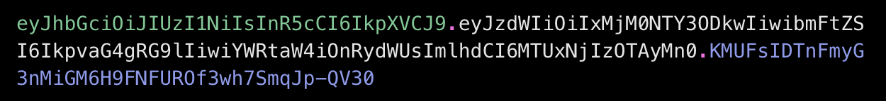
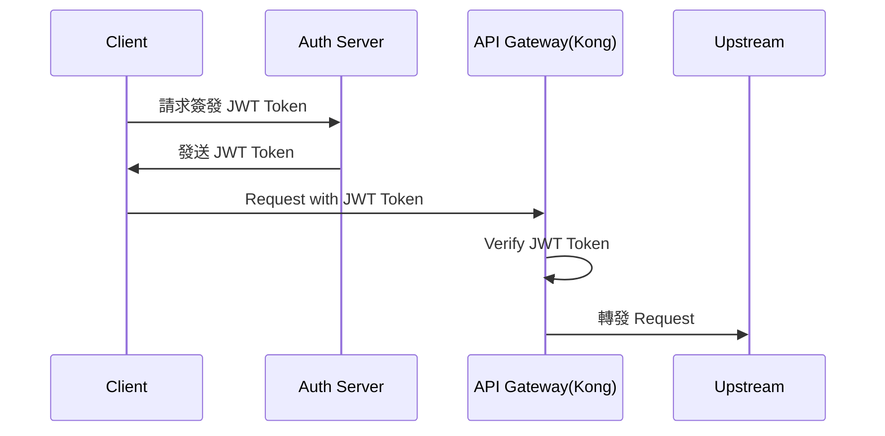
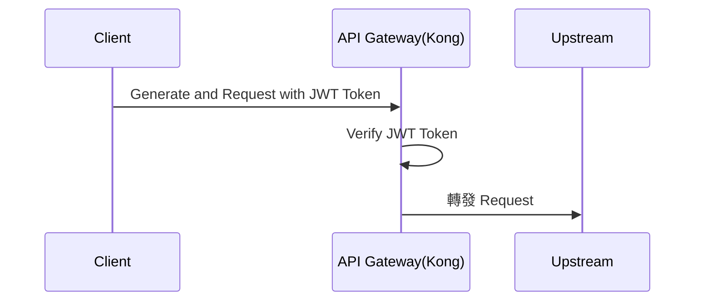

# 什麼是 JWT Token？

JTW 為 Json Web Token 的簡稱，是 [RFC 7519](https://datatracker.ietf.org/doc/html/rfc7519) 規範的一種資料交換格式。

## JWT Token 的基本組成

JWT 字串分成三個部分，將三份資料以**小數點**的方式組合起來。



這三個部份分別為：

- **Header:** 描述加密的演算法及 Token 類型(JSON 格式)
- **Payload:** 實際上要傳遞的聲明資訊(JSON 格式)
- **Signature:** 將 Header 與 Payload 經過 Base 64 encode 後加上雜湊演算法產生的簽章，用來驗證 JWT 是否經過篡改。

將圖 1 拿去 [JWT.io](https://www.jwt.io/) 解碼，結果分別會是：

```json
// Header

{
  "alg": "HS256",
  "typ": "JWT"
}

// Payload

{
  "sub": "1234567890",
  "name": "John Doe",
  "admin": true,
  "iat": 1516239022
}

// Signature

a-string-secret-at-least-256-bits-long

```

RFC 7519 定義了 Payload 中的一些公認欄位：

- `iss`：發行者
- `iat`：發行時間
- `exp`：到期時間
- `sub`：主題，用字串(`case-sensitive`) 或 `URI` 表示這個 `JWT` 所夾帶的唯一識別訊息，用於確定該 token 是與某一特定使用者相關。
- `aud`：收件人
- `nbf`：不接受早於該欄位的時間，如果當前時間早於這個欄位，則表示 `JWT` 還未生效。
- `jti`：唯一識別符，用來區分 `JWT`

# 基於 JWT Token 的認證機制

## 與一般 token 的區別

一般 Token 通常會在伺服器端儲存，並且伺服器會在每次請求時查詢 Token 的有效性，因此一般 token 是可撤回的，伺服器可以通過刪除或標記某個 Token 為無效來撤回該 Token。

而 JWT Token 是一個**自包含**的 Token，所有的驗證資訊（如簽發者、過期時間、用戶資訊等）都包含在 Token 本身的 Payload 中。因此驗證 JWT 時，伺服器只需要使用公鑰來驗證 Token 的完整性，無需查詢資料庫。但也因為這樣的特性，伺服器無法主動使某個已簽發的 Token 無效，除非 Token 本身過期（`exp` Claim），或是伺服器更改了公私鑰（但這會導致所有使用該密鑰簽發的 Token 都失效）。

## 中心化/去中心化的概念

### 驗證的去中心化(Opaque Token cs. JWT Token)

***去中心化***的核心是「自解釋(Self-contained)」，故從此角度來看待 Token 與 JWT Token:

- Token: 中心化的，token 本身是沒有意義的字串，每次請求都需要伺服器進行驗證。
- JWT Token: 去中心化的，簽發一次後就不需驗證。簽發後就不可更改或撤銷，即便讓他「失效」也不等於「撤銷」，因為讓他失效只是讓單方不認(伺服器端)，**並不是撤銷 JWT Token 本身**。

### 簽發的去中心化(單一 vs. 多簽發者)

這個視角關注的是**整個系統的信任架構**，也就是「誰來簽發 Token」。

1. **中心化簽發**
在整個組織或系統中，只有一個權威的授權伺服器。所有人都必須去這個唯一的授權伺服器進行身分驗證，並取得 JWT Token。所有的資源伺服器都只信任這一個來源簽發的 JWT Token。

2. **去中心化簽發**
組織或系統中存在多個被信任的簽發實體，例如在母子公司中，子公司要呼叫母公司的 API，並須透過 API Gateway。子公司 A 可自行簽發 JWT，子公司 B 也可自行簽發 JWT。而母公司的 API Gateway 被設定為同時信任來自子公司 A 與子公司 B 的 JWT，API Gateway 會根據 JWT 中的 `iss` (issuer) 欄位，選擇對應的公鑰進行驗證。也就是說，信任關係從信任單一權威變成信任一個受信任的 issuer 列表。

## 基於中心/去中心化的認證流程

承上所述，我們可以分別從兩種不同的概念來說明不同的驗證流程：

### 中心化簽發的認證流程

在此模型中，存在一個單一、權威的身分提供者(Identity Provider, IdP)或驗證伺服器(Auth Server)，全權負責驗證簽發與驗證系統內所有的憑證。因為唯一，所有的信任關係都源自這個中心點。



在上圖的流程中，由 Auth Server **產生並保管一對公私鑰**，並將公鑰提供給所有需要驗證的單位，例如這裡的 Kong，並**保管好私鑰，用於簽發 JWT Token。**
Client 於取得 JWT Token 後並於請求時帶上，由 Kong 使用預先存放的公鑰進行驗證，通過驗證後將請求轉發給上游服務。

### 去中心化簽發的認證流程



以 Kong 為例進行說明。

子公司必須自行產一對 RSA 公私鑰，私鑰由子公司自行保管。子公司提供公鑰給 Kong，Kong 於該子公司(Consumer)上建立 JWT Credential，輸入該公鑰後，會自動產出(也可以自行指定)一個 `key` 字串。當子公司的系統需要呼叫 API 時，需於 Payload 中的 `iss` 欄位帶入該 `key` 字串，以供 Kong 辨識是哪一個 Consumer 呼叫。Kong 收到請求後，會用對應的公鑰進行驗證。
