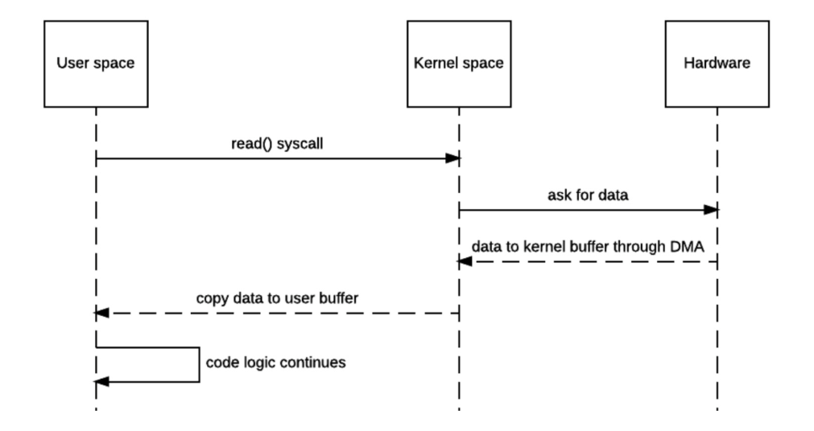
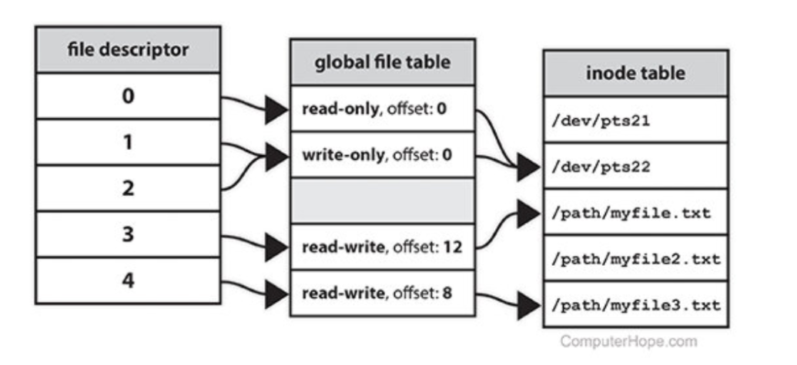

# Linux file descriptor issue

## File descriptor 基本概念

現代作業系統會把記憶體分成兩個區域，分別是 User space（使用者空間）和 Kernel space（核心空間）。使用者的程式會在 User space 執行，系統核心則在 Kernel space 執行。
而使用者的程式沒有權限直接存取硬體資源，但系統核心可以，像是讀寫本機檔案需要存取硬碟、建立 socket 需要用到網卡等等。因此，使用者的程式如果想要讀寫檔案，必須透過 system call 向 Kernel 發出請求。當核心收到使用者程式的 system call 時，會負責存取硬體，並把結果回傳給程式。



承上，File Descriptor 之所以存在，就是因為使用者程式無法直接存取硬體。因此，當程式向核心發出 system call 來開啟一個檔案時，核心會在使用者 process 中分配一個標識該檔案的東西，這個東西就是 FD。



## FD 與引用計數

當程式要取用檔案，向 kernal 發起 system call `open()` 時， kernal 會在 global file table 裡面會為該檔案分配一筆紀錄，並且在 process 的 file descriptor table 中分配一個整數索引，檔案名稱在目錄樹與 inode(實體資料區塊)之間維持引用計數。

而當程式移除檔案 `rm filename` (即呼叫 `unlink()`)時，kernal 只會將目錄中對該檔案名稱的引用移除，並且將引用計數減一。只要計數仍大於 0，表示至少一個 process 仍然持有該檔案的 FD，inode 與資料區塊就不會被回收。

也就是說，只有當最後一個持有該 FD 的 process 呼叫 `close()` 或該 process 終止時，global file table 的引用計數才會降為 0，此時 kernal 才會釋放對應的磁碟區塊。

## df 與 du 指令的差異

為了瞭解之後的內容，要先知道這兩個指令的區別：

- `df` (Disk Free)

   計算整個檔案系統中實際被占用的資料區塊。即使檔案被刪除，只要還有 process 開啟她，那些區塊就不會被釋放。
- `du` (Disk Usage)

   Iterate 目錄樹，加總當前可見檔案的大小，看不到已經從目錄中移除的檔案。

## 實驗「檔案已刪除但仍被 process 持有」

1. 建立檔案

   我們先查看 `/tmp` 的大小

   

   在 `/tmp` 下建立一個 100M 的測試檔案

   ```shell
   dd if=/dev/zero of=/tmp/testfile bs=1M count=100
   ```

   接著確認檔案大小
   ```shell
   ls -lh /tmp/testfile
   ```

   

2. 建立程序打開並持有該檔案

   在背景啟動一個簡單的命令，持續讀取該檔案

   ```shell
   tail -f /tmp/testfile > /dev/null &
   ```

   

3. 刪除測試檔案

   ```shell
   rm /tmp/testfile
   ```

4. 驗證空間未釋放

   使用 `df` 查看可用空間變化

   ```shell
   df -h .
   ```

   

   可以發現空間並沒有被釋放，我們用 `du -sh * | sort -rh` 確認該路徑下已無該檔案

   

5. 找出並觀察已刪除但仍被 process 持有的檔案

   我們使用這個指令來查看

   ```shell
   lsof +L1 | grep /tmp/testfile
   ```

   +L1 表示計數仍大於 0

   

6. 釋放空間

   終止 process

   ```shell
   kill 2680202
   ```

    或是重啟該服務。

   


REF: https://wiyi.org/linux-file-descriptor.html
